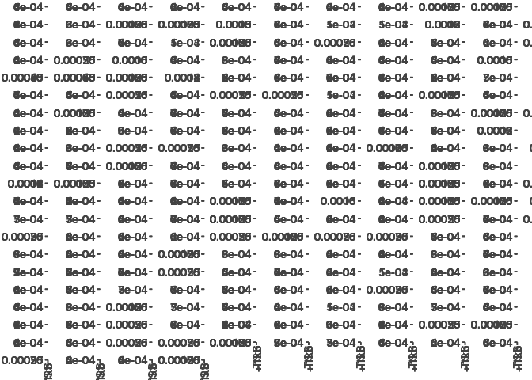

Big\_Knit
================
Corrin Bowman
4/22/2023

# Loading in all .broadPeak files for all dbps and their replicates

``` r
basepath <- "/scratch/Shares/rinnclass/CLASS_2023/corrinbowman"
peak_path <- "CLASS_2023/CLASSES/05_R_analyses/analysis/00_consensus_peaks"
broadpeakfilepath <- "/scratch/Shares/rinnclass/CLASS_2023/data/data/peaks"

# using import peaks to import .broadPeak files (~10min)
peak_list <- import_peaks(consensus_file_path = broadpeakfilepath)

save(peak_list, file= "/scratch/Shares/rinnclass/CLASS_2023/corrinbowman/CLASS_2023/CLASSES/06_final_going_global/analysis/01_create_consensus_peaks/results/peak_list.Rdata")
```

# creating consensus peaks

Using consensus\_from\_reduced function that requires peak list and dbp
object. This will be done in 2 steps (1) created dbp object of unique
names for dbp (2) run consensus\_from\_reduced

``` r
  # Creating unique DBP object for create_consensus_peaks_from_reduced
dbp <- unique(sapply(names(peak_list), function(x) {
   unlist(strsplit(x, "_"))[1]
}))

# now run our function consensus_from_reduced
consensus_list <- lapply(dbp, consensus_from_reduced, peak_list)

# adding names to the GRange list
names(consensus_list) <- dbp

save(consensus_list, file = "/scratch/Shares/rinnclass/CLASS_2023/corrinbowman/CLASS_2023/CLASSES/06_final_going_global/analysis/01_create_consensus_peaks/results/consensus_list.RData")

load("/scratch/Shares/rinnclass/CLASS_2023/corrinbowman/CLASS_2023/CLASSES/06_final_going_global/analysis/01_create_consensus_peaks/results/consensus_list.RData", verbose = T)
```

    ## Loading objects:
    ##   consensus_list

# exploring the number of peaks in the consensus\_list

``` r
# creating list of num_peaks per dbp
num_peaks <- sapply(consensus_list, length)

# plotting
hist(num_peaks, breaks = 1000)
```

<!-- -->

``` r
hist(num_peaks, breaks = 1000, xlim = c(0,3000))
```

<!-- -->
Result: seems like 1000 peaks should be the min moving forward, Filter
out any chip data less 1,000 peaks == filtered consensus peaks

# filtering consensus\_list to dbps with &gt; 1000 peaks

``` r
# filtering to 1000 peaks
filtered_consensus_list <- consensus_list[sapply(consensus_list, length) > 1000]

# saving 
save(filtered_consensus_list, file = "/scratch/Shares/rinnclass/CLASS_2023/corrinbowman/CLASS_2023/CLASSES/06_final_going_global/analysis/01_create_consensus_peaks/results/filtered_consensus_list.RData")

# keeping track of DBPs lost
lost_dbps <- names(consensus_list[sapply(consensus_list, length) < 1000]) %>% as.data.frame()

# saving 
write.table(lost_dbps, "/scratch/Shares/rinnclass/CLASS_2023/corrinbowman/CLASS_2023/CLASSES/06_final_going_global/analysis/01_create_consensus_peaks/results/lost_dbps.csv")
```

# exporting filtered\_consensus\_peaks

``` r
for(i in 1:length(filtered_consensus_list)) {
  rtracklayer::export(filtered_consensus_list[[i]], 
                      paste0("/scratch/Shares/rinnclass/CLASS_2023/corrinbowman/CLASS_2023/CLASSES/06_final_going_global/analysis/01_create_consensus_peaks/results/filtered_consensus_peaks/", 
                             names(filtered_consensus_list)[i], 
                             "_filtered_consensus_peaks.bed"))
}


#TODO rename so can load into UCSC.

#consensus_file_list <- list.files("/scratch/Shares/rinnclass/CLASS_2023/corrinbowman/CLASS_2023/CLASSES/06_final_going_global/analysis/01_create_consensus_peaks/results/Consensus Peaks", full.names = T, pattern = ".bed")

#peaks <- lapply(consensus_file_list, read.table, col.names = c("chr", "start", "end", "name", "score", "strand"))

#names(peaks) <-dbp

#canonical_chr <- c(paste0("chr", 1:22), "chrM", "chrX", "chrY")
#peaks <- lapply(peaks, function(x) x %>% filter(chr %in% canonical_chr))

# now that these are all nice and clean let's export: pasting a string together to name files
#new_filenames <- paste0("/scratch/Shares/rinnclass/CLASS_2023/corrinbowman/CLASS_2023/CLASSES/06_final_going_global/analysis/01_create_consensus_peaks/results/Consensus Peaks/", names(peaks), "_consensus.bed")

#for(i in 1:length(peaks)) {
 # write.table(peaks[[i]], new_filenames[[i]],
 #             sep = "\t", col.names = FALSE, row.names = FALSE,
 #             quote = FALSE, append = TRUE)
#}

#headers <- paste0("track type=bedGraph name=", names(peaks))

#new_filenames <- paste0("/scratch/Shares/rinnclass/CLASS_2023/corrinbowman/CLASS_2023/CLASSES/06_final_going_global/analysis/01_create_consensus_peaks/results/ucsc_consensus_peaks/", names(peaks), ".bed")


#for(i in 1:length(peaks)) {
  #writeLines(headers[[i]], new_filenames[[i]])

  #write.table(peaks[[i]], new_filenames[[i]],
             #sep = "\t", col.names = FALSE, row.names = FALSE,
            #quote = FALSE, append = TRUE)
#}
```

# loading in genome features

``` r
gencode_gr <- rtracklayer::import("/scratch/Shares/rinnclass/CLASS_2023/data/data/genomes/gencode.v32.annotation.gtf")

# gencode genes
gencode_genes <- gencode_gr[gencode_gr$type == "gene"] 

# mrna_genes
mrna_genes <- gencode_genes[gencode_genes$gene_type %in% "protein_coding"]

# lncrna_genes
lncrna_genes <- gencode_genes[gencode_genes$gene_type %in% "lncRNA"] 

# mrna_lncrna_genes
mrna_lncrna_genes <- gencode_genes[gencode_genes$gene_type %in% c("protein_coding","lncRNA")]

# lncrna_mrna_promoters
lncrna_mrna_promoters <- promoters(mrna_lncrna_genes, upstream = 1000, downstream = 1000)

# lncrna_gene_ids
lncrna_gene_ids <- mrna_lncrna_genes$gene_id[mrna_lncrna_genes$gene_type == "lncRNA"]

# mrna_gene_ids
mrna_gene_ids <-mrna_lncrna_genes$gene_id[mrna_lncrna_genes$gene_type == "protein_coding"]
```

# making data frame of filtered\_consensus\_peak info

``` r
num_peaks_df <- data.frame("dbp" = names(filtered_consensus_list),
                           "num_peaks" = sapply(filtered_consensus_list, length))

# total genome covered by peaks
num_peaks_df$total_peak_length <- sapply(filtered_consensus_list, function(x) sum(width(x)))

# creating number of promoter overlaps entry
promoter_peak_counts <- count_peaks_per_feature(lncrna_mrna_promoters, filtered_consensus_list, type = "counts")

# creating promoter peak_occurence for clustering - Metaplots later.
promoter_peak_matrix <- count_peaks_per_feature(lncrna_mrna_promoters, filtered_consensus_list, type = "occurrence")

# saving
write.table(promoter_peak_matrix, "/scratch/Shares/rinnclass/CLASS_2023/corrinbowman/CLASS_2023/CLASSES/06_final_going_global/analysis/01_create_consensus_peaks/results/promoter_peak_occurrence_matrix.tsv")

# read back in
promoter_peak_occurrence_matrix <- read.table("/scratch/Shares/rinnclass/CLASS_2023/corrinbowman/CLASS_2023/CLASSES/06_final_going_global/analysis/01_create_consensus_peaks/results/promoter_peak_occurrence_matrix.tsv")

save(promoter_peak_occurrence_matrix, file = "/scratch/Shares/rinnclass/CLASS_2023/corrinbowman/CLASS_2023/CLASSES/06_final_going_global/analysis/01_create_consensus_peaks/results/promoter_peak_occurrence_matrix.RData")

# summing rows to get total number of promoter overlaps
num_peaks_df$peaks_overlapping_promoters <- rowSums(promoter_peak_counts)

# lncrna promoter overlaps 
num_peaks_df$peaks_overlapping_lncrna_promoters <- rowSums(promoter_peak_counts[,lncrna_gene_ids])

# mrna promoter overlaps
num_peaks_df$peaks_overlapping_mrna_promoters <- rowSums(promoter_peak_counts[,mrna_gene_ids])

# Finding overlaps with gene_bodies (will take a few minutes again)
# Note this takes several minutes
genebody_peak_counts <- count_peaks_per_feature(mrna_lncrna_genes, 
                                                filtered_consensus_list, 
                                                type = "counts")

# All gene bodies overlaps
num_peaks_df$peaks_overlapping_genebody <- rowSums(genebody_peak_counts)

# lncRNA gene bodies 
num_peaks_df$peaks_overlapping_lncrna_genebody <- rowSums(genebody_peak_counts[,lncrna_gene_ids])

# mRNA gene bodies
num_peaks_df$peaks_overlapping_mrna_genebody <- rowSums(genebody_peak_counts[,mrna_gene_ids])
```

# adding TF type annotations for DBPs

``` r
# download TF annotations to results
#url <- "https://www.cell.com/cms/10.1016/j.cell.2018.01.029/attachment/ede37821-fd6f-41b7-9a0e-9d5410855ae6/mmc2.xlsx"
#destination_for_url <- "results/TF/TF_annotations.xlsx"

# to download we can use download.file
#download.file(url, destination_for_url)

# reading in TF annotations 
human_tfs <- readxl::read_excel("/scratch/Shares/rinnclass/CLASS_2023/corrinbowman/CLASS_2023/CLASSES/06_final_going_global/analysis/01_create_consensus_peaks/results/TF/TF_annotations.xlsx",
                                sheet = 2, skip = 1)
```

    ## Warning: Expecting logical in M1006 / R1006C13: got 'Contains a SANT and
    ## multiple DNA-binding C2H2 domains. Motif is 99% AA ID from mouse (Transfac).'

    ## Warning: Expecting logical in M1021 / R1021C13: got 'Close ortholog (PP1RA)
    ## binds to mRNA; single-stranded DNA (ssDNA); poly(A) and poly(G) homopolymers
    ## (Uniprot)'

    ## Warning: Expecting logical in M1542 / R1542C13: got 'Contains 1 SANT domain'

    ## Warning: Expecting logical in M1543 / R1543C13: got 'Contains 2 Myb DBDs.
    ## Sources of Hocomoco/Transfac motifs are unclear. However these sequences look
    ## similar to in vitro sites selected by SELEX (PMID:11082045)'

    ## Warning: Expecting logical in M1544 / R1544C13: got 'Although CHD2 has weak
    ## similarity to a Myb domain (PMID:9326634), it's more closely related to the
    ## non-DNA-binding SANT domain based on our alignment analysis. The data showing
    ## that show that CHD2 binding histone H3.3 (PMID:22569126) further support the
    ## conclusion that the Myb domain is probably a SANT domain facilitating the
    ## histone interaction'

    ## Warning: Expecting logical in M1545 / R1545C13: got 'Contains a single SANT
    ## domain, no evidence for sequence-specific DNA binding'

    ## Warning: Expecting logical in M1546 / R1546C13: got 'Contains 2 Myb DBDs'

    ## Warning: Expecting logical in M1547 / R1547C13: got 'Contains 2 SANT domains,
    ## and no other putative DNA-binding domains'

    ## Warning: Expecting logical in M1548 / R1548C13: got 'Contains 2 SANT domains,
    ## and no other putative DNA-binding domains'

    ## Warning: Expecting logical in M1549 / R1549C13: got 'Contains a single SANT
    ## domain, no evidence for sequence-specific DNA binding'

    ## Warning: Expecting logical in M1550 / R1550C13: got 'Domain is truncated, and
    ## there is nothing known about this gene'

    ## Warning: Expecting logical in M1551 / R1551C13: got 'Contains a single SANT
    ## domain, no evidence for sequence-specific DNA binding'

    ## Warning: Expecting logical in M1552 / R1552C13: got 'MIER2's Myb domain is more
    ## similar to the non-DNA-binding SANT domain'

    ## Warning: Expecting logical in M1553 / R1553C13: got 'MIER3's Myb domain is more
    ## similar to the non-DNA-binding SANT domain'

    ## Warning: Expecting logical in M1554 / R1554C13: got 'Contains 1 SANT domain,
    ## and a SANTA domain'

    ## Warning: Expecting logical in M1555 / R1555C13: got 'Contains a single Myb-like
    ## domain with an insertion in the middle. It is ambiguous whether Myb-like
    ## domains are DNA or protein binding. Since it has a single domain it's likely
    ## non-specific, but future experiments should be performed to assay it's
    ## specificity'

    ## Warning: Expecting logical in M1556 / R1556C13: got 'Contains 3 Myb DBDs'

    ## Warning: Expecting logical in M1557 / R1557C13: got 'Contains 3 Myb DBDs'

    ## Warning: Expecting logical in M1558 / R1558C13: got 'Contains 3 Myb DBDs'

    ## Warning: Expecting logical in M1559 / R1559C13: got 'Contains a single Myb-like
    ## domain. Mouse ortholog has motif'

    ## Warning: Expecting logical in M1560 / R1560C13: got 'MYSM1 has been shown to
    ## bind DNA ? interaction with DNA requires the MYSM1 Myb but not the SWIRM domain
    ## (PMID:17428495). Domain sequence alignment places it near DNA-binding Myb
    ## domains but scores slightly higher as a SANT rather than Myb domain based on
    ## Prosite patterns. Given that most Myb proteins that bind DNA sequence
    ## specifically have multiple Myb domains in an array this protein could bind DNA
    ## sequence non-specifically with it?s single Myb domain. Future experiments
    ## should assay MYSM1?s specificity'

    ## Warning: Expecting logical in M1561 / R1561C13: got 'Contains 2 SANT domains,
    ## and no other putative DNA-binding domains'

    ## Warning: Expecting logical in M1562 / R1562C13: got 'Contains 2 SANT domains,
    ## and no other putative DNA-binding domains'

    ## Warning: Expecting logical in M1564 / R1564C13: got 'Contains 2 SANT domains,
    ## and no other putative DNA-binding domains'

    ## Warning: Expecting logical in M1565 / R1565C13: got 'Contains 2 SANT domains,
    ## and no other putative DNA-binding domains'

    ## Warning: Expecting logical in M1566 / R1566C13: got 'Contains 2 SANT domains,
    ## and no other putative DNA-binding domains. RCOR3 SANT domains are known to
    ## facilitate PPIs'

    ## Warning: Expecting logical in M1567 / R1567C13: got 'SMARCA1 contains a
    ## truncated Myb-like and SANT domain. Given the presence of the Myb-like domain,
    ## and other domains known to associated with DNA (DEAD box helicase) it likely
    ## associates with DNA non-sequence-specifically'

    ## Warning: Expecting logical in M1568 / R1568C13: got 'Contains a SANT, and
    ## Myb-like domain'

    ## Warning: Expecting logical in M1569 / R1569C13: got 'Contains 1 SANT domain,
    ## and no other putative DNA-binding domains. Motif logos look like bZIP dimeric
    ## binding sites, and are thus likely specificifities of SMARCC1 interactors'

    ## Warning: Expecting logical in M1570 / R1570C13: got 'Contains 1 SANT domain,
    ## and no other putative DNA-binding domains. Motif logos ares likely
    ## specificifities of SMARCC2 interactors'

    ## Warning: Expecting logical in M1571 / R1571C13: got 'Contains only Myb DBDs'

    ## Warning: Expecting logical in M1572 / R1572C13: got 'Contains 1 SANT domain'

    ## Warning: Expecting logical in M1573 / R1573C13: got 'TADA2B contains a single
    ## SANT domain and is thus unlikely to bind DNA'

    ## Warning: Expecting logical in M1574 / R1574C13: got 'Contains a single Myb
    ## domain (with slightly less simialrity to a SANT domain.) This domain has been
    ## shown to be involved in PPIs but this may not be mutually exclusive with
    ## DNA-binding. The sequence-specificity of CCDC79 should be investigated in the
    ## future'

    ## Warning: Expecting logical in M1575 / R1575C13: got 'Contains 1 Myb domain, and
    ## has structural evidence of DNA-binding'

    ## Warning: Expecting logical in M1576 / R1576C13: got 'Motif is inferred from
    ## mouse (92% DBD AA ID)'

    ## Warning: Expecting logical in M1577 / R1577C13: got 'TERF2IP contains a single
    ## Myb-like domain. While it's unclear if TERF2IP (Human Rap1) contacts DNA
    ## directly it has been shown to affect the DNA binding activity of TRF2'

    ## Warning: Expecting logical in M1578 / R1578C13: got 'This protein contains Myb,
    ## and Myb-like domains and is annotated as a Pol1 terminator. TTF1 DNA-binding
    ## has been demonstrated in vitro (PMID: 7597036), but it's specificity has not
    ## been determined'

    ## Warning: Expecting logical in M1579 / R1579C13: got 'Contains 1 Myb DBD'

    ## Warning: Expecting logical in M1580 / R1580C13: got 'Contains a GATA and SANT
    ## domain. Unclear whether the GATA domain is a bona fide DBD as the MTA/RERE
    ## family domains are atypical to human GATA domains (see alignment). In CIS-BP
    ## there is one protein from C.elegans that shares domain homology and binds a
    ## GATA motif (elg-27, ChIP-seq). The GATA ZnF domain of MTA1 is required for it's
    ## interaction with RBBP4 and RBBP7 (PMID:18067919). Full-length protein has been
    ## tried in HT-SELEX and did not yield a motif'

    ## Warning: Expecting logical in M1581 / R1581C13: got 'Contains a GATA and SANT
    ## domain. Unclear whether the GATA domain is a bona fide DBD as the MTA/RERE
    ## family domains are atypical to human GATA domains (see alignment). In CIS-BP
    ## there is one protein from C.elegans that shares domain homology and binds a
    ## GATA motif (elg-27, ChIP-seq). Full-length protein has been tried in HT-SELEX,
    ## and DBD has been tried on PBM - neither yielded motifs'

    ## Warning: Expecting logical in M1582 / R1582C13: got 'Contains a GATA and SANT
    ## domain. Unclear whether the GATA domain is a bona fide DBD as the MTA/RERE
    ## family domains are atypical to human GATA domains (see alignment). In CIS-BP
    ## there is one protein from C.elegans that shares domain homology and binds a
    ## GATA motif (elg-27, ChIP-seq). Hasn't been tried in any in vitro assays'

    ## Warning: Expecting logical in M1583 / R1583C13: got 'Contains a GATA and SANT
    ## domain. Unclear whether the GATA domain is a bona fide DBD as the MTA/RERE
    ## family domains are atypical to human GATA domains (see alignment). In CIS-BP
    ## there is one protein from C.elegans that shares domain homology and binds a
    ## GATA motif (elg-27, ChIP-seq). Has been tried as a DBD in HT-SELEX but did not
    ## yield a motif'

    ## Warning: Expecting logical in M1791 / R1791C13: got 'CNOT3 is a part of the
    ## CCR4-NOT complex involved in mRNA decay'

    ## Warning: Expecting logical in M1932 / R1932C13: got '"Prosite identifies a
    ## low-confidence Myb-like domain (e.g. can?t decide between Myb and SANT) so it?s
    ## probably not a TF"'

    ## New names:
    ## • `` -> `...4`

``` r
# let's rename the 4th column to indicate if it is a TF.
names(human_tfs)[4] <- "is_tf"

# now let's intersect gene names that are in our ChIP data and has TF identity.
length(which(tolower(num_peaks_df$dbp) %in% tolower(human_tfs$dbp)))
```

    ## Warning: Unknown or uninitialised column: `dbp`.

    ## [1] 0

``` r
# 407 of the 430 have matching gene_names - not bad

human_tfs <- human_tfs[tolower(human_tfs$Name) %in% tolower(num_peaks_df$dbp), 1:4]
# adding new column names
names(human_tfs) <- c("ensembl_id",
                      "dbp",
                      "dbd",
                      "tf")

# merging into num_peaks_df
num_peaks_df <- merge(num_peaks_df, human_tfs, all.x = T)
```

# How many of these proteins are TFs? What is the most represented type of DBD?

table(num\_peaks\_df\$tf)

When I run the code indexing into the num\_peaks file and then the tf
column- there are 63 no and 344 yes

table(human\_tfs\$dbd)

C2H2 ZF is the most represented type of DBD and is seen 199 times-
significantly more than the rest

# creating promoter peak occurence matrix

This will make a matrix where promoters are cols (30K) Each will have 1
if overlapped by a given dbp : 0 if no overlaps

``` r
# running count_peaks_per_feature
promoter_peak_occurence <- count_peaks_per_feature(lncrna_mrna_promoters, filtered_consensus_list, 
                                               type = "occurrence")

# Let's double check that all lncrna & mrna genes are accounted for:
stopifnot(all(colnames(promoter_peak_occurence) == lncrna_mrna_promoters$gene_id))

# saving
write.table(promoter_peak_occurence, "/scratch/Shares/rinnclass/CLASS_2023/corrinbowman/CLASS_2023/CLASSES/06_final_going_global/analysis/01_create_consensus_peaks/results/lncrna_mrna_promoter_peak_occurence_matrix.tsv")

# Now let's use the 'data.frame()' fucntion. Set up a bunch of colnames and populate them.
peak_occurence_df <- data.frame("gene_id" = colnames(promoter_peak_occurence),
                                "gene_name" = lncrna_mrna_promoters$gene_name,
                                "gene_type" = lncrna_mrna_promoters$gene_type,
                                "chr" = lncrna_mrna_promoters@seqnames,   
                                "1kb_up_tss_start" = lncrna_mrna_promoters@ranges@start,
                                "strand" = lncrna_mrna_promoters@strand,
                                "number_of_dbp" = colSums(promoter_peak_occurence))

# saving
write_csv(peak_occurence_df, "/scratch/Shares/rinnclass/CLASS_2023/corrinbowman/CLASS_2023/CLASSES/06_final_going_global/analysis/01_create_consensus_peaks/results/peak_occurence_dataframe.csv")
```

# now make a promoter data\_frame that tells which dbps are bound

``` r
# dbps on promoters object
DBPs_on_promoter <- lncrna_mrna_promoters %>%
                    as.data.frame() %>%
  dplyr::select(gene_id, gene_name)

# creating promoter dbps by pivot longer of promoter_peak_occurence_matrix
promoter_dbps <- promoter_peak_occurence %>%
  as.data.frame() %>%
  rownames_to_column("dbp") %>%
pivot_longer(2:ncol(.), names_to = "gene_id", values_to = "occurrence") %>%
  filter(occurrence == 1) %>%
  dplyr::select(-occurrence) %>%
  left_join(DBPs_on_promoter)
```

    ## Joining with `by = join_by(gene_id)`

``` r
save(promoter_dbps, file = "/scratch/Shares/rinnclass/CLASS_2023/corrinbowman/CLASS_2023/CLASSES/06_final_going_global/analysis/01_create_consensus_peaks/results/promoter_dbps.RData")

# checking Firre promoter
firre_promoter <- promoter_dbps %>%
  filter(gene_name == "FIRRE")

# XIST promoter (should be off since male cells)
XIST_promoter <- promoter_dbps %>%
  filter(gene_name == "XIST")

# GAPDH
GAPDH_promoter <- promoter_dbps %>%
  filter(gene_name == "GAPDH")

# saving
promoter_dbps_df <- promoter_dbps %>% as.data.frame()
write.csv(promoter_dbps, "/scratch/Shares/rinnclass/CLASS_2023/corrinbowman/CLASS_2023/CLASSES/06_final_going_global/analysis/01_create_consensus_peaks/results/promoter_dbps.csv")

save(promoter_dbps, file = "/scratch/Shares/rinnclass/CLASS_2023/corrinbowman/CLASS_2023/CLASSES/06_final_going_global/analysis/01_create_consensus_peaks/results/promoter_dbps.RData")
```

# saving key env objects

``` r
save(filtered_consensus_list, gencode_genes, lncrna_gene_ids, mrna_gene_ids, num_peaks_df, peak_occurence_df, promoter_peak_occurrence_matrix, lncrna_mrna_promoters, mrna_lncrna_genes, file = "/scratch/Shares/rinnclass/CLASS_2023/corrinbowman/CLASS_2023/CLASSES/06_final_going_global/analysis/01_create_consensus_peaks/results/peak_features.RData")
# awesome - now we never have to load in consensus peaks again :)

#saving other things 
save(DBPs_on_promoter, file = "/scratch/Shares/rinnclass/CLASS_2023/corrinbowman/CLASS_2023/CLASSES/06_final_going_global/analysis/01_create_consensus_peaks/results/DBPs_on_promoter.RData")
save(lost_dbps, file = "/scratch/Shares/rinnclass/CLASS_2023/corrinbowman/CLASS_2023/CLASSES/06_final_going_global/analysis/01_create_consensus_peaks/results/lost_dbps.RData")
```

# loading in peak\_features env objects from 01\_create\_consensus\_peaks

``` r
load("/scratch/Shares/rinnclass/CLASS_2023/corrinbowman/CLASS_2023/CLASSES/06_final_going_global/analysis/01_create_consensus_peaks/results/peak_features.RData", verbose = T)
```

    ## Loading objects:
    ##   filtered_consensus_list
    ##   gencode_genes
    ##   lncrna_gene_ids
    ##   mrna_gene_ids
    ##   num_peaks_df
    ##   peak_occurence_df
    ##   promoter_peak_occurrence_matrix
    ##   lncrna_mrna_promoters
    ##   mrna_lncrna_genes

# Peaks per dbp

``` r
# First let's look at a histogram of peak#/DBP
 ggplot(num_peaks_df, aes(x = num_peaks)) + 
  geom_histogram(bins = 70)
```

<!-- -->

``` r
# saving
ggsave("/scratch/Shares/rinnclass/CLASS_2023/corrinbowman/CLASS_2023/CLASSES/06_final_going_global/analysis/02_plotting_consensus_peaks/figures/num_peaks_hist.pdf")
```

    ## Saving 7 x 5 in image

# plotting num\_peaks versus genome coverage.

``` r
ggplot(num_peaks_df, aes(x = num_peaks, y = total_peak_length)) +
  geom_point() + 
  geom_smooth(method = "gam", se = TRUE, color = "black", lty = 2)+
  ylab("BP covered") +
  xlab("Number of peaks") +
  ggtitle("Peak count vs. total bases covered")
```

    ## `geom_smooth()` using formula = 'y ~ s(x, bs = "cs")'

<!-- -->

``` r
# saving 
ggsave("/scratch/Shares/rinnclass/CLASS_2023/corrinbowman/CLASS_2023/CLASSES/06_final_going_global/analysis/02_plotting_consensus_peaks/figures/peak_num_vs_coverage.pdf")
```

    ## Saving 7 x 5 in image
    ## `geom_smooth()` using formula = 'y ~ s(x, bs = "cs")'

# How does peak number and genome coverage compare

looking at the plot of peak counts vs. total genome- there seems to be a
correlation when the peak number is high the genome coverage is also
high for example- ZNF280B, when the number of peaks is low the genome
coverage is also lower. It looks pretty linear in the graph with some
outliers. The genome coverage is a way bigger number, magnitudes bigger,
than the peak numbers. This makes sense because the whole genome
coverage isn’t going to be covered in peaks.

# plotting num peaks on promoters

``` r
ggplot(num_peaks_df,
       aes(x = num_peaks, y = peaks_overlapping_promoters)) +
  xlab("Peaks per DBP") +
  ylab("Number of peaks overlapping promoters") +
  ggtitle("Relationship Between Number of DBP Peaks and Promoter Overlaps")+
  geom_point() +
  geom_abline(slope = 1, linetype="dashed") +
  geom_smooth(method = "lm", se=FALSE, formula = 'y ~ x',
              color = "#a8404c") +
 # stat_regline_equation(label.x = 35000, label.y = 18000) +
  ylim(0,60100) +
  xlim(0,60100)
```

    ## Warning: Removed 25 rows containing non-finite values (`stat_smooth()`).

    ## Warning: Removed 25 rows containing missing values (`geom_point()`).

<!-- -->

``` r
ggsave("/scratch/Shares/rinnclass/CLASS_2023/corrinbowman/CLASS_2023/CLASSES/06_final_going_global/analysis/02_plotting_consensus_peaks/figures/peak_num_vs_promoter_coverage.pdf")
```

    ## Saving 7 x 5 in image

    ## Warning: Removed 25 rows containing non-finite values (`stat_smooth()`).
    ## Removed 25 rows containing missing values (`geom_point()`).

``` r
# peaks you stop increaseing binding to promoters.
# maybe it leaks into the gene body let's check
```

Result: saturation of binding events – as you get more peaks you stop
increasing binding to promoters – probably saturated.

# peak Coverage on gene bodies

``` r
ggplot(num_peaks_df,
       aes(x = num_peaks, y = peaks_overlapping_genebody)) +
  xlab("Peaks per DBP") +
  ylab("Number of peaks overlapping genes") +
  ggtitle("Relationship Between Number of DBP Peaks and Gene Body Overlaps")+
  geom_point() +
  geom_abline(slope = 1, linetype="dashed") +
  geom_smooth(method = "lm", se=F, formula = 'y ~ x',
              color = "#a8404c") +
  #stat_regline_equation(label.x = 35000, label.y = 18000) +
  ylim(0,60100) +
  xlim(0,60100)
```

    ## Warning: Removed 25 rows containing non-finite values (`stat_smooth()`).

    ## Warning: Removed 25 rows containing missing values (`geom_point()`).

<!-- -->

``` r
# saving
ggsave("/scratch/Shares/rinnclass/CLASS_2023/corrinbowman/CLASS_2023/CLASSES/06_final_going_global/analysis/02_plotting_consensus_peaks/figures/4_peak_num_vs_gene_body_coverage.pdf")
```

    ## Saving 7 x 5 in image

    ## Warning: Removed 25 rows containing non-finite values (`stat_smooth()`).
    ## Removed 25 rows containing missing values (`geom_point()`).

Result: Gene bodies explain almost all the places of binding in the
genome

# What is the distribution of promoter overlaps versus gene-bodies (hint hist)

hist(num\_peaks\_df$peaks_overlapping_promoters, breaks = 1000) hist(num_peaks_df$peaks\_overlapping\_genebody,
breaks = 1000)

When I look at the distribution of promoter overlaps it seems to be more
evenly distributed across the x-axis. The majority of frequencies being
1, a lot are unique.

When I look at the distribution of gene body overlaps it is skewed to
the left but much higher values than the promoter overlaps. The majority
of frequencies are 1 meaning there is a lot of uniqueness.

# Density plot of binding events

Let’s make a density plot of num DBPs bound per promoter

``` r
ggplot(peak_occurence_df, aes(x = number_of_dbp)) +
geom_density(alpha = 0.2, color = "#424242", fill = "#424242") +
  theme_paperwhite() +
  xlab(expression("Number of DBPs")) +
  ylab(expression("Density")) +
  ggtitle("Promoter binding events",
          subtitle = "mRNA and lncRNA genes") 
```

<!-- -->

``` r
# saving
ggsave("/scratch/Shares/rinnclass/CLASS_2023/corrinbowman/CLASS_2023/CLASSES/06_final_going_global/analysis/02_plotting_consensus_peaks/figures/num_binding_events_per_promoter.pdf")
```

    ## Saving 7 x 5 in image

Result: very interesting that the promoter binding is bimodal ! Result:
most promoters have upto 100 dbps then a lag and 2nd dist at \~200dbs \#
RESULT: There are two types of promoter binding - (1) normal (2)
super-binders

# Make a list of genes that are “super binders”

I am filtering the peak\_occurence\_df file in the number of dbp column
above 200 to be considered a super binder which means over 200 dbps
bind.

super= filter(peak\_occurence\_df, number\_of\_dbp &gt; 200)
super\$gene\_name

There are so many names that are super binders which can be seen from
the above code.

# Is there a type of gene ontology associated with them versus the others?

I am going to index into the super binders list and see what kind of
gene type they are and how many-

table(super\$gene\_type)

What I found was there are two gene types associated with the super
binders- lnRNA (2512) and protein coding (9184)

# promoters with out binding events

Lets find how many promoters don’t have any DBPs bound

``` r
unbound_promoters <- peak_occurence_df %>% 
  filter(peak_occurence_df$number_of_dbp < 1)

# how many are there?
nrow(unbound_promoters)
```

    ## [1] 9448

``` r
# so there are only a few 6,720 promoters that don't have binding evetns (~10%)

#  let's put it in a folder called results. We will always use this folder structure
write_csv(unbound_promoters, "/scratch/Shares/rinnclass/CLASS_2023/corrinbowman/CLASS_2023/CLASSES/06_final_going_global/analysis/02_plotting_consensus_peaks/results/unbound_promoters.csv")
```

# lncRNA versus mRNA promoter binding

Let’s compare the binding patterns of lncRNA vs mRNA promoters.

``` r
ggplot(num_peaks_df, aes(x = num_peaks)) +
  geom_point(aes(y = peaks_overlapping_lncrna_promoters), color = "red") +
  geom_point(aes(y = peaks_overlapping_mrna_promoters), color = "black") +
  #stat_regline_equation(aes(y = peaks_overlapping_lncrna_promoters), color = "red") +
  #stat_regline_equation(aes(y = peaks_overlapping_mrna_promoters), color = "black", label.y = 20000) +
  geom_smooth(aes(y = peaks_overlapping_lncrna_promoters), method = "lm", se = FALSE, formula = "y ~ x") +
  geom_smooth(aes(y = peaks_overlapping_mrna_promoters), method = "lm", se = FALSE, formula = "y ~ x")
```

<!-- -->

``` r
# saving
ggsave("/scratch/Shares/rinnclass/CLASS_2023/corrinbowman/CLASS_2023/CLASSES/06_final_going_global/analysis/02_plotting_consensus_peaks/figures/lncRNA-mRNA-promoter_binding.pdf")
```

    ## Saving 7 x 5 in image

``` r
# This is just a fancier version of the same thing -- note mutate to clean up names
num_peaks_dfl <- num_peaks_df %>%
  dplyr::select(-peaks_overlapping_promoters) %>%
  pivot_longer(cols = peaks_overlapping_lncrna_promoters:peaks_overlapping_mrna_promoters,
               names_to = "gene_type",
               values_to = "peaks_overlapping_promoters") %>%
  mutate(gene_type = gsub("peaks_overlapping_", "", gene_type))

# plotting
ggplot(num_peaks_dfl, aes(x = num_peaks, y = peaks_overlapping_promoters, 
                         col = gene_type)) +
         geom_point() +
         geom_abline(slope = 1, linetype="dashed") +
  geom_smooth(method = "lm", se = FALSE, formula = "y ~ x") +
  #stat_regline_equation() +
  scale_color_manual(values = c("#a8404c", "#424242"))+
  xlab("Peaks per DBP") +
  ylab("Peaks Overlapping Promoters") +
  ggtitle("Number of DBP Peaks and Promoter Overlaps")
```

<!-- -->

``` r
# saving
ggsave("/scratch/Shares/rinnclass/CLASS_2023/corrinbowman/CLASS_2023/CLASSES/06_final_going_global/analysis/02_plotting_consensus_peaks/figures/peaks_overlaps_relationship_by_gene_type.pdf", height = 5, width = 8)
```

# Is there a difference in mRNA and lncRNA promoter overlaps?

When looking at the plot of number of DBPs and promoter overlaps for
mRNA and lncRNA- mRNA definetely has more peaks overlapping promoters
and has a greater slope than lncRNA. lncRNA may have less but seems more
linear relationship than mRNA. There is 9,184 mRNA superbinders.
Superbinders are more closely related to mRNA vs. lncRNA.

# Do lncRNAs also have super-binding promoters?

Yes they still have super binders there are 2512 superbinders but not as
many as mRNA has.

\#03

# creating distance matrix & dendrogram

``` r
# creating distance matrix
peak_occurence_dist <- dist(promoter_peak_occurrence_matrix, method = "binary")

# clustering distance values
bin_hier <- hclust(peak_occurence_dist, method = "complete")

# Dendrogram of binding profiles by promoter (not binding profile - below)
ggdendro::ggdendrogram(bin_hier, rotate = FALSE,  size = 3,
                       theme_dendro = TRUE) +
   coord_flip() +
   scale_y_continuous() +
   scale_x_continuous(position = "top") +
   scale_x_continuous(breaks = seq_along(bin_hier$labels[bin_hier$order]),
             labels = bin_hier$labels[bin_hier$order], position = "top",
             expand = c(0,0)) +
   theme(axis.text.x = element_text(angle = 90, hjust  = 1)) +
   theme(axis.text.y = element_text(angle = 0,hjust = 1)) +
   scale_y_reverse(expand = c(0.01, 0)) +
   theme(
     plot.background = element_blank(),
     panel.grid.major = element_blank(),
   panel.grid.minor = element_blank(),
     panel.border = element_blank()
   )
```

    ## Scale for y is already present.
    ## Adding another scale for y, which will replace the existing scale.
    ## Scale for x is already present.
    ## Adding another scale for x, which will replace the existing scale.
    ## Scale for x is already present.
    ## Adding another scale for x, which will replace the existing scale.
    ## Scale for y is already present.
    ## Adding another scale for y, which will replace the existing scale.

<!-- -->

``` r
ggsave("/scratch/Shares/rinnclass/CLASS_2023/corrinbowman/CLASS_2023/CLASSES/06_final_going_global/analysis/03_clustering/figures/promoter_overlap_dendrogram.pdf")
```

    ## Saving 7 x 5 in image

# Using profile\_tss for all 430 DBPs

# ! this takes \~45 min !

``` r
# establishing DF
metaplot_df <- data.frame(x = integer(), dens = numeric(), dbp = character())

# for loop to populate DF 
for(i in 1:length(filtered_consensus_list)) {
  print(names(filtered_consensus_list)[[i]])
  tmp_df <- profile_tss(filtered_consensus_list[[i]], lncrna_mrna_promoters)
  tmp_df$dbp <- names(filtered_consensus_list)[[i]]
  metaplot_df <- bind_rows(metaplot_df, tmp_df)
  
}
```

    ## [1] "ADNP"

    ## Warning in .Seqinfo.mergexy(x, y): Each of the 2 combined objects has sequence levels not in the other:
    ##   - in 'x': chrY
    ##   - in 'y': GL000214.1, GL000218.1, GL000220.1, GL000252.2, KI270438.1, KI270442.1, KI270467.1, KI270733.1, KI270767.1, KI270857.1, KI270878.1, KN196487.1, KQ031389.1, KV575244.1, ML143377.1, ML143380.1, GL000194.1, GL000216.2, GL000219.1, GL000224.1, GL000225.1, GL383577.2, KI270712.1, KI270728.1, KI270729.1, KI270861.1, KQ458384.1, KZ208915.1, ML143372.1
    ##   Make sure to always combine/compare objects based on the same reference
    ##   genome (use suppressWarnings() to suppress this warning).

    ## [1] "AFF4"
    ## [1] "AHDC1"

    ## Warning in .Seqinfo.mergexy(x, y): Each of the 2 combined objects has sequence levels not in the other:
    ##   - in 'x': chrM
    ##   - in 'y': GL000194.1, GL000218.1, GL000219.1, GL000251.2, GL000252.2, GL000254.2, GL339449.2, GL383527.1, GL383556.1, GL383563.3, GL383577.2, GL877875.1, KI270467.1, KI270713.1, KI270721.1, KI270744.1, KI270782.1, KI270803.1, KI270829.1, KI270857.1, KI270861.1, KI270862.1, KI270878.1, KI270879.1, KI270908.1, KN196484.1, KQ458384.1, KV575244.1, KV880768.1, KZ208915.1, ML143371.1, ML143377.1, ML143381.1, GL000224.1, KI270712.1, KI270728.1, KI270733.1, KI270830.1, KI270853.1, KI270869.1, KN538372.1, KV766196.1, KV880764.1
    ##   Make sure to always combine/compare objects based on the same reference
    ##   genome (use suppressWarnings() to suppress this warning).

    ## [1] "AHR"
    ## [1] "AKAP8"
    ## [1] "ARID3A"
    ## [1] "ARID4A"
    ## [1] "ARID4B"
    ## [1] "ARID5B"
    ## [1] "ARNTL"
    ## [1] "ASH2L"

    ## Warning in .Seqinfo.mergexy(x, y): Each of the 2 combined objects has sequence levels not in the other:
    ##   - in 'x': chrM
    ##   - in 'y': GL000219.1, GL383577.2, GL383581.2, KI270713.1, KI270729.1, KI270879.1, KI270904.1, KQ458384.1, KV880768.1, KZ208922.1, GL000218.1, GL000251.2, KZ208915.1
    ##   Make sure to always combine/compare objects based on the same reference
    ##   genome (use suppressWarnings() to suppress this warning).

    ## [1] "ATAD3A"
    ## [1] "ATF2"
    ## [1] "ATF3"
    ## [1] "ATF5"
    ## [1] "ATF6"
    ## [1] "ATF7"

    ## Warning in .Seqinfo.mergexy(x, y): Each of the 2 combined objects has sequence levels not in the other:
    ##   - in 'x': chrM
    ##   - in 'y': GL000009.2, GL000194.1, GL000208.1, GL000214.1, GL000216.2, GL000218.1, GL000219.1, GL000220.1, GL000221.1, GL000224.1, GL000225.1, GL000252.2, GL000255.2, GL000256.2, GL339449.2, GL383522.1, GL383542.1, GL383563.3, GL383577.2, GL383581.2, JH159146.1, KI270442.1, KI270706.1, KI270711.1, KI270712.1, KI270713.1, KI270714.1, KI270718.1, KI270719.1, KI270721.1, KI270722.1, KI270723.1, KI270725.1, KI270726.1, KI270728.1, KI270731.1, KI270732.1, KI270733.1, KI270734.1, KI270736.1, KI270742.1, KI270743.1, KI270744.1, KI270745.1, KI270750.1, KI270751.1, KI270754.1, KI270762.1, KI270764.1, KI270772.1, KI270805.1, KI270819.1, KI270830.1, KI270832.1, KI270846.1, KI270847.1, KI270850.1, KI270853.1, KI270861.1, KI270862.1, KI270865.1, KI270868.1, KI270869.1, KI270879.1, KI270894.1, KI270896.1, KI270903.1, KI270905.1, KI270907.1, KI270908.1, KI270913.1, KI270936.1, KN196484.1, KN196487.1, KN538372.1, KQ031389.1, KQ090026.1, KQ090028.1, KQ759762.1, KV575244.1, KV766193.1, KV880764.1, KV880768.1, KZ208908.1, KZ208915.1, KZ208921.1, KZ208922.1, KZ559100.1, ML143353.1, ML143364.1, ML143365.1, ML143371.1, ML143372.1, ML143375.1, ML143377.1, ML143380.1, GL000008.2, GL000195.1, GL000251.2, GL000254.2, GL383556.1, KI270438.1, KI270866.1, KI270878.1
    ##   Make sure to always combine/compare objects based on the same reference
    ##   genome (use suppressWarnings() to suppress this warning).

    ## [1] "BCL3"
    ## [1] "BCL6"
    ## [1] "BHLHE40"
    ## [1] "BRCA1"
    ## [1] "CAMTA2"
    ## [1] "CBFB"
    ## [1] "CBX5"
    ## [1] "CEBPA"
    ## [1] "CEBPB"
    ## [1] "CEBPD"
    ## [1] "CEBPG"
    ## [1] "CERS6"

    ## Warning in .Seqinfo.mergexy(x, y): Each of the 2 combined objects has sequence levels not in the other:
    ##   - in 'x': chrY
    ##   - in 'y': GL000224.1, GL877875.1, KI270438.1, KI270712.1, KI270713.1, KI270733.1, KI270744.1, KN196487.1, KV880768.1
    ##   Make sure to always combine/compare objects based on the same reference
    ##   genome (use suppressWarnings() to suppress this warning).

    ## [1] "CHD2"
    ## [1] "CREB3"
    ## [1] "CREM"
    ## [1] "CTCF"
    ## [1] "DBP"

    ## Warning in .Seqinfo.mergexy(x, y): Each of the 2 combined objects has sequence levels not in the other:
    ##   - in 'x': chrY
    ##   - in 'y': KI270438.1, KI270466.1, KI270467.1, KI270713.1, KI270830.1, KI270869.1, KI270879.1, KN196487.1, KV880768.1, ML143380.1, KI270712.1
    ##   Make sure to always combine/compare objects based on the same reference
    ##   genome (use suppressWarnings() to suppress this warning).

    ## [1] "DDIT3"

    ## Warning in .Seqinfo.mergexy(x, y): Each of the 2 combined objects has sequence levels not in the other:
    ##   - in 'x': chrY
    ##   - in 'y': GL000214.1, GL000216.2, GL000220.1, GL000224.1, GL000225.1, KI270330.1, KI270333.1, KI270336.1, KI270337.1, KI270438.1, KI270442.1, KI270466.1, KI270467.1, KI270713.1, KI270729.1, KI270733.1, KI270879.1, KN196487.1, KV880768.1, ML143380.1, GL383577.2
    ##   Make sure to always combine/compare objects based on the same reference
    ##   genome (use suppressWarnings() to suppress this warning).

    ## [1] "DLX6"
    ## [1] "DMAP1"
    ## [1] "DMTF1"
    ## [1] "DNMT1"

    ## Warning in .Seqinfo.mergexy(x, y): Each of the 2 combined objects has sequence levels not in the other:
    ##   - in 'x': chrM
    ##   - in 'y': GL000009.2, GL000194.1, GL000205.2, GL000213.1, GL000214.1, GL000216.2, GL000218.1, GL000219.1, GL000220.1, GL000221.1, GL000224.1, GL000225.1, GL000252.2, GL000253.2, GL000254.2, GL000255.2, GL000256.2, GL339449.2, GL383563.3, GL383566.1, GL383574.1, GL383577.2, JH159146.1, JH159147.1, KI270442.1, KI270512.1, KI270519.1, KI270538.1, KI270706.1, KI270709.1, KI270711.1, KI270712.1, KI270713.1, KI270714.1, KI270718.1, KI270719.1, KI270721.1, KI270722.1, KI270723.1, KI270724.1, KI270725.1, KI270728.1, KI270731.1, KI270732.1, KI270733.1, KI270734.1, KI270735.1, KI270736.1, KI270742.1, KI270743.1, KI270744.1, KI270745.1, KI270749.1, KI270750.1, KI270751.1, KI270753.1, KI270754.1, KI270762.1, KI270767.1, KI270772.1, KI270780.1, KI270782.1, KI270791.1, KI270792.1, KI270795.1, KI270797.1, KI270805.1, KI270815.1, KI270816.1, KI270819.1, KI270821.1, KI270830.1, KI270831.1, KI270832.1, KI270846.1, KI270847.1, KI270850.1, KI270853.1, KI270854.1, KI270856.1, KI270857.1, KI270860.1, KI270861.1, KI270862.1, KI270865.1, KI270868.1, KI270869.1, KI270870.1, KI270871.1, KI270872.1, KI270875.1, KI270877.1, KI270878.1, KI270879.1, KI270894.1, KI270896.1, KI270901.1, KI270903.1, KI270905.1, KI270908.1, KI270913.1, KI270937.1, KN196484.1, KN538361.1, KN538364.1, KN538368.1, KN538372.1, KN538373.1, KQ031389.1, KQ090026.1, KQ090028.1, KQ458383.1, KQ458386.1, KQ759759.1, KQ759762.1, KV575244.1, KV766196.1, KV880764.1, KV880768.1, KZ208904.1, KZ208906.1, KZ208915.1, KZ208918.1, KZ208919.1, KZ208921.1, KZ208922.1, KZ559100.1, KZ559109.1, ML143341.1, ML143353.1, ML143355.1, ML143358.1, ML143364.1, ML143365.1, ML143366.1, ML143371.1, ML143372.1, ML143375.1, ML143377.1, ML143378.1, ML143379.1, ML143380.1, GL000258.2, KI270589.1, KI270876.1, KI270907.1, KI270936.1, KQ090022.1, KZ208908.1, KZ208916.1, ML143370.1
    ##   Make sure to always combine/compare objects based on the same reference
    ##   genome (use suppressWarnings() to suppress this warning).

    ## [1] "DPF2"
    ## [1] "DRAP1"
    ## [1] "DZIP1"

    ## Warning in .Seqinfo.mergexy(x, y): Each of the 2 combined objects has sequence levels not in the other:
    ##   - in 'x': chrM
    ##   - in 'y': GL000214.1, GL000218.1, GL000219.1, GL000225.1, GL383577.2, KI270713.1, KI270721.1, KI270733.1, KI270869.1, KI270879.1, KI270908.1, KZ208915.1, GL000008.2, GL000009.2, GL000194.1, GL000208.1, GL000216.2, GL000220.1, GL000221.1, GL000224.1, GL000251.2, GL000252.2, GL000253.2, GL000254.2, GL000256.2, GL339449.2, GL383522.1, GL383533.1, GL383563.3, GL383566.1, GL383574.1, GL877875.1, KI270330.1, KI270442.1, KI270706.1, KI270709.1, KI270711.1, KI270712.1, KI270714.1, KI270718.1, KI270719.1, KI270720.1, KI270722.1, KI270723.1, KI270724.1, KI270725.1, KI270728.1, KI270731.1, KI270732.1, KI270734.1, KI270742.1, KI270743.1, KI270744.1, KI270745.1, KI270746.1, KI270750.1, KI270751.1, KI270753.1, KI270754.1, KI270762.1, KI270764.1, KI270772.1, KI270787.1, KI270791.1, KI270805.1, KI270819.1, KI270821.1, KI270824.1, KI270830.1, KI270831.1, KI270832.1, KI270845.1, KI270847.1, KI270853.1, KI270854.1, KI270857.1, KI270861.1, KI270868.1, KI270871.1, KI270872.1, KI270877.1, KI270878.1, KI270894.1, KI270902.1, KI270903.1, KI270905.1, KI270907.1, KN196484.1, KN196487.1, KN538372.1, KQ031389.1, KQ090020.1, KQ090026.1, KQ458386.1, KV575244.1, KV766196.1, KV880768.1, KZ208904.1, KZ208906.1, KZ208918.1, KZ208921.1, KZ208922.1, KZ559100.1, ML143353.1, ML143364.1, ML143365.1, ML143366.1, ML143367.1, ML143371.1, ML143372.1, ML143373.1, ML143374.1, ML143377.1
    ##   Make sure to always combine/compare objects based on the same reference
    ##   genome (use suppressWarnings() to suppress this warning).

    ## [1] "E2F1"
    ## [1] "E2F2"
    ## [1] "E2F4"
    ## [1] "E2F5"
    ## [1] "EEA1"
    ## [1] "EED"

    ## Warning in .Seqinfo.mergexy(x, y): Each of the 2 combined objects has sequence levels not in the other:
    ##   - in 'x': chrM
    ##   - in 'y': GL000194.1, GL000219.1, GL000224.1, KI270712.1, KI270713.1, KI270721.1, KI270728.1, KI270733.1, KI270744.1, KI270869.1, KI270879.1, KI270894.1, KI270908.1, KZ208915.1, GL000009.2, GL000214.1, GL000216.2, GL000218.1, GL000225.1, GL000252.2, GL000255.2, GL339449.2, GL383533.1, GL383557.1, GL877875.1, JH159146.1, KI270442.1, KI270709.1, KI270711.1, KI270714.1, KI270718.1, KI270719.1, KI270722.1, KI270725.1, KI270734.1, KI270745.1, KI270750.1, KI270754.1, KI270772.1, KI270830.1, KI270847.1, KI270871.1, KI270877.1, KI270878.1, KI270903.1, KI270907.1, KN196484.1, KN538372.1, KQ090026.1, KV880768.1, KZ208908.1, KZ208921.1, KZ208922.1, ML143345.1, ML143364.1
    ##   Make sure to always combine/compare objects based on the same reference
    ##   genome (use suppressWarnings() to suppress this warning).

    ## [1] "EGR1"
    ## [1] "ELF1"
    ## [1] "ELF3"
    ## [1] "ELF4"

    ## Warning in .Seqinfo.mergexy(x, y): Each of the 2 combined objects has sequence levels not in the other:
    ##   - in 'x': chrY, chrM
    ##   - in 'y': GL000194.1, GL000219.1, GL339449.2, GL383577.2, KI270713.1, KI270879.1, GL000254.2
    ##   Make sure to always combine/compare objects based on the same reference
    ##   genome (use suppressWarnings() to suppress this warning).

    ## [1] "ELK1"
    ## [1] "ERF"
    ## [1] "ESRRA"
    ## [1] "ETS1"
    ## [1] "ETV5"
    ## [1] "ETV6"
    ## [1] "EZH2"

    ## Warning in .Seqinfo.mergexy(x, y): Each of the 2 combined objects has sequence levels not in the other:
    ##   - in 'x': chrY, chrM
    ##   - in 'y': KI270712.1, KI270729.1, KI270824.1, KI270830.1, KI270894.1, KQ090026.1, ML143364.1, KI270733.1, KI270845.1, KI270871.1
    ##   Make sure to always combine/compare objects based on the same reference
    ##   genome (use suppressWarnings() to suppress this warning).

    ## [1] "FOSL2"
    ## [1] "FOXA1"

    ## Warning in .Seqinfo.mergexy(x, y): Each of the 2 combined objects has sequence levels not in the other:
    ##   - in 'x': chrM
    ##   - in 'y': GL000218.1, GL000219.1, GL000251.2, GL000254.2, GL000256.2, GL000257.2, GL383556.1, GL383577.2, GL383580.2, KI270713.1, KI270721.1, KI270744.1, KI270772.1, KI270827.1, KI270830.1, KI270853.1, KI270857.1, KI270861.1, KI270862.1, KI270878.1, KI270879.1, KI270904.1, KI270905.1, KQ031389.1, KQ090028.1, KQ458383.1, KV880768.1, KZ208915.1, KZ208918.1, KZ208919.1, ML143343.1, ML143381.1, GL339449.2, GL383527.1, GL383555.2, GL949742.1, KI270734.1, KI270801.1, KI270908.1, KN196474.1, KN196483.1, KN196484.1, KQ458384.1, KZ208922.1, KZ559105.1, ML143360.1, ML143366.1, ML143371.1, GL000253.2, KI270803.1, KN196487.1, GL383552.1, KI270733.1, KI270751.1, KI270850.1, KV575244.1, GL000214.1, GL000216.2, GL000224.1, GL000225.1, KI270330.1, KI270438.1, KI270712.1, KI270730.1, KI270754.1, ML143372.1, ML143377.1, ML143380.1, GL000194.1, KI270442.1, KI270709.1, KI270723.1, KI270735.1, KI270745.1, KI270782.1, KI270821.1, KI270896.1, KQ031384.1
    ##   Make sure to always combine/compare objects based on the same reference
    ##   genome (use suppressWarnings() to suppress this warning).

    ## [1] "FOXA2"

    ## Warning in .Seqinfo.mergexy(x, y): Each of the 2 combined objects has sequence levels not in the other:
    ##   - in 'x': chrM
    ##   - in 'y': GL000205.2, GL000219.1, GL000251.2, GL000254.2, GL000257.2, GL339449.2, GL383526.1, GL383552.1, GL383556.1, GL383563.3, GL383571.1, GL383577.2, GL383580.2, GL383581.2, KI270713.1, KI270721.1, KI270723.1, KI270734.1, KI270744.1, KI270782.1, KI270801.1, KI270822.1, KI270827.1, KI270830.1, KI270853.1, KI270857.1, KI270861.1, KI270862.1, KI270878.1, KI270879.1, KI270896.1, KI270904.1, KI270905.1, KN196484.1, KQ031389.1, KQ090022.1, KQ090026.1, KQ090028.1, KQ458383.1, KV575244.1, KV880768.1, KZ208915.1, KZ208918.1, KZ208919.1, KZ559105.1, ML143343.1, ML143360.1, ML143371.1, ML143377.1, ML143381.1, KI270333.1, KI270337.1, KI270466.1, KI270467.1, KN196487.1, ML143380.1, GL000214.1, GL000216.2, GL000224.1, GL000225.1, GL000252.2, KI270330.1, KI270438.1, KI270709.1, KI270729.1, KI270730.1, KI270735.1, KI270751.1, KI270754.1, ML143366.1, GL000194.1, GL000195.1, GL000218.1, GL000253.2, GL000255.2, KI270442.1, KI270519.1, KI270720.1, KI270733.1, KI270803.1, KI270908.1, KQ458384.1, KQ759762.1, KZ208922.1
    ##   Make sure to always combine/compare objects based on the same reference
    ##   genome (use suppressWarnings() to suppress this warning).

    ## [1] "FOXA3"
    ## [1] "FOXJ3"
    ## [1] "FOXK1"
    ## [1] "FOXM1"
    ## [1] "FOXO1"
    ## [1] "FOXP1"
    ## [1] "FOXP4"
    ## [1] "FUBP1"

    ## Warning in .Seqinfo.mergexy(x, y): Each of the 2 combined objects has sequence levels not in the other:
    ##   - in 'x': chrM
    ##   - in 'y': GL000219.1, GL000252.2, GL000255.2, GL339449.2, GL383563.3, GL383577.2, GL383580.2, KI270713.1, KI270721.1, KI270734.1, KI270736.1, KI270744.1, KI270773.1, KI270830.1, KI270850.1, KI270857.1, KI270861.1, KI270862.1, KI270869.1, KI270878.1, KI270879.1, KI270905.1, KQ090026.1, KQ458383.1, KQ458384.1, KV880768.1, ML143365.1, ML143377.1, ML143380.1
    ##   Make sure to always combine/compare objects based on the same reference
    ##   genome (use suppressWarnings() to suppress this warning).

    ## [1] "FUBP3"
    ## [1] "GABPA"

    ## Warning in .Seqinfo.mergexy(x, y): Each of the 2 combined objects has sequence levels not in the other:
    ##   - in 'x': chrM
    ##   - in 'y': GL000219.1, GL000251.2, GL000255.2, GL339449.2, KI270816.1, KI270830.1, KI270879.1, KV880768.1, ML143371.1, ML143377.1, ML143380.1, GL000194.1, GL000218.1, GL000254.2, KZ208915.1, ML143364.1
    ##   Make sure to always combine/compare objects based on the same reference
    ##   genome (use suppressWarnings() to suppress this warning).

    ## [1] "GABPB1"
    ## [1] "GATA2"
    ## [1] "GATAD1"
    ## [1] "GATAD2A"
    ## [1] "GLI4"
    ## [1] "GMEB1"
    ## [1] "GMEB2"
    ## [1] "GPN1"
    ## [1] "GTF2F1"
    ## [1] "GTF3A"

    ## Warning in .Seqinfo.mergexy(x, y): Each of the 2 combined objects has sequence levels not in the other:
    ##   - in 'x': chrM
    ##   - in 'y': KI270713.1, KI270733.1, KI270879.1, KZ208906.1, GL000194.1, GL000251.2, GL339449.2, GL383577.2, KI270712.1, KI270721.1, KI270728.1, KI270905.1, KN196484.1, KV880768.1, ML143377.1
    ##   Make sure to always combine/compare objects based on the same reference
    ##   genome (use suppressWarnings() to suppress this warning).

    ## [1] "GZF1"
    ## [1] "H2AFZ"

    ## Warning in .Seqinfo.mergexy(x, y): Each of the 2 combined objects has sequence levels not in the other:
    ##   - in 'x': chrM
    ##   - in 'y': KI270442.1, KI270729.1
    ##   Make sure to always combine/compare objects based on the same reference
    ##   genome (use suppressWarnings() to suppress this warning).

    ## [1] "H3K27ac"

    ## Warning in .Seqinfo.mergexy(x, y): Each of the 2 combined objects has sequence levels not in the other:
    ##   - in 'x': chrM
    ##   - in 'y': GL000218.1, GL000251.2, GL000254.2, GL000255.2, GL000257.2, GL339449.2, GL383563.3, GL383574.1, KI270713.1, KI270721.1, KI270729.1, KI270744.1, KI270782.1, KI270857.1, KI270878.1, KI270879.1, KI270903.1, KI270904.1, KN196484.1, KQ458384.1, KV575244.1, KV880768.1, KZ208915.1, ML143366.1, ML143372.1, ML143377.1, ML143380.1, GL000194.1, GL000219.1, GL383577.2, GL383581.2, KI270861.1, KQ759762.1
    ##   Make sure to always combine/compare objects based on the same reference
    ##   genome (use suppressWarnings() to suppress this warning).

    ## [1] "H3K36me3"

    ## Warning in .Seqinfo.mergexy(x, y): Each of the 2 combined objects has sequence levels not in the other:
    ##   - in 'x': chrM
    ##   - in 'y': GL000194.1, GL000225.1, GL383557.1, KI270442.1, KI270711.1, KI270729.1, KI270736.1, KI270801.1, KI270853.1, KI270866.1, KI270879.1, KQ090028.1, KV575244.1, KZ559109.1, GL000218.1, GL000219.1, KI270467.1, KI270728.1, GL383522.1, KN196474.1, KV766194.1, ML143377.1
    ##   Make sure to always combine/compare objects based on the same reference
    ##   genome (use suppressWarnings() to suppress this warning).

    ## [1] "H3K4me1"

    ## Warning in .Seqinfo.mergexy(x, y): Each of the 2 combined objects has sequence levels not in the other:
    ##   - in 'x': chrM
    ##   - in 'y': GL000194.1, GL000218.1, GL000219.1, GL000257.2, GL383574.1, GL383577.2, GL383581.2, KI270442.1, KI270713.1, KI270729.1, KI270744.1, KI270829.1, KI270830.1, KI270847.1, KI270856.1, KI270861.1, KI270877.1, KI270878.1, KI270879.1, KI270903.1, KN196484.1, KQ090026.1, KQ458383.1, KQ458384.1, KV880764.1, KZ208919.1, KZ208922.1, ML143360.1, ML143366.1, ML143377.1, ML143380.1, KZ208915.1
    ##   Make sure to always combine/compare objects based on the same reference
    ##   genome (use suppressWarnings() to suppress this warning).

    ## [1] "H3K4me2"

    ## Warning in .Seqinfo.mergexy(x, y): Each of the 2 combined objects has sequence levels not in the other:
    ##   - in 'x': chrM
    ##   - in 'y': GL000194.1, GL000205.2, GL000214.1, GL000218.1, GL000219.1, GL000220.1, GL000251.2, GL000252.2, GL000253.2, GL000254.2, GL000255.2, GL000256.2, GL339449.2, GL383552.1, GL383563.3, GL383574.1, GL383577.2, GL383580.2, KI270706.1, KI270712.1, KI270713.1, KI270714.1, KI270729.1, KI270744.1, KI270782.1, KI270803.1, KI270809.1, KI270821.1, KI270830.1, KI270831.1, KI270832.1, KI270853.1, KI270856.1, KI270857.1, KI270860.1, KI270861.1, KI270878.1, KI270879.1, KI270903.1, KI270904.1, KI270905.1, KI270908.1, KN196481.1, KN196484.1, KN538364.1, KQ090026.1, KQ458383.1, KQ458384.1, KQ759762.1, KV575244.1, KV880764.1, KV880768.1, KZ208904.1, KZ208906.1, KZ208915.1, KZ208921.1, KZ208922.1, KZ559105.1, ML143360.1, ML143366.1, ML143367.1, ML143372.1, ML143377.1, ML143380.1, KV766196.1, ML143371.1
    ##   Make sure to always combine/compare objects based on the same reference
    ##   genome (use suppressWarnings() to suppress this warning).

    ## [1] "H3K4me3"

    ## Warning in .Seqinfo.mergexy(x, y): Each of the 2 combined objects has sequence levels not in the other:
    ##   - in 'x': chrM
    ##   - in 'y': GL000194.1, GL000218.1, GL000219.1, GL000220.1, GL000251.2, GL000252.2, GL000253.2, GL000254.2, GL000255.2, GL000256.2, GL339449.2, GL383563.3, KI270712.1, KI270713.1, KI270714.1, KI270717.1, KI270721.1, KI270744.1, KI270762.1, KI270816.1, KI270824.1, KI270830.1, KI270832.1, KI270847.1, KI270849.1, KI270850.1, KI270853.1, KI270857.1, KI270861.1, KI270872.1, KI270879.1, KI270894.1, KI270897.1, KI270904.1, KI270905.1, KI270908.1, KN538364.1, KQ031389.1, KQ090026.1, KQ759762.1, KV575244.1, KV880764.1, KV880768.1, KZ208906.1, KZ208915.1, KZ208922.1, KZ559105.1, KZ559109.1, ML143366.1, ML143371.1, ML143372.1, ML143377.1, ML143380.1, KI270765.1, KI270848.1, KI270856.1, KZ208917.1, KI270333.1, KI270337.1, KI270466.1, KI270467.1, KI270878.1, KI270336.1, KI270438.1, KI270442.1, KI270515.1, KI270729.1, KI270735.1, KI270736.1, KI270750.1, KN196487.1, GL000216.2, GL000224.1, GL000225.1, KI270435.1, KI270509.1, KI270519.1, KI270588.1, KI270591.1, KI270709.1, KI270746.1, KI270751.1, KI270757.1, GL383556.1, GL383574.1, KI270745.1, KI270815.1
    ##   Make sure to always combine/compare objects based on the same reference
    ##   genome (use suppressWarnings() to suppress this warning).

    ## [1] "H3K79me2"

    ## Warning in .Seqinfo.mergexy(x, y): Each of the 2 combined objects has sequence levels not in the other:
    ##   - in 'x': chrM
    ##   - in 'y': GL383557.1, KI270729.1, KI270744.1, KI270830.1, KI270832.1, KI270866.1, KI270879.1, KI270904.1, KN538364.1, KQ458384.1, KV575244.1, KV880768.1, KZ208915.1, ML143366.1, ML143377.1, ML143380.1
    ##   Make sure to always combine/compare objects based on the same reference
    ##   genome (use suppressWarnings() to suppress this warning).

    ## [1] "H3K9ac"

    ## Warning in .Seqinfo.mergexy(x, y): Each of the 2 combined objects has sequence levels not in the other:
    ##   - in 'x': chrM
    ##   - in 'y': GL000194.1, GL000218.1, GL000219.1, GL000220.1, GL000251.2, GL000252.2, GL339449.2, GL383563.3, GL383574.1, KI270713.1, KI270721.1, KI270729.1, KI270736.1, KI270744.1, KI270745.1, KI270830.1, KI270857.1, KI270879.1, KI270904.1, KI270908.1, KN196484.1, KQ458384.1, KV575244.1, KV880768.1, KZ208915.1, ML143377.1, ML143380.1, GL000254.2, GL000255.2, KI270866.1, KI270872.1, KI270903.1, KQ090026.1, KV880764.1
    ##   Make sure to always combine/compare objects based on the same reference
    ##   genome (use suppressWarnings() to suppress this warning).

    ## [1] "H3K9me3"

    ## Warning in .Seqinfo.mergexy(x, y): Each of the 2 combined objects has sequence levels not in the other:
    ##   - in 'x': chrM
    ##   - in 'y': GL000008.2, GL000009.2, GL000208.1, GL000216.2, GL000224.1, GL000225.1, KI270435.1, KI270438.1, KI270442.1, KI270468.1, KI270511.1, KI270512.1, KI270515.1, KI270516.1, KI270517.1, KI270519.1, KI270522.1, KI270538.1, KI270584.1, KI270587.1, KI270589.1, KI270590.1, KI270591.1, KI270709.1, KI270716.1, KI270718.1, KI270719.1, KI270720.1, KI270722.1, KI270723.1, KI270725.1, KI270729.1, KI270730.1, KI270732.1, KI270735.1, KI270736.1, KI270746.1, KI270747.1, KI270749.1, KI270750.1, KI270751.1, KI270753.1, KI270756.1, KI270757.1, KN196487.1, KN538372.1, KQ031387.1, KV766197.1, ML143354.1, ML143364.1, ML143378.1, GL000194.1, GL000218.1, GL000219.1, GL000221.1, KI270320.1, KI270322.1, KI270333.1, KI270337.1, KI270429.1, KI270448.1, KI270465.1, KI270466.1, KI270467.1, KI270507.1, KI270508.1, KI270509.1, KI270510.1, KI270518.1, KI270521.1, KI270580.1, KI270583.1, KI270588.1, KI270593.1, KI270710.1, KI270712.1, KI270724.1, KI270728.1, KI270733.1, KI270738.1, KI270742.1, KI270743.1, KI270775.1, KI270839.1, KI270881.1, KI270907.1, KN538360.1, KN538367.1, KN538368.1, KQ031384.1, KV766199.1, KZ208924.1, ML143359.1
    ##   Make sure to always combine/compare objects based on the same reference
    ##   genome (use suppressWarnings() to suppress this warning).

    ## [1] "H4K20me1"

    ## Warning in .Seqinfo.mergexy(x, y): Each of the 2 combined objects has sequence levels not in the other:
    ##   - in 'x': chrM
    ##   - in 'y': KI270333.1, KI270729.1, KI270819.1, KI270866.1
    ##   Make sure to always combine/compare objects based on the same reference
    ##   genome (use suppressWarnings() to suppress this warning).

    ## [1] "HCFC1"
    ## [1] "HDAC1"

    ## Warning in .Seqinfo.mergexy(x, y): Each of the 2 combined objects has sequence levels not in the other:
    ##   - in 'x': chrM
    ##   - in 'y': GL000194.1, GL000195.1, GL000218.1, GL000219.1, GL000251.2, GL000252.2, GL000253.2, GL000254.2, GL000255.2, GL000256.2, GL339449.2, GL383556.1, GL383563.3, GL383577.2, KI270466.1, KI270467.1, KI270712.1, KI270713.1, KI270714.1, KI270721.1, KI270733.1, KI270734.1, KI270744.1, KI270750.1, KI270751.1, KI270782.1, KI270816.1, KI270830.1, KI270832.1, KI270850.1, KI270853.1, KI270857.1, KI270860.1, KI270861.1, KI270862.1, KI270869.1, KI270872.1, KI270878.1, KI270879.1, KI270897.1, KI270904.1, KI270905.1, KI270908.1, KN196484.1, KN196487.1, KQ090026.1, KQ458384.1, KQ759762.1, KV575244.1, KV766196.1, KV880764.1, KV880768.1, KZ208915.1, KZ208921.1, KZ208922.1, KZ559109.1, ML143371.1, ML143377.1, ML143380.1, KI270745.1, KI270842.1
    ##   Make sure to always combine/compare objects based on the same reference
    ##   genome (use suppressWarnings() to suppress this warning).

    ## [1] "HDAC2"
    ## [1] "HINFP"
    ## [1] "HIVEP1"

    ## Warning in .Seqinfo.mergexy(x, y): Each of the 2 combined objects has sequence levels not in the other:
    ##   - in 'x': chrM
    ##   - in 'y': GL000009.2, GL000194.1, GL000214.1, GL000218.1, GL000219.1, GL000220.1, GL000221.1, GL000224.1, GL000225.1, GL000251.2, GL000252.2, GL000253.2, GL000254.2, GL000255.2, GL000257.2, GL339449.2, GL383522.1, GL383542.1, GL383563.3, GL383574.1, GL383577.2, GL383581.2, GL877875.1, JH159146.1, KI270442.1, KI270706.1, KI270709.1, KI270711.1, KI270712.1, KI270713.1, KI270719.1, KI270721.1, KI270722.1, KI270723.1, KI270728.1, KI270731.1, KI270733.1, KI270734.1, KI270743.1, KI270744.1, KI270745.1, KI270751.1, KI270754.1, KI270772.1, KI270791.1, KI270810.1, KI270816.1, KI270819.1, KI270827.1, KI270830.1, KI270832.1, KI270842.1, KI270846.1, KI270850.1, KI270853.1, KI270854.1, KI270857.1, KI270861.1, KI270862.1, KI270869.1, KI270878.1, KI270879.1, KI270894.1, KI270901.1, KI270903.1, KI270905.1, KI270907.1, KI270908.1, KI270913.1, KN196484.1, KN538364.1, KN538372.1, KQ090026.1, KQ759762.1, KV575244.1, KV766196.1, KV880764.1, KV880768.1, KZ208906.1, KZ208908.1, KZ208915.1, KZ208918.1, KZ208921.1, KZ208922.1, KZ559105.1, KZ559109.1, ML143343.1, ML143364.1, ML143371.1, ML143372.1, ML143377.1, ML143380.1, GL000205.2, GL000208.1, GL000216.2, GL000256.2, GL000258.2, GL383533.1, GL383550.2, GL383566.1, GL949742.1, KI270707.1, KI270714.1, KI270724.1, KI270725.1, KI270729.1, KI270732.1, KI270742.1, KI270749.1, KI270750.1, KI270753.1, KI270762.1, KI270765.1, KI270781.1, KI270792.1, KI270805.1, KI270824.1, KI270831.1, KI270856.1, KI270860.1, KI270868.1, KI270871.1, KI270872.1, KI270896.1, KI270902.1, KN196480.1, KN196487.1, KQ090022.1, KQ458383.1, KQ458386.1, KZ208914.1, KZ559103.1, ML143358.1, ML143367.1, ML143374.1
    ##   Make sure to always combine/compare objects based on the same reference
    ##   genome (use suppressWarnings() to suppress this warning).

    ## [1] "HMG20A"
    ## [1] "HMG20B"
    ## [1] "HMGXB3"
    ## [1] "HMGXB4"
    ## [1] "HNF1A"

    ## Warning in .Seqinfo.mergexy(x, y): Each of the 2 combined objects has sequence levels not in the other:
    ##   - in 'x': chrM
    ##   - in 'y': GL000194.1, GL000218.1, GL000219.1, GL000251.2, GL000252.2, GL000254.2, GL000257.2, GL339449.2, GL383563.3, GL383577.2, KI270442.1, KI270713.1, KI270721.1, KI270744.1, KI270782.1, KI270819.1, KI270830.1, KI270832.1, KI270853.1, KI270857.1, KI270861.1, KI270862.1, KI270872.1, KI270878.1, KI270879.1, KI270905.1, KI270907.1, KN196484.1, KQ031389.1, KQ983256.1, KV575244.1, KV880768.1, KZ208915.1, KZ208921.1, KZ208922.1, ML143343.1, ML143371.1, ML143372.1, ML143377.1, ML143380.1, GL000008.2, GL000009.2, GL000195.1, GL000205.2, GL000214.1, GL000216.2, GL000220.1, GL000224.1, GL000225.1, GL000258.2, GL383533.1, KI270438.1, KI270589.1, KI270591.1, KI270709.1, KI270712.1, KI270718.1, KI270719.1, KI270720.1, KI270722.1, KI270723.1, KI270725.1, KI270728.1, KI270730.1, KI270732.1, KI270733.1, KI270734.1, KI270735.1, KI270736.1, KI270745.1, KI270746.1, KI270750.1, KI270751.1, KI270753.1, KI270754.1, KI270756.1, KI270757.1, KI270762.1, KI270816.1, KI270821.1, KI270846.1, KI270869.1, KI270894.1, KI270913.1, KN538372.1, KV880764.1, ML143364.1, ML143379.1
    ##   Make sure to always combine/compare objects based on the same reference
    ##   genome (use suppressWarnings() to suppress this warning).

    ## [1] "HNF1B"

    ## Warning in .Seqinfo.mergexy(x, y): Each of the 2 combined objects has sequence levels not in the other:
    ##   - in 'x': chrM
    ##   - in 'y': GL000194.1, GL000195.1, GL000218.1, GL000219.1, GL000224.1, GL000251.2, GL000252.2, GL000253.2, GL000254.2, GL000255.2, GL339449.2, GL383555.2, GL383556.1, GL383557.1, GL383563.3, GL383574.1, GL383577.2, GL383580.2, GL877875.1, KI270442.1, KI270711.1, KI270713.1, KI270714.1, KI270721.1, KI270728.1, KI270731.1, KI270734.1, KI270744.1, KI270751.1, KI270781.1, KI270782.1, KI270803.1, KI270809.1, KI270830.1, KI270832.1, KI270845.1, KI270846.1, KI270850.1, KI270853.1, KI270856.1, KI270857.1, KI270861.1, KI270869.1, KI270872.1, KI270878.1, KI270879.1, KI270894.1, KI270903.1, KI270904.1, KI270905.1, KI270907.1, KI270908.1, KN196483.1, KN196484.1, KQ090026.1, KQ458383.1, KQ458384.1, KQ759762.1, KQ983256.1, KV575244.1, KV880763.1, KV880764.1, KV880768.1, KZ208906.1, KZ208915.1, KZ208918.1, KZ208921.1, KZ208922.1, KZ559105.1, ML143360.1, ML143367.1, ML143372.1, ML143377.1, GL000205.2, GL000225.1, GL000256.2, GL383578.2, KI270762.1, KI270862.1, KI270875.1, KI270896.1, KV766197.1, ML143371.1, ML143380.1
    ##   Make sure to always combine/compare objects based on the same reference
    ##   genome (use suppressWarnings() to suppress this warning).

    ## [1] "HNF4A"
    ## [1] "HNF4G"
    ## [1] "HOMEZ"
    ## [1] "HOXA3"
    ## [1] "HOXA5"
    ## [1] "HOXD1"
    ## [1] "HSF2"
    ## [1] "IKZF4"
    ## [1] "IKZF5"
    ## [1] "IRF1"
    ## [1] "IRF2"
    ## [1] "IRF5"

    ## Warning in .Seqinfo.mergexy(x, y): Each of the 2 combined objects has sequence levels not in the other:
    ##   - in 'x': chrM
    ##   - in 'y': GL000218.1, GL000219.1, GL000220.1, GL339449.2, KI270712.1, KI270713.1, KI270721.1, KI270728.1, KI270733.1, KI270744.1, KI270821.1, KI270830.1, KI270861.1, KI270869.1, KI270879.1, KI270903.1, KI270908.1, KV880768.1, KZ208915.1, ML143377.1, GL383577.2, KI270442.1, KI270857.1, KI270878.1, KI270894.1, ML143372.1
    ##   Make sure to always combine/compare objects based on the same reference
    ##   genome (use suppressWarnings() to suppress this warning).

    ## [1] "ISL2"
    ## [1] "ISX"
    ## [1] "JUN"
    ## [1] "JUND"
    ## [1] "KAT7"
    ## [1] "KAT8"
    ## [1] "KDM1A"

    ## Warning in .Seqinfo.mergexy(x, y): Each of the 2 combined objects has sequence levels not in the other:
    ##   - in 'x': chrM
    ##   - in 'y': GL000219.1, GL000252.2, GL383563.3, GL383577.2, KI270713.1, KI270853.1, KI270857.1, KI270861.1, KI270878.1, KV880768.1, ML143377.1, GL000216.2, GL000218.1, GL000224.1, GL000225.1, KI270330.1, KI270467.1, KI270733.1, KI270879.1, KI270442.1, KI270729.1, KN196480.1, KN196484.1, KN538361.1, KQ031389.1, KV880764.1
    ##   Make sure to always combine/compare objects based on the same reference
    ##   genome (use suppressWarnings() to suppress this warning).

    ## [1] "KDM2A"
    ## [1] "KDM3A"
    ## [1] "KDM4B"
    ## [1] "KDM5B"

    ## Warning in .Seqinfo.mergexy(x, y): Each of the 2 combined objects has sequence levels not in the other:
    ##   - in 'x': chrM
    ##   - in 'y': GL000194.1, GL000214.1, GL000218.1, GL000219.1, GL000255.2, GL000256.2, GL383563.3, KI270706.1, KI270712.1, KI270713.1, KI270714.1, KI270721.1, KI270728.1, KI270731.1, KI270733.1, KI270734.1, KI270744.1, KI270830.1, KI270832.1, KI270857.1, KI270862.1, KI270869.1, KI270879.1, KI270894.1, KI270903.1, KI270904.1, KI270905.1, KI270908.1, KN196484.1, KN538364.1, KQ090026.1, KV880768.1, KZ208915.1, KZ208921.1, KZ208922.1, ML143353.1, ML143372.1, GL000008.2, GL000195.1, GL000205.2, GL000220.1, GL000224.1, GL000225.1, GL000251.2, GL000252.2, GL000253.2, GL000254.2, GL000258.2, GL339449.2, GL383522.1, GL383533.1, GL383555.2, GL383556.1, GL383557.1, GL383566.1, GL383574.1, GL383577.2, GL383580.2, GL383581.2, GL877875.1, JH159146.1, JH159148.1, KI270442.1, KI270707.1, KI270709.1, KI270711.1, KI270719.1, KI270723.1, KI270726.1, KI270745.1, KI270746.1, KI270750.1, KI270751.1, KI270754.1, KI270762.1, KI270772.1, KI270780.1, KI270782.1, KI270791.1, KI270804.1, KI270809.1, KI270816.1, KI270819.1, KI270820.1, KI270821.1, KI270824.1, KI270831.1, KI270835.1, KI270842.1, KI270846.1, KI270847.1, KI270850.1, KI270853.1, KI270854.1, KI270856.1, KI270860.1, KI270861.1, KI270868.1, KI270870.1, KI270872.1, KI270877.1, KI270878.1, KI270896.1, KI270897.1, KI270907.1, KI270927.1, KI270936.1, KI270937.1, KN196480.1, KN196487.1, KN538372.1, KQ031389.1, KQ090021.1, KQ458383.1, KQ458386.1, KQ759762.1, KV575244.1, KV766193.1, KV766196.1, KV880764.1, KZ208904.1, KZ208906.1, KZ208908.1, KZ208919.1, KZ559105.1, KZ559109.1, ML143341.1, ML143358.1, ML143364.1, ML143365.1, ML143366.1, ML143367.1, ML143371.1, ML143377.1, ML143380.1
    ##   Make sure to always combine/compare objects based on the same reference
    ##   genome (use suppressWarnings() to suppress this warning).

    ## [1] "KDM6A"
    ## [1] "KLF11"
    ## [1] "KLF12"
    ## [1] "KLF13"
    ## [1] "KLF16"
    ## [1] "KLF6"
    ## [1] "KLF9"
    ## [1] "KMT2A"
    ## [1] "KMT2B"
    ## [1] "LBX2"
    ## [1] "LCOR"
    ## [1] "LCORL"
    ## [1] "LIN54"
    ## [1] "LRRFIP1"

    ## Warning in .Seqinfo.mergexy(x, y): Each of the 2 combined objects has sequence levels not in the other:
    ##   - in 'x': chrY
    ##   - in 'y': GL000216.2, GL000224.1, GL000225.1, KI270438.1, KI270442.1, KI270466.1, KI270467.1, KI270713.1, KI270729.1, KI270733.1, KI270744.1, KI270869.1, KN196487.1, KV880768.1, ML143380.1, GL000219.1, GL383563.3, GL383577.2, KI270330.1, KI270731.1, KI270879.1, KN196484.1
    ##   Make sure to always combine/compare objects based on the same reference
    ##   genome (use suppressWarnings() to suppress this warning).

    ## [1] "MAF1"
    ## [1] "MAFF"
    ## [1] "MAFG"

    ## Warning in .Seqinfo.mergexy(x, y): Each of the 2 combined objects has sequence levels not in the other:
    ##   - in 'x': chrM
    ##   - in 'y': GL000224.1, GL000254.2, KI270712.1, KI270728.1, KI270733.1, KI270744.1, KI270762.1, KI270853.1, KI270908.1, KN196483.1, KN538372.1, KZ559100.1, ML143377.1, GL000220.1, KI270330.1, KI270754.1
    ##   Make sure to always combine/compare objects based on the same reference
    ##   genome (use suppressWarnings() to suppress this warning).

    ## [1] "MAFK"
    ## [1] "MATR3"

    ## Warning in .Seqinfo.mergexy(x, y): Each of the 2 combined objects has sequence levels not in the other:
    ##   - in 'x': chrY
    ##   - in 'y': GL000008.2, GL000194.1, GL000214.1, GL000216.2, GL000218.1, GL000219.1, GL000220.1, GL000224.1, GL000225.1, GL877875.1, KI270330.1, KI270438.1, KI270442.1, KI270589.1, KI270709.1, KI270712.1, KI270713.1, KI270718.1, KI270719.1, KI270723.1, KI270728.1, KI270729.1, KI270730.1, KI270733.1, KI270734.1, KI270735.1, KI270736.1, KI270744.1, KI270754.1, KI270756.1, KI270757.1, KI270762.1, KI270772.1, KI270830.1, KI270878.1, KI270879.1, KI270894.1, KN196487.1, KN538372.1, KV880768.1, ML143377.1, ML143380.1, KI270731.1, KI270819.1, KQ031384.1, KQ031389.1, KQ090026.1, KZ208915.1, KZ208922.1
    ##   Make sure to always combine/compare objects based on the same reference
    ##   genome (use suppressWarnings() to suppress this warning).

    ## [1] "MAX"
    ## [1] "MAZ"
    ## [1] "MED1"
    ## [1] "MED13"
    ## [1] "MEF2A"
    ## [1] "MEF2D"
    ## [1] "MIER2"
    ## [1] "MIER3"
    ## [1] "MIXL1"
    ## [1] "MLX"
    ## [1] "MNX1"

    ## Warning in .Seqinfo.mergexy(x, y): Each of the 2 combined objects has sequence levels not in the other:
    ##   - in 'x': chrM
    ##   - in 'y': GL000194.1, GL000214.1, GL000218.1, GL000219.1, GL000224.1, GL000251.2, GL000252.2, GL000253.2, GL000254.2, GL000255.2, GL000256.2, GL339449.2, GL383556.1, GL383563.3, GL383574.1, GL383577.2, GL383581.2, KI270442.1, KI270712.1, KI270713.1, KI270714.1, KI270719.1, KI270721.1, KI270728.1, KI270733.1, KI270734.1, KI270744.1, KI270745.1, KI270754.1, KI270782.1, KI270816.1, KI270821.1, KI270830.1, KI270832.1, KI270850.1, KI270853.1, KI270857.1, KI270861.1, KI270862.1, KI270869.1, KI270872.1, KI270877.1, KI270878.1, KI270879.1, KI270894.1, KI270905.1, KI270907.1, KI270908.1, KN196484.1, KN538364.1, KN538372.1, KQ090026.1, KQ458384.1, KQ759762.1, KV575244.1, KV766196.1, KV880768.1, KZ208915.1, KZ208922.1, KZ559109.1, ML143371.1, ML143372.1, ML143377.1, ML143380.1, GL000009.2, GL000205.2, GL000216.2, GL000225.1, GL383527.1, GL383533.1, GL383550.2, GL383557.1, GL877875.1, JH159146.1, JH159147.1, KI270706.1, KI270709.1, KI270711.1, KI270717.1, KI270722.1, KI270723.1, KI270726.1, KI270729.1, KI270731.1, KI270748.1, KI270762.1, KI270765.1, KI270772.1, KI270780.1, KI270791.1, KI270802.1, KI270804.1, KI270813.1, KI270819.1, KI270827.1, KI270835.1, KI270845.1, KI270846.1, KI270847.1, KI270854.1, KI270856.1, KI270868.1, KI270871.1, KI270897.1, KI270903.1, KI270904.1, KI270913.1, KQ090021.1, KQ090022.1, KQ458383.1, KQ458386.1, KZ208904.1, KZ208906.1, KZ208909.1, KZ208914.1, KZ208921.1, KZ559105.1, ML143355.1, ML143358.1, ML143364.1, ML143366.1
    ##   Make sure to always combine/compare objects based on the same reference
    ##   genome (use suppressWarnings() to suppress this warning).

    ## [1] "MTA1"

    ## Warning in .Seqinfo.mergexy(x, y): Each of the 2 combined objects has sequence levels not in the other:
    ##   - in 'x': chrM
    ##   - in 'y': GL000216.2, GL000218.1, GL000219.1, GL000252.2, GL383563.3, GL383577.2, KI270438.1, KI270442.1, KI270713.1, KI270714.1, KI270718.1, KI270721.1, KI270754.1, KI270782.1, KI270857.1, KI270861.1, KI270869.1, KI270878.1, KI270905.1, KN196484.1, KV880768.1, KZ208915.1, ML143377.1, GL000009.2, GL000194.1, GL000208.1, GL000214.1, GL000220.1, GL000221.1, GL000224.1, GL000225.1, GL000251.2, GL000253.2, GL000254.2, GL000255.2, GL000256.2, GL000258.2, GL339449.2, GL383522.1, GL383533.1, GL383550.2, GL383555.2, GL383557.1, GL383574.1, GL383581.2, GL877875.1, GL949742.1, JH159146.1, JH159147.1, KI270508.1, KI270519.1, KI270706.1, KI270707.1, KI270709.1, KI270712.1, KI270719.1, KI270720.1, KI270722.1, KI270723.1, KI270724.1, KI270725.1, KI270726.1, KI270728.1, KI270729.1, KI270731.1, KI270732.1, KI270733.1, KI270734.1, KI270735.1, KI270742.1, KI270743.1, KI270744.1, KI270745.1, KI270746.1, KI270749.1, KI270750.1, KI270751.1, KI270753.1, KI270762.1, KI270764.1, KI270765.1, KI270767.1, KI270772.1, KI270791.1, KI270792.1, KI270795.1, KI270797.1, KI270804.1, KI270805.1, KI270810.1, KI270813.1, KI270816.1, KI270819.1, KI270821.1, KI270824.1, KI270827.1, KI270830.1, KI270831.1, KI270832.1, KI270835.1, KI270842.1, KI270845.1, KI270846.1, KI270847.1, KI270850.1, KI270853.1, KI270854.1, KI270856.1, KI270860.1, KI270862.1, KI270868.1, KI270870.1, KI270871.1, KI270872.1, KI270876.1, KI270877.1, KI270879.1, KI270894.1, KI270897.1, KI270901.1, KI270902.1, KI270903.1, KI270907.1, KI270908.1, KI270910.1, KI270913.1, KI270927.1, KI270936.1, KI270937.1, KN196481.1, KN196487.1, KN538364.1, KN538372.1, KQ031389.1, KQ090017.1, KQ090022.1, KQ090026.1, KQ458384.1, KQ458386.1, KQ759759.1, KQ759762.1, KV575244.1, KV766193.1, KV766196.1, KV880764.1, KZ208904.1, KZ208906.1, KZ208908.1, KZ208909.1, KZ208917.1, KZ208918.1, KZ208919.1, KZ208921.1, KZ208922.1, KZ559100.1, KZ559105.1, KZ559109.1, KZ559113.1, ML143353.1, ML143355.1, ML143358.1, ML143361.1, ML143364.1, ML143365.1, ML143366.1, ML143367.1, ML143370.1, ML143371.1, ML143372.1, ML143373.1, ML143374.1, ML143378.1, ML143380.1
    ##   Make sure to always combine/compare objects based on the same reference
    ##   genome (use suppressWarnings() to suppress this warning).

    ## [1] "MTF2"

    ## Warning in .Seqinfo.mergexy(x, y): Each of the 2 combined objects has sequence levels not in the other:
    ##   - in 'x': chrM
    ##   - in 'y': GL000195.1, GL000251.2, GL000252.2, GL000255.2, GL000256.2, GL339449.2, GL383563.3, KI270712.1, KI270713.1, KI270717.1, KI270731.1, KI270765.1, KI270824.1, KI270829.1, KI270830.1, KI270850.1, KI270857.1, KI270862.1, KI270869.1, KI270879.1, KI270894.1, KI270905.1, KI270908.1, KQ458383.1, KV880768.1, KZ208906.1, KZ208915.1, KZ559113.1
    ##   Make sure to always combine/compare objects based on the same reference
    ##   genome (use suppressWarnings() to suppress this warning).

    ## [1] "MXD1"

    ## Warning in .Seqinfo.mergexy(x, y): Each of the 2 combined objects has sequence levels not in the other:
    ##   - in 'x': chrM
    ##   - in 'y': GL000194.1, GL000214.1, GL000216.2, GL000218.1, GL000219.1, GL000220.1, GL000224.1, GL000225.1, GL000252.2, GL000254.2, GL000255.2, GL339449.2, GL383533.1, GL383563.3, GL383574.1, GL383577.2, JH159147.1, KI270435.1, KI270438.1, KI270442.1, KI270589.1, KI270591.1, KI270706.1, KI270709.1, KI270712.1, KI270713.1, KI270714.1, KI270719.1, KI270721.1, KI270722.1, KI270723.1, KI270726.1, KI270728.1, KI270733.1, KI270734.1, KI270744.1, KI270745.1, KI270750.1, KI270754.1, KI270762.1, KI270781.1, KI270782.1, KI270813.1, KI270816.1, KI270821.1, KI270830.1, KI270832.1, KI270846.1, KI270850.1, KI270853.1, KI270857.1, KI270861.1, KI270862.1, KI270868.1, KI270869.1, KI270879.1, KI270894.1, KI270896.1, KI270897.1, KI270904.1, KI270905.1, KI270908.1, KI270927.1, KN196484.1, KN538364.1, KN538372.1, KQ458383.1, KQ458386.1, KQ759762.1, KV575244.1, KV766193.1, KV766196.1, KV880768.1, KZ208906.1, KZ208915.1, KZ208921.1, KZ559113.1, ML143364.1, ML143371.1, ML143377.1, ML143380.1, GL000256.2, KI270872.1
    ##   Make sure to always combine/compare objects based on the same reference
    ##   genome (use suppressWarnings() to suppress this warning).

    ## [1] "MXD3"
    ## [1] "MXD4"
    ## [1] "MXI1"

    ## Warning in .Seqinfo.mergexy(x, y): Each of the 2 combined objects has sequence levels not in the other:
    ##   - in 'x': chrM
    ##   - in 'y': GL000225.1, KI270438.1, KI270467.1, KI270713.1, KI270729.1, KI270733.1, KI270879.1, KN196487.1, GL000194.1, GL000219.1, GL000252.2, GL339449.2, GL383563.3, GL383577.2, KI270830.1, KI270857.1, KI270861.1, KI270862.1, KQ759762.1, KV575244.1, KV880768.1, KZ208915.1, ML143367.1, ML143377.1, ML143380.1, KI270466.1
    ##   Make sure to always combine/compare objects based on the same reference
    ##   genome (use suppressWarnings() to suppress this warning).

    ## [1] "MYNN"
    ## [1] "MYRF"
    ## [1] "NAIF1"

    ## Warning in .Seqinfo.mergexy(x, y): Each of the 2 combined objects has sequence levels not in the other:
    ##   - in 'x': chrM
    ##   - in 'y': GL000219.1, KI270713.1, KI270908.1, KN196487.1, KI270466.1, KI270467.1
    ##   Make sure to always combine/compare objects based on the same reference
    ##   genome (use suppressWarnings() to suppress this warning).

    ## [1] "NFAT5"
    ## [1] "NFATC3"

    ## Warning in .Seqinfo.mergexy(x, y): Each of the 2 combined objects has sequence levels not in the other:
    ##   - in 'x': chrM
    ##   - in 'y': GL000194.1, GL000214.1, GL000219.1, GL000255.2, GL383577.2, KI270713.1, KI270721.1, KI270733.1, KI270744.1, KI270745.1, KI270830.1, KI270862.1, KI270879.1, KN196484.1, KQ090026.1, KV880768.1, ML143377.1, KI270711.1, KQ458383.1, KZ208915.1
    ##   Make sure to always combine/compare objects based on the same reference
    ##   genome (use suppressWarnings() to suppress this warning).

    ## [1] "NFE2L1"
    ## [1] "NFE2L2"
    ## [1] "NFIA"
    ## [1] "NFIC"
    ## [1] "NFIL3"
    ## [1] "NFKB2"
    ## [1] "NFKBIZ"
    ## [1] "NFYA"
    ## [1] "NFYB"
    ## [1] "NFYC"
    ## [1] "NKX3-1"
    ## [1] "NR0B2"

    ## Warning in .Seqinfo.mergexy(x, y): Each of the 2 combined objects has sequence levels not in the other:
    ##   - in 'x': chrM
    ##   - in 'y': GL000194.1, GL000208.1, GL000214.1, GL000216.2, GL000218.1, GL000219.1, GL000220.1, GL000224.1, GL000225.1, GL339449.2, GL383566.1, KI270435.1, KI270442.1, KI270589.1, KI270712.1, KI270713.1, KI270721.1, KI270723.1, KI270725.1, KI270728.1, KI270731.1, KI270733.1, KI270744.1, KI270754.1, KI270816.1, KI270830.1, KI270832.1, KI270857.1, KI270869.1, KI270879.1, KI270894.1, KI270908.1, KN538360.1, KN538372.1, KV766196.1, KV880768.1, KZ208915.1, KZ208922.1, KZ559105.1, ML143343.1, ML143367.1, ML143377.1, ML143380.1, GL000008.2, GL000009.2, GL000205.2, GL000251.2, GL000252.2, GL000255.2, GL000256.2, GL383522.1, GL383527.1, GL383533.1, GL383563.3, GL383574.1, GL383577.2, GL383581.2, JH159147.1, KI270714.1, KI270719.1, KI270722.1, KI270724.1, KI270750.1, KI270753.1, KI270772.1, KI270791.1, KI270802.1, KI270821.1, KI270831.1, KI270842.1, KI270847.1, KI270850.1, KI270853.1, KI270856.1, KI270861.1, KI270868.1, KI270878.1, KI270903.1, KI270904.1, KI270907.1, KI270936.1, KN196484.1, KN538364.1, KQ090028.1, KQ458386.1, KV575244.1, KV766193.1, KZ208906.1, KZ208916.1, KZ208921.1, ML143353.1, ML143355.1, ML143360.1, ML143364.1, ML143372.1
    ##   Make sure to always combine/compare objects based on the same reference
    ##   genome (use suppressWarnings() to suppress this warning).

    ## [1] "NR2C2"
    ## [1] "NR2F1"
    ## [1] "NR2F6"
    ## [1] "NR5A1"
    ## [1] "NRF1"

    ## Warning in .Seqinfo.mergexy(x, y): Each of the 2 combined objects has sequence levels not in the other:
    ##   - in 'x': chrY
    ##   - in 'y': KI270438.1, KI270466.1, KI270467.1, KI270857.1, KN196487.1, ML143380.1
    ##   Make sure to always combine/compare objects based on the same reference
    ##   genome (use suppressWarnings() to suppress this warning).

    ## [1] "NRL"

    ## Warning in .Seqinfo.mergexy(x, y): Each of the 2 combined objects has sequence levels not in the other:
    ##   - in 'x': chrM
    ##   - in 'y': GL000009.2, GL000194.1, GL000195.1, GL000208.1, GL000214.1, GL000216.2, GL000218.1, GL000219.1, GL000220.1, GL000224.1, GL000225.1, GL000252.2, GL000253.2, GL000254.2, GL000255.2, GL000256.2, GL339449.2, GL383563.3, GL383574.1, GL383577.2, GL877875.1, JH159146.1, KI270442.1, KI270706.1, KI270709.1, KI270712.1, KI270713.1, KI270714.1, KI270717.1, KI270719.1, KI270721.1, KI270722.1, KI270723.1, KI270724.1, KI270728.1, KI270731.1, KI270732.1, KI270733.1, KI270734.1, KI270742.1, KI270743.1, KI270744.1, KI270745.1, KI270746.1, KI270748.1, KI270750.1, KI270751.1, KI270754.1, KI270772.1, KI270782.1, KI270791.1, KI270810.1, KI270816.1, KI270819.1, KI270830.1, KI270831.1, KI270832.1, KI270845.1, KI270846.1, KI270847.1, KI270850.1, KI270853.1, KI270856.1, KI270857.1, KI270861.1, KI270862.1, KI270868.1, KI270869.1, KI270872.1, KI270878.1, KI270879.1, KI270894.1, KI270903.1, KI270905.1, KI270907.1, KI270908.1, KN196484.1, KN196487.1, KN538364.1, KN538372.1, KQ090020.1, KQ090026.1, KQ458383.1, KQ458386.1, KQ759762.1, KV575244.1, KV766196.1, KV880768.1, KZ208915.1, KZ208918.1, KZ208921.1, KZ208922.1, KZ559105.1, KZ559109.1, ML143372.1, ML143373.1, ML143374.1, ML143377.1, ML143380.1, GL000221.1, GL000251.2, GL383527.1, GL383531.1, GL383542.1, GL383550.2, GL383566.1, JH159147.1, KI270438.1, KI270519.1, KI270711.1, KI270718.1, KI270720.1, KI270725.1, KI270726.1, KI270729.1, KI270735.1, KI270753.1, KI270762.1, KI270795.1, KI270804.1, KI270805.1, KI270824.1, KI270876.1, KI270877.1, KI270901.1, KI270904.1, KQ031389.1, KQ759759.1, KZ208908.1, KZ559100.1, ML143341.1, ML143353.1, ML143364.1, ML143365.1, ML143366.1, ML143367.1
    ##   Make sure to always combine/compare objects based on the same reference
    ##   genome (use suppressWarnings() to suppress this warning).

    ## [1] "ONECUT1"
    ## [1] "ONECUT2"
    ## [1] "PAF1"
    ## [1] "PATZ1"
    ## [1] "PAWR"

    ## Warning in .Seqinfo.mergexy(x, y): Each of the 2 combined objects has sequence levels not in the other:
    ##   - in 'x': chrM
    ##   - in 'y': KI270713.1, KI270862.1, KV880768.1, KI270728.1, KI270733.1, KI270846.1
    ##   Make sure to always combine/compare objects based on the same reference
    ##   genome (use suppressWarnings() to suppress this warning).

    ## [1] "PAXIP1"
    ## [1] "PHF20"
    ## [1] "PHF21A"
    ## [1] "PHF5A"
    ## [1] "PHF8"
    ## [1] "PITX1"

    ## Warning in .Seqinfo.mergexy(x, y): Each of the 2 combined objects has sequence levels not in the other:
    ##   - in 'x': chrM
    ##   - in 'y': GL000194.1, GL000195.1, GL000205.2, GL000214.1, GL000218.1, GL000219.1, GL000220.1, GL000251.2, GL000252.2, GL000253.2, GL000254.2, GL000255.2, GL339449.2, GL383556.1, GL383563.3, GL383574.1, GL383577.2, GL383580.2, KI270442.1, KI270711.1, KI270712.1, KI270713.1, KI270714.1, KI270721.1, KI270726.1, KI270728.1, KI270731.1, KI270733.1, KI270744.1, KI270745.1, KI270751.1, KI270754.1, KI270782.1, KI270803.1, KI270829.1, KI270830.1, KI270832.1, KI270842.1, KI270846.1, KI270847.1, KI270850.1, KI270853.1, KI270857.1, KI270861.1, KI270862.1, KI270869.1, KI270877.1, KI270878.1, KI270879.1, KI270894.1, KI270903.1, KI270904.1, KI270905.1, KI270907.1, KI270908.1, KN196484.1, KN538364.1, KQ090026.1, KQ090028.1, KQ458383.1, KQ458384.1, KQ759762.1, KV575244.1, KV880768.1, KZ208906.1, KZ208908.1, KZ208915.1, KZ208921.1, KZ208922.1, KZ559105.1, ML143367.1, ML143371.1, ML143377.1, ML143380.1, ML143381.1, GL000224.1, GL000256.2, KI270722.1, KI270734.1, KI270816.1, KI270821.1, ML143353.1, ML143366.1, ML143375.1
    ##   Make sure to always combine/compare objects based on the same reference
    ##   genome (use suppressWarnings() to suppress this warning).

    ## [1] "POGZ"

    ## Warning in .Seqinfo.mergexy(x, y): Each of the 2 combined objects has sequence levels not in the other:
    ##   - in 'x': chrM
    ##   - in 'y': GL000194.1, GL000218.1, GL000219.1, GL000251.2, GL000252.2, GL000254.2, GL000255.2, GL000257.2, GL339449.2, GL383563.3, GL383574.1, GL383577.2, KI270589.1, KI270712.1, KI270713.1, KI270721.1, KI270728.1, KI270733.1, KI270744.1, KI270745.1, KI270782.1, KI270821.1, KI270829.1, KI270830.1, KI270850.1, KI270853.1, KI270857.1, KI270861.1, KI270862.1, KI270879.1, KI270904.1, KI270905.1, KI270908.1, KN196484.1, KN538364.1, KQ458383.1, KQ458384.1, KV575244.1, KV880768.1, KZ208915.1, KZ208921.1, KZ208922.1, ML143371.1, ML143377.1, ML143380.1, ML143381.1, KI270805.1, KI270832.1, KI270842.1, KZ208906.1
    ##   Make sure to always combine/compare objects based on the same reference
    ##   genome (use suppressWarnings() to suppress this warning).

    ## [1] "POLR2A"
    ## [1] "POLR2AphosphoS2"
    ## [1] "POLR2AphosphoS5"

    ## Warning in .Seqinfo.mergexy(x, y): Each of the 2 combined objects has sequence levels not in the other:
    ##   - in 'x': chrM
    ##   - in 'y': GL000194.1, GL000218.1, GL000219.1, GL000220.1, GL000251.2, GL000252.2, GL000253.2, GL000254.2, GL000255.2, GL339449.2, GL383563.3, GL383574.1, GL383577.2, KI270713.1, KI270721.1, KI270744.1, KI270782.1, KI270819.1, KI270831.1, KI270847.1, KI270853.1, KI270857.1, KI270866.1, KI270878.1, KI270879.1, KI270903.1, KI270904.1, KI270905.1, KI270908.1, KQ458383.1, KQ759762.1, KV575244.1, KV880768.1, KZ208915.1, KZ208921.1, ML143377.1, ML143380.1, KI270438.1, KI270816.1, KI270830.1, KI270832.1, KI270850.1, KI270861.1, KI270907.1, KN538364.1, KQ090026.1, KQ090028.1, KV766196.1, KZ208904.1, ML143366.1, ML143367.1, ML143372.1, ML143379.1
    ##   Make sure to always combine/compare objects based on the same reference
    ##   genome (use suppressWarnings() to suppress this warning).

    ## [1] "PPARG"
    ## [1] "PRDM10"
    ## [1] "PRDM15"
    ## [1] "PREB"
    ## [1] "RAD21"
    ## [1] "RARA"
    ## [1] "RARG"

    ## Warning in .Seqinfo.mergexy(x, y): Each of the 2 combined objects has sequence levels not in the other:
    ##   - in 'x': chrY
    ##   - in 'y': KI270438.1, KI270713.1, KN196487.1, ML143380.1, GL000194.1, GL000218.1, KI270721.1, KI270730.1, KI270733.1, KI270744.1, KI270869.1, KI270879.1
    ##   Make sure to always combine/compare objects based on the same reference
    ##   genome (use suppressWarnings() to suppress this warning).

    ## [1] "RBAK"
    ## [1] "RBPJ"
    ## [1] "RCOR1"
    ## [1] "RCOR2"
    ## [1] "RELA"
    ## [1] "RERE"
    ## [1] "REST"
    ## [1] "RFX3"
    ## [1] "RFX5"
    ## [1] "RFXANK"
    ## [1] "RFXAP"
    ## [1] "RREB1"
    ## [1] "RXRA"
    ## [1] "RXRB"
    ## [1] "SAFB2"
    ## [1] "SAP130"
    ## [1] "SATB2"
    ## [1] "SFPQ"

    ## Warning in .Seqinfo.mergexy(x, y): Each of the 2 combined objects has sequence levels not in the other:
    ##   - in 'x': chrM
    ##   - in 'y': GL000219.1, GL000251.2, GL000252.2, GL000255.2, GL339449.2, GL383577.2, KI270713.1, KI270721.1, KI270731.1, KI270744.1, KI270782.1, KI270861.1, KI270869.1, KI270879.1, KI270904.1, KI270908.1, KN538364.1, KQ458383.1, KV880768.1, KZ208921.1, ML143377.1, GL000195.1, GL000254.2, GL383563.3, KI270711.1, KI270714.1, KI270809.1, KI270816.1, KI270830.1, KI270831.1, KI270832.1, KI270847.1, KI270850.1, KI270857.1, KI270862.1, KI270866.1, KI270878.1, KI270894.1, KI270903.1, KI270907.1, KN196484.1, KQ458384.1, KQ759762.1, KV575244.1, KZ208906.1, KZ208915.1, ML143380.1
    ##   Make sure to always combine/compare objects based on the same reference
    ##   genome (use suppressWarnings() to suppress this warning).

    ## [1] "SIN3A"
    ## [1] "SIN3B"
    ## [1] "SIX1"
    ## [1] "SIX4"
    ## [1] "SMAD1"
    ## [1] "SMAD3"
    ## [1] "SMAD4"
    ## [1] "SMAD9"
    ## [1] "SMC3"
    ## [1] "SNAI1"

    ## Warning in .Seqinfo.mergexy(x, y): Each of the 2 combined objects has sequence levels not in the other:
    ##   - in 'x': chrM
    ##   - in 'y': GL000252.2, GL383563.3, KI270713.1, KI270714.1, KI270721.1, KI270728.1, KI270733.1, KI270745.1, KI270846.1, KI270857.1, KI270862.1, KI270879.1, KI270894.1, KI270904.1, ML143380.1, GL000219.1, KI270466.1
    ##   Make sure to always combine/compare objects based on the same reference
    ##   genome (use suppressWarnings() to suppress this warning).

    ## [1] "SNAPC4"
    ## [1] "SOX13"
    ## [1] "SOX18"
    ## [1] "SOX6"

    ## Warning in .Seqinfo.mergexy(x, y): Each of the 2 combined objects has sequence levels not in the other:
    ##   - in 'x': chrM
    ##   - in 'y': GL000194.1, GL000218.1, GL000219.1, GL000251.2, GL000252.2, GL000254.2, GL000255.2, GL000257.2, GL339449.2, GL383563.3, GL383574.1, GL383577.2, GL383580.2, GL383581.2, KI270442.1, KI270713.1, KI270714.1, KI270721.1, KI270731.1, KI270734.1, KI270744.1, KI270745.1, KI270782.1, KI270816.1, KI270829.1, KI270830.1, KI270842.1, KI270850.1, KI270853.1, KI270856.1, KI270857.1, KI270861.1, KI270862.1, KI270872.1, KI270875.1, KI270878.1, KI270879.1, KI270894.1, KI270903.1, KI270904.1, KI270905.1, KI270908.1, KN196483.1, KN196484.1, KQ031389.1, KQ458383.1, KQ458384.1, KV575244.1, KV766197.1, KV880768.1, KZ208906.1, KZ208915.1, KZ208921.1, KZ208922.1, KZ559105.1, KZ559109.1, ML143360.1, ML143371.1, ML143372.1, ML143377.1, ML143380.1, ML143381.1, GL000253.2, KI270712.1, KI270827.1, KI270832.1, KN538364.1
    ##   Make sure to always combine/compare objects based on the same reference
    ##   genome (use suppressWarnings() to suppress this warning).

    ## [1] "SP140L"
    ## [1] "SP5"
    ## [1] "SPEN"
    ## [1] "SRF"
    ## [1] "STAG1"
    ## [1] "STAT5B"
    ## [1] "STAT6"
    ## [1] "SUZ12"
    ## [1] "TAF1"
    ## [1] "TBL1XR1"
    ## [1] "TBP"
    ## [1] "TBX2"

    ## Warning in .Seqinfo.mergexy(x, y): Each of the 2 combined objects has sequence levels not in the other:
    ##   - in 'x': chrM
    ##   - in 'y': GL000194.1, GL000218.1, GL000219.1, GL000251.2, GL000252.2, GL000254.2, GL339449.2, GL383577.2, KI270442.1, KI270712.1, KI270713.1, KI270721.1, KI270728.1, KI270733.1, KI270744.1, KI270830.1, KI270862.1, KI270869.1, KI270878.1, KI270879.1, KI270894.1, KI270908.1, KV575244.1, KV880768.1, KZ208915.1, KZ208921.1, KZ208922.1, ML143377.1, ML143380.1, GL000214.1, GL000253.2, GL000255.2, GL383556.1, GL383563.3, GL383574.1, KI270714.1, KI270731.1, KI270782.1, KI270816.1, KI270827.1, KI270832.1, KI270850.1, KI270853.1, KI270857.1, KI270861.1, KI270877.1, KI270903.1, KI270905.1, KI270907.1, KN196484.1, KN538364.1, KQ090026.1, KQ458384.1, KQ759762.1, KZ208906.1, KZ559105.1, ML143367.1, ML143371.1
    ##   Make sure to always combine/compare objects based on the same reference
    ##   genome (use suppressWarnings() to suppress this warning).

    ## [1] "TCF3"

    ## Warning in .Seqinfo.mergexy(x, y): Each of the 2 combined objects has sequence levels not in the other:
    ##   - in 'x': chrM
    ##   - in 'y': GL000220.1, GL000225.1, GL383577.2, KI270713.1, KI270723.1, KI270733.1, KI270861.1, KI270879.1, KN196487.1, GL000194.1, GL000216.2, GL000219.1, GL339449.2, KI270442.1, KI270709.1, KI270721.1, KI270744.1, KI270754.1, KI270772.1, KI270857.1, KZ559109.1
    ##   Make sure to always combine/compare objects based on the same reference
    ##   genome (use suppressWarnings() to suppress this warning).

    ## [1] "TCF7L2"

    ## Warning in .Seqinfo.mergexy(x, y): Each of the 2 combined objects has sequence levels not in the other:
    ##   - in 'x': chrM
    ##   - in 'y': GL000225.1, KI270333.1, KI270587.1, KI270729.1, KI270829.1, KI270337.1, KI270466.1, KI270467.1, KI270746.1, KI270750.1, ML143380.1, GL000194.1, GL000218.1, GL000219.1, GL000251.2, GL000252.2, GL000254.2, GL383577.2, KI270712.1, KI270713.1, KI270714.1, KI270721.1, KI270728.1, KI270733.1, KI270744.1, KI270861.1, KI270862.1, KI270869.1, KI270878.1, KI270879.1, KI270894.1, KI270903.1, KI270905.1, KN196484.1, KQ458384.1, KV575244.1, KV880768.1, KZ208915.1, KZ559109.1, ML143371.1, ML143377.1, GL000255.2, GL339449.2, KI270734.1, KI270782.1, KI270830.1, KI270842.1, KI270857.1, KZ208921.1, KZ208922.1, ML143381.1
    ##   Make sure to always combine/compare objects based on the same reference
    ##   genome (use suppressWarnings() to suppress this warning).

    ## [1] "TEAD1"
    ## [1] "TEAD3"
    ## [1] "TEF"
    ## [1] "TFAP4"
    ## [1] "TFDP1"
    ## [1] "TFDP2"
    ## [1] "TFE3"
    ## [1] "THAP11"
    ## [1] "THAP8"
    ## [1] "THAP9"
    ## [1] "THRA"
    ## [1] "THRB"
    ## [1] "TIGD3"

    ## Warning in .Seqinfo.mergexy(x, y): Each of the 2 combined objects has sequence levels not in the other:
    ##   - in 'x': chrM
    ##   - in 'y': KI270713.1, GL000194.1, GL000219.1, GL000252.2, GL339449.2, GL383577.2, GL383580.2, KI270712.1, KI270721.1, KI270733.1, KI270744.1, KI270830.1, KI270869.1, KI270879.1, KI270908.1, KV880768.1, ML143377.1, ML143380.1
    ##   Make sure to always combine/compare objects based on the same reference
    ##   genome (use suppressWarnings() to suppress this warning).

    ## [1] "TIGD6"
    ## [1] "TOE1"
    ## [1] "TP53"
    ## [1] "TRAFD1"

    ## Warning in .Seqinfo.mergexy(x, y): Each of the 2 combined objects has sequence levels not in the other:
    ##   - in 'x': chrM
    ##   - in 'y': GL000218.1, GL000219.1, GL000251.2, GL000254.2, GL000255.2, GL383563.3, GL383574.1, GL383577.2, GL383580.2, KI270711.1, KI270712.1, KI270713.1, KI270721.1, KI270728.1, KI270731.1, KI270734.1, KI270744.1, KI270830.1, KI270850.1, KI270853.1, KI270857.1, KI270869.1, KI270878.1, KI270879.1, KI270894.1, KI270903.1, KI270905.1, KN196484.1, KQ090026.1, KV880768.1, KZ208915.1, KZ208921.1, ML143377.1, ML143380.1, GL000214.1, GL000220.1, KI270733.1, KI270736.1, KI270753.1, KI270908.1
    ##   Make sure to always combine/compare objects based on the same reference
    ##   genome (use suppressWarnings() to suppress this warning).

    ## [1] "TSC22D2"
    ## [1] "UBTF"
    ## [1] "USF1"

    ## Warning in .Seqinfo.mergexy(x, y): Each of the 2 combined objects has sequence levels not in the other:
    ##   - in 'x': chrM
    ##   - in 'y': GL000205.2, GL000218.1, GL000251.2, GL000252.2, GL000255.2, GL383556.1, GL383557.1, KI270733.1, KI270841.1, KI270842.1, KI270878.1, KI270879.1, KI270908.1, KQ759762.1, KV880768.1, ML143377.1, ML143381.1, GL000194.1, GL000219.1, GL000220.1, GL339449.2, GL383555.2, GL383577.2, KI270713.1, KI270734.1, KI270743.1, KI270744.1, KI270830.1, KI270850.1, KI270853.1, KI270857.1, KI270861.1, KI270869.1, KI270872.1, KI270877.1, KQ090026.1, KZ208908.1, KZ208915.1, KZ208921.1, ML143364.1, ML143366.1, GL000214.1, GL000216.2, GL000224.1, GL000225.1, GL000254.2, GL000256.2, KI270438.1, KI270709.1, KI270735.1, KI270745.1, KI270748.1, KI270754.1, KI270782.1, KI270821.1, KI270832.1, KN538372.1, KV575244.1, KZ208913.1, ML143371.1, ML143380.1
    ##   Make sure to always combine/compare objects based on the same reference
    ##   genome (use suppressWarnings() to suppress this warning).

    ## [1] "USF2"
    ## [1] "WIZ"

    ## Warning in .Seqinfo.mergexy(x, y): Each of the 2 combined objects has sequence levels not in the other:
    ##   - in 'x': chrM
    ##   - in 'y': GL000194.1, GL000218.1, GL000219.1, GL000220.1, GL000224.1, GL000225.1, GL000252.2, KI270442.1, KI270712.1, KI270713.1, KI270721.1, KI270728.1, KI270733.1, KI270744.1, KI270750.1, KI270753.1, KI270782.1, KI270830.1, KI270857.1, KI270869.1, KI270879.1, KV880768.1, KZ208921.1, ML143377.1, GL000255.2, GL383556.1, GL383574.1, GL383577.2, KI270734.1, KI270894.1, KI270908.1, KN196484.1, KZ208915.1
    ##   Make sure to always combine/compare objects based on the same reference
    ##   genome (use suppressWarnings() to suppress this warning).

    ## [1] "XBP1"
    ## [1] "YEATS2"
    ## [1] "YEATS4"
    ## [1] "YY1"
    ## [1] "ZBED4"
    ## [1] "ZBED5"
    ## [1] "ZBTB1"
    ## [1] "ZBTB10"
    ## [1] "ZBTB14"
    ## [1] "ZBTB21"
    ## [1] "ZBTB24"
    ## [1] "ZBTB25"
    ## [1] "ZBTB26"
    ## [1] "ZBTB38"
    ## [1] "ZBTB39"

    ## Warning in .Seqinfo.mergexy(x, y): Each of the 2 combined objects has sequence levels not in the other:
    ##   - in 'x': chrM
    ##   - in 'y': GL000252.2, KI270713.1, KI270861.1, KI270862.1, GL000195.1, GL000251.2, GL000255.2, GL000256.2, GL339449.2, KI270721.1, KI270734.1, KI270857.1, KI270869.1, KI270879.1, KI270908.1, KV880768.1, KZ208906.1, KZ208915.1, KZ208921.1
    ##   Make sure to always combine/compare objects based on the same reference
    ##   genome (use suppressWarnings() to suppress this warning).

    ## [1] "ZBTB4"
    ## [1] "ZBTB42"
    ## [1] "ZBTB43"
    ## [1] "ZBTB44"
    ## [1] "ZBTB46"

    ## Warning in .Seqinfo.mergexy(x, y): Each of the 2 combined objects has sequence levels not in the other:
    ##   - in 'x': chrM
    ##   - in 'y': GL000194.1, KI270712.1, KI270713.1, KI270721.1, KI270728.1, KI270733.1, KI270905.1, KV880768.1, GL000220.1, GL000225.1, KI270744.1, KI270754.1, KN538372.1
    ##   Make sure to always combine/compare objects based on the same reference
    ##   genome (use suppressWarnings() to suppress this warning).

    ## [1] "ZBTB49"
    ## [1] "ZBTB7A"
    ## [1] "ZBTB7B"
    ## [1] "ZC3H4"
    ## [1] "ZC3H8"

    ## Warning in .Seqinfo.mergexy(x, y): Each of the 2 combined objects has sequence levels not in the other:
    ##   - in 'x': chrY, chrM
    ##   - in 'y': KI270713.1, KI270879.1, KI270908.1, GL000194.1, KI270733.1, KI270830.1
    ##   Make sure to always combine/compare objects based on the same reference
    ##   genome (use suppressWarnings() to suppress this warning).

    ## [1] "ZCCHC11"
    ## [1] "ZFP1"
    ## [1] "ZFP14"

    ## Warning in .Seqinfo.mergexy(x, y): Each of the 2 combined objects has sequence levels not in the other:
    ##   - in 'x': chrY
    ##   - in 'y': GL000194.1, GL000216.2, GL000220.1, GL000224.1, GL000225.1, GL000252.2, KI270438.1, KI270713.1, KI270728.1, KI270730.1, KI270733.1, KI270744.1, KI270869.1, KI270712.1, KI270754.1
    ##   Make sure to always combine/compare objects based on the same reference
    ##   genome (use suppressWarnings() to suppress this warning).

    ## [1] "ZFP36L2"
    ## [1] "ZFP37"
    ## [1] "ZFP41"
    ## [1] "ZFP64"
    ## [1] "ZFP82"

    ## Warning in .Seqinfo.mergexy(x, y): Each of the 2 combined objects has sequence levels not in the other:
    ##   - in 'x': chrM
    ##   - in 'y': GL000218.1, GL000219.1, KI270466.1, KI270467.1, KI270713.1, KI270721.1, KI270733.1, KI270816.1, KI270830.1, KI270832.1, KI270869.1, KI270879.1, KI270908.1, KN538364.1, KV880768.1, KZ208915.1, ML143380.1
    ##   Make sure to always combine/compare objects based on the same reference
    ##   genome (use suppressWarnings() to suppress this warning).

    ## [1] "ZFY"
    ## [1] "ZGPAT"
    ## [1] "ZHX3"
    ## [1] "ZIK1"
    ## [1] "ZKSCAN1"
    ## [1] "ZKSCAN5"
    ## [1] "ZKSCAN8"
    ## [1] "ZMYM3"
    ## [1] "ZNF12"
    ## [1] "ZNF124"
    ## [1] "ZNF138"

    ## Warning in .Seqinfo.mergexy(x, y): Each of the 2 combined objects has sequence levels not in the other:
    ##   - in 'x': chrM
    ##   - in 'y': GL000219.1, GL000255.2, GL339449.2, KI270712.1, KI270713.1, KI270721.1, KI270728.1, KI270733.1, KI270821.1, KI270830.1, KI270869.1, KI270879.1, KN196484.1, KN538364.1, KV880768.1, KZ208922.1, GL000194.1, GL000218.1
    ##   Make sure to always combine/compare objects based on the same reference
    ##   genome (use suppressWarnings() to suppress this warning).

    ## [1] "ZNF142"
    ## [1] "ZNF143"
    ## [1] "ZNF205"
    ## [1] "ZNF217"
    ## [1] "ZNF224"

    ## Warning in .Seqinfo.mergexy(x, y): Each of the 2 combined objects has sequence levels not in the other:
    ##   - in 'x': chrM
    ##   - in 'y': GL000194.1, GL000214.1, GL000216.2, GL000219.1, GL000220.1, GL000224.1, GL000225.1, GL000252.2, GL000253.2, KI270442.1, KI270709.1, KI270711.1, KI270712.1, KI270713.1, KI270714.1, KI270726.1, KI270728.1, KI270731.1, KI270733.1, KI270735.1, KI270744.1, KI270750.1, KI270751.1, KI270754.1, KI270869.1, KI270879.1, KI270894.1, KI270903.1, KN196487.1, KQ031389.1, KV880768.1, ML143372.1, ML143377.1, GL383577.2, KI270721.1
    ##   Make sure to always combine/compare objects based on the same reference
    ##   genome (use suppressWarnings() to suppress this warning).

    ## [1] "ZNF225"
    ## [1] "ZNF230"
    ## [1] "ZNF232"
    ## [1] "ZNF234"

    ## Warning in .Seqinfo.mergexy(x, y): Each of the 2 combined objects has sequence levels not in the other:
    ##   - in 'x': chrY, chrM
    ##   - in 'y': GL000219.1, KI270733.1, KI270869.1, GL000216.2, GL000220.1, KI270442.1, KI270466.1, KI270713.1, KI270728.1, KI270744.1, KI270850.1, KI270894.1, KI270908.1, KN538372.1
    ##   Make sure to always combine/compare objects based on the same reference
    ##   genome (use suppressWarnings() to suppress this warning).

    ## [1] "ZNF25"
    ## [1] "ZNF256"
    ## [1] "ZNF263"
    ## [1] "ZNF264"
    ## [1] "ZNF274"
    ## [1] "ZNF276"
    ## [1] "ZNF280B"

    ## Warning in .Seqinfo.mergexy(x, y): Each of the 2 combined objects has sequence levels not in the other:
    ##   - in 'x': chrM
    ##   - in 'y': GL000008.2, GL000009.2, GL000194.1, GL000195.1, GL000205.2, GL000208.1, GL000214.1, GL000216.2, GL000218.1, GL000219.1, GL000220.1, GL000221.1, GL000224.1, GL000225.1, GL000251.2, GL000252.2, GL000253.2, GL000254.2, GL000255.2, GL000256.2, GL000258.2, GL339449.2, GL383530.1, GL383542.1, GL383555.2, GL383557.1, GL383563.3, GL383574.1, GL383577.2, GL383581.2, GL877875.1, GL949742.1, JH159146.1, KI270442.1, KI270706.1, KI270709.1, KI270711.1, KI270712.1, KI270713.1, KI270714.1, KI270717.1, KI270718.1, KI270719.1, KI270721.1, KI270722.1, KI270723.1, KI270724.1, KI270725.1, KI270726.1, KI270728.1, KI270731.1, KI270733.1, KI270734.1, KI270742.1, KI270743.1, KI270744.1, KI270745.1, KI270746.1, KI270748.1, KI270750.1, KI270751.1, KI270753.1, KI270754.1, KI270762.1, KI270765.1, KI270767.1, KI270772.1, KI270779.1, KI270780.1, KI270782.1, KI270792.1, KI270802.1, KI270805.1, KI270809.1, KI270813.1, KI270815.1, KI270816.1, KI270819.1, KI270821.1, KI270824.1, KI270827.1, KI270830.1, KI270831.1, KI270832.1, KI270845.1, KI270846.1, KI270847.1, KI270850.1, KI270853.1, KI270854.1, KI270856.1, KI270857.1, KI270860.1, KI270861.1, KI270862.1, KI270868.1, KI270869.1, KI270870.1, KI270871.1, KI270872.1, KI270878.1, KI270879.1, KI270894.1, KI270897.1, KI270900.1, KI270903.1, KI270904.1, KI270905.1, KI270907.1, KI270908.1, KI270913.1, KI270927.1, KI270934.1, KI270937.1, KN196484.1, KN196487.1, KN538364.1, KN538372.1, KQ031387.1, KQ031389.1, KQ090015.1, KQ090021.1, KQ090026.1, KQ090027.1, KQ458383.1, KQ458384.1, KQ458386.1, KQ759759.1, KQ759762.1, KV575244.1, KV766193.1, KV766196.1, KV880768.1, KZ208904.1, KZ208906.1, KZ208908.1, KZ208914.1, KZ208915.1, KZ208921.1, KZ208922.1, KZ559100.1, KZ559105.1, KZ559109.1, ML143353.1, ML143355.1, ML143358.1, ML143364.1, ML143365.1, ML143366.1, ML143371.1, ML143372.1, ML143373.1, ML143375.1, ML143377.1, ML143380.1, GL000213.1, GL383522.1, GL383526.1, GL383533.1, GL383550.2, JH159147.1, JH159148.1, KI270438.1, KI270519.1, KI270538.1, KI270707.1, KI270720.1, KI270729.1, KI270732.1, KI270735.1, KI270749.1, KI270764.1, KI270787.1, KI270791.1, KI270795.1, KI270797.1, KI270804.1, KI270810.1, KI270818.1, KI270823.1, KI270835.1, KI270842.1, KI270876.1, KI270896.1, KI270902.1, KI270909.1, KI270925.1, KI270936.1, KI270938.1, KN196472.1, KN538360.1, KN538361.1, KQ090020.1, KQ983256.1, KV880764.1, KZ208909.1, KZ208918.1, KZ208919.1, ML143343.1, ML143367.1, ML143374.1
    ##   Make sure to always combine/compare objects based on the same reference
    ##   genome (use suppressWarnings() to suppress this warning).

    ## [1] "ZNF280D"

    ## Warning in .Seqinfo.mergexy(x, y): Each of the 2 combined objects has sequence levels not in the other:
    ##   - in 'x': chrM
    ##   - in 'y': GL000194.1, GL000218.1, GL000219.1, GL000251.2, GL000254.2, GL000255.2, GL383577.2, GL383578.2, KI270712.1, KI270713.1, KI270721.1, KI270733.1, KI270744.1, KI270853.1, KI270862.1, KI270869.1, KI270878.1, KI270879.1, KI270905.1, KI270908.1, KQ458384.1, KV880768.1, KZ208915.1, KZ208922.1, KZ559105.1, ML143377.1, KI270726.1, KN196484.1, KV575244.1
    ##   Make sure to always combine/compare objects based on the same reference
    ##   genome (use suppressWarnings() to suppress this warning).

    ## [1] "ZNF281"
    ## [1] "ZNF296"
    ## [1] "ZNF30"
    ## [1] "ZNF317"

    ## Warning in .Seqinfo.mergexy(x, y): Each of the 2 combined objects has sequence levels not in the other:
    ##   - in 'x': chrM
    ##   - in 'y': GL000194.1, GL000218.1, GL000251.2, GL000255.2, GL383563.3, GL383577.2, GL949747.2, KI270713.1, KI270721.1, KI270746.1, KI270829.1, KI270853.1, KI270857.1, KI270860.1, KI270862.1, KI270879.1, KI270905.1, KN196484.1, KZ208906.1, KZ208915.1, GL000219.1, GL000252.2, GL000256.2, GL383574.1, KI270728.1, KI270830.1, KI270861.1, KI270869.1, KI270894.1, KI270903.1, KI270908.1, KN538364.1, KV880768.1, KZ208922.1, ML143341.1, ML143380.1
    ##   Make sure to always combine/compare objects based on the same reference
    ##   genome (use suppressWarnings() to suppress this warning).

    ## [1] "ZNF318"

    ## Warning in .Seqinfo.mergexy(x, y): Each of the 2 combined objects has sequence levels not in the other:
    ##   - in 'x': chrM
    ##   - in 'y': GL000008.2, GL000194.1, GL000195.1, GL000205.2, GL000214.1, GL000216.2, GL000218.1, GL000219.1, GL000220.1, GL000224.1, GL000225.1, GL000255.2, GL339449.2, GL383563.3, GL383577.2, KI270438.1, KI270442.1, KI270589.1, KI270706.1, KI270712.1, KI270713.1, KI270718.1, KI270719.1, KI270721.1, KI270722.1, KI270726.1, KI270728.1, KI270730.1, KI270731.1, KI270733.1, KI270734.1, KI270736.1, KI270742.1, KI270744.1, KI270745.1, KI270750.1, KI270751.1, KI270754.1, KI270762.1, KI270795.1, KI270805.1, KI270830.1, KI270846.1, KI270847.1, KI270856.1, KI270857.1, KI270861.1, KI270862.1, KI270869.1, KI270878.1, KI270879.1, KI270894.1, KI270903.1, KI270905.1, KI270908.1, KN196484.1, KN196487.1, KN538372.1, KQ031389.1, KQ090026.1, KV766193.1, KV766196.1, KV880768.1, KZ208915.1, KZ208922.1, ML143341.1, ML143353.1, ML143362.1, ML143364.1, ML143377.1, ML143379.1, ML143380.1, GL383574.1, KI270711.1, KI270714.1, KI270723.1, KI270772.1, KI270782.1, KI270816.1, KI270819.1, KI270829.1, KI270853.1, KI270866.1, KI270896.1, KN538364.1, KV880764.1, ML143355.1, ML143358.1, ML143365.1, ML143372.1
    ##   Make sure to always combine/compare objects based on the same reference
    ##   genome (use suppressWarnings() to suppress this warning).

    ## [1] "ZNF326"

    ## Warning in .Seqinfo.mergexy(x, y): Each of the 2 combined objects has sequence levels not in the other:
    ##   - in 'x': chrY
    ##   - in 'y': GL000216.2, GL000219.1, GL000224.1, GL000225.1, GL383577.2, KI270330.1, KI270438.1, KI270442.1, KI270466.1, KI270467.1, KI270713.1, KI270721.1, KI270729.1, KI270733.1, KI270819.1, KI270847.1, KI270879.1, KN196487.1, KV880768.1, ML143377.1, ML143380.1, GL000214.1, KI270744.1, KI270830.1, KI270831.1, KI270866.1, KN196484.1, KQ031384.1, KQ090026.1
    ##   Make sure to always combine/compare objects based on the same reference
    ##   genome (use suppressWarnings() to suppress this warning).

    ## [1] "ZNF331"
    ## [1] "ZNF333"
    ## [1] "ZNF335"
    ## [1] "ZNF337"
    ## [1] "ZNF33B"
    ## [1] "ZNF34"
    ## [1] "ZNF343"
    ## [1] "ZNF350"
    ## [1] "ZNF362"

    ## Warning in .Seqinfo.mergexy(x, y): Each of the 2 combined objects has sequence levels not in the other:
    ##   - in 'x': chrM
    ##   - in 'y': GL000194.1, GL000195.1, GL000214.1, GL000218.1, GL000219.1, GL000250.2, GL000251.2, GL000252.2, GL000254.2, GL000255.2, GL000256.2, GL000257.2, GL339449.2, GL383527.1, GL383574.1, GL383577.2, GL383581.2, GL383582.2, KI270713.1, KI270714.1, KI270721.1, KI270733.1, KI270734.1, KI270744.1, KI270782.1, KI270785.1, KI270798.1, KI270806.1, KI270816.1, KI270827.1, KI270829.1, KI270830.1, KI270831.1, KI270832.1, KI270849.1, KI270853.1, KI270856.1, KI270857.1, KI270860.1, KI270861.1, KI270862.1, KI270868.1, KI270869.1, KI270875.1, KI270878.1, KI270879.1, KI270894.1, KI270903.1, KI270904.1, KI270905.1, KI270907.1, KI270908.1, KN196484.1, KN538369.1, KQ458384.1, KQ983256.1, KV575244.1, KV766198.1, KV880768.1, KZ208906.1, KZ208915.1, KZ208921.1, KZ208922.1, ML143353.1, ML143366.1, ML143372.1, ML143375.1, ML143377.1, ML143380.1, GL000220.1, KI270438.1, KI270442.1, KI270712.1, KI270718.1, KI270719.1, KI270728.1, KI270751.1, KI270754.1, KN538372.1, KQ031389.1
    ##   Make sure to always combine/compare objects based on the same reference
    ##   genome (use suppressWarnings() to suppress this warning).

    ## [1] "ZNF383"

    ## Warning in .Seqinfo.mergexy(x, y): Each of the 2 combined objects has sequence levels not in the other:
    ##   - in 'x': chrM
    ##   - in 'y': KI270713.1, KI270721.1, KI270879.1, KV880768.1, KI270733.1
    ##   Make sure to always combine/compare objects based on the same reference
    ##   genome (use suppressWarnings() to suppress this warning).

    ## [1] "ZNF384"
    ## [1] "ZNF407"
    ## [1] "ZNF414"
    ## [1] "ZNF44"
    ## [1] "ZNF446"

    ## Warning in .Seqinfo.mergexy(x, y): Each of the 2 combined objects has sequence levels not in the other:
    ##   - in 'x': chrM
    ##   - in 'y': GL000194.1, GL000219.1, GL000251.2, GL877875.1, KI270442.1, KI270713.1, KI270733.1, KI270830.1, KI270857.1, KI270869.1, KI270879.1, KN538372.1, KV880768.1, KZ208915.1, KZ208921.1, ML143367.1
    ##   Make sure to always combine/compare objects based on the same reference
    ##   genome (use suppressWarnings() to suppress this warning).

    ## [1] "ZNF451"
    ## [1] "ZNF460"

    ## Warning in .Seqinfo.mergexy(x, y): Each of the 2 combined objects has sequence levels not in the other:
    ##   - in 'x': chrM
    ##   - in 'y': GL000218.1, GL000224.1, GL000254.2, GL339449.2, KI270442.1, KI270709.1, KI270712.1, KI270728.1, KI270745.1, KI270751.1, KI270832.1, KI270853.1, KI270856.1, KI270879.1, KI270905.1, KN196484.1, KQ458384.1, KV575244.1, KV880768.1, KZ208915.1, KZ208921.1, KZ559109.1, ML143377.1, GL000194.1, GL000219.1, GL000251.2, GL000252.2, GL000253.2, GL000255.2, GL000257.2, GL383556.1, GL383557.1, GL383577.2, GL383581.2, KI270333.1, KI270711.1, KI270713.1, KI270714.1, KI270721.1, KI270744.1, KI270782.1, KI270827.1, KI270849.1, KI270857.1, KI270861.1, KI270876.1, KI270878.1, KI270894.1, KI270908.1, KN196474.1, KQ031389.1, KV880764.1, KZ208904.1, KZ208908.1, KZ208919.1, ML143360.1, ML143374.1
    ##   Make sure to always combine/compare objects based on the same reference
    ##   genome (use suppressWarnings() to suppress this warning).

    ## [1] "ZNF483"
    ## [1] "ZNF485"

    ## Warning in .Seqinfo.mergexy(x, y): Each of the 2 combined objects has sequence levels not in the other:
    ##   - in 'x': chrM
    ##   - in 'y': GL000194.1, GL000214.1, GL000218.1, GL000219.1, GL000224.1, KI270442.1, KI270712.1, KI270719.1, KI270721.1, KI270728.1, KI270733.1, KI270734.1, KI270744.1, KI270751.1, KI270754.1, KI270762.1, KI270869.1, KI270879.1, KN196487.1, KN538372.1, KQ031389.1, KV880768.1, ML143377.1, GL000009.2, GL000195.1, GL000216.2, GL000220.1, GL000221.1, GL000225.1, GL000251.2, GL000252.2, GL000253.2, GL000254.2, GL000255.2, GL000256.2, GL339449.2, GL383550.2, GL383555.2, GL383574.1, GL383577.2, GL877875.1, KI270438.1, KI270538.1, KI270709.1, KI270713.1, KI270717.1, KI270718.1, KI270722.1, KI270725.1, KI270726.1, KI270742.1, KI270743.1, KI270745.1, KI270746.1, KI270750.1, KI270753.1, KI270772.1, KI270791.1, KI270815.1, KI270816.1, KI270821.1, KI270830.1, KI270850.1, KI270853.1, KI270854.1, KI270857.1, KI270862.1, KI270871.1, KI270872.1, KI270876.1, KI270877.1, KI270878.1, KI270894.1, KI270897.1, KI270903.1, KI270905.1, KI270908.1, KN538364.1, KV575244.1, KV766196.1, KZ208915.1, KZ208921.1, KZ208922.1, KZ559100.1, KZ559109.1, ML143353.1, ML143364.1, ML143366.1, ML143367.1, ML143371.1, ML143372.1, ML143375.1, ML143380.1
    ##   Make sure to always combine/compare objects based on the same reference
    ##   genome (use suppressWarnings() to suppress this warning).

    ## [1] "ZNF490"
    ## [1] "ZNF501"
    ## [1] "ZNF503"
    ## [1] "ZNF510"
    ## [1] "ZNF511"
    ## [1] "ZNF512"

    ## Warning in .Seqinfo.mergexy(x, y): Each of the 2 combined objects has sequence levels not in the other:
    ##   - in 'x': chrM
    ##   - in 'y': GL000219.1, GL000254.2, GL339449.2, GL383556.1, GL949746.1, KI270442.1, KI270712.1, KI270713.1, KI270725.1, KI270728.1, KI270733.1, KI270734.1, KI270762.1, KI270764.1, KI270827.1, KI270853.1, KI270879.1, KI270908.1, KV880764.1, KZ208915.1, ML143365.1, ML143372.1, ML143377.1, GL000214.1, GL000218.1, GL000220.1, GL000224.1, KI270330.1, KI270717.1, KI270718.1, KI270719.1, KI270722.1, KI270726.1, KI270744.1, KI270754.1, KI270821.1, KI270850.1, KI270857.1, KI270894.1, KI270905.1, KQ090027.1, KV880768.1, ML143367.1, ML143380.1, GL000194.1, GL000251.2, GL000252.2, GL000255.2, GL383577.2, GL383578.2, GL383580.2, KI270711.1, KI270714.1, KI270721.1, KI270782.1, KI270830.1, KI270842.1, KI270862.1, KI270869.1, KI270878.1, KN538364.1, KZ208906.1, KZ208921.1, KZ208922.1, KZ559105.1
    ##   Make sure to always combine/compare objects based on the same reference
    ##   genome (use suppressWarnings() to suppress this warning).

    ## [1] "ZNF512B"

    ## Warning in .Seqinfo.mergexy(x, y): Each of the 2 combined objects has sequence levels not in the other:
    ##   - in 'x': chrM
    ##   - in 'y': GL000194.1, GL000214.1, GL000219.1, GL000220.1, GL000251.2, GL000252.2, GL000254.2, GL000255.2, GL339449.2, GL383577.2, GL383578.2, GL383580.2, KI270711.1, KI270712.1, KI270713.1, KI270714.1, KI270721.1, KI270726.1, KI270733.1, KI270734.1, KI270744.1, KI270782.1, KI270821.1, KI270830.1, KI270842.1, KI270850.1, KI270857.1, KI270862.1, KI270869.1, KI270878.1, KI270879.1, KI270894.1, KI270905.1, KI270908.1, KN538364.1, KV880764.1, KV880768.1, KZ208906.1, KZ208915.1, KZ208921.1, KZ208922.1, KZ559105.1, ML143377.1
    ##   Make sure to always combine/compare objects based on the same reference
    ##   genome (use suppressWarnings() to suppress this warning).

    ## [1] "ZNF513"

    ## Warning in .Seqinfo.mergexy(x, y): Each of the 2 combined objects has sequence levels not in the other:
    ##   - in 'x': chrY
    ##   - in 'y': GL000219.1, KI270438.1, KI270713.1, KI270733.1, KI270879.1, KN196487.1, KV880768.1, GL000220.1, GL000251.2, KI270712.1, KI270728.1, KI270744.1, KI270830.1
    ##   Make sure to always combine/compare objects based on the same reference
    ##   genome (use suppressWarnings() to suppress this warning).

    ## [1] "ZNF526"
    ## [1] "ZNF543"
    ## [1] "ZNF547"
    ## [1] "ZNF548"
    ## [1] "ZNF550"
    ## [1] "ZNF556"
    ## [1] "ZNF557"
    ## [1] "ZNF572"
    ## [1] "ZNF574"
    ## [1] "ZNF576"

    ## Warning in .Seqinfo.mergexy(x, y): Each of the 2 combined objects has sequence levels not in the other:
    ##   - in 'x': chrM
    ##   - in 'y': GL000219.1, GL383563.3, KI270712.1, KI270713.1, KI270714.1, KI270721.1, KI270728.1, KI270879.1, KV880768.1, KZ208909.1, KZ208915.1, GL000194.1, GL000214.1, GL000254.2, GL000255.2, GL383533.1, GL383555.2, GL383574.1, KI270442.1, KI270734.1, KI270744.1, KI270750.1, KI270772.1, KI270802.1, KI270857.1, KI270894.1, KI270903.1, KI270908.1, KV766193.1, KZ208908.1, ML143380.1
    ##   Make sure to always combine/compare objects based on the same reference
    ##   genome (use suppressWarnings() to suppress this warning).

    ## [1] "ZNF580"
    ## [1] "ZNF598"
    ## [1] "ZNF607"
    ## [1] "ZNF608"
    ## [1] "ZNF609"

    ## Warning in .Seqinfo.mergexy(x, y): Each of the 2 combined objects has sequence levels not in the other:
    ##   - in 'x': chrM
    ##   - in 'y': GL000219.1, GL000254.2, GL383577.2, KI270712.1, KI270713.1, KI270721.1, KI270728.1, KI270733.1, KI270861.1, KI270862.1, KI270878.1, KI270879.1, KV880768.1, KZ208915.1, GL000194.1, GL000218.1, GL000220.1, GL000251.2, GL000252.2, GL000255.2, GL339449.2, GL383563.3, GL383574.1, KI270442.1, KI270714.1, KI270734.1, KI270744.1, KI270745.1, KI270754.1, KI270782.1, KI270830.1, KI270832.1, KI270847.1, KI270853.1, KI270857.1, KI270869.1, KI270872.1, KI270894.1, KI270903.1, KI270904.1, KI270905.1, KI270908.1, KN196484.1, KN538364.1, KN538372.1, KQ031389.1, KQ090026.1, KQ458384.1, KV575244.1, KZ208918.1, KZ208921.1, KZ208922.1, ML143371.1, ML143377.1, ML143380.1, ML143381.1
    ##   Make sure to always combine/compare objects based on the same reference
    ##   genome (use suppressWarnings() to suppress this warning).

    ## [1] "ZNF614"
    ## [1] "ZNF616"
    ## [1] "ZNF619"
    ## [1] "ZNF629"
    ## [1] "ZNF639"
    ## [1] "ZNF644"
    ## [1] "ZNF652"
    ## [1] "ZNF660"
    ## [1] "ZNF674"

    ## Warning in .Seqinfo.mergexy(x, y): Each of the 2 combined objects has sequence levels not in the other:
    ##   - in 'x': chrM
    ##   - in 'y': GL000220.1, KI270713.1, KI270728.1, KI270733.1, GL000194.1, GL000219.1, KI270712.1, KI270869.1, KN196487.1
    ##   Make sure to always combine/compare objects based on the same reference
    ##   genome (use suppressWarnings() to suppress this warning).

    ## [1] "ZNF678"
    ## [1] "ZNF687"

    ## Warning in .Seqinfo.mergexy(x, y): Each of the 2 combined objects has sequence levels not in the other:
    ##   - in 'x': chrM
    ##   - in 'y': GL000194.1, GL000195.1, GL000214.1, GL000218.1, GL000219.1, GL000220.1, GL000251.2, GL000252.2, GL000253.2, GL000254.2, GL000255.2, GL000256.2, GL000257.2, GL000258.2, GL339449.2, GL383526.1, GL383555.2, GL383556.1, GL383557.1, GL383563.3, GL383566.1, GL383574.1, GL383577.2, GL383580.2, GL949752.1, JH159146.1, KI270706.1, KI270712.1, KI270713.1, KI270714.1, KI270717.1, KI270719.1, KI270721.1, KI270723.1, KI270726.1, KI270728.1, KI270731.1, KI270733.1, KI270734.1, KI270744.1, KI270745.1, KI270748.1, KI270751.1, KI270753.1, KI270754.1, KI270762.1, KI270772.1, KI270780.1, KI270782.1, KI270804.1, KI270809.1, KI270810.1, KI270813.1, KI270816.1, KI270819.1, KI270821.1, KI270827.1, KI270830.1, KI270831.1, KI270832.1, KI270842.1, KI270846.1, KI270847.1, KI270848.1, KI270850.1, KI270853.1, KI270854.1, KI270856.1, KI270857.1, KI270860.1, KI270861.1, KI270862.1, KI270868.1, KI270869.1, KI270872.1, KI270877.1, KI270878.1, KI270879.1, KI270894.1, KI270897.1, KI270903.1, KI270904.1, KI270905.1, KI270907.1, KI270908.1, KI270910.1, KI270913.1, KI270927.1, KI270938.1, KN196479.1, KN196484.1, KN538364.1, KN538372.1, KQ090026.1, KQ090028.1, KQ458383.1, KQ458384.1, KQ458386.1, KQ759762.1, KV575244.1, KV766196.1, KV880768.1, KZ208906.1, KZ208908.1, KZ208914.1, KZ208915.1, KZ208918.1, KZ208921.1, KZ208922.1, KZ559105.1, KZ559109.1, ML143353.1, ML143358.1, ML143364.1, ML143366.1, ML143367.1, ML143371.1, ML143372.1, ML143377.1, ML143380.1, GL383533.1, GL383550.2, GL383581.2, KI270709.1, KI270765.1, KI270788.1, KI270791.1, KI270792.1, KI270805.1, KI270824.1, KI270845.1, KI270849.1, KI270871.1, KN196472.1, KQ031389.1, KZ208904.1, KZ559113.1, ML143365.1, ML143378.1
    ##   Make sure to always combine/compare objects based on the same reference
    ##   genome (use suppressWarnings() to suppress this warning).

    ## [1] "ZNF691"
    ## [1] "ZNF697"
    ## [1] "ZNF709"

    ## Warning in .Seqinfo.mergexy(x, y): Each of the 2 combined objects has sequence levels not in the other:
    ##   - in 'x': chrM
    ##   - in 'y': GL000194.1, GL000216.2, GL000219.1, GL000251.2, GL339449.2, GL383563.3, GL383577.2, KI270442.1, KI270712.1, KI270713.1, KI270714.1, KI270725.1, KI270726.1, KI270728.1, KI270730.1, KI270733.1, KI270742.1, KI270744.1, KI270830.1, KI270832.1, KI270857.1, KI270869.1, KI270879.1, KN196484.1, KN538364.1, KQ759762.1, KV575244.1, KV880768.1, KZ208915.1, KZ208921.1, KI270721.1, KI270861.1, KI270908.1
    ##   Make sure to always combine/compare objects based on the same reference
    ##   genome (use suppressWarnings() to suppress this warning).

    ## [1] "ZNF710"
    ## [1] "ZNF713"
    ## [1] "ZNF720"
    ## [1] "ZNF737"
    ## [1] "ZNF740"
    ## [1] "ZNF761"
    ## [1] "ZNF766"
    ## [1] "ZNF768"
    ## [1] "ZNF772"

    ## Warning in .Seqinfo.mergexy(x, y): Each of the 2 combined objects has sequence levels not in the other:
    ##   - in 'x': chrM
    ##   - in 'y': GL000195.1, GL000251.2, GL000252.2, GL000254.2, GL339449.2, GL383577.2, KI270713.1, KI270721.1, KI270733.1, KI270861.1, KI270862.1, KI270879.1, KN538372.1, KV880768.1, KZ208921.1, ML143377.1, GL000194.1, GL000218.1, GL000219.1, GL000224.1, GL383574.1, KI270712.1, KI270714.1, KI270728.1, KI270744.1, KI270780.1, KI270816.1, KI270821.1, KI270830.1, KI270832.1, KI270857.1, KI270869.1, KI270894.1, KI270905.1, KI270908.1, KN196484.1, KN538364.1, KQ031389.1, KQ458384.1, KV766196.1, KZ208915.1, KZ208922.1, ML143372.1, ML143380.1
    ##   Make sure to always combine/compare objects based on the same reference
    ##   genome (use suppressWarnings() to suppress this warning).

    ## [1] "ZNF773"
    ## [1] "ZNF775"
    ## [1] "ZNF776"

    ## Warning in .Seqinfo.mergexy(x, y): Each of the 2 combined objects has sequence levels not in the other:
    ##   - in 'x': chrM
    ##   - in 'y': GL000009.2, GL000194.1, GL000214.1, GL000218.1, GL000219.1, GL000220.1, GL000224.1, GL000225.1, GL000254.2, GL000255.2, GL339449.2, GL383563.3, GL383574.1, KI270442.1, KI270706.1, KI270712.1, KI270713.1, KI270714.1, KI270719.1, KI270721.1, KI270722.1, KI270723.1, KI270728.1, KI270731.1, KI270733.1, KI270734.1, KI270736.1, KI270744.1, KI270745.1, KI270750.1, KI270754.1, KI270772.1, KI270816.1, KI270830.1, KI270832.1, KI270850.1, KI270854.1, KI270860.1, KI270861.1, KI270869.1, KI270879.1, KI270894.1, KI270901.1, KI270905.1, KI270908.1, KN196484.1, KN538364.1, KN538372.1, KV575244.1, KV766196.1, KV880768.1, KZ208915.1, KZ208921.1, KZ208922.1, ML143360.1, ML143364.1, ML143380.1
    ##   Make sure to always combine/compare objects based on the same reference
    ##   genome (use suppressWarnings() to suppress this warning).

    ## [1] "ZNF777"
    ## [1] "ZNF781"
    ## [1] "ZNF782"
    ## [1] "ZNF784"
    ## [1] "ZNF786"
    ## [1] "ZNF788"

    ## Warning in .Seqinfo.mergexy(x, y): Each of the 2 combined objects has sequence levels not in the other:
    ##   - in 'x': chrM
    ##   - in 'y': GL000194.1, GL000195.1, GL000205.2, GL000214.1, GL000216.2, GL000218.1, GL000219.1, GL000224.1, GL000251.2, GL000252.2, GL000253.2, GL000254.2, GL000255.2, GL339449.2, GL383563.3, GL383574.1, GL383577.2, GL383580.2, KI270442.1, KI270711.1, KI270712.1, KI270713.1, KI270714.1, KI270719.1, KI270721.1, KI270728.1, KI270731.1, KI270733.1, KI270734.1, KI270744.1, KI270772.1, KI270780.1, KI270782.1, KI270816.1, KI270821.1, KI270827.1, KI270829.1, KI270830.1, KI270832.1, KI270842.1, KI270850.1, KI270853.1, KI270857.1, KI270861.1, KI270862.1, KI270869.1, KI270875.1, KI270877.1, KI270878.1, KI270879.1, KI270894.1, KI270903.1, KI270905.1, KI270907.1, KI270908.1, KN196484.1, KN538364.1, KN538372.1, KQ090026.1, KQ458384.1, KQ458386.1, KQ759762.1, KV575244.1, KV880768.1, KZ208906.1, KZ208915.1, KZ208921.1, KZ208922.1, KZ559109.1, ML143358.1, ML143366.1, ML143367.1, ML143371.1, ML143372.1, ML143377.1, ML143380.1, GL000225.1, KI270718.1, KI270754.1, KQ031389.1
    ##   Make sure to always combine/compare objects based on the same reference
    ##   genome (use suppressWarnings() to suppress this warning).

    ## [1] "ZNF792"
    ## [1] "ZNF800"
    ## [1] "ZNF83"
    ## [1] "ZNF839"
    ## [1] "ZNF883"
    ## [1] "ZNF891"

    ## Warning in .Seqinfo.mergexy(x, y): Each of the 2 combined objects has sequence levels not in the other:
    ##   - in 'x': chrM
    ##   - in 'y': GL000008.2, GL000009.2, GL000194.1, GL000195.1, GL000208.1, GL000214.1, GL000216.2, GL000218.1, GL000219.1, GL000220.1, GL000221.1, GL000224.1, GL000225.1, GL000251.2, GL000252.2, GL000253.2, GL000254.2, GL000255.2, GL000256.2, GL339449.2, GL383522.1, GL383533.1, GL383556.1, GL383563.3, GL383566.1, GL383574.1, GL383577.2, GL383581.2, GL877875.1, GL949742.1, JH159146.1, JH159147.1, JH159148.1, KI270438.1, KI270442.1, KI270538.1, KI270706.1, KI270707.1, KI270709.1, KI270712.1, KI270713.1, KI270714.1, KI270718.1, KI270719.1, KI270720.1, KI270721.1, KI270722.1, KI270723.1, KI270724.1, KI270726.1, KI270728.1, KI270731.1, KI270732.1, KI270733.1, KI270734.1, KI270742.1, KI270743.1, KI270744.1, KI270745.1, KI270746.1, KI270750.1, KI270751.1, KI270753.1, KI270754.1, KI270762.1, KI270772.1, KI270782.1, KI270804.1, KI270805.1, KI270810.1, KI270816.1, KI270819.1, KI270821.1, KI270823.1, KI270824.1, KI270830.1, KI270831.1, KI270832.1, KI270845.1, KI270846.1, KI270847.1, KI270850.1, KI270853.1, KI270854.1, KI270857.1, KI270860.1, KI270861.1, KI270869.1, KI270871.1, KI270872.1, KI270876.1, KI270877.1, KI270878.1, KI270879.1, KI270894.1, KI270896.1, KI270897.1, KI270903.1, KI270904.1, KI270905.1, KI270907.1, KI270908.1, KI270910.1, KI270913.1, KN196484.1, KN196487.1, KN538364.1, KN538372.1, KQ031389.1, KQ090026.1, KQ458386.1, KQ759762.1, KV575244.1, KV766196.1, KV880764.1, KV880768.1, KZ208904.1, KZ208906.1, KZ208908.1, KZ208915.1, KZ208918.1, KZ208921.1, KZ208922.1, KZ559109.1, ML143353.1, ML143364.1, ML143365.1, ML143366.1, ML143367.1, ML143371.1, ML143372.1, ML143377.1, ML143378.1, ML143380.1, GL000205.2, KI270711.1, KI270725.1, KI270764.1, KI270862.1, KQ458383.1, KV766197.1, ML143341.1
    ##   Make sure to always combine/compare objects based on the same reference
    ##   genome (use suppressWarnings() to suppress this warning).

    ## [1] "ZSCAN20"
    ## [1] "ZSCAN22"
    ## [1] "ZSCAN29"

    ## Warning in .Seqinfo.mergexy(x, y): Each of the 2 combined objects has sequence levels not in the other:
    ##   - in 'x': chrM
    ##   - in 'y': GL000218.1, GL000251.2, GL000252.2, GL000254.2, GL000255.2, GL339449.2, GL383574.1, GL383577.2, KI270713.1, KI270721.1, KI270733.1, KI270829.1, KI270857.1, KI270879.1, KI270894.1, KI270905.1, KN196484.1, KV575244.1, KV880768.1, KZ208915.1, GL000194.1, GL000253.2, KI270908.1, KZ208922.1, ML143350.1
    ##   Make sure to always combine/compare objects based on the same reference
    ##   genome (use suppressWarnings() to suppress this warning).

    ## [1] "ZSCAN31"

    ## Warning in .Seqinfo.mergexy(x, y): Each of the 2 combined objects has sequence levels not in the other:
    ##   - in 'x': chrM
    ##   - in 'y': GL000194.1, GL000214.1, GL000218.1, GL000219.1, GL000220.1, GL000224.1, GL000225.1, GL000251.2, GL000252.2, GL000253.2, GL000254.2, GL000255.2, GL339449.2, GL383574.1, GL383577.2, GL383580.2, KI270713.1, KI270714.1, KI270721.1, KI270728.1, KI270733.1, KI270744.1, KI270782.1, KI270816.1, KI270830.1, KI270861.1, KI270869.1, KI270879.1, KI270894.1, KI270905.1, KI270908.1, KN196483.1, KN196484.1, KV880768.1, KZ208915.1, KZ208922.1, ML143377.1, ML143380.1, KI270904.1, KZ208921.1
    ##   Make sure to always combine/compare objects based on the same reference
    ##   genome (use suppressWarnings() to suppress this warning).

    ## [1] "ZSCAN9"
    ## [1] "ZXDC"
    ## [1] "ZZZ3"

    ## Warning in .Seqinfo.mergexy(x, y): Each of the 2 combined objects has sequence levels not in the other:
    ##   - in 'x': chrM
    ##   - in 'y': GL000194.1, GL000218.1, GL000219.1, GL000220.1, GL000224.1, GL000225.1, GL339449.2, GL383563.3, KI270589.1, KI270712.1, KI270713.1, KI270726.1, KI270728.1, KI270733.1, KI270742.1, KI270744.1, KI270762.1, KI270830.1, KI270857.1, KI270869.1, KI270894.1, KN538372.1, KQ031389.1, KZ208915.1, ML143353.1, ML143362.1, ML143372.1, GL000195.1, GL000216.2, GL000251.2, GL000255.2, GL383577.2, KI270438.1, KI270719.1, KI270721.1, KI270754.1, KI270756.1, KI270853.1, KI270862.1, KI270879.1, KI270904.1, KI270905.1, KV880768.1, ML143377.1, ML143380.1
    ##   Make sure to always combine/compare objects based on the same reference
    ##   genome (use suppressWarnings() to suppress this warning).

``` r
# saving
write_rds(metaplot_df, "/scratch/Shares/rinnclass/CLASS_2023/corrinbowman/CLASS_2023/CLASSES/06_final_going_global/analysis/03_clustering/results/metaplot_df_final.rds")


save(metaplot_df, file = "/scratch/Shares/rinnclass/CLASS_2023/corrinbowman/CLASS_2023/CLASSES/06_final_going_global/analysis/03_clustering/results/metaplot_df_final.RData")
```

# creating distance matrix of binding profile correlations

``` r
metaplot_filtered_matrix <- metaplot_df %>% 
  pivot_wider(names_from = x, values_from = dens) %>%
  column_to_rownames("dbp") %>%
  as.matrix()
mm_scaled <- t(scale(t(metaplot_filtered_matrix)))
metaplot_hclust <- hclust(dist(mm_scaled), method = "complete")

# plotting relationship between binding profiles
plot(metaplot_hclust)
```

<!-- -->

``` r
pdf("/scratch/Shares/rinnclass/CLASS_2023/corrinbowman/CLASS_2023/CLASSES/06_final_going_global/analysis/03_clustering/figures/tss_profile_dendrogram.pdf", height = 10, width = 27)
par(cex=0.3)
plot(metaplot_hclust)
dev.off()
```

    ## png 
    ##   2

# What genes make sense to cluster together create an image (hint Pol II makes RNA)

I filtered through to get all the different gene types and found-
processed\_pseudogene, lncRNA , unprocessed\_pseudogene, miRNA,
protein\_coding.

It makes sense to cluster genes together that have similar
functions/roles. For example all the protein coding genes together, and
transcription factors together.

# Find a cluster of genes your interested in and can figure out what those genes do – are there unknown genes i there too? If so maybe one could hypothesize they have a similar function to the known genes (Hint ZNFs)

I looked at a smaller cluster with a few genes that are protein coding
such as- smc3, suz12. Also in the cluster toward the right side is a few
genes that are related to transcription factors such as- nfe2i2, maff
and cebpb. There is a zinc finger gene(ZNF460) right next to the
transcription factors and in this cluster so I guessed it was a function
related to transcription factors but this gene is actually a protein
coding one- so related to the other half of the cluster.

Another example= ZNF883 is realted to cell carcinoma and is right next
to gene EGR1 which is also associated with cancer- Leukemia.

I searched through a lot of the zinc finger genes and found one example
that didn’t seem to have much information on what it really does- ZNF614
is described as a protein coding gene realted to pathways for gene
expression. The spot next door is gabpb1 which is protein coding related
to gene expression. This one is involved in encoding the GA-binding
protein transcription factor, beta subunit so maybe ZNF614 could be for
something similiar with a beta subunit.

# heat map of binding profile over +/- 1kb TSS window

``` r
# setting up PDF function for saving

# complex heatmap of mm_scaled

pdf("/scratch/Shares/rinnclass/CLASS_2023/corrinbowman/CLASS_2023/CLASSES/06_final_going_global/analysis/03_clustering/figures/tss_profile_heatmap.pdf", height = 35, width = 10)
pheatmap(mm_scaled, cluster_columns = FALSE, border = TRUE, 
        show_column_names = FALSE,
        use_raster = TRUE,
        column_split = split,
        column_gap = unit(0, "mm"))
dev.off()
```

    ## pdf 
    ##   3

# looking more into the patterns of ChIP binding profiles relative to TSS

# breaking this down into several clusters and plotting each

``` r
# Let's see how many DBPs have different patterns.
# manually checking at 6 we get a new group of 10 - after that not much changes
clusters <- cutree(metaplot_hclust, k=6)
table(clusters)
```

    ## clusters
    ##   1   2   3   4   5   6 
    ## 281 130  10   5   1   3

``` r
# plot cluster 1
dev.new()
pdf("/scratch/Shares/rinnclass/CLASS_2023/corrinbowman/CLASS_2023/CLASSES/06_final_going_global/analysis/03_clustering/figures/cluster_1_heatmap.pdf", height = 35, width = 10)

pheatmap(mm_scaled[clusters == 1,], cluster_columns = FALSE, border = TRUE, 
        show_column_names = FALSE,
        use_raster = TRUE,
        column_split = split,
        column_gap = unit(0, "mm"),)
graphics.off()

#row_names_gp = gpar(fontsize = 7)
# TSS enriched a bit broader than cluster 2


# cluster 2

dev.new()
pdf("/scratch/Shares/rinnclass/CLASS_2023/corrinbowman/CLASS_2023/CLASSES/06_final_going_global/analysis/03_clustering/figures/cluster_2_heatmap.pdf", height = 35, width = 10)

pheatmap(mm_scaled[clusters == 2,], cluster_columns = FALSE, border = TRUE, 
        show_column_names = FALSE,
        use_raster = TRUE,
        column_split = split,
        column_gap = unit(0, "mm"),)
graphics.off()

#row_names_gp = gpar(fontsize = 7)
# TSS enrichred a bit more narrow

# cluster 3
dev.new()
pdf("/scratch/Shares/rinnclass/CLASS_2023/corrinbowman/CLASS_2023/CLASSES/06_final_going_global/analysis/03_clustering/figures/cluster_3_heatmap.pdf", height = 35, width = 10)

pheatmap(mm_scaled[clusters == 3,], cluster_columns = FALSE, border = TRUE, 
        show_column_names = FALSE,
        use_raster = TRUE,
        column_split = split,
        column_gap = unit(0, "mm"))
graphics.off()

#row_names_gp = gpar(fontsize = 7)
# very narrow binding over tss !

# cluster 4

dev.new()
pdf("/scratch/Shares/rinnclass/CLASS_2023/corrinbowman/CLASS_2023/CLASSES/06_final_going_global/analysis/03_clustering/figures/cluster_4_heatmap.pdf", height = 35, width = 10)
pheatmap(mm_scaled[clusters == 4,], cluster_columns = FALSE, border = TRUE, 
        show_column_names = FALSE,
        use_raster = TRUE,
        column_split = split,
        column_gap = unit(0, "mm"))
graphics.off()

#row_names_gp = gpar(fontsize = 7)
# looks like TSS depletion and histone mods

# cluster 5 only 1 DBP
names(clusters[5])
```

    ## [1] "AKAP8"

``` r
# cluster 6
dev.new()
pdf("/scratch/Shares/rinnclass/CLASS_2023/corrinbowman/CLASS_2023/CLASSES/06_final_going_global/analysis/03_clustering/figures/cluster_6_heatmap.pdf", height = 35, width = 10)
pheatmap(mm_scaled[clusters == 6,], cluster_columns = FALSE, border = TRUE, 
        show_column_names = FALSE,
        use_raster = TRUE,
        column_split = split,
        column_gap = unit(0, "mm"))
graphics.off()

# TSS depletion and histone mods again.
```

# establishing lncRNA and mRNA promoters (+/- 1kb)

``` r
# creating promoters just in case:
lncrna_promoters <- lncrna_mrna_promoters[lncrna_mrna_promoters$gene_type == "lncRNA"]
mrna_promoters <- lncrna_mrna_promoters[lncrna_mrna_promoters$gene_type == "protein_coding"]
```

# metaplots for each DBP by lncRNA and mRNA promoters

``` r
#setting up lncrna DF.
lncrna_metaplot_df <- data.frame(x = integer(), dens = numeric(), dbp = character())

# for loop to populate DF with overlap density in lncrna promoters
for(i in 1:length(filtered_consensus_list)) {
  print(names(filtered_consensus_list)[[i]])
  tmp_df <- profile_tss(filtered_consensus_list[[i]], lncrna_mrna_promoters = lncrna_promoters)
  tmp_df$dbp <- names(filtered_consensus_list)[[i]]
  lncrna_metaplot_df <- bind_rows(lncrna_metaplot_df, tmp_df)
  
}
```

    ## [1] "ADNP"

    ## Warning in .Seqinfo.mergexy(x, y): Each of the 2 combined objects has sequence levels not in the other:
    ##   - in 'x': chrY
    ##   - in 'y': GL000214.1, GL000218.1, GL000220.1, GL000252.2, KI270438.1, KI270442.1, KI270467.1, KI270733.1, KI270767.1, KI270857.1, KI270878.1, KN196487.1, KQ031389.1, KV575244.1, ML143377.1, ML143380.1, GL000194.1, GL000216.2, GL000219.1, GL000224.1, GL000225.1, GL383577.2, KI270712.1, KI270728.1, KI270729.1, KI270861.1, KQ458384.1, KZ208915.1, ML143372.1
    ##   Make sure to always combine/compare objects based on the same reference
    ##   genome (use suppressWarnings() to suppress this warning).

    ## [1] "AFF4"
    ## [1] "AHDC1"

    ## Warning in .Seqinfo.mergexy(x, y): Each of the 2 combined objects has sequence levels not in the other:
    ##   - in 'x': chrM
    ##   - in 'y': GL000194.1, GL000218.1, GL000219.1, GL000251.2, GL000252.2, GL000254.2, GL339449.2, GL383527.1, GL383556.1, GL383563.3, GL383577.2, GL877875.1, KI270467.1, KI270713.1, KI270721.1, KI270744.1, KI270782.1, KI270803.1, KI270829.1, KI270857.1, KI270861.1, KI270862.1, KI270878.1, KI270879.1, KI270908.1, KN196484.1, KQ458384.1, KV575244.1, KV880768.1, KZ208915.1, ML143371.1, ML143377.1, ML143381.1, GL000224.1, KI270712.1, KI270728.1, KI270733.1, KI270830.1, KI270853.1, KI270869.1, KN538372.1, KV766196.1, KV880764.1
    ##   Make sure to always combine/compare objects based on the same reference
    ##   genome (use suppressWarnings() to suppress this warning).

    ## [1] "AHR"
    ## [1] "AKAP8"
    ## [1] "ARID3A"
    ## [1] "ARID4A"
    ## [1] "ARID4B"
    ## [1] "ARID5B"
    ## [1] "ARNTL"
    ## [1] "ASH2L"

    ## Warning in .Seqinfo.mergexy(x, y): Each of the 2 combined objects has sequence levels not in the other:
    ##   - in 'x': chrM
    ##   - in 'y': GL000219.1, GL383577.2, GL383581.2, KI270713.1, KI270729.1, KI270879.1, KI270904.1, KQ458384.1, KV880768.1, KZ208922.1, GL000218.1, GL000251.2, KZ208915.1
    ##   Make sure to always combine/compare objects based on the same reference
    ##   genome (use suppressWarnings() to suppress this warning).

    ## [1] "ATAD3A"
    ## [1] "ATF2"
    ## [1] "ATF3"
    ## [1] "ATF5"
    ## [1] "ATF6"
    ## [1] "ATF7"

    ## Warning in .Seqinfo.mergexy(x, y): Each of the 2 combined objects has sequence levels not in the other:
    ##   - in 'x': chrM
    ##   - in 'y': GL000009.2, GL000194.1, GL000208.1, GL000214.1, GL000216.2, GL000218.1, GL000219.1, GL000220.1, GL000221.1, GL000224.1, GL000225.1, GL000252.2, GL000255.2, GL000256.2, GL339449.2, GL383522.1, GL383542.1, GL383563.3, GL383577.2, GL383581.2, JH159146.1, KI270442.1, KI270706.1, KI270711.1, KI270712.1, KI270713.1, KI270714.1, KI270718.1, KI270719.1, KI270721.1, KI270722.1, KI270723.1, KI270725.1, KI270726.1, KI270728.1, KI270731.1, KI270732.1, KI270733.1, KI270734.1, KI270736.1, KI270742.1, KI270743.1, KI270744.1, KI270745.1, KI270750.1, KI270751.1, KI270754.1, KI270762.1, KI270764.1, KI270772.1, KI270805.1, KI270819.1, KI270830.1, KI270832.1, KI270846.1, KI270847.1, KI270850.1, KI270853.1, KI270861.1, KI270862.1, KI270865.1, KI270868.1, KI270869.1, KI270879.1, KI270894.1, KI270896.1, KI270903.1, KI270905.1, KI270907.1, KI270908.1, KI270913.1, KI270936.1, KN196484.1, KN196487.1, KN538372.1, KQ031389.1, KQ090026.1, KQ090028.1, KQ759762.1, KV575244.1, KV766193.1, KV880764.1, KV880768.1, KZ208908.1, KZ208915.1, KZ208921.1, KZ208922.1, KZ559100.1, ML143353.1, ML143364.1, ML143365.1, ML143371.1, ML143372.1, ML143375.1, ML143377.1, ML143380.1, GL000008.2, GL000195.1, GL000251.2, GL000254.2, GL383556.1, KI270438.1, KI270866.1, KI270878.1
    ##   Make sure to always combine/compare objects based on the same reference
    ##   genome (use suppressWarnings() to suppress this warning).

    ## [1] "BCL3"
    ## [1] "BCL6"
    ## [1] "BHLHE40"
    ## [1] "BRCA1"
    ## [1] "CAMTA2"
    ## [1] "CBFB"
    ## [1] "CBX5"
    ## [1] "CEBPA"
    ## [1] "CEBPB"
    ## [1] "CEBPD"
    ## [1] "CEBPG"
    ## [1] "CERS6"

    ## Warning in .Seqinfo.mergexy(x, y): Each of the 2 combined objects has sequence levels not in the other:
    ##   - in 'x': chrY
    ##   - in 'y': GL000224.1, GL877875.1, KI270438.1, KI270712.1, KI270713.1, KI270733.1, KI270744.1, KN196487.1, KV880768.1
    ##   Make sure to always combine/compare objects based on the same reference
    ##   genome (use suppressWarnings() to suppress this warning).

    ## [1] "CHD2"
    ## [1] "CREB3"
    ## [1] "CREM"
    ## [1] "CTCF"
    ## [1] "DBP"

    ## Warning in .Seqinfo.mergexy(x, y): Each of the 2 combined objects has sequence levels not in the other:
    ##   - in 'x': chrY
    ##   - in 'y': KI270438.1, KI270466.1, KI270467.1, KI270713.1, KI270830.1, KI270869.1, KI270879.1, KN196487.1, KV880768.1, ML143380.1, KI270712.1
    ##   Make sure to always combine/compare objects based on the same reference
    ##   genome (use suppressWarnings() to suppress this warning).

    ## [1] "DDIT3"

    ## Warning in .Seqinfo.mergexy(x, y): Each of the 2 combined objects has sequence levels not in the other:
    ##   - in 'x': chrY
    ##   - in 'y': GL000214.1, GL000216.2, GL000220.1, GL000224.1, GL000225.1, KI270330.1, KI270333.1, KI270336.1, KI270337.1, KI270438.1, KI270442.1, KI270466.1, KI270467.1, KI270713.1, KI270729.1, KI270733.1, KI270879.1, KN196487.1, KV880768.1, ML143380.1, GL383577.2
    ##   Make sure to always combine/compare objects based on the same reference
    ##   genome (use suppressWarnings() to suppress this warning).

    ## [1] "DLX6"
    ## [1] "DMAP1"
    ## [1] "DMTF1"
    ## [1] "DNMT1"

    ## Warning in .Seqinfo.mergexy(x, y): Each of the 2 combined objects has sequence levels not in the other:
    ##   - in 'x': chrM
    ##   - in 'y': GL000009.2, GL000194.1, GL000205.2, GL000213.1, GL000214.1, GL000216.2, GL000218.1, GL000219.1, GL000220.1, GL000221.1, GL000224.1, GL000225.1, GL000252.2, GL000253.2, GL000254.2, GL000255.2, GL000256.2, GL339449.2, GL383563.3, GL383566.1, GL383574.1, GL383577.2, JH159146.1, JH159147.1, KI270442.1, KI270512.1, KI270519.1, KI270538.1, KI270706.1, KI270709.1, KI270711.1, KI270712.1, KI270713.1, KI270714.1, KI270718.1, KI270719.1, KI270721.1, KI270722.1, KI270723.1, KI270724.1, KI270725.1, KI270728.1, KI270731.1, KI270732.1, KI270733.1, KI270734.1, KI270735.1, KI270736.1, KI270742.1, KI270743.1, KI270744.1, KI270745.1, KI270749.1, KI270750.1, KI270751.1, KI270753.1, KI270754.1, KI270762.1, KI270767.1, KI270772.1, KI270780.1, KI270782.1, KI270791.1, KI270792.1, KI270795.1, KI270797.1, KI270805.1, KI270815.1, KI270816.1, KI270819.1, KI270821.1, KI270830.1, KI270831.1, KI270832.1, KI270846.1, KI270847.1, KI270850.1, KI270853.1, KI270854.1, KI270856.1, KI270857.1, KI270860.1, KI270861.1, KI270862.1, KI270865.1, KI270868.1, KI270869.1, KI270870.1, KI270871.1, KI270872.1, KI270875.1, KI270877.1, KI270878.1, KI270879.1, KI270894.1, KI270896.1, KI270901.1, KI270903.1, KI270905.1, KI270908.1, KI270913.1, KI270937.1, KN196484.1, KN538361.1, KN538364.1, KN538368.1, KN538372.1, KN538373.1, KQ031389.1, KQ090026.1, KQ090028.1, KQ458383.1, KQ458386.1, KQ759759.1, KQ759762.1, KV575244.1, KV766196.1, KV880764.1, KV880768.1, KZ208904.1, KZ208906.1, KZ208915.1, KZ208918.1, KZ208919.1, KZ208921.1, KZ208922.1, KZ559100.1, KZ559109.1, ML143341.1, ML143353.1, ML143355.1, ML143358.1, ML143364.1, ML143365.1, ML143366.1, ML143371.1, ML143372.1, ML143375.1, ML143377.1, ML143378.1, ML143379.1, ML143380.1, GL000258.2, KI270589.1, KI270876.1, KI270907.1, KI270936.1, KQ090022.1, KZ208908.1, KZ208916.1, ML143370.1
    ##   Make sure to always combine/compare objects based on the same reference
    ##   genome (use suppressWarnings() to suppress this warning).

    ## [1] "DPF2"
    ## [1] "DRAP1"
    ## [1] "DZIP1"

    ## Warning in .Seqinfo.mergexy(x, y): Each of the 2 combined objects has sequence levels not in the other:
    ##   - in 'x': chrM
    ##   - in 'y': GL000214.1, GL000218.1, GL000219.1, GL000225.1, GL383577.2, KI270713.1, KI270721.1, KI270733.1, KI270869.1, KI270879.1, KI270908.1, KZ208915.1, GL000008.2, GL000009.2, GL000194.1, GL000208.1, GL000216.2, GL000220.1, GL000221.1, GL000224.1, GL000251.2, GL000252.2, GL000253.2, GL000254.2, GL000256.2, GL339449.2, GL383522.1, GL383533.1, GL383563.3, GL383566.1, GL383574.1, GL877875.1, KI270330.1, KI270442.1, KI270706.1, KI270709.1, KI270711.1, KI270712.1, KI270714.1, KI270718.1, KI270719.1, KI270720.1, KI270722.1, KI270723.1, KI270724.1, KI270725.1, KI270728.1, KI270731.1, KI270732.1, KI270734.1, KI270742.1, KI270743.1, KI270744.1, KI270745.1, KI270746.1, KI270750.1, KI270751.1, KI270753.1, KI270754.1, KI270762.1, KI270764.1, KI270772.1, KI270787.1, KI270791.1, KI270805.1, KI270819.1, KI270821.1, KI270824.1, KI270830.1, KI270831.1, KI270832.1, KI270845.1, KI270847.1, KI270853.1, KI270854.1, KI270857.1, KI270861.1, KI270868.1, KI270871.1, KI270872.1, KI270877.1, KI270878.1, KI270894.1, KI270902.1, KI270903.1, KI270905.1, KI270907.1, KN196484.1, KN196487.1, KN538372.1, KQ031389.1, KQ090020.1, KQ090026.1, KQ458386.1, KV575244.1, KV766196.1, KV880768.1, KZ208904.1, KZ208906.1, KZ208918.1, KZ208921.1, KZ208922.1, KZ559100.1, ML143353.1, ML143364.1, ML143365.1, ML143366.1, ML143367.1, ML143371.1, ML143372.1, ML143373.1, ML143374.1, ML143377.1
    ##   Make sure to always combine/compare objects based on the same reference
    ##   genome (use suppressWarnings() to suppress this warning).

    ## [1] "E2F1"
    ## [1] "E2F2"
    ## [1] "E2F4"
    ## [1] "E2F5"
    ## [1] "EEA1"
    ## [1] "EED"

    ## Warning in .Seqinfo.mergexy(x, y): Each of the 2 combined objects has sequence levels not in the other:
    ##   - in 'x': chrM
    ##   - in 'y': GL000194.1, GL000219.1, GL000224.1, KI270712.1, KI270713.1, KI270721.1, KI270728.1, KI270733.1, KI270744.1, KI270869.1, KI270879.1, KI270894.1, KI270908.1, KZ208915.1, GL000009.2, GL000214.1, GL000216.2, GL000218.1, GL000225.1, GL000252.2, GL000255.2, GL339449.2, GL383533.1, GL383557.1, GL877875.1, JH159146.1, KI270442.1, KI270709.1, KI270711.1, KI270714.1, KI270718.1, KI270719.1, KI270722.1, KI270725.1, KI270734.1, KI270745.1, KI270750.1, KI270754.1, KI270772.1, KI270830.1, KI270847.1, KI270871.1, KI270877.1, KI270878.1, KI270903.1, KI270907.1, KN196484.1, KN538372.1, KQ090026.1, KV880768.1, KZ208908.1, KZ208921.1, KZ208922.1, ML143345.1, ML143364.1
    ##   Make sure to always combine/compare objects based on the same reference
    ##   genome (use suppressWarnings() to suppress this warning).

    ## [1] "EGR1"
    ## [1] "ELF1"
    ## [1] "ELF3"
    ## [1] "ELF4"

    ## Warning in .Seqinfo.mergexy(x, y): Each of the 2 combined objects has sequence levels not in the other:
    ##   - in 'x': chrY, chrM
    ##   - in 'y': GL000194.1, GL000219.1, GL339449.2, GL383577.2, KI270713.1, KI270879.1, GL000254.2
    ##   Make sure to always combine/compare objects based on the same reference
    ##   genome (use suppressWarnings() to suppress this warning).

    ## [1] "ELK1"
    ## [1] "ERF"
    ## [1] "ESRRA"
    ## [1] "ETS1"
    ## [1] "ETV5"
    ## [1] "ETV6"
    ## [1] "EZH2"

    ## Warning in .Seqinfo.mergexy(x, y): Each of the 2 combined objects has sequence levels not in the other:
    ##   - in 'x': chrY, chrM
    ##   - in 'y': KI270712.1, KI270729.1, KI270824.1, KI270830.1, KI270894.1, KQ090026.1, ML143364.1, KI270733.1, KI270845.1, KI270871.1
    ##   Make sure to always combine/compare objects based on the same reference
    ##   genome (use suppressWarnings() to suppress this warning).

    ## [1] "FOSL2"
    ## [1] "FOXA1"

    ## Warning in .Seqinfo.mergexy(x, y): Each of the 2 combined objects has sequence levels not in the other:
    ##   - in 'x': chrM
    ##   - in 'y': GL000218.1, GL000219.1, GL000251.2, GL000254.2, GL000256.2, GL000257.2, GL383556.1, GL383577.2, GL383580.2, KI270713.1, KI270721.1, KI270744.1, KI270772.1, KI270827.1, KI270830.1, KI270853.1, KI270857.1, KI270861.1, KI270862.1, KI270878.1, KI270879.1, KI270904.1, KI270905.1, KQ031389.1, KQ090028.1, KQ458383.1, KV880768.1, KZ208915.1, KZ208918.1, KZ208919.1, ML143343.1, ML143381.1, GL339449.2, GL383527.1, GL383555.2, GL949742.1, KI270734.1, KI270801.1, KI270908.1, KN196474.1, KN196483.1, KN196484.1, KQ458384.1, KZ208922.1, KZ559105.1, ML143360.1, ML143366.1, ML143371.1, GL000253.2, KI270803.1, KN196487.1, GL383552.1, KI270733.1, KI270751.1, KI270850.1, KV575244.1, GL000214.1, GL000216.2, GL000224.1, GL000225.1, KI270330.1, KI270438.1, KI270712.1, KI270730.1, KI270754.1, ML143372.1, ML143377.1, ML143380.1, GL000194.1, KI270442.1, KI270709.1, KI270723.1, KI270735.1, KI270745.1, KI270782.1, KI270821.1, KI270896.1, KQ031384.1
    ##   Make sure to always combine/compare objects based on the same reference
    ##   genome (use suppressWarnings() to suppress this warning).

    ## [1] "FOXA2"

    ## Warning in .Seqinfo.mergexy(x, y): Each of the 2 combined objects has sequence levels not in the other:
    ##   - in 'x': chrM
    ##   - in 'y': GL000205.2, GL000219.1, GL000251.2, GL000254.2, GL000257.2, GL339449.2, GL383526.1, GL383552.1, GL383556.1, GL383563.3, GL383571.1, GL383577.2, GL383580.2, GL383581.2, KI270713.1, KI270721.1, KI270723.1, KI270734.1, KI270744.1, KI270782.1, KI270801.1, KI270822.1, KI270827.1, KI270830.1, KI270853.1, KI270857.1, KI270861.1, KI270862.1, KI270878.1, KI270879.1, KI270896.1, KI270904.1, KI270905.1, KN196484.1, KQ031389.1, KQ090022.1, KQ090026.1, KQ090028.1, KQ458383.1, KV575244.1, KV880768.1, KZ208915.1, KZ208918.1, KZ208919.1, KZ559105.1, ML143343.1, ML143360.1, ML143371.1, ML143377.1, ML143381.1, KI270333.1, KI270337.1, KI270466.1, KI270467.1, KN196487.1, ML143380.1, GL000214.1, GL000216.2, GL000224.1, GL000225.1, GL000252.2, KI270330.1, KI270438.1, KI270709.1, KI270729.1, KI270730.1, KI270735.1, KI270751.1, KI270754.1, ML143366.1, GL000194.1, GL000195.1, GL000218.1, GL000253.2, GL000255.2, KI270442.1, KI270519.1, KI270720.1, KI270733.1, KI270803.1, KI270908.1, KQ458384.1, KQ759762.1, KZ208922.1
    ##   Make sure to always combine/compare objects based on the same reference
    ##   genome (use suppressWarnings() to suppress this warning).

    ## [1] "FOXA3"
    ## [1] "FOXJ3"
    ## [1] "FOXK1"
    ## [1] "FOXM1"
    ## [1] "FOXO1"
    ## [1] "FOXP1"
    ## [1] "FOXP4"
    ## [1] "FUBP1"

    ## Warning in .Seqinfo.mergexy(x, y): Each of the 2 combined objects has sequence levels not in the other:
    ##   - in 'x': chrM
    ##   - in 'y': GL000219.1, GL000252.2, GL000255.2, GL339449.2, GL383563.3, GL383577.2, GL383580.2, KI270713.1, KI270721.1, KI270734.1, KI270736.1, KI270744.1, KI270773.1, KI270830.1, KI270850.1, KI270857.1, KI270861.1, KI270862.1, KI270869.1, KI270878.1, KI270879.1, KI270905.1, KQ090026.1, KQ458383.1, KQ458384.1, KV880768.1, ML143365.1, ML143377.1, ML143380.1
    ##   Make sure to always combine/compare objects based on the same reference
    ##   genome (use suppressWarnings() to suppress this warning).

    ## [1] "FUBP3"
    ## [1] "GABPA"

    ## Warning in .Seqinfo.mergexy(x, y): Each of the 2 combined objects has sequence levels not in the other:
    ##   - in 'x': chrM
    ##   - in 'y': GL000219.1, GL000251.2, GL000255.2, GL339449.2, KI270816.1, KI270830.1, KI270879.1, KV880768.1, ML143371.1, ML143377.1, ML143380.1, GL000194.1, GL000218.1, GL000254.2, KZ208915.1, ML143364.1
    ##   Make sure to always combine/compare objects based on the same reference
    ##   genome (use suppressWarnings() to suppress this warning).

    ## [1] "GABPB1"
    ## [1] "GATA2"
    ## [1] "GATAD1"
    ## [1] "GATAD2A"
    ## [1] "GLI4"
    ## [1] "GMEB1"
    ## [1] "GMEB2"
    ## [1] "GPN1"
    ## [1] "GTF2F1"
    ## [1] "GTF3A"

    ## Warning in .Seqinfo.mergexy(x, y): Each of the 2 combined objects has sequence levels not in the other:
    ##   - in 'x': chrM
    ##   - in 'y': KI270713.1, KI270733.1, KI270879.1, KZ208906.1, GL000194.1, GL000251.2, GL339449.2, GL383577.2, KI270712.1, KI270721.1, KI270728.1, KI270905.1, KN196484.1, KV880768.1, ML143377.1
    ##   Make sure to always combine/compare objects based on the same reference
    ##   genome (use suppressWarnings() to suppress this warning).

    ## [1] "GZF1"
    ## [1] "H2AFZ"

    ## Warning in .Seqinfo.mergexy(x, y): Each of the 2 combined objects has sequence levels not in the other:
    ##   - in 'x': chrM
    ##   - in 'y': KI270442.1, KI270729.1
    ##   Make sure to always combine/compare objects based on the same reference
    ##   genome (use suppressWarnings() to suppress this warning).

    ## [1] "H3K27ac"

    ## Warning in .Seqinfo.mergexy(x, y): Each of the 2 combined objects has sequence levels not in the other:
    ##   - in 'x': chrM
    ##   - in 'y': GL000218.1, GL000251.2, GL000254.2, GL000255.2, GL000257.2, GL339449.2, GL383563.3, GL383574.1, KI270713.1, KI270721.1, KI270729.1, KI270744.1, KI270782.1, KI270857.1, KI270878.1, KI270879.1, KI270903.1, KI270904.1, KN196484.1, KQ458384.1, KV575244.1, KV880768.1, KZ208915.1, ML143366.1, ML143372.1, ML143377.1, ML143380.1, GL000194.1, GL000219.1, GL383577.2, GL383581.2, KI270861.1, KQ759762.1
    ##   Make sure to always combine/compare objects based on the same reference
    ##   genome (use suppressWarnings() to suppress this warning).

    ## [1] "H3K36me3"

    ## Warning in .Seqinfo.mergexy(x, y): Each of the 2 combined objects has sequence levels not in the other:
    ##   - in 'x': chrM
    ##   - in 'y': GL000194.1, GL000225.1, GL383557.1, KI270442.1, KI270711.1, KI270729.1, KI270736.1, KI270801.1, KI270853.1, KI270866.1, KI270879.1, KQ090028.1, KV575244.1, KZ559109.1, GL000218.1, GL000219.1, KI270467.1, KI270728.1, GL383522.1, KN196474.1, KV766194.1, ML143377.1
    ##   Make sure to always combine/compare objects based on the same reference
    ##   genome (use suppressWarnings() to suppress this warning).

    ## [1] "H3K4me1"

    ## Warning in .Seqinfo.mergexy(x, y): Each of the 2 combined objects has sequence levels not in the other:
    ##   - in 'x': chrM
    ##   - in 'y': GL000194.1, GL000218.1, GL000219.1, GL000257.2, GL383574.1, GL383577.2, GL383581.2, KI270442.1, KI270713.1, KI270729.1, KI270744.1, KI270829.1, KI270830.1, KI270847.1, KI270856.1, KI270861.1, KI270877.1, KI270878.1, KI270879.1, KI270903.1, KN196484.1, KQ090026.1, KQ458383.1, KQ458384.1, KV880764.1, KZ208919.1, KZ208922.1, ML143360.1, ML143366.1, ML143377.1, ML143380.1, KZ208915.1
    ##   Make sure to always combine/compare objects based on the same reference
    ##   genome (use suppressWarnings() to suppress this warning).

    ## [1] "H3K4me2"

    ## Warning in .Seqinfo.mergexy(x, y): Each of the 2 combined objects has sequence levels not in the other:
    ##   - in 'x': chrM
    ##   - in 'y': GL000194.1, GL000205.2, GL000214.1, GL000218.1, GL000219.1, GL000220.1, GL000251.2, GL000252.2, GL000253.2, GL000254.2, GL000255.2, GL000256.2, GL339449.2, GL383552.1, GL383563.3, GL383574.1, GL383577.2, GL383580.2, KI270706.1, KI270712.1, KI270713.1, KI270714.1, KI270729.1, KI270744.1, KI270782.1, KI270803.1, KI270809.1, KI270821.1, KI270830.1, KI270831.1, KI270832.1, KI270853.1, KI270856.1, KI270857.1, KI270860.1, KI270861.1, KI270878.1, KI270879.1, KI270903.1, KI270904.1, KI270905.1, KI270908.1, KN196481.1, KN196484.1, KN538364.1, KQ090026.1, KQ458383.1, KQ458384.1, KQ759762.1, KV575244.1, KV880764.1, KV880768.1, KZ208904.1, KZ208906.1, KZ208915.1, KZ208921.1, KZ208922.1, KZ559105.1, ML143360.1, ML143366.1, ML143367.1, ML143372.1, ML143377.1, ML143380.1, KV766196.1, ML143371.1
    ##   Make sure to always combine/compare objects based on the same reference
    ##   genome (use suppressWarnings() to suppress this warning).

    ## [1] "H3K4me3"

    ## Warning in .Seqinfo.mergexy(x, y): Each of the 2 combined objects has sequence levels not in the other:
    ##   - in 'x': chrM
    ##   - in 'y': GL000194.1, GL000218.1, GL000219.1, GL000220.1, GL000251.2, GL000252.2, GL000253.2, GL000254.2, GL000255.2, GL000256.2, GL339449.2, GL383563.3, KI270712.1, KI270713.1, KI270714.1, KI270717.1, KI270721.1, KI270744.1, KI270762.1, KI270816.1, KI270824.1, KI270830.1, KI270832.1, KI270847.1, KI270849.1, KI270850.1, KI270853.1, KI270857.1, KI270861.1, KI270872.1, KI270879.1, KI270894.1, KI270897.1, KI270904.1, KI270905.1, KI270908.1, KN538364.1, KQ031389.1, KQ090026.1, KQ759762.1, KV575244.1, KV880764.1, KV880768.1, KZ208906.1, KZ208915.1, KZ208922.1, KZ559105.1, KZ559109.1, ML143366.1, ML143371.1, ML143372.1, ML143377.1, ML143380.1, KI270765.1, KI270848.1, KI270856.1, KZ208917.1, KI270333.1, KI270337.1, KI270466.1, KI270467.1, KI270878.1, KI270336.1, KI270438.1, KI270442.1, KI270515.1, KI270729.1, KI270735.1, KI270736.1, KI270750.1, KN196487.1, GL000216.2, GL000224.1, GL000225.1, KI270435.1, KI270509.1, KI270519.1, KI270588.1, KI270591.1, KI270709.1, KI270746.1, KI270751.1, KI270757.1, GL383556.1, GL383574.1, KI270745.1, KI270815.1
    ##   Make sure to always combine/compare objects based on the same reference
    ##   genome (use suppressWarnings() to suppress this warning).

    ## [1] "H3K79me2"

    ## Warning in .Seqinfo.mergexy(x, y): Each of the 2 combined objects has sequence levels not in the other:
    ##   - in 'x': chrM
    ##   - in 'y': GL383557.1, KI270729.1, KI270744.1, KI270830.1, KI270832.1, KI270866.1, KI270879.1, KI270904.1, KN538364.1, KQ458384.1, KV575244.1, KV880768.1, KZ208915.1, ML143366.1, ML143377.1, ML143380.1
    ##   Make sure to always combine/compare objects based on the same reference
    ##   genome (use suppressWarnings() to suppress this warning).

    ## [1] "H3K9ac"

    ## Warning in .Seqinfo.mergexy(x, y): Each of the 2 combined objects has sequence levels not in the other:
    ##   - in 'x': chrM
    ##   - in 'y': GL000194.1, GL000218.1, GL000219.1, GL000220.1, GL000251.2, GL000252.2, GL339449.2, GL383563.3, GL383574.1, KI270713.1, KI270721.1, KI270729.1, KI270736.1, KI270744.1, KI270745.1, KI270830.1, KI270857.1, KI270879.1, KI270904.1, KI270908.1, KN196484.1, KQ458384.1, KV575244.1, KV880768.1, KZ208915.1, ML143377.1, ML143380.1, GL000254.2, GL000255.2, KI270866.1, KI270872.1, KI270903.1, KQ090026.1, KV880764.1
    ##   Make sure to always combine/compare objects based on the same reference
    ##   genome (use suppressWarnings() to suppress this warning).

    ## [1] "H3K9me3"

    ## Warning in .Seqinfo.mergexy(x, y): Each of the 2 combined objects has sequence levels not in the other:
    ##   - in 'x': chrM
    ##   - in 'y': GL000008.2, GL000009.2, GL000208.1, GL000216.2, GL000224.1, GL000225.1, KI270435.1, KI270438.1, KI270442.1, KI270468.1, KI270511.1, KI270512.1, KI270515.1, KI270516.1, KI270517.1, KI270519.1, KI270522.1, KI270538.1, KI270584.1, KI270587.1, KI270589.1, KI270590.1, KI270591.1, KI270709.1, KI270716.1, KI270718.1, KI270719.1, KI270720.1, KI270722.1, KI270723.1, KI270725.1, KI270729.1, KI270730.1, KI270732.1, KI270735.1, KI270736.1, KI270746.1, KI270747.1, KI270749.1, KI270750.1, KI270751.1, KI270753.1, KI270756.1, KI270757.1, KN196487.1, KN538372.1, KQ031387.1, KV766197.1, ML143354.1, ML143364.1, ML143378.1, GL000194.1, GL000218.1, GL000219.1, GL000221.1, KI270320.1, KI270322.1, KI270333.1, KI270337.1, KI270429.1, KI270448.1, KI270465.1, KI270466.1, KI270467.1, KI270507.1, KI270508.1, KI270509.1, KI270510.1, KI270518.1, KI270521.1, KI270580.1, KI270583.1, KI270588.1, KI270593.1, KI270710.1, KI270712.1, KI270724.1, KI270728.1, KI270733.1, KI270738.1, KI270742.1, KI270743.1, KI270775.1, KI270839.1, KI270881.1, KI270907.1, KN538360.1, KN538367.1, KN538368.1, KQ031384.1, KV766199.1, KZ208924.1, ML143359.1
    ##   Make sure to always combine/compare objects based on the same reference
    ##   genome (use suppressWarnings() to suppress this warning).

    ## [1] "H4K20me1"

    ## Warning in .Seqinfo.mergexy(x, y): Each of the 2 combined objects has sequence levels not in the other:
    ##   - in 'x': chrM
    ##   - in 'y': KI270333.1, KI270729.1, KI270819.1, KI270866.1
    ##   Make sure to always combine/compare objects based on the same reference
    ##   genome (use suppressWarnings() to suppress this warning).

    ## [1] "HCFC1"
    ## [1] "HDAC1"

    ## Warning in .Seqinfo.mergexy(x, y): Each of the 2 combined objects has sequence levels not in the other:
    ##   - in 'x': chrM
    ##   - in 'y': GL000194.1, GL000195.1, GL000218.1, GL000219.1, GL000251.2, GL000252.2, GL000253.2, GL000254.2, GL000255.2, GL000256.2, GL339449.2, GL383556.1, GL383563.3, GL383577.2, KI270466.1, KI270467.1, KI270712.1, KI270713.1, KI270714.1, KI270721.1, KI270733.1, KI270734.1, KI270744.1, KI270750.1, KI270751.1, KI270782.1, KI270816.1, KI270830.1, KI270832.1, KI270850.1, KI270853.1, KI270857.1, KI270860.1, KI270861.1, KI270862.1, KI270869.1, KI270872.1, KI270878.1, KI270879.1, KI270897.1, KI270904.1, KI270905.1, KI270908.1, KN196484.1, KN196487.1, KQ090026.1, KQ458384.1, KQ759762.1, KV575244.1, KV766196.1, KV880764.1, KV880768.1, KZ208915.1, KZ208921.1, KZ208922.1, KZ559109.1, ML143371.1, ML143377.1, ML143380.1, KI270745.1, KI270842.1
    ##   Make sure to always combine/compare objects based on the same reference
    ##   genome (use suppressWarnings() to suppress this warning).

    ## [1] "HDAC2"
    ## [1] "HINFP"
    ## [1] "HIVEP1"

    ## Warning in .Seqinfo.mergexy(x, y): Each of the 2 combined objects has sequence levels not in the other:
    ##   - in 'x': chrM
    ##   - in 'y': GL000009.2, GL000194.1, GL000214.1, GL000218.1, GL000219.1, GL000220.1, GL000221.1, GL000224.1, GL000225.1, GL000251.2, GL000252.2, GL000253.2, GL000254.2, GL000255.2, GL000257.2, GL339449.2, GL383522.1, GL383542.1, GL383563.3, GL383574.1, GL383577.2, GL383581.2, GL877875.1, JH159146.1, KI270442.1, KI270706.1, KI270709.1, KI270711.1, KI270712.1, KI270713.1, KI270719.1, KI270721.1, KI270722.1, KI270723.1, KI270728.1, KI270731.1, KI270733.1, KI270734.1, KI270743.1, KI270744.1, KI270745.1, KI270751.1, KI270754.1, KI270772.1, KI270791.1, KI270810.1, KI270816.1, KI270819.1, KI270827.1, KI270830.1, KI270832.1, KI270842.1, KI270846.1, KI270850.1, KI270853.1, KI270854.1, KI270857.1, KI270861.1, KI270862.1, KI270869.1, KI270878.1, KI270879.1, KI270894.1, KI270901.1, KI270903.1, KI270905.1, KI270907.1, KI270908.1, KI270913.1, KN196484.1, KN538364.1, KN538372.1, KQ090026.1, KQ759762.1, KV575244.1, KV766196.1, KV880764.1, KV880768.1, KZ208906.1, KZ208908.1, KZ208915.1, KZ208918.1, KZ208921.1, KZ208922.1, KZ559105.1, KZ559109.1, ML143343.1, ML143364.1, ML143371.1, ML143372.1, ML143377.1, ML143380.1, GL000205.2, GL000208.1, GL000216.2, GL000256.2, GL000258.2, GL383533.1, GL383550.2, GL383566.1, GL949742.1, KI270707.1, KI270714.1, KI270724.1, KI270725.1, KI270729.1, KI270732.1, KI270742.1, KI270749.1, KI270750.1, KI270753.1, KI270762.1, KI270765.1, KI270781.1, KI270792.1, KI270805.1, KI270824.1, KI270831.1, KI270856.1, KI270860.1, KI270868.1, KI270871.1, KI270872.1, KI270896.1, KI270902.1, KN196480.1, KN196487.1, KQ090022.1, KQ458383.1, KQ458386.1, KZ208914.1, KZ559103.1, ML143358.1, ML143367.1, ML143374.1
    ##   Make sure to always combine/compare objects based on the same reference
    ##   genome (use suppressWarnings() to suppress this warning).

    ## [1] "HMG20A"
    ## [1] "HMG20B"
    ## [1] "HMGXB3"
    ## [1] "HMGXB4"
    ## [1] "HNF1A"

    ## Warning in .Seqinfo.mergexy(x, y): Each of the 2 combined objects has sequence levels not in the other:
    ##   - in 'x': chrM
    ##   - in 'y': GL000194.1, GL000218.1, GL000219.1, GL000251.2, GL000252.2, GL000254.2, GL000257.2, GL339449.2, GL383563.3, GL383577.2, KI270442.1, KI270713.1, KI270721.1, KI270744.1, KI270782.1, KI270819.1, KI270830.1, KI270832.1, KI270853.1, KI270857.1, KI270861.1, KI270862.1, KI270872.1, KI270878.1, KI270879.1, KI270905.1, KI270907.1, KN196484.1, KQ031389.1, KQ983256.1, KV575244.1, KV880768.1, KZ208915.1, KZ208921.1, KZ208922.1, ML143343.1, ML143371.1, ML143372.1, ML143377.1, ML143380.1, GL000008.2, GL000009.2, GL000195.1, GL000205.2, GL000214.1, GL000216.2, GL000220.1, GL000224.1, GL000225.1, GL000258.2, GL383533.1, KI270438.1, KI270589.1, KI270591.1, KI270709.1, KI270712.1, KI270718.1, KI270719.1, KI270720.1, KI270722.1, KI270723.1, KI270725.1, KI270728.1, KI270730.1, KI270732.1, KI270733.1, KI270734.1, KI270735.1, KI270736.1, KI270745.1, KI270746.1, KI270750.1, KI270751.1, KI270753.1, KI270754.1, KI270756.1, KI270757.1, KI270762.1, KI270816.1, KI270821.1, KI270846.1, KI270869.1, KI270894.1, KI270913.1, KN538372.1, KV880764.1, ML143364.1, ML143379.1
    ##   Make sure to always combine/compare objects based on the same reference
    ##   genome (use suppressWarnings() to suppress this warning).

    ## [1] "HNF1B"

    ## Warning in .Seqinfo.mergexy(x, y): Each of the 2 combined objects has sequence levels not in the other:
    ##   - in 'x': chrM
    ##   - in 'y': GL000194.1, GL000195.1, GL000218.1, GL000219.1, GL000224.1, GL000251.2, GL000252.2, GL000253.2, GL000254.2, GL000255.2, GL339449.2, GL383555.2, GL383556.1, GL383557.1, GL383563.3, GL383574.1, GL383577.2, GL383580.2, GL877875.1, KI270442.1, KI270711.1, KI270713.1, KI270714.1, KI270721.1, KI270728.1, KI270731.1, KI270734.1, KI270744.1, KI270751.1, KI270781.1, KI270782.1, KI270803.1, KI270809.1, KI270830.1, KI270832.1, KI270845.1, KI270846.1, KI270850.1, KI270853.1, KI270856.1, KI270857.1, KI270861.1, KI270869.1, KI270872.1, KI270878.1, KI270879.1, KI270894.1, KI270903.1, KI270904.1, KI270905.1, KI270907.1, KI270908.1, KN196483.1, KN196484.1, KQ090026.1, KQ458383.1, KQ458384.1, KQ759762.1, KQ983256.1, KV575244.1, KV880763.1, KV880764.1, KV880768.1, KZ208906.1, KZ208915.1, KZ208918.1, KZ208921.1, KZ208922.1, KZ559105.1, ML143360.1, ML143367.1, ML143372.1, ML143377.1, GL000205.2, GL000225.1, GL000256.2, GL383578.2, KI270762.1, KI270862.1, KI270875.1, KI270896.1, KV766197.1, ML143371.1, ML143380.1
    ##   Make sure to always combine/compare objects based on the same reference
    ##   genome (use suppressWarnings() to suppress this warning).

    ## [1] "HNF4A"
    ## [1] "HNF4G"
    ## [1] "HOMEZ"
    ## [1] "HOXA3"
    ## [1] "HOXA5"
    ## [1] "HOXD1"
    ## [1] "HSF2"
    ## [1] "IKZF4"
    ## [1] "IKZF5"
    ## [1] "IRF1"
    ## [1] "IRF2"
    ## [1] "IRF5"

    ## Warning in .Seqinfo.mergexy(x, y): Each of the 2 combined objects has sequence levels not in the other:
    ##   - in 'x': chrM
    ##   - in 'y': GL000218.1, GL000219.1, GL000220.1, GL339449.2, KI270712.1, KI270713.1, KI270721.1, KI270728.1, KI270733.1, KI270744.1, KI270821.1, KI270830.1, KI270861.1, KI270869.1, KI270879.1, KI270903.1, KI270908.1, KV880768.1, KZ208915.1, ML143377.1, GL383577.2, KI270442.1, KI270857.1, KI270878.1, KI270894.1, ML143372.1
    ##   Make sure to always combine/compare objects based on the same reference
    ##   genome (use suppressWarnings() to suppress this warning).

    ## [1] "ISL2"
    ## [1] "ISX"
    ## [1] "JUN"
    ## [1] "JUND"
    ## [1] "KAT7"
    ## [1] "KAT8"
    ## [1] "KDM1A"

    ## Warning in .Seqinfo.mergexy(x, y): Each of the 2 combined objects has sequence levels not in the other:
    ##   - in 'x': chrM
    ##   - in 'y': GL000219.1, GL000252.2, GL383563.3, GL383577.2, KI270713.1, KI270853.1, KI270857.1, KI270861.1, KI270878.1, KV880768.1, ML143377.1, GL000216.2, GL000218.1, GL000224.1, GL000225.1, KI270330.1, KI270467.1, KI270733.1, KI270879.1, KI270442.1, KI270729.1, KN196480.1, KN196484.1, KN538361.1, KQ031389.1, KV880764.1
    ##   Make sure to always combine/compare objects based on the same reference
    ##   genome (use suppressWarnings() to suppress this warning).

    ## [1] "KDM2A"
    ## [1] "KDM3A"
    ## [1] "KDM4B"
    ## [1] "KDM5B"

    ## Warning in .Seqinfo.mergexy(x, y): Each of the 2 combined objects has sequence levels not in the other:
    ##   - in 'x': chrM
    ##   - in 'y': GL000194.1, GL000214.1, GL000218.1, GL000219.1, GL000255.2, GL000256.2, GL383563.3, KI270706.1, KI270712.1, KI270713.1, KI270714.1, KI270721.1, KI270728.1, KI270731.1, KI270733.1, KI270734.1, KI270744.1, KI270830.1, KI270832.1, KI270857.1, KI270862.1, KI270869.1, KI270879.1, KI270894.1, KI270903.1, KI270904.1, KI270905.1, KI270908.1, KN196484.1, KN538364.1, KQ090026.1, KV880768.1, KZ208915.1, KZ208921.1, KZ208922.1, ML143353.1, ML143372.1, GL000008.2, GL000195.1, GL000205.2, GL000220.1, GL000224.1, GL000225.1, GL000251.2, GL000252.2, GL000253.2, GL000254.2, GL000258.2, GL339449.2, GL383522.1, GL383533.1, GL383555.2, GL383556.1, GL383557.1, GL383566.1, GL383574.1, GL383577.2, GL383580.2, GL383581.2, GL877875.1, JH159146.1, JH159148.1, KI270442.1, KI270707.1, KI270709.1, KI270711.1, KI270719.1, KI270723.1, KI270726.1, KI270745.1, KI270746.1, KI270750.1, KI270751.1, KI270754.1, KI270762.1, KI270772.1, KI270780.1, KI270782.1, KI270791.1, KI270804.1, KI270809.1, KI270816.1, KI270819.1, KI270820.1, KI270821.1, KI270824.1, KI270831.1, KI270835.1, KI270842.1, KI270846.1, KI270847.1, KI270850.1, KI270853.1, KI270854.1, KI270856.1, KI270860.1, KI270861.1, KI270868.1, KI270870.1, KI270872.1, KI270877.1, KI270878.1, KI270896.1, KI270897.1, KI270907.1, KI270927.1, KI270936.1, KI270937.1, KN196480.1, KN196487.1, KN538372.1, KQ031389.1, KQ090021.1, KQ458383.1, KQ458386.1, KQ759762.1, KV575244.1, KV766193.1, KV766196.1, KV880764.1, KZ208904.1, KZ208906.1, KZ208908.1, KZ208919.1, KZ559105.1, KZ559109.1, ML143341.1, ML143358.1, ML143364.1, ML143365.1, ML143366.1, ML143367.1, ML143371.1, ML143377.1, ML143380.1
    ##   Make sure to always combine/compare objects based on the same reference
    ##   genome (use suppressWarnings() to suppress this warning).

    ## [1] "KDM6A"
    ## [1] "KLF11"
    ## [1] "KLF12"
    ## [1] "KLF13"
    ## [1] "KLF16"
    ## [1] "KLF6"
    ## [1] "KLF9"
    ## [1] "KMT2A"
    ## [1] "KMT2B"
    ## [1] "LBX2"
    ## [1] "LCOR"
    ## [1] "LCORL"
    ## [1] "LIN54"
    ## [1] "LRRFIP1"

    ## Warning in .Seqinfo.mergexy(x, y): Each of the 2 combined objects has sequence levels not in the other:
    ##   - in 'x': chrY
    ##   - in 'y': GL000216.2, GL000224.1, GL000225.1, KI270438.1, KI270442.1, KI270466.1, KI270467.1, KI270713.1, KI270729.1, KI270733.1, KI270744.1, KI270869.1, KN196487.1, KV880768.1, ML143380.1, GL000219.1, GL383563.3, GL383577.2, KI270330.1, KI270731.1, KI270879.1, KN196484.1
    ##   Make sure to always combine/compare objects based on the same reference
    ##   genome (use suppressWarnings() to suppress this warning).

    ## [1] "MAF1"
    ## [1] "MAFF"
    ## [1] "MAFG"

    ## Warning in .Seqinfo.mergexy(x, y): Each of the 2 combined objects has sequence levels not in the other:
    ##   - in 'x': chrM
    ##   - in 'y': GL000224.1, GL000254.2, KI270712.1, KI270728.1, KI270733.1, KI270744.1, KI270762.1, KI270853.1, KI270908.1, KN196483.1, KN538372.1, KZ559100.1, ML143377.1, GL000220.1, KI270330.1, KI270754.1
    ##   Make sure to always combine/compare objects based on the same reference
    ##   genome (use suppressWarnings() to suppress this warning).

    ## [1] "MAFK"
    ## [1] "MATR3"

    ## Warning in .Seqinfo.mergexy(x, y): Each of the 2 combined objects has sequence levels not in the other:
    ##   - in 'x': chrY
    ##   - in 'y': GL000008.2, GL000194.1, GL000214.1, GL000216.2, GL000218.1, GL000219.1, GL000220.1, GL000224.1, GL000225.1, GL877875.1, KI270330.1, KI270438.1, KI270442.1, KI270589.1, KI270709.1, KI270712.1, KI270713.1, KI270718.1, KI270719.1, KI270723.1, KI270728.1, KI270729.1, KI270730.1, KI270733.1, KI270734.1, KI270735.1, KI270736.1, KI270744.1, KI270754.1, KI270756.1, KI270757.1, KI270762.1, KI270772.1, KI270830.1, KI270878.1, KI270879.1, KI270894.1, KN196487.1, KN538372.1, KV880768.1, ML143377.1, ML143380.1, KI270731.1, KI270819.1, KQ031384.1, KQ031389.1, KQ090026.1, KZ208915.1, KZ208922.1
    ##   Make sure to always combine/compare objects based on the same reference
    ##   genome (use suppressWarnings() to suppress this warning).

    ## [1] "MAX"
    ## [1] "MAZ"
    ## [1] "MED1"
    ## [1] "MED13"
    ## [1] "MEF2A"
    ## [1] "MEF2D"
    ## [1] "MIER2"
    ## [1] "MIER3"
    ## [1] "MIXL1"
    ## [1] "MLX"
    ## [1] "MNX1"

    ## Warning in .Seqinfo.mergexy(x, y): Each of the 2 combined objects has sequence levels not in the other:
    ##   - in 'x': chrM
    ##   - in 'y': GL000194.1, GL000214.1, GL000218.1, GL000219.1, GL000224.1, GL000251.2, GL000252.2, GL000253.2, GL000254.2, GL000255.2, GL000256.2, GL339449.2, GL383556.1, GL383563.3, GL383574.1, GL383577.2, GL383581.2, KI270442.1, KI270712.1, KI270713.1, KI270714.1, KI270719.1, KI270721.1, KI270728.1, KI270733.1, KI270734.1, KI270744.1, KI270745.1, KI270754.1, KI270782.1, KI270816.1, KI270821.1, KI270830.1, KI270832.1, KI270850.1, KI270853.1, KI270857.1, KI270861.1, KI270862.1, KI270869.1, KI270872.1, KI270877.1, KI270878.1, KI270879.1, KI270894.1, KI270905.1, KI270907.1, KI270908.1, KN196484.1, KN538364.1, KN538372.1, KQ090026.1, KQ458384.1, KQ759762.1, KV575244.1, KV766196.1, KV880768.1, KZ208915.1, KZ208922.1, KZ559109.1, ML143371.1, ML143372.1, ML143377.1, ML143380.1, GL000009.2, GL000205.2, GL000216.2, GL000225.1, GL383527.1, GL383533.1, GL383550.2, GL383557.1, GL877875.1, JH159146.1, JH159147.1, KI270706.1, KI270709.1, KI270711.1, KI270717.1, KI270722.1, KI270723.1, KI270726.1, KI270729.1, KI270731.1, KI270748.1, KI270762.1, KI270765.1, KI270772.1, KI270780.1, KI270791.1, KI270802.1, KI270804.1, KI270813.1, KI270819.1, KI270827.1, KI270835.1, KI270845.1, KI270846.1, KI270847.1, KI270854.1, KI270856.1, KI270868.1, KI270871.1, KI270897.1, KI270903.1, KI270904.1, KI270913.1, KQ090021.1, KQ090022.1, KQ458383.1, KQ458386.1, KZ208904.1, KZ208906.1, KZ208909.1, KZ208914.1, KZ208921.1, KZ559105.1, ML143355.1, ML143358.1, ML143364.1, ML143366.1
    ##   Make sure to always combine/compare objects based on the same reference
    ##   genome (use suppressWarnings() to suppress this warning).

    ## [1] "MTA1"

    ## Warning in .Seqinfo.mergexy(x, y): Each of the 2 combined objects has sequence levels not in the other:
    ##   - in 'x': chrM
    ##   - in 'y': GL000216.2, GL000218.1, GL000219.1, GL000252.2, GL383563.3, GL383577.2, KI270438.1, KI270442.1, KI270713.1, KI270714.1, KI270718.1, KI270721.1, KI270754.1, KI270782.1, KI270857.1, KI270861.1, KI270869.1, KI270878.1, KI270905.1, KN196484.1, KV880768.1, KZ208915.1, ML143377.1, GL000009.2, GL000194.1, GL000208.1, GL000214.1, GL000220.1, GL000221.1, GL000224.1, GL000225.1, GL000251.2, GL000253.2, GL000254.2, GL000255.2, GL000256.2, GL000258.2, GL339449.2, GL383522.1, GL383533.1, GL383550.2, GL383555.2, GL383557.1, GL383574.1, GL383581.2, GL877875.1, GL949742.1, JH159146.1, JH159147.1, KI270508.1, KI270519.1, KI270706.1, KI270707.1, KI270709.1, KI270712.1, KI270719.1, KI270720.1, KI270722.1, KI270723.1, KI270724.1, KI270725.1, KI270726.1, KI270728.1, KI270729.1, KI270731.1, KI270732.1, KI270733.1, KI270734.1, KI270735.1, KI270742.1, KI270743.1, KI270744.1, KI270745.1, KI270746.1, KI270749.1, KI270750.1, KI270751.1, KI270753.1, KI270762.1, KI270764.1, KI270765.1, KI270767.1, KI270772.1, KI270791.1, KI270792.1, KI270795.1, KI270797.1, KI270804.1, KI270805.1, KI270810.1, KI270813.1, KI270816.1, KI270819.1, KI270821.1, KI270824.1, KI270827.1, KI270830.1, KI270831.1, KI270832.1, KI270835.1, KI270842.1, KI270845.1, KI270846.1, KI270847.1, KI270850.1, KI270853.1, KI270854.1, KI270856.1, KI270860.1, KI270862.1, KI270868.1, KI270870.1, KI270871.1, KI270872.1, KI270876.1, KI270877.1, KI270879.1, KI270894.1, KI270897.1, KI270901.1, KI270902.1, KI270903.1, KI270907.1, KI270908.1, KI270910.1, KI270913.1, KI270927.1, KI270936.1, KI270937.1, KN196481.1, KN196487.1, KN538364.1, KN538372.1, KQ031389.1, KQ090017.1, KQ090022.1, KQ090026.1, KQ458384.1, KQ458386.1, KQ759759.1, KQ759762.1, KV575244.1, KV766193.1, KV766196.1, KV880764.1, KZ208904.1, KZ208906.1, KZ208908.1, KZ208909.1, KZ208917.1, KZ208918.1, KZ208919.1, KZ208921.1, KZ208922.1, KZ559100.1, KZ559105.1, KZ559109.1, KZ559113.1, ML143353.1, ML143355.1, ML143358.1, ML143361.1, ML143364.1, ML143365.1, ML143366.1, ML143367.1, ML143370.1, ML143371.1, ML143372.1, ML143373.1, ML143374.1, ML143378.1, ML143380.1
    ##   Make sure to always combine/compare objects based on the same reference
    ##   genome (use suppressWarnings() to suppress this warning).

    ## [1] "MTF2"

    ## Warning in .Seqinfo.mergexy(x, y): Each of the 2 combined objects has sequence levels not in the other:
    ##   - in 'x': chrM
    ##   - in 'y': GL000195.1, GL000251.2, GL000252.2, GL000255.2, GL000256.2, GL339449.2, GL383563.3, KI270712.1, KI270713.1, KI270717.1, KI270731.1, KI270765.1, KI270824.1, KI270829.1, KI270830.1, KI270850.1, KI270857.1, KI270862.1, KI270869.1, KI270879.1, KI270894.1, KI270905.1, KI270908.1, KQ458383.1, KV880768.1, KZ208906.1, KZ208915.1, KZ559113.1
    ##   Make sure to always combine/compare objects based on the same reference
    ##   genome (use suppressWarnings() to suppress this warning).

    ## [1] "MXD1"

    ## Warning in .Seqinfo.mergexy(x, y): Each of the 2 combined objects has sequence levels not in the other:
    ##   - in 'x': chrM
    ##   - in 'y': GL000194.1, GL000214.1, GL000216.2, GL000218.1, GL000219.1, GL000220.1, GL000224.1, GL000225.1, GL000252.2, GL000254.2, GL000255.2, GL339449.2, GL383533.1, GL383563.3, GL383574.1, GL383577.2, JH159147.1, KI270435.1, KI270438.1, KI270442.1, KI270589.1, KI270591.1, KI270706.1, KI270709.1, KI270712.1, KI270713.1, KI270714.1, KI270719.1, KI270721.1, KI270722.1, KI270723.1, KI270726.1, KI270728.1, KI270733.1, KI270734.1, KI270744.1, KI270745.1, KI270750.1, KI270754.1, KI270762.1, KI270781.1, KI270782.1, KI270813.1, KI270816.1, KI270821.1, KI270830.1, KI270832.1, KI270846.1, KI270850.1, KI270853.1, KI270857.1, KI270861.1, KI270862.1, KI270868.1, KI270869.1, KI270879.1, KI270894.1, KI270896.1, KI270897.1, KI270904.1, KI270905.1, KI270908.1, KI270927.1, KN196484.1, KN538364.1, KN538372.1, KQ458383.1, KQ458386.1, KQ759762.1, KV575244.1, KV766193.1, KV766196.1, KV880768.1, KZ208906.1, KZ208915.1, KZ208921.1, KZ559113.1, ML143364.1, ML143371.1, ML143377.1, ML143380.1, GL000256.2, KI270872.1
    ##   Make sure to always combine/compare objects based on the same reference
    ##   genome (use suppressWarnings() to suppress this warning).

    ## [1] "MXD3"
    ## [1] "MXD4"
    ## [1] "MXI1"

    ## Warning in .Seqinfo.mergexy(x, y): Each of the 2 combined objects has sequence levels not in the other:
    ##   - in 'x': chrM
    ##   - in 'y': GL000225.1, KI270438.1, KI270467.1, KI270713.1, KI270729.1, KI270733.1, KI270879.1, KN196487.1, GL000194.1, GL000219.1, GL000252.2, GL339449.2, GL383563.3, GL383577.2, KI270830.1, KI270857.1, KI270861.1, KI270862.1, KQ759762.1, KV575244.1, KV880768.1, KZ208915.1, ML143367.1, ML143377.1, ML143380.1, KI270466.1
    ##   Make sure to always combine/compare objects based on the same reference
    ##   genome (use suppressWarnings() to suppress this warning).

    ## [1] "MYNN"
    ## [1] "MYRF"
    ## [1] "NAIF1"

    ## Warning in .Seqinfo.mergexy(x, y): Each of the 2 combined objects has sequence levels not in the other:
    ##   - in 'x': chrM
    ##   - in 'y': GL000219.1, KI270713.1, KI270908.1, KN196487.1, KI270466.1, KI270467.1
    ##   Make sure to always combine/compare objects based on the same reference
    ##   genome (use suppressWarnings() to suppress this warning).

    ## [1] "NFAT5"
    ## [1] "NFATC3"

    ## Warning in .Seqinfo.mergexy(x, y): Each of the 2 combined objects has sequence levels not in the other:
    ##   - in 'x': chrM
    ##   - in 'y': GL000194.1, GL000214.1, GL000219.1, GL000255.2, GL383577.2, KI270713.1, KI270721.1, KI270733.1, KI270744.1, KI270745.1, KI270830.1, KI270862.1, KI270879.1, KN196484.1, KQ090026.1, KV880768.1, ML143377.1, KI270711.1, KQ458383.1, KZ208915.1
    ##   Make sure to always combine/compare objects based on the same reference
    ##   genome (use suppressWarnings() to suppress this warning).

    ## [1] "NFE2L1"
    ## [1] "NFE2L2"
    ## [1] "NFIA"
    ## [1] "NFIC"
    ## [1] "NFIL3"
    ## [1] "NFKB2"
    ## [1] "NFKBIZ"
    ## [1] "NFYA"
    ## [1] "NFYB"
    ## [1] "NFYC"
    ## [1] "NKX3-1"
    ## [1] "NR0B2"

    ## Warning in .Seqinfo.mergexy(x, y): Each of the 2 combined objects has sequence levels not in the other:
    ##   - in 'x': chrM
    ##   - in 'y': GL000194.1, GL000208.1, GL000214.1, GL000216.2, GL000218.1, GL000219.1, GL000220.1, GL000224.1, GL000225.1, GL339449.2, GL383566.1, KI270435.1, KI270442.1, KI270589.1, KI270712.1, KI270713.1, KI270721.1, KI270723.1, KI270725.1, KI270728.1, KI270731.1, KI270733.1, KI270744.1, KI270754.1, KI270816.1, KI270830.1, KI270832.1, KI270857.1, KI270869.1, KI270879.1, KI270894.1, KI270908.1, KN538360.1, KN538372.1, KV766196.1, KV880768.1, KZ208915.1, KZ208922.1, KZ559105.1, ML143343.1, ML143367.1, ML143377.1, ML143380.1, GL000008.2, GL000009.2, GL000205.2, GL000251.2, GL000252.2, GL000255.2, GL000256.2, GL383522.1, GL383527.1, GL383533.1, GL383563.3, GL383574.1, GL383577.2, GL383581.2, JH159147.1, KI270714.1, KI270719.1, KI270722.1, KI270724.1, KI270750.1, KI270753.1, KI270772.1, KI270791.1, KI270802.1, KI270821.1, KI270831.1, KI270842.1, KI270847.1, KI270850.1, KI270853.1, KI270856.1, KI270861.1, KI270868.1, KI270878.1, KI270903.1, KI270904.1, KI270907.1, KI270936.1, KN196484.1, KN538364.1, KQ090028.1, KQ458386.1, KV575244.1, KV766193.1, KZ208906.1, KZ208916.1, KZ208921.1, ML143353.1, ML143355.1, ML143360.1, ML143364.1, ML143372.1
    ##   Make sure to always combine/compare objects based on the same reference
    ##   genome (use suppressWarnings() to suppress this warning).

    ## [1] "NR2C2"
    ## [1] "NR2F1"
    ## [1] "NR2F6"
    ## [1] "NR5A1"
    ## [1] "NRF1"

    ## Warning in .Seqinfo.mergexy(x, y): Each of the 2 combined objects has sequence levels not in the other:
    ##   - in 'x': chrY
    ##   - in 'y': KI270438.1, KI270466.1, KI270467.1, KI270857.1, KN196487.1, ML143380.1
    ##   Make sure to always combine/compare objects based on the same reference
    ##   genome (use suppressWarnings() to suppress this warning).

    ## [1] "NRL"

    ## Warning in .Seqinfo.mergexy(x, y): Each of the 2 combined objects has sequence levels not in the other:
    ##   - in 'x': chrM
    ##   - in 'y': GL000009.2, GL000194.1, GL000195.1, GL000208.1, GL000214.1, GL000216.2, GL000218.1, GL000219.1, GL000220.1, GL000224.1, GL000225.1, GL000252.2, GL000253.2, GL000254.2, GL000255.2, GL000256.2, GL339449.2, GL383563.3, GL383574.1, GL383577.2, GL877875.1, JH159146.1, KI270442.1, KI270706.1, KI270709.1, KI270712.1, KI270713.1, KI270714.1, KI270717.1, KI270719.1, KI270721.1, KI270722.1, KI270723.1, KI270724.1, KI270728.1, KI270731.1, KI270732.1, KI270733.1, KI270734.1, KI270742.1, KI270743.1, KI270744.1, KI270745.1, KI270746.1, KI270748.1, KI270750.1, KI270751.1, KI270754.1, KI270772.1, KI270782.1, KI270791.1, KI270810.1, KI270816.1, KI270819.1, KI270830.1, KI270831.1, KI270832.1, KI270845.1, KI270846.1, KI270847.1, KI270850.1, KI270853.1, KI270856.1, KI270857.1, KI270861.1, KI270862.1, KI270868.1, KI270869.1, KI270872.1, KI270878.1, KI270879.1, KI270894.1, KI270903.1, KI270905.1, KI270907.1, KI270908.1, KN196484.1, KN196487.1, KN538364.1, KN538372.1, KQ090020.1, KQ090026.1, KQ458383.1, KQ458386.1, KQ759762.1, KV575244.1, KV766196.1, KV880768.1, KZ208915.1, KZ208918.1, KZ208921.1, KZ208922.1, KZ559105.1, KZ559109.1, ML143372.1, ML143373.1, ML143374.1, ML143377.1, ML143380.1, GL000221.1, GL000251.2, GL383527.1, GL383531.1, GL383542.1, GL383550.2, GL383566.1, JH159147.1, KI270438.1, KI270519.1, KI270711.1, KI270718.1, KI270720.1, KI270725.1, KI270726.1, KI270729.1, KI270735.1, KI270753.1, KI270762.1, KI270795.1, KI270804.1, KI270805.1, KI270824.1, KI270876.1, KI270877.1, KI270901.1, KI270904.1, KQ031389.1, KQ759759.1, KZ208908.1, KZ559100.1, ML143341.1, ML143353.1, ML143364.1, ML143365.1, ML143366.1, ML143367.1
    ##   Make sure to always combine/compare objects based on the same reference
    ##   genome (use suppressWarnings() to suppress this warning).

    ## [1] "ONECUT1"
    ## [1] "ONECUT2"
    ## [1] "PAF1"
    ## [1] "PATZ1"
    ## [1] "PAWR"

    ## Warning in .Seqinfo.mergexy(x, y): Each of the 2 combined objects has sequence levels not in the other:
    ##   - in 'x': chrM
    ##   - in 'y': KI270713.1, KI270862.1, KV880768.1, KI270728.1, KI270733.1, KI270846.1
    ##   Make sure to always combine/compare objects based on the same reference
    ##   genome (use suppressWarnings() to suppress this warning).

    ## [1] "PAXIP1"
    ## [1] "PHF20"
    ## [1] "PHF21A"
    ## [1] "PHF5A"
    ## [1] "PHF8"
    ## [1] "PITX1"

    ## Warning in .Seqinfo.mergexy(x, y): Each of the 2 combined objects has sequence levels not in the other:
    ##   - in 'x': chrM
    ##   - in 'y': GL000194.1, GL000195.1, GL000205.2, GL000214.1, GL000218.1, GL000219.1, GL000220.1, GL000251.2, GL000252.2, GL000253.2, GL000254.2, GL000255.2, GL339449.2, GL383556.1, GL383563.3, GL383574.1, GL383577.2, GL383580.2, KI270442.1, KI270711.1, KI270712.1, KI270713.1, KI270714.1, KI270721.1, KI270726.1, KI270728.1, KI270731.1, KI270733.1, KI270744.1, KI270745.1, KI270751.1, KI270754.1, KI270782.1, KI270803.1, KI270829.1, KI270830.1, KI270832.1, KI270842.1, KI270846.1, KI270847.1, KI270850.1, KI270853.1, KI270857.1, KI270861.1, KI270862.1, KI270869.1, KI270877.1, KI270878.1, KI270879.1, KI270894.1, KI270903.1, KI270904.1, KI270905.1, KI270907.1, KI270908.1, KN196484.1, KN538364.1, KQ090026.1, KQ090028.1, KQ458383.1, KQ458384.1, KQ759762.1, KV575244.1, KV880768.1, KZ208906.1, KZ208908.1, KZ208915.1, KZ208921.1, KZ208922.1, KZ559105.1, ML143367.1, ML143371.1, ML143377.1, ML143380.1, ML143381.1, GL000224.1, GL000256.2, KI270722.1, KI270734.1, KI270816.1, KI270821.1, ML143353.1, ML143366.1, ML143375.1
    ##   Make sure to always combine/compare objects based on the same reference
    ##   genome (use suppressWarnings() to suppress this warning).

    ## [1] "POGZ"

    ## Warning in .Seqinfo.mergexy(x, y): Each of the 2 combined objects has sequence levels not in the other:
    ##   - in 'x': chrM
    ##   - in 'y': GL000194.1, GL000218.1, GL000219.1, GL000251.2, GL000252.2, GL000254.2, GL000255.2, GL000257.2, GL339449.2, GL383563.3, GL383574.1, GL383577.2, KI270589.1, KI270712.1, KI270713.1, KI270721.1, KI270728.1, KI270733.1, KI270744.1, KI270745.1, KI270782.1, KI270821.1, KI270829.1, KI270830.1, KI270850.1, KI270853.1, KI270857.1, KI270861.1, KI270862.1, KI270879.1, KI270904.1, KI270905.1, KI270908.1, KN196484.1, KN538364.1, KQ458383.1, KQ458384.1, KV575244.1, KV880768.1, KZ208915.1, KZ208921.1, KZ208922.1, ML143371.1, ML143377.1, ML143380.1, ML143381.1, KI270805.1, KI270832.1, KI270842.1, KZ208906.1
    ##   Make sure to always combine/compare objects based on the same reference
    ##   genome (use suppressWarnings() to suppress this warning).

    ## [1] "POLR2A"
    ## [1] "POLR2AphosphoS2"
    ## [1] "POLR2AphosphoS5"

    ## Warning in .Seqinfo.mergexy(x, y): Each of the 2 combined objects has sequence levels not in the other:
    ##   - in 'x': chrM
    ##   - in 'y': GL000194.1, GL000218.1, GL000219.1, GL000220.1, GL000251.2, GL000252.2, GL000253.2, GL000254.2, GL000255.2, GL339449.2, GL383563.3, GL383574.1, GL383577.2, KI270713.1, KI270721.1, KI270744.1, KI270782.1, KI270819.1, KI270831.1, KI270847.1, KI270853.1, KI270857.1, KI270866.1, KI270878.1, KI270879.1, KI270903.1, KI270904.1, KI270905.1, KI270908.1, KQ458383.1, KQ759762.1, KV575244.1, KV880768.1, KZ208915.1, KZ208921.1, ML143377.1, ML143380.1, KI270438.1, KI270816.1, KI270830.1, KI270832.1, KI270850.1, KI270861.1, KI270907.1, KN538364.1, KQ090026.1, KQ090028.1, KV766196.1, KZ208904.1, ML143366.1, ML143367.1, ML143372.1, ML143379.1
    ##   Make sure to always combine/compare objects based on the same reference
    ##   genome (use suppressWarnings() to suppress this warning).

    ## [1] "PPARG"
    ## [1] "PRDM10"
    ## [1] "PRDM15"
    ## [1] "PREB"
    ## [1] "RAD21"
    ## [1] "RARA"
    ## [1] "RARG"

    ## Warning in .Seqinfo.mergexy(x, y): Each of the 2 combined objects has sequence levels not in the other:
    ##   - in 'x': chrY
    ##   - in 'y': KI270438.1, KI270713.1, KN196487.1, ML143380.1, GL000194.1, GL000218.1, KI270721.1, KI270730.1, KI270733.1, KI270744.1, KI270869.1, KI270879.1
    ##   Make sure to always combine/compare objects based on the same reference
    ##   genome (use suppressWarnings() to suppress this warning).

    ## [1] "RBAK"
    ## [1] "RBPJ"
    ## [1] "RCOR1"
    ## [1] "RCOR2"
    ## [1] "RELA"
    ## [1] "RERE"
    ## [1] "REST"
    ## [1] "RFX3"
    ## [1] "RFX5"
    ## [1] "RFXANK"
    ## [1] "RFXAP"
    ## [1] "RREB1"
    ## [1] "RXRA"
    ## [1] "RXRB"
    ## [1] "SAFB2"
    ## [1] "SAP130"
    ## [1] "SATB2"
    ## [1] "SFPQ"

    ## Warning in .Seqinfo.mergexy(x, y): Each of the 2 combined objects has sequence levels not in the other:
    ##   - in 'x': chrM
    ##   - in 'y': GL000219.1, GL000251.2, GL000252.2, GL000255.2, GL339449.2, GL383577.2, KI270713.1, KI270721.1, KI270731.1, KI270744.1, KI270782.1, KI270861.1, KI270869.1, KI270879.1, KI270904.1, KI270908.1, KN538364.1, KQ458383.1, KV880768.1, KZ208921.1, ML143377.1, GL000195.1, GL000254.2, GL383563.3, KI270711.1, KI270714.1, KI270809.1, KI270816.1, KI270830.1, KI270831.1, KI270832.1, KI270847.1, KI270850.1, KI270857.1, KI270862.1, KI270866.1, KI270878.1, KI270894.1, KI270903.1, KI270907.1, KN196484.1, KQ458384.1, KQ759762.1, KV575244.1, KZ208906.1, KZ208915.1, ML143380.1
    ##   Make sure to always combine/compare objects based on the same reference
    ##   genome (use suppressWarnings() to suppress this warning).

    ## [1] "SIN3A"
    ## [1] "SIN3B"
    ## [1] "SIX1"
    ## [1] "SIX4"
    ## [1] "SMAD1"
    ## [1] "SMAD3"
    ## [1] "SMAD4"
    ## [1] "SMAD9"
    ## [1] "SMC3"
    ## [1] "SNAI1"

    ## Warning in .Seqinfo.mergexy(x, y): Each of the 2 combined objects has sequence levels not in the other:
    ##   - in 'x': chrM
    ##   - in 'y': GL000252.2, GL383563.3, KI270713.1, KI270714.1, KI270721.1, KI270728.1, KI270733.1, KI270745.1, KI270846.1, KI270857.1, KI270862.1, KI270879.1, KI270894.1, KI270904.1, ML143380.1, GL000219.1, KI270466.1
    ##   Make sure to always combine/compare objects based on the same reference
    ##   genome (use suppressWarnings() to suppress this warning).

    ## [1] "SNAPC4"
    ## [1] "SOX13"
    ## [1] "SOX18"
    ## [1] "SOX6"

    ## Warning in .Seqinfo.mergexy(x, y): Each of the 2 combined objects has sequence levels not in the other:
    ##   - in 'x': chrM
    ##   - in 'y': GL000194.1, GL000218.1, GL000219.1, GL000251.2, GL000252.2, GL000254.2, GL000255.2, GL000257.2, GL339449.2, GL383563.3, GL383574.1, GL383577.2, GL383580.2, GL383581.2, KI270442.1, KI270713.1, KI270714.1, KI270721.1, KI270731.1, KI270734.1, KI270744.1, KI270745.1, KI270782.1, KI270816.1, KI270829.1, KI270830.1, KI270842.1, KI270850.1, KI270853.1, KI270856.1, KI270857.1, KI270861.1, KI270862.1, KI270872.1, KI270875.1, KI270878.1, KI270879.1, KI270894.1, KI270903.1, KI270904.1, KI270905.1, KI270908.1, KN196483.1, KN196484.1, KQ031389.1, KQ458383.1, KQ458384.1, KV575244.1, KV766197.1, KV880768.1, KZ208906.1, KZ208915.1, KZ208921.1, KZ208922.1, KZ559105.1, KZ559109.1, ML143360.1, ML143371.1, ML143372.1, ML143377.1, ML143380.1, ML143381.1, GL000253.2, KI270712.1, KI270827.1, KI270832.1, KN538364.1
    ##   Make sure to always combine/compare objects based on the same reference
    ##   genome (use suppressWarnings() to suppress this warning).

    ## [1] "SP140L"
    ## [1] "SP5"
    ## [1] "SPEN"
    ## [1] "SRF"
    ## [1] "STAG1"
    ## [1] "STAT5B"
    ## [1] "STAT6"
    ## [1] "SUZ12"
    ## [1] "TAF1"
    ## [1] "TBL1XR1"
    ## [1] "TBP"
    ## [1] "TBX2"

    ## Warning in .Seqinfo.mergexy(x, y): Each of the 2 combined objects has sequence levels not in the other:
    ##   - in 'x': chrM
    ##   - in 'y': GL000194.1, GL000218.1, GL000219.1, GL000251.2, GL000252.2, GL000254.2, GL339449.2, GL383577.2, KI270442.1, KI270712.1, KI270713.1, KI270721.1, KI270728.1, KI270733.1, KI270744.1, KI270830.1, KI270862.1, KI270869.1, KI270878.1, KI270879.1, KI270894.1, KI270908.1, KV575244.1, KV880768.1, KZ208915.1, KZ208921.1, KZ208922.1, ML143377.1, ML143380.1, GL000214.1, GL000253.2, GL000255.2, GL383556.1, GL383563.3, GL383574.1, KI270714.1, KI270731.1, KI270782.1, KI270816.1, KI270827.1, KI270832.1, KI270850.1, KI270853.1, KI270857.1, KI270861.1, KI270877.1, KI270903.1, KI270905.1, KI270907.1, KN196484.1, KN538364.1, KQ090026.1, KQ458384.1, KQ759762.1, KZ208906.1, KZ559105.1, ML143367.1, ML143371.1
    ##   Make sure to always combine/compare objects based on the same reference
    ##   genome (use suppressWarnings() to suppress this warning).

    ## [1] "TCF3"

    ## Warning in .Seqinfo.mergexy(x, y): Each of the 2 combined objects has sequence levels not in the other:
    ##   - in 'x': chrM
    ##   - in 'y': GL000220.1, GL000225.1, GL383577.2, KI270713.1, KI270723.1, KI270733.1, KI270861.1, KI270879.1, KN196487.1, GL000194.1, GL000216.2, GL000219.1, GL339449.2, KI270442.1, KI270709.1, KI270721.1, KI270744.1, KI270754.1, KI270772.1, KI270857.1, KZ559109.1
    ##   Make sure to always combine/compare objects based on the same reference
    ##   genome (use suppressWarnings() to suppress this warning).

    ## [1] "TCF7L2"

    ## Warning in .Seqinfo.mergexy(x, y): Each of the 2 combined objects has sequence levels not in the other:
    ##   - in 'x': chrM
    ##   - in 'y': GL000225.1, KI270333.1, KI270587.1, KI270729.1, KI270829.1, KI270337.1, KI270466.1, KI270467.1, KI270746.1, KI270750.1, ML143380.1, GL000194.1, GL000218.1, GL000219.1, GL000251.2, GL000252.2, GL000254.2, GL383577.2, KI270712.1, KI270713.1, KI270714.1, KI270721.1, KI270728.1, KI270733.1, KI270744.1, KI270861.1, KI270862.1, KI270869.1, KI270878.1, KI270879.1, KI270894.1, KI270903.1, KI270905.1, KN196484.1, KQ458384.1, KV575244.1, KV880768.1, KZ208915.1, KZ559109.1, ML143371.1, ML143377.1, GL000255.2, GL339449.2, KI270734.1, KI270782.1, KI270830.1, KI270842.1, KI270857.1, KZ208921.1, KZ208922.1, ML143381.1
    ##   Make sure to always combine/compare objects based on the same reference
    ##   genome (use suppressWarnings() to suppress this warning).

    ## [1] "TEAD1"
    ## [1] "TEAD3"
    ## [1] "TEF"
    ## [1] "TFAP4"
    ## [1] "TFDP1"
    ## [1] "TFDP2"
    ## [1] "TFE3"
    ## [1] "THAP11"
    ## [1] "THAP8"
    ## [1] "THAP9"
    ## [1] "THRA"
    ## [1] "THRB"
    ## [1] "TIGD3"

    ## Warning in .Seqinfo.mergexy(x, y): Each of the 2 combined objects has sequence levels not in the other:
    ##   - in 'x': chrM
    ##   - in 'y': KI270713.1, GL000194.1, GL000219.1, GL000252.2, GL339449.2, GL383577.2, GL383580.2, KI270712.1, KI270721.1, KI270733.1, KI270744.1, KI270830.1, KI270869.1, KI270879.1, KI270908.1, KV880768.1, ML143377.1, ML143380.1
    ##   Make sure to always combine/compare objects based on the same reference
    ##   genome (use suppressWarnings() to suppress this warning).

    ## [1] "TIGD6"
    ## [1] "TOE1"
    ## [1] "TP53"
    ## [1] "TRAFD1"

    ## Warning in .Seqinfo.mergexy(x, y): Each of the 2 combined objects has sequence levels not in the other:
    ##   - in 'x': chrM
    ##   - in 'y': GL000218.1, GL000219.1, GL000251.2, GL000254.2, GL000255.2, GL383563.3, GL383574.1, GL383577.2, GL383580.2, KI270711.1, KI270712.1, KI270713.1, KI270721.1, KI270728.1, KI270731.1, KI270734.1, KI270744.1, KI270830.1, KI270850.1, KI270853.1, KI270857.1, KI270869.1, KI270878.1, KI270879.1, KI270894.1, KI270903.1, KI270905.1, KN196484.1, KQ090026.1, KV880768.1, KZ208915.1, KZ208921.1, ML143377.1, ML143380.1, GL000214.1, GL000220.1, KI270733.1, KI270736.1, KI270753.1, KI270908.1
    ##   Make sure to always combine/compare objects based on the same reference
    ##   genome (use suppressWarnings() to suppress this warning).

    ## [1] "TSC22D2"
    ## [1] "UBTF"
    ## [1] "USF1"

    ## Warning in .Seqinfo.mergexy(x, y): Each of the 2 combined objects has sequence levels not in the other:
    ##   - in 'x': chrM
    ##   - in 'y': GL000205.2, GL000218.1, GL000251.2, GL000252.2, GL000255.2, GL383556.1, GL383557.1, KI270733.1, KI270841.1, KI270842.1, KI270878.1, KI270879.1, KI270908.1, KQ759762.1, KV880768.1, ML143377.1, ML143381.1, GL000194.1, GL000219.1, GL000220.1, GL339449.2, GL383555.2, GL383577.2, KI270713.1, KI270734.1, KI270743.1, KI270744.1, KI270830.1, KI270850.1, KI270853.1, KI270857.1, KI270861.1, KI270869.1, KI270872.1, KI270877.1, KQ090026.1, KZ208908.1, KZ208915.1, KZ208921.1, ML143364.1, ML143366.1, GL000214.1, GL000216.2, GL000224.1, GL000225.1, GL000254.2, GL000256.2, KI270438.1, KI270709.1, KI270735.1, KI270745.1, KI270748.1, KI270754.1, KI270782.1, KI270821.1, KI270832.1, KN538372.1, KV575244.1, KZ208913.1, ML143371.1, ML143380.1
    ##   Make sure to always combine/compare objects based on the same reference
    ##   genome (use suppressWarnings() to suppress this warning).

    ## [1] "USF2"
    ## [1] "WIZ"

    ## Warning in .Seqinfo.mergexy(x, y): Each of the 2 combined objects has sequence levels not in the other:
    ##   - in 'x': chrM
    ##   - in 'y': GL000194.1, GL000218.1, GL000219.1, GL000220.1, GL000224.1, GL000225.1, GL000252.2, KI270442.1, KI270712.1, KI270713.1, KI270721.1, KI270728.1, KI270733.1, KI270744.1, KI270750.1, KI270753.1, KI270782.1, KI270830.1, KI270857.1, KI270869.1, KI270879.1, KV880768.1, KZ208921.1, ML143377.1, GL000255.2, GL383556.1, GL383574.1, GL383577.2, KI270734.1, KI270894.1, KI270908.1, KN196484.1, KZ208915.1
    ##   Make sure to always combine/compare objects based on the same reference
    ##   genome (use suppressWarnings() to suppress this warning).

    ## [1] "XBP1"
    ## [1] "YEATS2"
    ## [1] "YEATS4"
    ## [1] "YY1"
    ## [1] "ZBED4"
    ## [1] "ZBED5"
    ## [1] "ZBTB1"
    ## [1] "ZBTB10"
    ## [1] "ZBTB14"
    ## [1] "ZBTB21"
    ## [1] "ZBTB24"
    ## [1] "ZBTB25"
    ## [1] "ZBTB26"
    ## [1] "ZBTB38"
    ## [1] "ZBTB39"

    ## Warning in .Seqinfo.mergexy(x, y): Each of the 2 combined objects has sequence levels not in the other:
    ##   - in 'x': chrM
    ##   - in 'y': GL000252.2, KI270713.1, KI270861.1, KI270862.1, GL000195.1, GL000251.2, GL000255.2, GL000256.2, GL339449.2, KI270721.1, KI270734.1, KI270857.1, KI270869.1, KI270879.1, KI270908.1, KV880768.1, KZ208906.1, KZ208915.1, KZ208921.1
    ##   Make sure to always combine/compare objects based on the same reference
    ##   genome (use suppressWarnings() to suppress this warning).

    ## [1] "ZBTB4"
    ## [1] "ZBTB42"
    ## [1] "ZBTB43"
    ## [1] "ZBTB44"
    ## [1] "ZBTB46"

    ## Warning in .Seqinfo.mergexy(x, y): Each of the 2 combined objects has sequence levels not in the other:
    ##   - in 'x': chrM
    ##   - in 'y': GL000194.1, KI270712.1, KI270713.1, KI270721.1, KI270728.1, KI270733.1, KI270905.1, KV880768.1, GL000220.1, GL000225.1, KI270744.1, KI270754.1, KN538372.1
    ##   Make sure to always combine/compare objects based on the same reference
    ##   genome (use suppressWarnings() to suppress this warning).

    ## [1] "ZBTB49"
    ## [1] "ZBTB7A"
    ## [1] "ZBTB7B"
    ## [1] "ZC3H4"
    ## [1] "ZC3H8"

    ## Warning in .Seqinfo.mergexy(x, y): Each of the 2 combined objects has sequence levels not in the other:
    ##   - in 'x': chrY, chrM
    ##   - in 'y': KI270713.1, KI270879.1, KI270908.1, GL000194.1, KI270733.1, KI270830.1
    ##   Make sure to always combine/compare objects based on the same reference
    ##   genome (use suppressWarnings() to suppress this warning).

    ## [1] "ZCCHC11"
    ## [1] "ZFP1"
    ## [1] "ZFP14"

    ## Warning in .Seqinfo.mergexy(x, y): Each of the 2 combined objects has sequence levels not in the other:
    ##   - in 'x': chrY
    ##   - in 'y': GL000194.1, GL000216.2, GL000220.1, GL000224.1, GL000225.1, GL000252.2, KI270438.1, KI270713.1, KI270728.1, KI270730.1, KI270733.1, KI270744.1, KI270869.1, KI270712.1, KI270754.1
    ##   Make sure to always combine/compare objects based on the same reference
    ##   genome (use suppressWarnings() to suppress this warning).

    ## [1] "ZFP36L2"
    ## [1] "ZFP37"
    ## [1] "ZFP41"
    ## [1] "ZFP64"
    ## [1] "ZFP82"

    ## Warning in .Seqinfo.mergexy(x, y): Each of the 2 combined objects has sequence levels not in the other:
    ##   - in 'x': chrM
    ##   - in 'y': GL000218.1, GL000219.1, KI270466.1, KI270467.1, KI270713.1, KI270721.1, KI270733.1, KI270816.1, KI270830.1, KI270832.1, KI270869.1, KI270879.1, KI270908.1, KN538364.1, KV880768.1, KZ208915.1, ML143380.1
    ##   Make sure to always combine/compare objects based on the same reference
    ##   genome (use suppressWarnings() to suppress this warning).

    ## [1] "ZFY"
    ## [1] "ZGPAT"
    ## [1] "ZHX3"
    ## [1] "ZIK1"
    ## [1] "ZKSCAN1"
    ## [1] "ZKSCAN5"
    ## [1] "ZKSCAN8"
    ## [1] "ZMYM3"
    ## [1] "ZNF12"
    ## [1] "ZNF124"
    ## [1] "ZNF138"

    ## Warning in .Seqinfo.mergexy(x, y): Each of the 2 combined objects has sequence levels not in the other:
    ##   - in 'x': chrM
    ##   - in 'y': GL000219.1, GL000255.2, GL339449.2, KI270712.1, KI270713.1, KI270721.1, KI270728.1, KI270733.1, KI270821.1, KI270830.1, KI270869.1, KI270879.1, KN196484.1, KN538364.1, KV880768.1, KZ208922.1, GL000194.1, GL000218.1
    ##   Make sure to always combine/compare objects based on the same reference
    ##   genome (use suppressWarnings() to suppress this warning).

    ## [1] "ZNF142"
    ## [1] "ZNF143"
    ## [1] "ZNF205"
    ## [1] "ZNF217"
    ## [1] "ZNF224"

    ## Warning in .Seqinfo.mergexy(x, y): Each of the 2 combined objects has sequence levels not in the other:
    ##   - in 'x': chrM
    ##   - in 'y': GL000194.1, GL000214.1, GL000216.2, GL000219.1, GL000220.1, GL000224.1, GL000225.1, GL000252.2, GL000253.2, KI270442.1, KI270709.1, KI270711.1, KI270712.1, KI270713.1, KI270714.1, KI270726.1, KI270728.1, KI270731.1, KI270733.1, KI270735.1, KI270744.1, KI270750.1, KI270751.1, KI270754.1, KI270869.1, KI270879.1, KI270894.1, KI270903.1, KN196487.1, KQ031389.1, KV880768.1, ML143372.1, ML143377.1, GL383577.2, KI270721.1
    ##   Make sure to always combine/compare objects based on the same reference
    ##   genome (use suppressWarnings() to suppress this warning).

    ## [1] "ZNF225"
    ## [1] "ZNF230"
    ## [1] "ZNF232"
    ## [1] "ZNF234"

    ## Warning in .Seqinfo.mergexy(x, y): Each of the 2 combined objects has sequence levels not in the other:
    ##   - in 'x': chrY, chrM
    ##   - in 'y': GL000219.1, KI270733.1, KI270869.1, GL000216.2, GL000220.1, KI270442.1, KI270466.1, KI270713.1, KI270728.1, KI270744.1, KI270850.1, KI270894.1, KI270908.1, KN538372.1
    ##   Make sure to always combine/compare objects based on the same reference
    ##   genome (use suppressWarnings() to suppress this warning).

    ## [1] "ZNF25"
    ## [1] "ZNF256"
    ## [1] "ZNF263"
    ## [1] "ZNF264"
    ## [1] "ZNF274"
    ## [1] "ZNF276"
    ## [1] "ZNF280B"

    ## Warning in .Seqinfo.mergexy(x, y): Each of the 2 combined objects has sequence levels not in the other:
    ##   - in 'x': chrM
    ##   - in 'y': GL000008.2, GL000009.2, GL000194.1, GL000195.1, GL000205.2, GL000208.1, GL000214.1, GL000216.2, GL000218.1, GL000219.1, GL000220.1, GL000221.1, GL000224.1, GL000225.1, GL000251.2, GL000252.2, GL000253.2, GL000254.2, GL000255.2, GL000256.2, GL000258.2, GL339449.2, GL383530.1, GL383542.1, GL383555.2, GL383557.1, GL383563.3, GL383574.1, GL383577.2, GL383581.2, GL877875.1, GL949742.1, JH159146.1, KI270442.1, KI270706.1, KI270709.1, KI270711.1, KI270712.1, KI270713.1, KI270714.1, KI270717.1, KI270718.1, KI270719.1, KI270721.1, KI270722.1, KI270723.1, KI270724.1, KI270725.1, KI270726.1, KI270728.1, KI270731.1, KI270733.1, KI270734.1, KI270742.1, KI270743.1, KI270744.1, KI270745.1, KI270746.1, KI270748.1, KI270750.1, KI270751.1, KI270753.1, KI270754.1, KI270762.1, KI270765.1, KI270767.1, KI270772.1, KI270779.1, KI270780.1, KI270782.1, KI270792.1, KI270802.1, KI270805.1, KI270809.1, KI270813.1, KI270815.1, KI270816.1, KI270819.1, KI270821.1, KI270824.1, KI270827.1, KI270830.1, KI270831.1, KI270832.1, KI270845.1, KI270846.1, KI270847.1, KI270850.1, KI270853.1, KI270854.1, KI270856.1, KI270857.1, KI270860.1, KI270861.1, KI270862.1, KI270868.1, KI270869.1, KI270870.1, KI270871.1, KI270872.1, KI270878.1, KI270879.1, KI270894.1, KI270897.1, KI270900.1, KI270903.1, KI270904.1, KI270905.1, KI270907.1, KI270908.1, KI270913.1, KI270927.1, KI270934.1, KI270937.1, KN196484.1, KN196487.1, KN538364.1, KN538372.1, KQ031387.1, KQ031389.1, KQ090015.1, KQ090021.1, KQ090026.1, KQ090027.1, KQ458383.1, KQ458384.1, KQ458386.1, KQ759759.1, KQ759762.1, KV575244.1, KV766193.1, KV766196.1, KV880768.1, KZ208904.1, KZ208906.1, KZ208908.1, KZ208914.1, KZ208915.1, KZ208921.1, KZ208922.1, KZ559100.1, KZ559105.1, KZ559109.1, ML143353.1, ML143355.1, ML143358.1, ML143364.1, ML143365.1, ML143366.1, ML143371.1, ML143372.1, ML143373.1, ML143375.1, ML143377.1, ML143380.1, GL000213.1, GL383522.1, GL383526.1, GL383533.1, GL383550.2, JH159147.1, JH159148.1, KI270438.1, KI270519.1, KI270538.1, KI270707.1, KI270720.1, KI270729.1, KI270732.1, KI270735.1, KI270749.1, KI270764.1, KI270787.1, KI270791.1, KI270795.1, KI270797.1, KI270804.1, KI270810.1, KI270818.1, KI270823.1, KI270835.1, KI270842.1, KI270876.1, KI270896.1, KI270902.1, KI270909.1, KI270925.1, KI270936.1, KI270938.1, KN196472.1, KN538360.1, KN538361.1, KQ090020.1, KQ983256.1, KV880764.1, KZ208909.1, KZ208918.1, KZ208919.1, ML143343.1, ML143367.1, ML143374.1
    ##   Make sure to always combine/compare objects based on the same reference
    ##   genome (use suppressWarnings() to suppress this warning).

    ## [1] "ZNF280D"

    ## Warning in .Seqinfo.mergexy(x, y): Each of the 2 combined objects has sequence levels not in the other:
    ##   - in 'x': chrM
    ##   - in 'y': GL000194.1, GL000218.1, GL000219.1, GL000251.2, GL000254.2, GL000255.2, GL383577.2, GL383578.2, KI270712.1, KI270713.1, KI270721.1, KI270733.1, KI270744.1, KI270853.1, KI270862.1, KI270869.1, KI270878.1, KI270879.1, KI270905.1, KI270908.1, KQ458384.1, KV880768.1, KZ208915.1, KZ208922.1, KZ559105.1, ML143377.1, KI270726.1, KN196484.1, KV575244.1
    ##   Make sure to always combine/compare objects based on the same reference
    ##   genome (use suppressWarnings() to suppress this warning).

    ## [1] "ZNF281"
    ## [1] "ZNF296"
    ## [1] "ZNF30"
    ## [1] "ZNF317"

    ## Warning in .Seqinfo.mergexy(x, y): Each of the 2 combined objects has sequence levels not in the other:
    ##   - in 'x': chrM
    ##   - in 'y': GL000194.1, GL000218.1, GL000251.2, GL000255.2, GL383563.3, GL383577.2, GL949747.2, KI270713.1, KI270721.1, KI270746.1, KI270829.1, KI270853.1, KI270857.1, KI270860.1, KI270862.1, KI270879.1, KI270905.1, KN196484.1, KZ208906.1, KZ208915.1, GL000219.1, GL000252.2, GL000256.2, GL383574.1, KI270728.1, KI270830.1, KI270861.1, KI270869.1, KI270894.1, KI270903.1, KI270908.1, KN538364.1, KV880768.1, KZ208922.1, ML143341.1, ML143380.1
    ##   Make sure to always combine/compare objects based on the same reference
    ##   genome (use suppressWarnings() to suppress this warning).

    ## [1] "ZNF318"

    ## Warning in .Seqinfo.mergexy(x, y): Each of the 2 combined objects has sequence levels not in the other:
    ##   - in 'x': chrM
    ##   - in 'y': GL000008.2, GL000194.1, GL000195.1, GL000205.2, GL000214.1, GL000216.2, GL000218.1, GL000219.1, GL000220.1, GL000224.1, GL000225.1, GL000255.2, GL339449.2, GL383563.3, GL383577.2, KI270438.1, KI270442.1, KI270589.1, KI270706.1, KI270712.1, KI270713.1, KI270718.1, KI270719.1, KI270721.1, KI270722.1, KI270726.1, KI270728.1, KI270730.1, KI270731.1, KI270733.1, KI270734.1, KI270736.1, KI270742.1, KI270744.1, KI270745.1, KI270750.1, KI270751.1, KI270754.1, KI270762.1, KI270795.1, KI270805.1, KI270830.1, KI270846.1, KI270847.1, KI270856.1, KI270857.1, KI270861.1, KI270862.1, KI270869.1, KI270878.1, KI270879.1, KI270894.1, KI270903.1, KI270905.1, KI270908.1, KN196484.1, KN196487.1, KN538372.1, KQ031389.1, KQ090026.1, KV766193.1, KV766196.1, KV880768.1, KZ208915.1, KZ208922.1, ML143341.1, ML143353.1, ML143362.1, ML143364.1, ML143377.1, ML143379.1, ML143380.1, GL383574.1, KI270711.1, KI270714.1, KI270723.1, KI270772.1, KI270782.1, KI270816.1, KI270819.1, KI270829.1, KI270853.1, KI270866.1, KI270896.1, KN538364.1, KV880764.1, ML143355.1, ML143358.1, ML143365.1, ML143372.1
    ##   Make sure to always combine/compare objects based on the same reference
    ##   genome (use suppressWarnings() to suppress this warning).

    ## [1] "ZNF326"

    ## Warning in .Seqinfo.mergexy(x, y): Each of the 2 combined objects has sequence levels not in the other:
    ##   - in 'x': chrY
    ##   - in 'y': GL000216.2, GL000219.1, GL000224.1, GL000225.1, GL383577.2, KI270330.1, KI270438.1, KI270442.1, KI270466.1, KI270467.1, KI270713.1, KI270721.1, KI270729.1, KI270733.1, KI270819.1, KI270847.1, KI270879.1, KN196487.1, KV880768.1, ML143377.1, ML143380.1, GL000214.1, KI270744.1, KI270830.1, KI270831.1, KI270866.1, KN196484.1, KQ031384.1, KQ090026.1
    ##   Make sure to always combine/compare objects based on the same reference
    ##   genome (use suppressWarnings() to suppress this warning).

    ## [1] "ZNF331"
    ## [1] "ZNF333"
    ## [1] "ZNF335"
    ## [1] "ZNF337"
    ## [1] "ZNF33B"
    ## [1] "ZNF34"
    ## [1] "ZNF343"
    ## [1] "ZNF350"
    ## [1] "ZNF362"

    ## Warning in .Seqinfo.mergexy(x, y): Each of the 2 combined objects has sequence levels not in the other:
    ##   - in 'x': chrM
    ##   - in 'y': GL000194.1, GL000195.1, GL000214.1, GL000218.1, GL000219.1, GL000250.2, GL000251.2, GL000252.2, GL000254.2, GL000255.2, GL000256.2, GL000257.2, GL339449.2, GL383527.1, GL383574.1, GL383577.2, GL383581.2, GL383582.2, KI270713.1, KI270714.1, KI270721.1, KI270733.1, KI270734.1, KI270744.1, KI270782.1, KI270785.1, KI270798.1, KI270806.1, KI270816.1, KI270827.1, KI270829.1, KI270830.1, KI270831.1, KI270832.1, KI270849.1, KI270853.1, KI270856.1, KI270857.1, KI270860.1, KI270861.1, KI270862.1, KI270868.1, KI270869.1, KI270875.1, KI270878.1, KI270879.1, KI270894.1, KI270903.1, KI270904.1, KI270905.1, KI270907.1, KI270908.1, KN196484.1, KN538369.1, KQ458384.1, KQ983256.1, KV575244.1, KV766198.1, KV880768.1, KZ208906.1, KZ208915.1, KZ208921.1, KZ208922.1, ML143353.1, ML143366.1, ML143372.1, ML143375.1, ML143377.1, ML143380.1, GL000220.1, KI270438.1, KI270442.1, KI270712.1, KI270718.1, KI270719.1, KI270728.1, KI270751.1, KI270754.1, KN538372.1, KQ031389.1
    ##   Make sure to always combine/compare objects based on the same reference
    ##   genome (use suppressWarnings() to suppress this warning).

    ## [1] "ZNF383"

    ## Warning in .Seqinfo.mergexy(x, y): Each of the 2 combined objects has sequence levels not in the other:
    ##   - in 'x': chrM
    ##   - in 'y': KI270713.1, KI270721.1, KI270879.1, KV880768.1, KI270733.1
    ##   Make sure to always combine/compare objects based on the same reference
    ##   genome (use suppressWarnings() to suppress this warning).

    ## [1] "ZNF384"
    ## [1] "ZNF407"
    ## [1] "ZNF414"
    ## [1] "ZNF44"
    ## [1] "ZNF446"

    ## Warning in .Seqinfo.mergexy(x, y): Each of the 2 combined objects has sequence levels not in the other:
    ##   - in 'x': chrM
    ##   - in 'y': GL000194.1, GL000219.1, GL000251.2, GL877875.1, KI270442.1, KI270713.1, KI270733.1, KI270830.1, KI270857.1, KI270869.1, KI270879.1, KN538372.1, KV880768.1, KZ208915.1, KZ208921.1, ML143367.1
    ##   Make sure to always combine/compare objects based on the same reference
    ##   genome (use suppressWarnings() to suppress this warning).

    ## [1] "ZNF451"
    ## [1] "ZNF460"

    ## Warning in .Seqinfo.mergexy(x, y): Each of the 2 combined objects has sequence levels not in the other:
    ##   - in 'x': chrM
    ##   - in 'y': GL000218.1, GL000224.1, GL000254.2, GL339449.2, KI270442.1, KI270709.1, KI270712.1, KI270728.1, KI270745.1, KI270751.1, KI270832.1, KI270853.1, KI270856.1, KI270879.1, KI270905.1, KN196484.1, KQ458384.1, KV575244.1, KV880768.1, KZ208915.1, KZ208921.1, KZ559109.1, ML143377.1, GL000194.1, GL000219.1, GL000251.2, GL000252.2, GL000253.2, GL000255.2, GL000257.2, GL383556.1, GL383557.1, GL383577.2, GL383581.2, KI270333.1, KI270711.1, KI270713.1, KI270714.1, KI270721.1, KI270744.1, KI270782.1, KI270827.1, KI270849.1, KI270857.1, KI270861.1, KI270876.1, KI270878.1, KI270894.1, KI270908.1, KN196474.1, KQ031389.1, KV880764.1, KZ208904.1, KZ208908.1, KZ208919.1, ML143360.1, ML143374.1
    ##   Make sure to always combine/compare objects based on the same reference
    ##   genome (use suppressWarnings() to suppress this warning).

    ## [1] "ZNF483"
    ## [1] "ZNF485"

    ## Warning in .Seqinfo.mergexy(x, y): Each of the 2 combined objects has sequence levels not in the other:
    ##   - in 'x': chrM
    ##   - in 'y': GL000194.1, GL000214.1, GL000218.1, GL000219.1, GL000224.1, KI270442.1, KI270712.1, KI270719.1, KI270721.1, KI270728.1, KI270733.1, KI270734.1, KI270744.1, KI270751.1, KI270754.1, KI270762.1, KI270869.1, KI270879.1, KN196487.1, KN538372.1, KQ031389.1, KV880768.1, ML143377.1, GL000009.2, GL000195.1, GL000216.2, GL000220.1, GL000221.1, GL000225.1, GL000251.2, GL000252.2, GL000253.2, GL000254.2, GL000255.2, GL000256.2, GL339449.2, GL383550.2, GL383555.2, GL383574.1, GL383577.2, GL877875.1, KI270438.1, KI270538.1, KI270709.1, KI270713.1, KI270717.1, KI270718.1, KI270722.1, KI270725.1, KI270726.1, KI270742.1, KI270743.1, KI270745.1, KI270746.1, KI270750.1, KI270753.1, KI270772.1, KI270791.1, KI270815.1, KI270816.1, KI270821.1, KI270830.1, KI270850.1, KI270853.1, KI270854.1, KI270857.1, KI270862.1, KI270871.1, KI270872.1, KI270876.1, KI270877.1, KI270878.1, KI270894.1, KI270897.1, KI270903.1, KI270905.1, KI270908.1, KN538364.1, KV575244.1, KV766196.1, KZ208915.1, KZ208921.1, KZ208922.1, KZ559100.1, KZ559109.1, ML143353.1, ML143364.1, ML143366.1, ML143367.1, ML143371.1, ML143372.1, ML143375.1, ML143380.1
    ##   Make sure to always combine/compare objects based on the same reference
    ##   genome (use suppressWarnings() to suppress this warning).

    ## [1] "ZNF490"
    ## [1] "ZNF501"
    ## [1] "ZNF503"
    ## [1] "ZNF510"
    ## [1] "ZNF511"
    ## [1] "ZNF512"

    ## Warning in .Seqinfo.mergexy(x, y): Each of the 2 combined objects has sequence levels not in the other:
    ##   - in 'x': chrM
    ##   - in 'y': GL000219.1, GL000254.2, GL339449.2, GL383556.1, GL949746.1, KI270442.1, KI270712.1, KI270713.1, KI270725.1, KI270728.1, KI270733.1, KI270734.1, KI270762.1, KI270764.1, KI270827.1, KI270853.1, KI270879.1, KI270908.1, KV880764.1, KZ208915.1, ML143365.1, ML143372.1, ML143377.1, GL000214.1, GL000218.1, GL000220.1, GL000224.1, KI270330.1, KI270717.1, KI270718.1, KI270719.1, KI270722.1, KI270726.1, KI270744.1, KI270754.1, KI270821.1, KI270850.1, KI270857.1, KI270894.1, KI270905.1, KQ090027.1, KV880768.1, ML143367.1, ML143380.1, GL000194.1, GL000251.2, GL000252.2, GL000255.2, GL383577.2, GL383578.2, GL383580.2, KI270711.1, KI270714.1, KI270721.1, KI270782.1, KI270830.1, KI270842.1, KI270862.1, KI270869.1, KI270878.1, KN538364.1, KZ208906.1, KZ208921.1, KZ208922.1, KZ559105.1
    ##   Make sure to always combine/compare objects based on the same reference
    ##   genome (use suppressWarnings() to suppress this warning).

    ## [1] "ZNF512B"

    ## Warning in .Seqinfo.mergexy(x, y): Each of the 2 combined objects has sequence levels not in the other:
    ##   - in 'x': chrM
    ##   - in 'y': GL000194.1, GL000214.1, GL000219.1, GL000220.1, GL000251.2, GL000252.2, GL000254.2, GL000255.2, GL339449.2, GL383577.2, GL383578.2, GL383580.2, KI270711.1, KI270712.1, KI270713.1, KI270714.1, KI270721.1, KI270726.1, KI270733.1, KI270734.1, KI270744.1, KI270782.1, KI270821.1, KI270830.1, KI270842.1, KI270850.1, KI270857.1, KI270862.1, KI270869.1, KI270878.1, KI270879.1, KI270894.1, KI270905.1, KI270908.1, KN538364.1, KV880764.1, KV880768.1, KZ208906.1, KZ208915.1, KZ208921.1, KZ208922.1, KZ559105.1, ML143377.1
    ##   Make sure to always combine/compare objects based on the same reference
    ##   genome (use suppressWarnings() to suppress this warning).

    ## [1] "ZNF513"

    ## Warning in .Seqinfo.mergexy(x, y): Each of the 2 combined objects has sequence levels not in the other:
    ##   - in 'x': chrY
    ##   - in 'y': GL000219.1, KI270438.1, KI270713.1, KI270733.1, KI270879.1, KN196487.1, KV880768.1, GL000220.1, GL000251.2, KI270712.1, KI270728.1, KI270744.1, KI270830.1
    ##   Make sure to always combine/compare objects based on the same reference
    ##   genome (use suppressWarnings() to suppress this warning).

    ## [1] "ZNF526"
    ## [1] "ZNF543"
    ## [1] "ZNF547"
    ## [1] "ZNF548"
    ## [1] "ZNF550"
    ## [1] "ZNF556"
    ## [1] "ZNF557"
    ## [1] "ZNF572"
    ## [1] "ZNF574"
    ## [1] "ZNF576"

    ## Warning in .Seqinfo.mergexy(x, y): Each of the 2 combined objects has sequence levels not in the other:
    ##   - in 'x': chrM
    ##   - in 'y': GL000219.1, GL383563.3, KI270712.1, KI270713.1, KI270714.1, KI270721.1, KI270728.1, KI270879.1, KV880768.1, KZ208909.1, KZ208915.1, GL000194.1, GL000214.1, GL000254.2, GL000255.2, GL383533.1, GL383555.2, GL383574.1, KI270442.1, KI270734.1, KI270744.1, KI270750.1, KI270772.1, KI270802.1, KI270857.1, KI270894.1, KI270903.1, KI270908.1, KV766193.1, KZ208908.1, ML143380.1
    ##   Make sure to always combine/compare objects based on the same reference
    ##   genome (use suppressWarnings() to suppress this warning).

    ## [1] "ZNF580"
    ## [1] "ZNF598"
    ## [1] "ZNF607"
    ## [1] "ZNF608"
    ## [1] "ZNF609"

    ## Warning in .Seqinfo.mergexy(x, y): Each of the 2 combined objects has sequence levels not in the other:
    ##   - in 'x': chrM
    ##   - in 'y': GL000219.1, GL000254.2, GL383577.2, KI270712.1, KI270713.1, KI270721.1, KI270728.1, KI270733.1, KI270861.1, KI270862.1, KI270878.1, KI270879.1, KV880768.1, KZ208915.1, GL000194.1, GL000218.1, GL000220.1, GL000251.2, GL000252.2, GL000255.2, GL339449.2, GL383563.3, GL383574.1, KI270442.1, KI270714.1, KI270734.1, KI270744.1, KI270745.1, KI270754.1, KI270782.1, KI270830.1, KI270832.1, KI270847.1, KI270853.1, KI270857.1, KI270869.1, KI270872.1, KI270894.1, KI270903.1, KI270904.1, KI270905.1, KI270908.1, KN196484.1, KN538364.1, KN538372.1, KQ031389.1, KQ090026.1, KQ458384.1, KV575244.1, KZ208918.1, KZ208921.1, KZ208922.1, ML143371.1, ML143377.1, ML143380.1, ML143381.1
    ##   Make sure to always combine/compare objects based on the same reference
    ##   genome (use suppressWarnings() to suppress this warning).

    ## [1] "ZNF614"
    ## [1] "ZNF616"
    ## [1] "ZNF619"
    ## [1] "ZNF629"
    ## [1] "ZNF639"
    ## [1] "ZNF644"
    ## [1] "ZNF652"
    ## [1] "ZNF660"
    ## [1] "ZNF674"

    ## Warning in .Seqinfo.mergexy(x, y): Each of the 2 combined objects has sequence levels not in the other:
    ##   - in 'x': chrM
    ##   - in 'y': GL000220.1, KI270713.1, KI270728.1, KI270733.1, GL000194.1, GL000219.1, KI270712.1, KI270869.1, KN196487.1
    ##   Make sure to always combine/compare objects based on the same reference
    ##   genome (use suppressWarnings() to suppress this warning).

    ## [1] "ZNF678"
    ## [1] "ZNF687"

    ## Warning in .Seqinfo.mergexy(x, y): Each of the 2 combined objects has sequence levels not in the other:
    ##   - in 'x': chrM
    ##   - in 'y': GL000194.1, GL000195.1, GL000214.1, GL000218.1, GL000219.1, GL000220.1, GL000251.2, GL000252.2, GL000253.2, GL000254.2, GL000255.2, GL000256.2, GL000257.2, GL000258.2, GL339449.2, GL383526.1, GL383555.2, GL383556.1, GL383557.1, GL383563.3, GL383566.1, GL383574.1, GL383577.2, GL383580.2, GL949752.1, JH159146.1, KI270706.1, KI270712.1, KI270713.1, KI270714.1, KI270717.1, KI270719.1, KI270721.1, KI270723.1, KI270726.1, KI270728.1, KI270731.1, KI270733.1, KI270734.1, KI270744.1, KI270745.1, KI270748.1, KI270751.1, KI270753.1, KI270754.1, KI270762.1, KI270772.1, KI270780.1, KI270782.1, KI270804.1, KI270809.1, KI270810.1, KI270813.1, KI270816.1, KI270819.1, KI270821.1, KI270827.1, KI270830.1, KI270831.1, KI270832.1, KI270842.1, KI270846.1, KI270847.1, KI270848.1, KI270850.1, KI270853.1, KI270854.1, KI270856.1, KI270857.1, KI270860.1, KI270861.1, KI270862.1, KI270868.1, KI270869.1, KI270872.1, KI270877.1, KI270878.1, KI270879.1, KI270894.1, KI270897.1, KI270903.1, KI270904.1, KI270905.1, KI270907.1, KI270908.1, KI270910.1, KI270913.1, KI270927.1, KI270938.1, KN196479.1, KN196484.1, KN538364.1, KN538372.1, KQ090026.1, KQ090028.1, KQ458383.1, KQ458384.1, KQ458386.1, KQ759762.1, KV575244.1, KV766196.1, KV880768.1, KZ208906.1, KZ208908.1, KZ208914.1, KZ208915.1, KZ208918.1, KZ208921.1, KZ208922.1, KZ559105.1, KZ559109.1, ML143353.1, ML143358.1, ML143364.1, ML143366.1, ML143367.1, ML143371.1, ML143372.1, ML143377.1, ML143380.1, GL383533.1, GL383550.2, GL383581.2, KI270709.1, KI270765.1, KI270788.1, KI270791.1, KI270792.1, KI270805.1, KI270824.1, KI270845.1, KI270849.1, KI270871.1, KN196472.1, KQ031389.1, KZ208904.1, KZ559113.1, ML143365.1, ML143378.1
    ##   Make sure to always combine/compare objects based on the same reference
    ##   genome (use suppressWarnings() to suppress this warning).

    ## [1] "ZNF691"
    ## [1] "ZNF697"
    ## [1] "ZNF709"

    ## Warning in .Seqinfo.mergexy(x, y): Each of the 2 combined objects has sequence levels not in the other:
    ##   - in 'x': chrM
    ##   - in 'y': GL000194.1, GL000216.2, GL000219.1, GL000251.2, GL339449.2, GL383563.3, GL383577.2, KI270442.1, KI270712.1, KI270713.1, KI270714.1, KI270725.1, KI270726.1, KI270728.1, KI270730.1, KI270733.1, KI270742.1, KI270744.1, KI270830.1, KI270832.1, KI270857.1, KI270869.1, KI270879.1, KN196484.1, KN538364.1, KQ759762.1, KV575244.1, KV880768.1, KZ208915.1, KZ208921.1, KI270721.1, KI270861.1, KI270908.1
    ##   Make sure to always combine/compare objects based on the same reference
    ##   genome (use suppressWarnings() to suppress this warning).

    ## [1] "ZNF710"
    ## [1] "ZNF713"
    ## [1] "ZNF720"
    ## [1] "ZNF737"
    ## [1] "ZNF740"
    ## [1] "ZNF761"
    ## [1] "ZNF766"
    ## [1] "ZNF768"
    ## [1] "ZNF772"

    ## Warning in .Seqinfo.mergexy(x, y): Each of the 2 combined objects has sequence levels not in the other:
    ##   - in 'x': chrM
    ##   - in 'y': GL000195.1, GL000251.2, GL000252.2, GL000254.2, GL339449.2, GL383577.2, KI270713.1, KI270721.1, KI270733.1, KI270861.1, KI270862.1, KI270879.1, KN538372.1, KV880768.1, KZ208921.1, ML143377.1, GL000194.1, GL000218.1, GL000219.1, GL000224.1, GL383574.1, KI270712.1, KI270714.1, KI270728.1, KI270744.1, KI270780.1, KI270816.1, KI270821.1, KI270830.1, KI270832.1, KI270857.1, KI270869.1, KI270894.1, KI270905.1, KI270908.1, KN196484.1, KN538364.1, KQ031389.1, KQ458384.1, KV766196.1, KZ208915.1, KZ208922.1, ML143372.1, ML143380.1
    ##   Make sure to always combine/compare objects based on the same reference
    ##   genome (use suppressWarnings() to suppress this warning).

    ## [1] "ZNF773"
    ## [1] "ZNF775"
    ## [1] "ZNF776"

    ## Warning in .Seqinfo.mergexy(x, y): Each of the 2 combined objects has sequence levels not in the other:
    ##   - in 'x': chrM
    ##   - in 'y': GL000009.2, GL000194.1, GL000214.1, GL000218.1, GL000219.1, GL000220.1, GL000224.1, GL000225.1, GL000254.2, GL000255.2, GL339449.2, GL383563.3, GL383574.1, KI270442.1, KI270706.1, KI270712.1, KI270713.1, KI270714.1, KI270719.1, KI270721.1, KI270722.1, KI270723.1, KI270728.1, KI270731.1, KI270733.1, KI270734.1, KI270736.1, KI270744.1, KI270745.1, KI270750.1, KI270754.1, KI270772.1, KI270816.1, KI270830.1, KI270832.1, KI270850.1, KI270854.1, KI270860.1, KI270861.1, KI270869.1, KI270879.1, KI270894.1, KI270901.1, KI270905.1, KI270908.1, KN196484.1, KN538364.1, KN538372.1, KV575244.1, KV766196.1, KV880768.1, KZ208915.1, KZ208921.1, KZ208922.1, ML143360.1, ML143364.1, ML143380.1
    ##   Make sure to always combine/compare objects based on the same reference
    ##   genome (use suppressWarnings() to suppress this warning).

    ## [1] "ZNF777"
    ## [1] "ZNF781"
    ## [1] "ZNF782"
    ## [1] "ZNF784"
    ## [1] "ZNF786"
    ## [1] "ZNF788"

    ## Warning in .Seqinfo.mergexy(x, y): Each of the 2 combined objects has sequence levels not in the other:
    ##   - in 'x': chrM
    ##   - in 'y': GL000194.1, GL000195.1, GL000205.2, GL000214.1, GL000216.2, GL000218.1, GL000219.1, GL000224.1, GL000251.2, GL000252.2, GL000253.2, GL000254.2, GL000255.2, GL339449.2, GL383563.3, GL383574.1, GL383577.2, GL383580.2, KI270442.1, KI270711.1, KI270712.1, KI270713.1, KI270714.1, KI270719.1, KI270721.1, KI270728.1, KI270731.1, KI270733.1, KI270734.1, KI270744.1, KI270772.1, KI270780.1, KI270782.1, KI270816.1, KI270821.1, KI270827.1, KI270829.1, KI270830.1, KI270832.1, KI270842.1, KI270850.1, KI270853.1, KI270857.1, KI270861.1, KI270862.1, KI270869.1, KI270875.1, KI270877.1, KI270878.1, KI270879.1, KI270894.1, KI270903.1, KI270905.1, KI270907.1, KI270908.1, KN196484.1, KN538364.1, KN538372.1, KQ090026.1, KQ458384.1, KQ458386.1, KQ759762.1, KV575244.1, KV880768.1, KZ208906.1, KZ208915.1, KZ208921.1, KZ208922.1, KZ559109.1, ML143358.1, ML143366.1, ML143367.1, ML143371.1, ML143372.1, ML143377.1, ML143380.1, GL000225.1, KI270718.1, KI270754.1, KQ031389.1
    ##   Make sure to always combine/compare objects based on the same reference
    ##   genome (use suppressWarnings() to suppress this warning).

    ## [1] "ZNF792"
    ## [1] "ZNF800"
    ## [1] "ZNF83"
    ## [1] "ZNF839"
    ## [1] "ZNF883"
    ## [1] "ZNF891"

    ## Warning in .Seqinfo.mergexy(x, y): Each of the 2 combined objects has sequence levels not in the other:
    ##   - in 'x': chrM
    ##   - in 'y': GL000008.2, GL000009.2, GL000194.1, GL000195.1, GL000208.1, GL000214.1, GL000216.2, GL000218.1, GL000219.1, GL000220.1, GL000221.1, GL000224.1, GL000225.1, GL000251.2, GL000252.2, GL000253.2, GL000254.2, GL000255.2, GL000256.2, GL339449.2, GL383522.1, GL383533.1, GL383556.1, GL383563.3, GL383566.1, GL383574.1, GL383577.2, GL383581.2, GL877875.1, GL949742.1, JH159146.1, JH159147.1, JH159148.1, KI270438.1, KI270442.1, KI270538.1, KI270706.1, KI270707.1, KI270709.1, KI270712.1, KI270713.1, KI270714.1, KI270718.1, KI270719.1, KI270720.1, KI270721.1, KI270722.1, KI270723.1, KI270724.1, KI270726.1, KI270728.1, KI270731.1, KI270732.1, KI270733.1, KI270734.1, KI270742.1, KI270743.1, KI270744.1, KI270745.1, KI270746.1, KI270750.1, KI270751.1, KI270753.1, KI270754.1, KI270762.1, KI270772.1, KI270782.1, KI270804.1, KI270805.1, KI270810.1, KI270816.1, KI270819.1, KI270821.1, KI270823.1, KI270824.1, KI270830.1, KI270831.1, KI270832.1, KI270845.1, KI270846.1, KI270847.1, KI270850.1, KI270853.1, KI270854.1, KI270857.1, KI270860.1, KI270861.1, KI270869.1, KI270871.1, KI270872.1, KI270876.1, KI270877.1, KI270878.1, KI270879.1, KI270894.1, KI270896.1, KI270897.1, KI270903.1, KI270904.1, KI270905.1, KI270907.1, KI270908.1, KI270910.1, KI270913.1, KN196484.1, KN196487.1, KN538364.1, KN538372.1, KQ031389.1, KQ090026.1, KQ458386.1, KQ759762.1, KV575244.1, KV766196.1, KV880764.1, KV880768.1, KZ208904.1, KZ208906.1, KZ208908.1, KZ208915.1, KZ208918.1, KZ208921.1, KZ208922.1, KZ559109.1, ML143353.1, ML143364.1, ML143365.1, ML143366.1, ML143367.1, ML143371.1, ML143372.1, ML143377.1, ML143378.1, ML143380.1, GL000205.2, KI270711.1, KI270725.1, KI270764.1, KI270862.1, KQ458383.1, KV766197.1, ML143341.1
    ##   Make sure to always combine/compare objects based on the same reference
    ##   genome (use suppressWarnings() to suppress this warning).

    ## [1] "ZSCAN20"
    ## [1] "ZSCAN22"
    ## [1] "ZSCAN29"

    ## Warning in .Seqinfo.mergexy(x, y): Each of the 2 combined objects has sequence levels not in the other:
    ##   - in 'x': chrM
    ##   - in 'y': GL000218.1, GL000251.2, GL000252.2, GL000254.2, GL000255.2, GL339449.2, GL383574.1, GL383577.2, KI270713.1, KI270721.1, KI270733.1, KI270829.1, KI270857.1, KI270879.1, KI270894.1, KI270905.1, KN196484.1, KV575244.1, KV880768.1, KZ208915.1, GL000194.1, GL000253.2, KI270908.1, KZ208922.1, ML143350.1
    ##   Make sure to always combine/compare objects based on the same reference
    ##   genome (use suppressWarnings() to suppress this warning).

    ## [1] "ZSCAN31"

    ## Warning in .Seqinfo.mergexy(x, y): Each of the 2 combined objects has sequence levels not in the other:
    ##   - in 'x': chrM
    ##   - in 'y': GL000194.1, GL000214.1, GL000218.1, GL000219.1, GL000220.1, GL000224.1, GL000225.1, GL000251.2, GL000252.2, GL000253.2, GL000254.2, GL000255.2, GL339449.2, GL383574.1, GL383577.2, GL383580.2, KI270713.1, KI270714.1, KI270721.1, KI270728.1, KI270733.1, KI270744.1, KI270782.1, KI270816.1, KI270830.1, KI270861.1, KI270869.1, KI270879.1, KI270894.1, KI270905.1, KI270908.1, KN196483.1, KN196484.1, KV880768.1, KZ208915.1, KZ208922.1, ML143377.1, ML143380.1, KI270904.1, KZ208921.1
    ##   Make sure to always combine/compare objects based on the same reference
    ##   genome (use suppressWarnings() to suppress this warning).

    ## [1] "ZSCAN9"
    ## [1] "ZXDC"
    ## [1] "ZZZ3"

    ## Warning in .Seqinfo.mergexy(x, y): Each of the 2 combined objects has sequence levels not in the other:
    ##   - in 'x': chrM
    ##   - in 'y': GL000194.1, GL000218.1, GL000219.1, GL000220.1, GL000224.1, GL000225.1, GL339449.2, GL383563.3, KI270589.1, KI270712.1, KI270713.1, KI270726.1, KI270728.1, KI270733.1, KI270742.1, KI270744.1, KI270762.1, KI270830.1, KI270857.1, KI270869.1, KI270894.1, KN538372.1, KQ031389.1, KZ208915.1, ML143353.1, ML143362.1, ML143372.1, GL000195.1, GL000216.2, GL000251.2, GL000255.2, GL383577.2, KI270438.1, KI270719.1, KI270721.1, KI270754.1, KI270756.1, KI270853.1, KI270862.1, KI270879.1, KI270904.1, KI270905.1, KV880768.1, ML143377.1, ML143380.1
    ##   Make sure to always combine/compare objects based on the same reference
    ##   genome (use suppressWarnings() to suppress this warning).

``` r
# saving
write_rds(lncrna_metaplot_df, "/scratch/Shares/rinnclass/CLASS_2023/corrinbowman/CLASS_2023/CLASSES/06_final_going_global/analysis/03_clustering/results/lncRNA_metaplot_df_final.rds")

save(lncrna_metaplot_df, file = "/scratch/Shares/rinnclass/CLASS_2023/corrinbowman/CLASS_2023/CLASSES/06_final_going_global/analysis/03_clustering/results/lncRNA_metaplot_df_final.RData")


# now for mRNAs 
mrna_metaplot_df <- data.frame(x = integer(), dens = numeric(), dbp = character())

# for loop to populate mRNA_metaplot
for(i in 1:length(filtered_consensus_list)) {
  print(names(filtered_consensus_list)[[i]])
  tmp_df <- profile_tss(filtered_consensus_list[[i]], lncrna_mrna_promoters = mrna_promoters)
  tmp_df$dbp <- names(filtered_consensus_list)[[i]]
  mrna_metaplot_df <- bind_rows(mrna_metaplot_df, tmp_df)
  
}
```

    ## [1] "ADNP"

    ## Warning in .Seqinfo.mergexy(x, y): Each of the 2 combined objects has sequence levels not in the other:
    ##   - in 'x': chrY
    ##   - in 'y': GL000214.1, GL000218.1, GL000220.1, GL000252.2, KI270438.1, KI270442.1, KI270467.1, KI270733.1, KI270767.1, KI270857.1, KI270878.1, KN196487.1, KQ031389.1, KV575244.1, ML143377.1, ML143380.1, GL000194.1, GL000216.2, GL000219.1, GL000224.1, GL000225.1, GL383577.2, KI270712.1, KI270728.1, KI270729.1, KI270861.1, KQ458384.1, KZ208915.1, ML143372.1
    ##   Make sure to always combine/compare objects based on the same reference
    ##   genome (use suppressWarnings() to suppress this warning).

    ## [1] "AFF4"
    ## [1] "AHDC1"

    ## Warning in .Seqinfo.mergexy(x, y): Each of the 2 combined objects has sequence levels not in the other:
    ##   - in 'x': chrM
    ##   - in 'y': GL000194.1, GL000218.1, GL000219.1, GL000251.2, GL000252.2, GL000254.2, GL339449.2, GL383527.1, GL383556.1, GL383563.3, GL383577.2, GL877875.1, KI270467.1, KI270713.1, KI270721.1, KI270744.1, KI270782.1, KI270803.1, KI270829.1, KI270857.1, KI270861.1, KI270862.1, KI270878.1, KI270879.1, KI270908.1, KN196484.1, KQ458384.1, KV575244.1, KV880768.1, KZ208915.1, ML143371.1, ML143377.1, ML143381.1, GL000224.1, KI270712.1, KI270728.1, KI270733.1, KI270830.1, KI270853.1, KI270869.1, KN538372.1, KV766196.1, KV880764.1
    ##   Make sure to always combine/compare objects based on the same reference
    ##   genome (use suppressWarnings() to suppress this warning).

    ## [1] "AHR"
    ## [1] "AKAP8"
    ## [1] "ARID3A"
    ## [1] "ARID4A"
    ## [1] "ARID4B"
    ## [1] "ARID5B"
    ## [1] "ARNTL"
    ## [1] "ASH2L"

    ## Warning in .Seqinfo.mergexy(x, y): Each of the 2 combined objects has sequence levels not in the other:
    ##   - in 'x': chrM
    ##   - in 'y': GL000219.1, GL383577.2, GL383581.2, KI270713.1, KI270729.1, KI270879.1, KI270904.1, KQ458384.1, KV880768.1, KZ208922.1, GL000218.1, GL000251.2, KZ208915.1
    ##   Make sure to always combine/compare objects based on the same reference
    ##   genome (use suppressWarnings() to suppress this warning).

    ## [1] "ATAD3A"
    ## [1] "ATF2"
    ## [1] "ATF3"
    ## [1] "ATF5"
    ## [1] "ATF6"
    ## [1] "ATF7"

    ## Warning in .Seqinfo.mergexy(x, y): Each of the 2 combined objects has sequence levels not in the other:
    ##   - in 'x': chrM
    ##   - in 'y': GL000009.2, GL000194.1, GL000208.1, GL000214.1, GL000216.2, GL000218.1, GL000219.1, GL000220.1, GL000221.1, GL000224.1, GL000225.1, GL000252.2, GL000255.2, GL000256.2, GL339449.2, GL383522.1, GL383542.1, GL383563.3, GL383577.2, GL383581.2, JH159146.1, KI270442.1, KI270706.1, KI270711.1, KI270712.1, KI270713.1, KI270714.1, KI270718.1, KI270719.1, KI270721.1, KI270722.1, KI270723.1, KI270725.1, KI270726.1, KI270728.1, KI270731.1, KI270732.1, KI270733.1, KI270734.1, KI270736.1, KI270742.1, KI270743.1, KI270744.1, KI270745.1, KI270750.1, KI270751.1, KI270754.1, KI270762.1, KI270764.1, KI270772.1, KI270805.1, KI270819.1, KI270830.1, KI270832.1, KI270846.1, KI270847.1, KI270850.1, KI270853.1, KI270861.1, KI270862.1, KI270865.1, KI270868.1, KI270869.1, KI270879.1, KI270894.1, KI270896.1, KI270903.1, KI270905.1, KI270907.1, KI270908.1, KI270913.1, KI270936.1, KN196484.1, KN196487.1, KN538372.1, KQ031389.1, KQ090026.1, KQ090028.1, KQ759762.1, KV575244.1, KV766193.1, KV880764.1, KV880768.1, KZ208908.1, KZ208915.1, KZ208921.1, KZ208922.1, KZ559100.1, ML143353.1, ML143364.1, ML143365.1, ML143371.1, ML143372.1, ML143375.1, ML143377.1, ML143380.1, GL000008.2, GL000195.1, GL000251.2, GL000254.2, GL383556.1, KI270438.1, KI270866.1, KI270878.1
    ##   Make sure to always combine/compare objects based on the same reference
    ##   genome (use suppressWarnings() to suppress this warning).

    ## [1] "BCL3"
    ## [1] "BCL6"
    ## [1] "BHLHE40"
    ## [1] "BRCA1"
    ## [1] "CAMTA2"
    ## [1] "CBFB"
    ## [1] "CBX5"
    ## [1] "CEBPA"
    ## [1] "CEBPB"
    ## [1] "CEBPD"
    ## [1] "CEBPG"
    ## [1] "CERS6"

    ## Warning in .Seqinfo.mergexy(x, y): Each of the 2 combined objects has sequence levels not in the other:
    ##   - in 'x': chrY
    ##   - in 'y': GL000224.1, GL877875.1, KI270438.1, KI270712.1, KI270713.1, KI270733.1, KI270744.1, KN196487.1, KV880768.1
    ##   Make sure to always combine/compare objects based on the same reference
    ##   genome (use suppressWarnings() to suppress this warning).

    ## [1] "CHD2"
    ## [1] "CREB3"
    ## [1] "CREM"
    ## [1] "CTCF"
    ## [1] "DBP"

    ## Warning in .Seqinfo.mergexy(x, y): Each of the 2 combined objects has sequence levels not in the other:
    ##   - in 'x': chrY
    ##   - in 'y': KI270438.1, KI270466.1, KI270467.1, KI270713.1, KI270830.1, KI270869.1, KI270879.1, KN196487.1, KV880768.1, ML143380.1, KI270712.1
    ##   Make sure to always combine/compare objects based on the same reference
    ##   genome (use suppressWarnings() to suppress this warning).

    ## [1] "DDIT3"

    ## Warning in .Seqinfo.mergexy(x, y): Each of the 2 combined objects has sequence levels not in the other:
    ##   - in 'x': chrY
    ##   - in 'y': GL000214.1, GL000216.2, GL000220.1, GL000224.1, GL000225.1, KI270330.1, KI270333.1, KI270336.1, KI270337.1, KI270438.1, KI270442.1, KI270466.1, KI270467.1, KI270713.1, KI270729.1, KI270733.1, KI270879.1, KN196487.1, KV880768.1, ML143380.1, GL383577.2
    ##   Make sure to always combine/compare objects based on the same reference
    ##   genome (use suppressWarnings() to suppress this warning).

    ## [1] "DLX6"
    ## [1] "DMAP1"
    ## [1] "DMTF1"
    ## [1] "DNMT1"

    ## Warning in .Seqinfo.mergexy(x, y): Each of the 2 combined objects has sequence levels not in the other:
    ##   - in 'x': chrM
    ##   - in 'y': GL000009.2, GL000194.1, GL000205.2, GL000213.1, GL000214.1, GL000216.2, GL000218.1, GL000219.1, GL000220.1, GL000221.1, GL000224.1, GL000225.1, GL000252.2, GL000253.2, GL000254.2, GL000255.2, GL000256.2, GL339449.2, GL383563.3, GL383566.1, GL383574.1, GL383577.2, JH159146.1, JH159147.1, KI270442.1, KI270512.1, KI270519.1, KI270538.1, KI270706.1, KI270709.1, KI270711.1, KI270712.1, KI270713.1, KI270714.1, KI270718.1, KI270719.1, KI270721.1, KI270722.1, KI270723.1, KI270724.1, KI270725.1, KI270728.1, KI270731.1, KI270732.1, KI270733.1, KI270734.1, KI270735.1, KI270736.1, KI270742.1, KI270743.1, KI270744.1, KI270745.1, KI270749.1, KI270750.1, KI270751.1, KI270753.1, KI270754.1, KI270762.1, KI270767.1, KI270772.1, KI270780.1, KI270782.1, KI270791.1, KI270792.1, KI270795.1, KI270797.1, KI270805.1, KI270815.1, KI270816.1, KI270819.1, KI270821.1, KI270830.1, KI270831.1, KI270832.1, KI270846.1, KI270847.1, KI270850.1, KI270853.1, KI270854.1, KI270856.1, KI270857.1, KI270860.1, KI270861.1, KI270862.1, KI270865.1, KI270868.1, KI270869.1, KI270870.1, KI270871.1, KI270872.1, KI270875.1, KI270877.1, KI270878.1, KI270879.1, KI270894.1, KI270896.1, KI270901.1, KI270903.1, KI270905.1, KI270908.1, KI270913.1, KI270937.1, KN196484.1, KN538361.1, KN538364.1, KN538368.1, KN538372.1, KN538373.1, KQ031389.1, KQ090026.1, KQ090028.1, KQ458383.1, KQ458386.1, KQ759759.1, KQ759762.1, KV575244.1, KV766196.1, KV880764.1, KV880768.1, KZ208904.1, KZ208906.1, KZ208915.1, KZ208918.1, KZ208919.1, KZ208921.1, KZ208922.1, KZ559100.1, KZ559109.1, ML143341.1, ML143353.1, ML143355.1, ML143358.1, ML143364.1, ML143365.1, ML143366.1, ML143371.1, ML143372.1, ML143375.1, ML143377.1, ML143378.1, ML143379.1, ML143380.1, GL000258.2, KI270589.1, KI270876.1, KI270907.1, KI270936.1, KQ090022.1, KZ208908.1, KZ208916.1, ML143370.1
    ##   Make sure to always combine/compare objects based on the same reference
    ##   genome (use suppressWarnings() to suppress this warning).

    ## [1] "DPF2"
    ## [1] "DRAP1"
    ## [1] "DZIP1"

    ## Warning in .Seqinfo.mergexy(x, y): Each of the 2 combined objects has sequence levels not in the other:
    ##   - in 'x': chrM
    ##   - in 'y': GL000214.1, GL000218.1, GL000219.1, GL000225.1, GL383577.2, KI270713.1, KI270721.1, KI270733.1, KI270869.1, KI270879.1, KI270908.1, KZ208915.1, GL000008.2, GL000009.2, GL000194.1, GL000208.1, GL000216.2, GL000220.1, GL000221.1, GL000224.1, GL000251.2, GL000252.2, GL000253.2, GL000254.2, GL000256.2, GL339449.2, GL383522.1, GL383533.1, GL383563.3, GL383566.1, GL383574.1, GL877875.1, KI270330.1, KI270442.1, KI270706.1, KI270709.1, KI270711.1, KI270712.1, KI270714.1, KI270718.1, KI270719.1, KI270720.1, KI270722.1, KI270723.1, KI270724.1, KI270725.1, KI270728.1, KI270731.1, KI270732.1, KI270734.1, KI270742.1, KI270743.1, KI270744.1, KI270745.1, KI270746.1, KI270750.1, KI270751.1, KI270753.1, KI270754.1, KI270762.1, KI270764.1, KI270772.1, KI270787.1, KI270791.1, KI270805.1, KI270819.1, KI270821.1, KI270824.1, KI270830.1, KI270831.1, KI270832.1, KI270845.1, KI270847.1, KI270853.1, KI270854.1, KI270857.1, KI270861.1, KI270868.1, KI270871.1, KI270872.1, KI270877.1, KI270878.1, KI270894.1, KI270902.1, KI270903.1, KI270905.1, KI270907.1, KN196484.1, KN196487.1, KN538372.1, KQ031389.1, KQ090020.1, KQ090026.1, KQ458386.1, KV575244.1, KV766196.1, KV880768.1, KZ208904.1, KZ208906.1, KZ208918.1, KZ208921.1, KZ208922.1, KZ559100.1, ML143353.1, ML143364.1, ML143365.1, ML143366.1, ML143367.1, ML143371.1, ML143372.1, ML143373.1, ML143374.1, ML143377.1
    ##   Make sure to always combine/compare objects based on the same reference
    ##   genome (use suppressWarnings() to suppress this warning).

    ## [1] "E2F1"
    ## [1] "E2F2"
    ## [1] "E2F4"
    ## [1] "E2F5"
    ## [1] "EEA1"
    ## [1] "EED"

    ## Warning in .Seqinfo.mergexy(x, y): Each of the 2 combined objects has sequence levels not in the other:
    ##   - in 'x': chrM
    ##   - in 'y': GL000194.1, GL000219.1, GL000224.1, KI270712.1, KI270713.1, KI270721.1, KI270728.1, KI270733.1, KI270744.1, KI270869.1, KI270879.1, KI270894.1, KI270908.1, KZ208915.1, GL000009.2, GL000214.1, GL000216.2, GL000218.1, GL000225.1, GL000252.2, GL000255.2, GL339449.2, GL383533.1, GL383557.1, GL877875.1, JH159146.1, KI270442.1, KI270709.1, KI270711.1, KI270714.1, KI270718.1, KI270719.1, KI270722.1, KI270725.1, KI270734.1, KI270745.1, KI270750.1, KI270754.1, KI270772.1, KI270830.1, KI270847.1, KI270871.1, KI270877.1, KI270878.1, KI270903.1, KI270907.1, KN196484.1, KN538372.1, KQ090026.1, KV880768.1, KZ208908.1, KZ208921.1, KZ208922.1, ML143345.1, ML143364.1
    ##   Make sure to always combine/compare objects based on the same reference
    ##   genome (use suppressWarnings() to suppress this warning).

    ## [1] "EGR1"
    ## [1] "ELF1"
    ## [1] "ELF3"
    ## [1] "ELF4"

    ## Warning in .Seqinfo.mergexy(x, y): Each of the 2 combined objects has sequence levels not in the other:
    ##   - in 'x': chrY, chrM
    ##   - in 'y': GL000194.1, GL000219.1, GL339449.2, GL383577.2, KI270713.1, KI270879.1, GL000254.2
    ##   Make sure to always combine/compare objects based on the same reference
    ##   genome (use suppressWarnings() to suppress this warning).

    ## [1] "ELK1"
    ## [1] "ERF"
    ## [1] "ESRRA"
    ## [1] "ETS1"
    ## [1] "ETV5"
    ## [1] "ETV6"
    ## [1] "EZH2"

    ## Warning in .Seqinfo.mergexy(x, y): Each of the 2 combined objects has sequence levels not in the other:
    ##   - in 'x': chrY, chrM
    ##   - in 'y': KI270712.1, KI270729.1, KI270824.1, KI270830.1, KI270894.1, KQ090026.1, ML143364.1, KI270733.1, KI270845.1, KI270871.1
    ##   Make sure to always combine/compare objects based on the same reference
    ##   genome (use suppressWarnings() to suppress this warning).

    ## [1] "FOSL2"
    ## [1] "FOXA1"

    ## Warning in .Seqinfo.mergexy(x, y): Each of the 2 combined objects has sequence levels not in the other:
    ##   - in 'x': chrM
    ##   - in 'y': GL000218.1, GL000219.1, GL000251.2, GL000254.2, GL000256.2, GL000257.2, GL383556.1, GL383577.2, GL383580.2, KI270713.1, KI270721.1, KI270744.1, KI270772.1, KI270827.1, KI270830.1, KI270853.1, KI270857.1, KI270861.1, KI270862.1, KI270878.1, KI270879.1, KI270904.1, KI270905.1, KQ031389.1, KQ090028.1, KQ458383.1, KV880768.1, KZ208915.1, KZ208918.1, KZ208919.1, ML143343.1, ML143381.1, GL339449.2, GL383527.1, GL383555.2, GL949742.1, KI270734.1, KI270801.1, KI270908.1, KN196474.1, KN196483.1, KN196484.1, KQ458384.1, KZ208922.1, KZ559105.1, ML143360.1, ML143366.1, ML143371.1, GL000253.2, KI270803.1, KN196487.1, GL383552.1, KI270733.1, KI270751.1, KI270850.1, KV575244.1, GL000214.1, GL000216.2, GL000224.1, GL000225.1, KI270330.1, KI270438.1, KI270712.1, KI270730.1, KI270754.1, ML143372.1, ML143377.1, ML143380.1, GL000194.1, KI270442.1, KI270709.1, KI270723.1, KI270735.1, KI270745.1, KI270782.1, KI270821.1, KI270896.1, KQ031384.1
    ##   Make sure to always combine/compare objects based on the same reference
    ##   genome (use suppressWarnings() to suppress this warning).

    ## [1] "FOXA2"

    ## Warning in .Seqinfo.mergexy(x, y): Each of the 2 combined objects has sequence levels not in the other:
    ##   - in 'x': chrM
    ##   - in 'y': GL000205.2, GL000219.1, GL000251.2, GL000254.2, GL000257.2, GL339449.2, GL383526.1, GL383552.1, GL383556.1, GL383563.3, GL383571.1, GL383577.2, GL383580.2, GL383581.2, KI270713.1, KI270721.1, KI270723.1, KI270734.1, KI270744.1, KI270782.1, KI270801.1, KI270822.1, KI270827.1, KI270830.1, KI270853.1, KI270857.1, KI270861.1, KI270862.1, KI270878.1, KI270879.1, KI270896.1, KI270904.1, KI270905.1, KN196484.1, KQ031389.1, KQ090022.1, KQ090026.1, KQ090028.1, KQ458383.1, KV575244.1, KV880768.1, KZ208915.1, KZ208918.1, KZ208919.1, KZ559105.1, ML143343.1, ML143360.1, ML143371.1, ML143377.1, ML143381.1, KI270333.1, KI270337.1, KI270466.1, KI270467.1, KN196487.1, ML143380.1, GL000214.1, GL000216.2, GL000224.1, GL000225.1, GL000252.2, KI270330.1, KI270438.1, KI270709.1, KI270729.1, KI270730.1, KI270735.1, KI270751.1, KI270754.1, ML143366.1, GL000194.1, GL000195.1, GL000218.1, GL000253.2, GL000255.2, KI270442.1, KI270519.1, KI270720.1, KI270733.1, KI270803.1, KI270908.1, KQ458384.1, KQ759762.1, KZ208922.1
    ##   Make sure to always combine/compare objects based on the same reference
    ##   genome (use suppressWarnings() to suppress this warning).

    ## [1] "FOXA3"
    ## [1] "FOXJ3"
    ## [1] "FOXK1"
    ## [1] "FOXM1"
    ## [1] "FOXO1"
    ## [1] "FOXP1"
    ## [1] "FOXP4"
    ## [1] "FUBP1"

    ## Warning in .Seqinfo.mergexy(x, y): Each of the 2 combined objects has sequence levels not in the other:
    ##   - in 'x': chrM
    ##   - in 'y': GL000219.1, GL000252.2, GL000255.2, GL339449.2, GL383563.3, GL383577.2, GL383580.2, KI270713.1, KI270721.1, KI270734.1, KI270736.1, KI270744.1, KI270773.1, KI270830.1, KI270850.1, KI270857.1, KI270861.1, KI270862.1, KI270869.1, KI270878.1, KI270879.1, KI270905.1, KQ090026.1, KQ458383.1, KQ458384.1, KV880768.1, ML143365.1, ML143377.1, ML143380.1
    ##   Make sure to always combine/compare objects based on the same reference
    ##   genome (use suppressWarnings() to suppress this warning).

    ## [1] "FUBP3"
    ## [1] "GABPA"

    ## Warning in .Seqinfo.mergexy(x, y): Each of the 2 combined objects has sequence levels not in the other:
    ##   - in 'x': chrM
    ##   - in 'y': GL000219.1, GL000251.2, GL000255.2, GL339449.2, KI270816.1, KI270830.1, KI270879.1, KV880768.1, ML143371.1, ML143377.1, ML143380.1, GL000194.1, GL000218.1, GL000254.2, KZ208915.1, ML143364.1
    ##   Make sure to always combine/compare objects based on the same reference
    ##   genome (use suppressWarnings() to suppress this warning).

    ## [1] "GABPB1"
    ## [1] "GATA2"
    ## [1] "GATAD1"
    ## [1] "GATAD2A"
    ## [1] "GLI4"
    ## [1] "GMEB1"
    ## [1] "GMEB2"
    ## [1] "GPN1"
    ## [1] "GTF2F1"
    ## [1] "GTF3A"

    ## Warning in .Seqinfo.mergexy(x, y): Each of the 2 combined objects has sequence levels not in the other:
    ##   - in 'x': chrM
    ##   - in 'y': KI270713.1, KI270733.1, KI270879.1, KZ208906.1, GL000194.1, GL000251.2, GL339449.2, GL383577.2, KI270712.1, KI270721.1, KI270728.1, KI270905.1, KN196484.1, KV880768.1, ML143377.1
    ##   Make sure to always combine/compare objects based on the same reference
    ##   genome (use suppressWarnings() to suppress this warning).

    ## [1] "GZF1"
    ## [1] "H2AFZ"

    ## Warning in .Seqinfo.mergexy(x, y): Each of the 2 combined objects has sequence levels not in the other:
    ##   - in 'x': chrM
    ##   - in 'y': KI270442.1, KI270729.1
    ##   Make sure to always combine/compare objects based on the same reference
    ##   genome (use suppressWarnings() to suppress this warning).

    ## [1] "H3K27ac"

    ## Warning in .Seqinfo.mergexy(x, y): Each of the 2 combined objects has sequence levels not in the other:
    ##   - in 'x': chrM
    ##   - in 'y': GL000218.1, GL000251.2, GL000254.2, GL000255.2, GL000257.2, GL339449.2, GL383563.3, GL383574.1, KI270713.1, KI270721.1, KI270729.1, KI270744.1, KI270782.1, KI270857.1, KI270878.1, KI270879.1, KI270903.1, KI270904.1, KN196484.1, KQ458384.1, KV575244.1, KV880768.1, KZ208915.1, ML143366.1, ML143372.1, ML143377.1, ML143380.1, GL000194.1, GL000219.1, GL383577.2, GL383581.2, KI270861.1, KQ759762.1
    ##   Make sure to always combine/compare objects based on the same reference
    ##   genome (use suppressWarnings() to suppress this warning).

    ## [1] "H3K36me3"

    ## Warning in .Seqinfo.mergexy(x, y): Each of the 2 combined objects has sequence levels not in the other:
    ##   - in 'x': chrM
    ##   - in 'y': GL000194.1, GL000225.1, GL383557.1, KI270442.1, KI270711.1, KI270729.1, KI270736.1, KI270801.1, KI270853.1, KI270866.1, KI270879.1, KQ090028.1, KV575244.1, KZ559109.1, GL000218.1, GL000219.1, KI270467.1, KI270728.1, GL383522.1, KN196474.1, KV766194.1, ML143377.1
    ##   Make sure to always combine/compare objects based on the same reference
    ##   genome (use suppressWarnings() to suppress this warning).

    ## [1] "H3K4me1"

    ## Warning in .Seqinfo.mergexy(x, y): Each of the 2 combined objects has sequence levels not in the other:
    ##   - in 'x': chrM
    ##   - in 'y': GL000194.1, GL000218.1, GL000219.1, GL000257.2, GL383574.1, GL383577.2, GL383581.2, KI270442.1, KI270713.1, KI270729.1, KI270744.1, KI270829.1, KI270830.1, KI270847.1, KI270856.1, KI270861.1, KI270877.1, KI270878.1, KI270879.1, KI270903.1, KN196484.1, KQ090026.1, KQ458383.1, KQ458384.1, KV880764.1, KZ208919.1, KZ208922.1, ML143360.1, ML143366.1, ML143377.1, ML143380.1, KZ208915.1
    ##   Make sure to always combine/compare objects based on the same reference
    ##   genome (use suppressWarnings() to suppress this warning).

    ## [1] "H3K4me2"

    ## Warning in .Seqinfo.mergexy(x, y): Each of the 2 combined objects has sequence levels not in the other:
    ##   - in 'x': chrM
    ##   - in 'y': GL000194.1, GL000205.2, GL000214.1, GL000218.1, GL000219.1, GL000220.1, GL000251.2, GL000252.2, GL000253.2, GL000254.2, GL000255.2, GL000256.2, GL339449.2, GL383552.1, GL383563.3, GL383574.1, GL383577.2, GL383580.2, KI270706.1, KI270712.1, KI270713.1, KI270714.1, KI270729.1, KI270744.1, KI270782.1, KI270803.1, KI270809.1, KI270821.1, KI270830.1, KI270831.1, KI270832.1, KI270853.1, KI270856.1, KI270857.1, KI270860.1, KI270861.1, KI270878.1, KI270879.1, KI270903.1, KI270904.1, KI270905.1, KI270908.1, KN196481.1, KN196484.1, KN538364.1, KQ090026.1, KQ458383.1, KQ458384.1, KQ759762.1, KV575244.1, KV880764.1, KV880768.1, KZ208904.1, KZ208906.1, KZ208915.1, KZ208921.1, KZ208922.1, KZ559105.1, ML143360.1, ML143366.1, ML143367.1, ML143372.1, ML143377.1, ML143380.1, KV766196.1, ML143371.1
    ##   Make sure to always combine/compare objects based on the same reference
    ##   genome (use suppressWarnings() to suppress this warning).

    ## [1] "H3K4me3"

    ## Warning in .Seqinfo.mergexy(x, y): Each of the 2 combined objects has sequence levels not in the other:
    ##   - in 'x': chrM
    ##   - in 'y': GL000194.1, GL000218.1, GL000219.1, GL000220.1, GL000251.2, GL000252.2, GL000253.2, GL000254.2, GL000255.2, GL000256.2, GL339449.2, GL383563.3, KI270712.1, KI270713.1, KI270714.1, KI270717.1, KI270721.1, KI270744.1, KI270762.1, KI270816.1, KI270824.1, KI270830.1, KI270832.1, KI270847.1, KI270849.1, KI270850.1, KI270853.1, KI270857.1, KI270861.1, KI270872.1, KI270879.1, KI270894.1, KI270897.1, KI270904.1, KI270905.1, KI270908.1, KN538364.1, KQ031389.1, KQ090026.1, KQ759762.1, KV575244.1, KV880764.1, KV880768.1, KZ208906.1, KZ208915.1, KZ208922.1, KZ559105.1, KZ559109.1, ML143366.1, ML143371.1, ML143372.1, ML143377.1, ML143380.1, KI270765.1, KI270848.1, KI270856.1, KZ208917.1, KI270333.1, KI270337.1, KI270466.1, KI270467.1, KI270878.1, KI270336.1, KI270438.1, KI270442.1, KI270515.1, KI270729.1, KI270735.1, KI270736.1, KI270750.1, KN196487.1, GL000216.2, GL000224.1, GL000225.1, KI270435.1, KI270509.1, KI270519.1, KI270588.1, KI270591.1, KI270709.1, KI270746.1, KI270751.1, KI270757.1, GL383556.1, GL383574.1, KI270745.1, KI270815.1
    ##   Make sure to always combine/compare objects based on the same reference
    ##   genome (use suppressWarnings() to suppress this warning).

    ## [1] "H3K79me2"

    ## Warning in .Seqinfo.mergexy(x, y): Each of the 2 combined objects has sequence levels not in the other:
    ##   - in 'x': chrM
    ##   - in 'y': GL383557.1, KI270729.1, KI270744.1, KI270830.1, KI270832.1, KI270866.1, KI270879.1, KI270904.1, KN538364.1, KQ458384.1, KV575244.1, KV880768.1, KZ208915.1, ML143366.1, ML143377.1, ML143380.1
    ##   Make sure to always combine/compare objects based on the same reference
    ##   genome (use suppressWarnings() to suppress this warning).

    ## [1] "H3K9ac"

    ## Warning in .Seqinfo.mergexy(x, y): Each of the 2 combined objects has sequence levels not in the other:
    ##   - in 'x': chrM
    ##   - in 'y': GL000194.1, GL000218.1, GL000219.1, GL000220.1, GL000251.2, GL000252.2, GL339449.2, GL383563.3, GL383574.1, KI270713.1, KI270721.1, KI270729.1, KI270736.1, KI270744.1, KI270745.1, KI270830.1, KI270857.1, KI270879.1, KI270904.1, KI270908.1, KN196484.1, KQ458384.1, KV575244.1, KV880768.1, KZ208915.1, ML143377.1, ML143380.1, GL000254.2, GL000255.2, KI270866.1, KI270872.1, KI270903.1, KQ090026.1, KV880764.1
    ##   Make sure to always combine/compare objects based on the same reference
    ##   genome (use suppressWarnings() to suppress this warning).

    ## [1] "H3K9me3"

    ## Warning in .Seqinfo.mergexy(x, y): Each of the 2 combined objects has sequence levels not in the other:
    ##   - in 'x': chrM
    ##   - in 'y': GL000008.2, GL000009.2, GL000208.1, GL000216.2, GL000224.1, GL000225.1, KI270435.1, KI270438.1, KI270442.1, KI270468.1, KI270511.1, KI270512.1, KI270515.1, KI270516.1, KI270517.1, KI270519.1, KI270522.1, KI270538.1, KI270584.1, KI270587.1, KI270589.1, KI270590.1, KI270591.1, KI270709.1, KI270716.1, KI270718.1, KI270719.1, KI270720.1, KI270722.1, KI270723.1, KI270725.1, KI270729.1, KI270730.1, KI270732.1, KI270735.1, KI270736.1, KI270746.1, KI270747.1, KI270749.1, KI270750.1, KI270751.1, KI270753.1, KI270756.1, KI270757.1, KN196487.1, KN538372.1, KQ031387.1, KV766197.1, ML143354.1, ML143364.1, ML143378.1, GL000194.1, GL000218.1, GL000219.1, GL000221.1, KI270320.1, KI270322.1, KI270333.1, KI270337.1, KI270429.1, KI270448.1, KI270465.1, KI270466.1, KI270467.1, KI270507.1, KI270508.1, KI270509.1, KI270510.1, KI270518.1, KI270521.1, KI270580.1, KI270583.1, KI270588.1, KI270593.1, KI270710.1, KI270712.1, KI270724.1, KI270728.1, KI270733.1, KI270738.1, KI270742.1, KI270743.1, KI270775.1, KI270839.1, KI270881.1, KI270907.1, KN538360.1, KN538367.1, KN538368.1, KQ031384.1, KV766199.1, KZ208924.1, ML143359.1
    ##   Make sure to always combine/compare objects based on the same reference
    ##   genome (use suppressWarnings() to suppress this warning).

    ## [1] "H4K20me1"

    ## Warning in .Seqinfo.mergexy(x, y): Each of the 2 combined objects has sequence levels not in the other:
    ##   - in 'x': chrM
    ##   - in 'y': KI270333.1, KI270729.1, KI270819.1, KI270866.1
    ##   Make sure to always combine/compare objects based on the same reference
    ##   genome (use suppressWarnings() to suppress this warning).

    ## [1] "HCFC1"
    ## [1] "HDAC1"

    ## Warning in .Seqinfo.mergexy(x, y): Each of the 2 combined objects has sequence levels not in the other:
    ##   - in 'x': chrM
    ##   - in 'y': GL000194.1, GL000195.1, GL000218.1, GL000219.1, GL000251.2, GL000252.2, GL000253.2, GL000254.2, GL000255.2, GL000256.2, GL339449.2, GL383556.1, GL383563.3, GL383577.2, KI270466.1, KI270467.1, KI270712.1, KI270713.1, KI270714.1, KI270721.1, KI270733.1, KI270734.1, KI270744.1, KI270750.1, KI270751.1, KI270782.1, KI270816.1, KI270830.1, KI270832.1, KI270850.1, KI270853.1, KI270857.1, KI270860.1, KI270861.1, KI270862.1, KI270869.1, KI270872.1, KI270878.1, KI270879.1, KI270897.1, KI270904.1, KI270905.1, KI270908.1, KN196484.1, KN196487.1, KQ090026.1, KQ458384.1, KQ759762.1, KV575244.1, KV766196.1, KV880764.1, KV880768.1, KZ208915.1, KZ208921.1, KZ208922.1, KZ559109.1, ML143371.1, ML143377.1, ML143380.1, KI270745.1, KI270842.1
    ##   Make sure to always combine/compare objects based on the same reference
    ##   genome (use suppressWarnings() to suppress this warning).

    ## [1] "HDAC2"
    ## [1] "HINFP"
    ## [1] "HIVEP1"

    ## Warning in .Seqinfo.mergexy(x, y): Each of the 2 combined objects has sequence levels not in the other:
    ##   - in 'x': chrM
    ##   - in 'y': GL000009.2, GL000194.1, GL000214.1, GL000218.1, GL000219.1, GL000220.1, GL000221.1, GL000224.1, GL000225.1, GL000251.2, GL000252.2, GL000253.2, GL000254.2, GL000255.2, GL000257.2, GL339449.2, GL383522.1, GL383542.1, GL383563.3, GL383574.1, GL383577.2, GL383581.2, GL877875.1, JH159146.1, KI270442.1, KI270706.1, KI270709.1, KI270711.1, KI270712.1, KI270713.1, KI270719.1, KI270721.1, KI270722.1, KI270723.1, KI270728.1, KI270731.1, KI270733.1, KI270734.1, KI270743.1, KI270744.1, KI270745.1, KI270751.1, KI270754.1, KI270772.1, KI270791.1, KI270810.1, KI270816.1, KI270819.1, KI270827.1, KI270830.1, KI270832.1, KI270842.1, KI270846.1, KI270850.1, KI270853.1, KI270854.1, KI270857.1, KI270861.1, KI270862.1, KI270869.1, KI270878.1, KI270879.1, KI270894.1, KI270901.1, KI270903.1, KI270905.1, KI270907.1, KI270908.1, KI270913.1, KN196484.1, KN538364.1, KN538372.1, KQ090026.1, KQ759762.1, KV575244.1, KV766196.1, KV880764.1, KV880768.1, KZ208906.1, KZ208908.1, KZ208915.1, KZ208918.1, KZ208921.1, KZ208922.1, KZ559105.1, KZ559109.1, ML143343.1, ML143364.1, ML143371.1, ML143372.1, ML143377.1, ML143380.1, GL000205.2, GL000208.1, GL000216.2, GL000256.2, GL000258.2, GL383533.1, GL383550.2, GL383566.1, GL949742.1, KI270707.1, KI270714.1, KI270724.1, KI270725.1, KI270729.1, KI270732.1, KI270742.1, KI270749.1, KI270750.1, KI270753.1, KI270762.1, KI270765.1, KI270781.1, KI270792.1, KI270805.1, KI270824.1, KI270831.1, KI270856.1, KI270860.1, KI270868.1, KI270871.1, KI270872.1, KI270896.1, KI270902.1, KN196480.1, KN196487.1, KQ090022.1, KQ458383.1, KQ458386.1, KZ208914.1, KZ559103.1, ML143358.1, ML143367.1, ML143374.1
    ##   Make sure to always combine/compare objects based on the same reference
    ##   genome (use suppressWarnings() to suppress this warning).

    ## [1] "HMG20A"
    ## [1] "HMG20B"
    ## [1] "HMGXB3"
    ## [1] "HMGXB4"
    ## [1] "HNF1A"

    ## Warning in .Seqinfo.mergexy(x, y): Each of the 2 combined objects has sequence levels not in the other:
    ##   - in 'x': chrM
    ##   - in 'y': GL000194.1, GL000218.1, GL000219.1, GL000251.2, GL000252.2, GL000254.2, GL000257.2, GL339449.2, GL383563.3, GL383577.2, KI270442.1, KI270713.1, KI270721.1, KI270744.1, KI270782.1, KI270819.1, KI270830.1, KI270832.1, KI270853.1, KI270857.1, KI270861.1, KI270862.1, KI270872.1, KI270878.1, KI270879.1, KI270905.1, KI270907.1, KN196484.1, KQ031389.1, KQ983256.1, KV575244.1, KV880768.1, KZ208915.1, KZ208921.1, KZ208922.1, ML143343.1, ML143371.1, ML143372.1, ML143377.1, ML143380.1, GL000008.2, GL000009.2, GL000195.1, GL000205.2, GL000214.1, GL000216.2, GL000220.1, GL000224.1, GL000225.1, GL000258.2, GL383533.1, KI270438.1, KI270589.1, KI270591.1, KI270709.1, KI270712.1, KI270718.1, KI270719.1, KI270720.1, KI270722.1, KI270723.1, KI270725.1, KI270728.1, KI270730.1, KI270732.1, KI270733.1, KI270734.1, KI270735.1, KI270736.1, KI270745.1, KI270746.1, KI270750.1, KI270751.1, KI270753.1, KI270754.1, KI270756.1, KI270757.1, KI270762.1, KI270816.1, KI270821.1, KI270846.1, KI270869.1, KI270894.1, KI270913.1, KN538372.1, KV880764.1, ML143364.1, ML143379.1
    ##   Make sure to always combine/compare objects based on the same reference
    ##   genome (use suppressWarnings() to suppress this warning).

    ## [1] "HNF1B"

    ## Warning in .Seqinfo.mergexy(x, y): Each of the 2 combined objects has sequence levels not in the other:
    ##   - in 'x': chrM
    ##   - in 'y': GL000194.1, GL000195.1, GL000218.1, GL000219.1, GL000224.1, GL000251.2, GL000252.2, GL000253.2, GL000254.2, GL000255.2, GL339449.2, GL383555.2, GL383556.1, GL383557.1, GL383563.3, GL383574.1, GL383577.2, GL383580.2, GL877875.1, KI270442.1, KI270711.1, KI270713.1, KI270714.1, KI270721.1, KI270728.1, KI270731.1, KI270734.1, KI270744.1, KI270751.1, KI270781.1, KI270782.1, KI270803.1, KI270809.1, KI270830.1, KI270832.1, KI270845.1, KI270846.1, KI270850.1, KI270853.1, KI270856.1, KI270857.1, KI270861.1, KI270869.1, KI270872.1, KI270878.1, KI270879.1, KI270894.1, KI270903.1, KI270904.1, KI270905.1, KI270907.1, KI270908.1, KN196483.1, KN196484.1, KQ090026.1, KQ458383.1, KQ458384.1, KQ759762.1, KQ983256.1, KV575244.1, KV880763.1, KV880764.1, KV880768.1, KZ208906.1, KZ208915.1, KZ208918.1, KZ208921.1, KZ208922.1, KZ559105.1, ML143360.1, ML143367.1, ML143372.1, ML143377.1, GL000205.2, GL000225.1, GL000256.2, GL383578.2, KI270762.1, KI270862.1, KI270875.1, KI270896.1, KV766197.1, ML143371.1, ML143380.1
    ##   Make sure to always combine/compare objects based on the same reference
    ##   genome (use suppressWarnings() to suppress this warning).

    ## [1] "HNF4A"
    ## [1] "HNF4G"
    ## [1] "HOMEZ"
    ## [1] "HOXA3"
    ## [1] "HOXA5"
    ## [1] "HOXD1"
    ## [1] "HSF2"
    ## [1] "IKZF4"
    ## [1] "IKZF5"
    ## [1] "IRF1"
    ## [1] "IRF2"
    ## [1] "IRF5"

    ## Warning in .Seqinfo.mergexy(x, y): Each of the 2 combined objects has sequence levels not in the other:
    ##   - in 'x': chrM
    ##   - in 'y': GL000218.1, GL000219.1, GL000220.1, GL339449.2, KI270712.1, KI270713.1, KI270721.1, KI270728.1, KI270733.1, KI270744.1, KI270821.1, KI270830.1, KI270861.1, KI270869.1, KI270879.1, KI270903.1, KI270908.1, KV880768.1, KZ208915.1, ML143377.1, GL383577.2, KI270442.1, KI270857.1, KI270878.1, KI270894.1, ML143372.1
    ##   Make sure to always combine/compare objects based on the same reference
    ##   genome (use suppressWarnings() to suppress this warning).

    ## [1] "ISL2"
    ## [1] "ISX"
    ## [1] "JUN"
    ## [1] "JUND"
    ## [1] "KAT7"
    ## [1] "KAT8"
    ## [1] "KDM1A"

    ## Warning in .Seqinfo.mergexy(x, y): Each of the 2 combined objects has sequence levels not in the other:
    ##   - in 'x': chrM
    ##   - in 'y': GL000219.1, GL000252.2, GL383563.3, GL383577.2, KI270713.1, KI270853.1, KI270857.1, KI270861.1, KI270878.1, KV880768.1, ML143377.1, GL000216.2, GL000218.1, GL000224.1, GL000225.1, KI270330.1, KI270467.1, KI270733.1, KI270879.1, KI270442.1, KI270729.1, KN196480.1, KN196484.1, KN538361.1, KQ031389.1, KV880764.1
    ##   Make sure to always combine/compare objects based on the same reference
    ##   genome (use suppressWarnings() to suppress this warning).

    ## [1] "KDM2A"
    ## [1] "KDM3A"
    ## [1] "KDM4B"
    ## [1] "KDM5B"

    ## Warning in .Seqinfo.mergexy(x, y): Each of the 2 combined objects has sequence levels not in the other:
    ##   - in 'x': chrM
    ##   - in 'y': GL000194.1, GL000214.1, GL000218.1, GL000219.1, GL000255.2, GL000256.2, GL383563.3, KI270706.1, KI270712.1, KI270713.1, KI270714.1, KI270721.1, KI270728.1, KI270731.1, KI270733.1, KI270734.1, KI270744.1, KI270830.1, KI270832.1, KI270857.1, KI270862.1, KI270869.1, KI270879.1, KI270894.1, KI270903.1, KI270904.1, KI270905.1, KI270908.1, KN196484.1, KN538364.1, KQ090026.1, KV880768.1, KZ208915.1, KZ208921.1, KZ208922.1, ML143353.1, ML143372.1, GL000008.2, GL000195.1, GL000205.2, GL000220.1, GL000224.1, GL000225.1, GL000251.2, GL000252.2, GL000253.2, GL000254.2, GL000258.2, GL339449.2, GL383522.1, GL383533.1, GL383555.2, GL383556.1, GL383557.1, GL383566.1, GL383574.1, GL383577.2, GL383580.2, GL383581.2, GL877875.1, JH159146.1, JH159148.1, KI270442.1, KI270707.1, KI270709.1, KI270711.1, KI270719.1, KI270723.1, KI270726.1, KI270745.1, KI270746.1, KI270750.1, KI270751.1, KI270754.1, KI270762.1, KI270772.1, KI270780.1, KI270782.1, KI270791.1, KI270804.1, KI270809.1, KI270816.1, KI270819.1, KI270820.1, KI270821.1, KI270824.1, KI270831.1, KI270835.1, KI270842.1, KI270846.1, KI270847.1, KI270850.1, KI270853.1, KI270854.1, KI270856.1, KI270860.1, KI270861.1, KI270868.1, KI270870.1, KI270872.1, KI270877.1, KI270878.1, KI270896.1, KI270897.1, KI270907.1, KI270927.1, KI270936.1, KI270937.1, KN196480.1, KN196487.1, KN538372.1, KQ031389.1, KQ090021.1, KQ458383.1, KQ458386.1, KQ759762.1, KV575244.1, KV766193.1, KV766196.1, KV880764.1, KZ208904.1, KZ208906.1, KZ208908.1, KZ208919.1, KZ559105.1, KZ559109.1, ML143341.1, ML143358.1, ML143364.1, ML143365.1, ML143366.1, ML143367.1, ML143371.1, ML143377.1, ML143380.1
    ##   Make sure to always combine/compare objects based on the same reference
    ##   genome (use suppressWarnings() to suppress this warning).

    ## [1] "KDM6A"
    ## [1] "KLF11"
    ## [1] "KLF12"
    ## [1] "KLF13"
    ## [1] "KLF16"
    ## [1] "KLF6"
    ## [1] "KLF9"
    ## [1] "KMT2A"
    ## [1] "KMT2B"
    ## [1] "LBX2"
    ## [1] "LCOR"
    ## [1] "LCORL"
    ## [1] "LIN54"
    ## [1] "LRRFIP1"

    ## Warning in .Seqinfo.mergexy(x, y): Each of the 2 combined objects has sequence levels not in the other:
    ##   - in 'x': chrY
    ##   - in 'y': GL000216.2, GL000224.1, GL000225.1, KI270438.1, KI270442.1, KI270466.1, KI270467.1, KI270713.1, KI270729.1, KI270733.1, KI270744.1, KI270869.1, KN196487.1, KV880768.1, ML143380.1, GL000219.1, GL383563.3, GL383577.2, KI270330.1, KI270731.1, KI270879.1, KN196484.1
    ##   Make sure to always combine/compare objects based on the same reference
    ##   genome (use suppressWarnings() to suppress this warning).

    ## [1] "MAF1"
    ## [1] "MAFF"
    ## [1] "MAFG"

    ## Warning in .Seqinfo.mergexy(x, y): Each of the 2 combined objects has sequence levels not in the other:
    ##   - in 'x': chrM
    ##   - in 'y': GL000224.1, GL000254.2, KI270712.1, KI270728.1, KI270733.1, KI270744.1, KI270762.1, KI270853.1, KI270908.1, KN196483.1, KN538372.1, KZ559100.1, ML143377.1, GL000220.1, KI270330.1, KI270754.1
    ##   Make sure to always combine/compare objects based on the same reference
    ##   genome (use suppressWarnings() to suppress this warning).

    ## [1] "MAFK"
    ## [1] "MATR3"

    ## Warning in .Seqinfo.mergexy(x, y): Each of the 2 combined objects has sequence levels not in the other:
    ##   - in 'x': chrY
    ##   - in 'y': GL000008.2, GL000194.1, GL000214.1, GL000216.2, GL000218.1, GL000219.1, GL000220.1, GL000224.1, GL000225.1, GL877875.1, KI270330.1, KI270438.1, KI270442.1, KI270589.1, KI270709.1, KI270712.1, KI270713.1, KI270718.1, KI270719.1, KI270723.1, KI270728.1, KI270729.1, KI270730.1, KI270733.1, KI270734.1, KI270735.1, KI270736.1, KI270744.1, KI270754.1, KI270756.1, KI270757.1, KI270762.1, KI270772.1, KI270830.1, KI270878.1, KI270879.1, KI270894.1, KN196487.1, KN538372.1, KV880768.1, ML143377.1, ML143380.1, KI270731.1, KI270819.1, KQ031384.1, KQ031389.1, KQ090026.1, KZ208915.1, KZ208922.1
    ##   Make sure to always combine/compare objects based on the same reference
    ##   genome (use suppressWarnings() to suppress this warning).

    ## [1] "MAX"
    ## [1] "MAZ"
    ## [1] "MED1"
    ## [1] "MED13"
    ## [1] "MEF2A"
    ## [1] "MEF2D"
    ## [1] "MIER2"
    ## [1] "MIER3"
    ## [1] "MIXL1"
    ## [1] "MLX"
    ## [1] "MNX1"

    ## Warning in .Seqinfo.mergexy(x, y): Each of the 2 combined objects has sequence levels not in the other:
    ##   - in 'x': chrM
    ##   - in 'y': GL000194.1, GL000214.1, GL000218.1, GL000219.1, GL000224.1, GL000251.2, GL000252.2, GL000253.2, GL000254.2, GL000255.2, GL000256.2, GL339449.2, GL383556.1, GL383563.3, GL383574.1, GL383577.2, GL383581.2, KI270442.1, KI270712.1, KI270713.1, KI270714.1, KI270719.1, KI270721.1, KI270728.1, KI270733.1, KI270734.1, KI270744.1, KI270745.1, KI270754.1, KI270782.1, KI270816.1, KI270821.1, KI270830.1, KI270832.1, KI270850.1, KI270853.1, KI270857.1, KI270861.1, KI270862.1, KI270869.1, KI270872.1, KI270877.1, KI270878.1, KI270879.1, KI270894.1, KI270905.1, KI270907.1, KI270908.1, KN196484.1, KN538364.1, KN538372.1, KQ090026.1, KQ458384.1, KQ759762.1, KV575244.1, KV766196.1, KV880768.1, KZ208915.1, KZ208922.1, KZ559109.1, ML143371.1, ML143372.1, ML143377.1, ML143380.1, GL000009.2, GL000205.2, GL000216.2, GL000225.1, GL383527.1, GL383533.1, GL383550.2, GL383557.1, GL877875.1, JH159146.1, JH159147.1, KI270706.1, KI270709.1, KI270711.1, KI270717.1, KI270722.1, KI270723.1, KI270726.1, KI270729.1, KI270731.1, KI270748.1, KI270762.1, KI270765.1, KI270772.1, KI270780.1, KI270791.1, KI270802.1, KI270804.1, KI270813.1, KI270819.1, KI270827.1, KI270835.1, KI270845.1, KI270846.1, KI270847.1, KI270854.1, KI270856.1, KI270868.1, KI270871.1, KI270897.1, KI270903.1, KI270904.1, KI270913.1, KQ090021.1, KQ090022.1, KQ458383.1, KQ458386.1, KZ208904.1, KZ208906.1, KZ208909.1, KZ208914.1, KZ208921.1, KZ559105.1, ML143355.1, ML143358.1, ML143364.1, ML143366.1
    ##   Make sure to always combine/compare objects based on the same reference
    ##   genome (use suppressWarnings() to suppress this warning).

    ## [1] "MTA1"

    ## Warning in .Seqinfo.mergexy(x, y): Each of the 2 combined objects has sequence levels not in the other:
    ##   - in 'x': chrM
    ##   - in 'y': GL000216.2, GL000218.1, GL000219.1, GL000252.2, GL383563.3, GL383577.2, KI270438.1, KI270442.1, KI270713.1, KI270714.1, KI270718.1, KI270721.1, KI270754.1, KI270782.1, KI270857.1, KI270861.1, KI270869.1, KI270878.1, KI270905.1, KN196484.1, KV880768.1, KZ208915.1, ML143377.1, GL000009.2, GL000194.1, GL000208.1, GL000214.1, GL000220.1, GL000221.1, GL000224.1, GL000225.1, GL000251.2, GL000253.2, GL000254.2, GL000255.2, GL000256.2, GL000258.2, GL339449.2, GL383522.1, GL383533.1, GL383550.2, GL383555.2, GL383557.1, GL383574.1, GL383581.2, GL877875.1, GL949742.1, JH159146.1, JH159147.1, KI270508.1, KI270519.1, KI270706.1, KI270707.1, KI270709.1, KI270712.1, KI270719.1, KI270720.1, KI270722.1, KI270723.1, KI270724.1, KI270725.1, KI270726.1, KI270728.1, KI270729.1, KI270731.1, KI270732.1, KI270733.1, KI270734.1, KI270735.1, KI270742.1, KI270743.1, KI270744.1, KI270745.1, KI270746.1, KI270749.1, KI270750.1, KI270751.1, KI270753.1, KI270762.1, KI270764.1, KI270765.1, KI270767.1, KI270772.1, KI270791.1, KI270792.1, KI270795.1, KI270797.1, KI270804.1, KI270805.1, KI270810.1, KI270813.1, KI270816.1, KI270819.1, KI270821.1, KI270824.1, KI270827.1, KI270830.1, KI270831.1, KI270832.1, KI270835.1, KI270842.1, KI270845.1, KI270846.1, KI270847.1, KI270850.1, KI270853.1, KI270854.1, KI270856.1, KI270860.1, KI270862.1, KI270868.1, KI270870.1, KI270871.1, KI270872.1, KI270876.1, KI270877.1, KI270879.1, KI270894.1, KI270897.1, KI270901.1, KI270902.1, KI270903.1, KI270907.1, KI270908.1, KI270910.1, KI270913.1, KI270927.1, KI270936.1, KI270937.1, KN196481.1, KN196487.1, KN538364.1, KN538372.1, KQ031389.1, KQ090017.1, KQ090022.1, KQ090026.1, KQ458384.1, KQ458386.1, KQ759759.1, KQ759762.1, KV575244.1, KV766193.1, KV766196.1, KV880764.1, KZ208904.1, KZ208906.1, KZ208908.1, KZ208909.1, KZ208917.1, KZ208918.1, KZ208919.1, KZ208921.1, KZ208922.1, KZ559100.1, KZ559105.1, KZ559109.1, KZ559113.1, ML143353.1, ML143355.1, ML143358.1, ML143361.1, ML143364.1, ML143365.1, ML143366.1, ML143367.1, ML143370.1, ML143371.1, ML143372.1, ML143373.1, ML143374.1, ML143378.1, ML143380.1
    ##   Make sure to always combine/compare objects based on the same reference
    ##   genome (use suppressWarnings() to suppress this warning).

    ## [1] "MTF2"

    ## Warning in .Seqinfo.mergexy(x, y): Each of the 2 combined objects has sequence levels not in the other:
    ##   - in 'x': chrM
    ##   - in 'y': GL000195.1, GL000251.2, GL000252.2, GL000255.2, GL000256.2, GL339449.2, GL383563.3, KI270712.1, KI270713.1, KI270717.1, KI270731.1, KI270765.1, KI270824.1, KI270829.1, KI270830.1, KI270850.1, KI270857.1, KI270862.1, KI270869.1, KI270879.1, KI270894.1, KI270905.1, KI270908.1, KQ458383.1, KV880768.1, KZ208906.1, KZ208915.1, KZ559113.1
    ##   Make sure to always combine/compare objects based on the same reference
    ##   genome (use suppressWarnings() to suppress this warning).

    ## [1] "MXD1"

    ## Warning in .Seqinfo.mergexy(x, y): Each of the 2 combined objects has sequence levels not in the other:
    ##   - in 'x': chrM
    ##   - in 'y': GL000194.1, GL000214.1, GL000216.2, GL000218.1, GL000219.1, GL000220.1, GL000224.1, GL000225.1, GL000252.2, GL000254.2, GL000255.2, GL339449.2, GL383533.1, GL383563.3, GL383574.1, GL383577.2, JH159147.1, KI270435.1, KI270438.1, KI270442.1, KI270589.1, KI270591.1, KI270706.1, KI270709.1, KI270712.1, KI270713.1, KI270714.1, KI270719.1, KI270721.1, KI270722.1, KI270723.1, KI270726.1, KI270728.1, KI270733.1, KI270734.1, KI270744.1, KI270745.1, KI270750.1, KI270754.1, KI270762.1, KI270781.1, KI270782.1, KI270813.1, KI270816.1, KI270821.1, KI270830.1, KI270832.1, KI270846.1, KI270850.1, KI270853.1, KI270857.1, KI270861.1, KI270862.1, KI270868.1, KI270869.1, KI270879.1, KI270894.1, KI270896.1, KI270897.1, KI270904.1, KI270905.1, KI270908.1, KI270927.1, KN196484.1, KN538364.1, KN538372.1, KQ458383.1, KQ458386.1, KQ759762.1, KV575244.1, KV766193.1, KV766196.1, KV880768.1, KZ208906.1, KZ208915.1, KZ208921.1, KZ559113.1, ML143364.1, ML143371.1, ML143377.1, ML143380.1, GL000256.2, KI270872.1
    ##   Make sure to always combine/compare objects based on the same reference
    ##   genome (use suppressWarnings() to suppress this warning).

    ## [1] "MXD3"
    ## [1] "MXD4"
    ## [1] "MXI1"

    ## Warning in .Seqinfo.mergexy(x, y): Each of the 2 combined objects has sequence levels not in the other:
    ##   - in 'x': chrM
    ##   - in 'y': GL000225.1, KI270438.1, KI270467.1, KI270713.1, KI270729.1, KI270733.1, KI270879.1, KN196487.1, GL000194.1, GL000219.1, GL000252.2, GL339449.2, GL383563.3, GL383577.2, KI270830.1, KI270857.1, KI270861.1, KI270862.1, KQ759762.1, KV575244.1, KV880768.1, KZ208915.1, ML143367.1, ML143377.1, ML143380.1, KI270466.1
    ##   Make sure to always combine/compare objects based on the same reference
    ##   genome (use suppressWarnings() to suppress this warning).

    ## [1] "MYNN"
    ## [1] "MYRF"
    ## [1] "NAIF1"

    ## Warning in .Seqinfo.mergexy(x, y): Each of the 2 combined objects has sequence levels not in the other:
    ##   - in 'x': chrM
    ##   - in 'y': GL000219.1, KI270713.1, KI270908.1, KN196487.1, KI270466.1, KI270467.1
    ##   Make sure to always combine/compare objects based on the same reference
    ##   genome (use suppressWarnings() to suppress this warning).

    ## [1] "NFAT5"
    ## [1] "NFATC3"

    ## Warning in .Seqinfo.mergexy(x, y): Each of the 2 combined objects has sequence levels not in the other:
    ##   - in 'x': chrM
    ##   - in 'y': GL000194.1, GL000214.1, GL000219.1, GL000255.2, GL383577.2, KI270713.1, KI270721.1, KI270733.1, KI270744.1, KI270745.1, KI270830.1, KI270862.1, KI270879.1, KN196484.1, KQ090026.1, KV880768.1, ML143377.1, KI270711.1, KQ458383.1, KZ208915.1
    ##   Make sure to always combine/compare objects based on the same reference
    ##   genome (use suppressWarnings() to suppress this warning).

    ## [1] "NFE2L1"
    ## [1] "NFE2L2"
    ## [1] "NFIA"
    ## [1] "NFIC"
    ## [1] "NFIL3"
    ## [1] "NFKB2"
    ## [1] "NFKBIZ"
    ## [1] "NFYA"
    ## [1] "NFYB"
    ## [1] "NFYC"
    ## [1] "NKX3-1"
    ## [1] "NR0B2"

    ## Warning in .Seqinfo.mergexy(x, y): Each of the 2 combined objects has sequence levels not in the other:
    ##   - in 'x': chrM
    ##   - in 'y': GL000194.1, GL000208.1, GL000214.1, GL000216.2, GL000218.1, GL000219.1, GL000220.1, GL000224.1, GL000225.1, GL339449.2, GL383566.1, KI270435.1, KI270442.1, KI270589.1, KI270712.1, KI270713.1, KI270721.1, KI270723.1, KI270725.1, KI270728.1, KI270731.1, KI270733.1, KI270744.1, KI270754.1, KI270816.1, KI270830.1, KI270832.1, KI270857.1, KI270869.1, KI270879.1, KI270894.1, KI270908.1, KN538360.1, KN538372.1, KV766196.1, KV880768.1, KZ208915.1, KZ208922.1, KZ559105.1, ML143343.1, ML143367.1, ML143377.1, ML143380.1, GL000008.2, GL000009.2, GL000205.2, GL000251.2, GL000252.2, GL000255.2, GL000256.2, GL383522.1, GL383527.1, GL383533.1, GL383563.3, GL383574.1, GL383577.2, GL383581.2, JH159147.1, KI270714.1, KI270719.1, KI270722.1, KI270724.1, KI270750.1, KI270753.1, KI270772.1, KI270791.1, KI270802.1, KI270821.1, KI270831.1, KI270842.1, KI270847.1, KI270850.1, KI270853.1, KI270856.1, KI270861.1, KI270868.1, KI270878.1, KI270903.1, KI270904.1, KI270907.1, KI270936.1, KN196484.1, KN538364.1, KQ090028.1, KQ458386.1, KV575244.1, KV766193.1, KZ208906.1, KZ208916.1, KZ208921.1, ML143353.1, ML143355.1, ML143360.1, ML143364.1, ML143372.1
    ##   Make sure to always combine/compare objects based on the same reference
    ##   genome (use suppressWarnings() to suppress this warning).

    ## [1] "NR2C2"
    ## [1] "NR2F1"
    ## [1] "NR2F6"
    ## [1] "NR5A1"
    ## [1] "NRF1"

    ## Warning in .Seqinfo.mergexy(x, y): Each of the 2 combined objects has sequence levels not in the other:
    ##   - in 'x': chrY
    ##   - in 'y': KI270438.1, KI270466.1, KI270467.1, KI270857.1, KN196487.1, ML143380.1
    ##   Make sure to always combine/compare objects based on the same reference
    ##   genome (use suppressWarnings() to suppress this warning).

    ## [1] "NRL"

    ## Warning in .Seqinfo.mergexy(x, y): Each of the 2 combined objects has sequence levels not in the other:
    ##   - in 'x': chrM
    ##   - in 'y': GL000009.2, GL000194.1, GL000195.1, GL000208.1, GL000214.1, GL000216.2, GL000218.1, GL000219.1, GL000220.1, GL000224.1, GL000225.1, GL000252.2, GL000253.2, GL000254.2, GL000255.2, GL000256.2, GL339449.2, GL383563.3, GL383574.1, GL383577.2, GL877875.1, JH159146.1, KI270442.1, KI270706.1, KI270709.1, KI270712.1, KI270713.1, KI270714.1, KI270717.1, KI270719.1, KI270721.1, KI270722.1, KI270723.1, KI270724.1, KI270728.1, KI270731.1, KI270732.1, KI270733.1, KI270734.1, KI270742.1, KI270743.1, KI270744.1, KI270745.1, KI270746.1, KI270748.1, KI270750.1, KI270751.1, KI270754.1, KI270772.1, KI270782.1, KI270791.1, KI270810.1, KI270816.1, KI270819.1, KI270830.1, KI270831.1, KI270832.1, KI270845.1, KI270846.1, KI270847.1, KI270850.1, KI270853.1, KI270856.1, KI270857.1, KI270861.1, KI270862.1, KI270868.1, KI270869.1, KI270872.1, KI270878.1, KI270879.1, KI270894.1, KI270903.1, KI270905.1, KI270907.1, KI270908.1, KN196484.1, KN196487.1, KN538364.1, KN538372.1, KQ090020.1, KQ090026.1, KQ458383.1, KQ458386.1, KQ759762.1, KV575244.1, KV766196.1, KV880768.1, KZ208915.1, KZ208918.1, KZ208921.1, KZ208922.1, KZ559105.1, KZ559109.1, ML143372.1, ML143373.1, ML143374.1, ML143377.1, ML143380.1, GL000221.1, GL000251.2, GL383527.1, GL383531.1, GL383542.1, GL383550.2, GL383566.1, JH159147.1, KI270438.1, KI270519.1, KI270711.1, KI270718.1, KI270720.1, KI270725.1, KI270726.1, KI270729.1, KI270735.1, KI270753.1, KI270762.1, KI270795.1, KI270804.1, KI270805.1, KI270824.1, KI270876.1, KI270877.1, KI270901.1, KI270904.1, KQ031389.1, KQ759759.1, KZ208908.1, KZ559100.1, ML143341.1, ML143353.1, ML143364.1, ML143365.1, ML143366.1, ML143367.1
    ##   Make sure to always combine/compare objects based on the same reference
    ##   genome (use suppressWarnings() to suppress this warning).

    ## [1] "ONECUT1"
    ## [1] "ONECUT2"
    ## [1] "PAF1"
    ## [1] "PATZ1"
    ## [1] "PAWR"

    ## Warning in .Seqinfo.mergexy(x, y): Each of the 2 combined objects has sequence levels not in the other:
    ##   - in 'x': chrM
    ##   - in 'y': KI270713.1, KI270862.1, KV880768.1, KI270728.1, KI270733.1, KI270846.1
    ##   Make sure to always combine/compare objects based on the same reference
    ##   genome (use suppressWarnings() to suppress this warning).

    ## [1] "PAXIP1"
    ## [1] "PHF20"
    ## [1] "PHF21A"
    ## [1] "PHF5A"
    ## [1] "PHF8"
    ## [1] "PITX1"

    ## Warning in .Seqinfo.mergexy(x, y): Each of the 2 combined objects has sequence levels not in the other:
    ##   - in 'x': chrM
    ##   - in 'y': GL000194.1, GL000195.1, GL000205.2, GL000214.1, GL000218.1, GL000219.1, GL000220.1, GL000251.2, GL000252.2, GL000253.2, GL000254.2, GL000255.2, GL339449.2, GL383556.1, GL383563.3, GL383574.1, GL383577.2, GL383580.2, KI270442.1, KI270711.1, KI270712.1, KI270713.1, KI270714.1, KI270721.1, KI270726.1, KI270728.1, KI270731.1, KI270733.1, KI270744.1, KI270745.1, KI270751.1, KI270754.1, KI270782.1, KI270803.1, KI270829.1, KI270830.1, KI270832.1, KI270842.1, KI270846.1, KI270847.1, KI270850.1, KI270853.1, KI270857.1, KI270861.1, KI270862.1, KI270869.1, KI270877.1, KI270878.1, KI270879.1, KI270894.1, KI270903.1, KI270904.1, KI270905.1, KI270907.1, KI270908.1, KN196484.1, KN538364.1, KQ090026.1, KQ090028.1, KQ458383.1, KQ458384.1, KQ759762.1, KV575244.1, KV880768.1, KZ208906.1, KZ208908.1, KZ208915.1, KZ208921.1, KZ208922.1, KZ559105.1, ML143367.1, ML143371.1, ML143377.1, ML143380.1, ML143381.1, GL000224.1, GL000256.2, KI270722.1, KI270734.1, KI270816.1, KI270821.1, ML143353.1, ML143366.1, ML143375.1
    ##   Make sure to always combine/compare objects based on the same reference
    ##   genome (use suppressWarnings() to suppress this warning).

    ## [1] "POGZ"

    ## Warning in .Seqinfo.mergexy(x, y): Each of the 2 combined objects has sequence levels not in the other:
    ##   - in 'x': chrM
    ##   - in 'y': GL000194.1, GL000218.1, GL000219.1, GL000251.2, GL000252.2, GL000254.2, GL000255.2, GL000257.2, GL339449.2, GL383563.3, GL383574.1, GL383577.2, KI270589.1, KI270712.1, KI270713.1, KI270721.1, KI270728.1, KI270733.1, KI270744.1, KI270745.1, KI270782.1, KI270821.1, KI270829.1, KI270830.1, KI270850.1, KI270853.1, KI270857.1, KI270861.1, KI270862.1, KI270879.1, KI270904.1, KI270905.1, KI270908.1, KN196484.1, KN538364.1, KQ458383.1, KQ458384.1, KV575244.1, KV880768.1, KZ208915.1, KZ208921.1, KZ208922.1, ML143371.1, ML143377.1, ML143380.1, ML143381.1, KI270805.1, KI270832.1, KI270842.1, KZ208906.1
    ##   Make sure to always combine/compare objects based on the same reference
    ##   genome (use suppressWarnings() to suppress this warning).

    ## [1] "POLR2A"
    ## [1] "POLR2AphosphoS2"
    ## [1] "POLR2AphosphoS5"

    ## Warning in .Seqinfo.mergexy(x, y): Each of the 2 combined objects has sequence levels not in the other:
    ##   - in 'x': chrM
    ##   - in 'y': GL000194.1, GL000218.1, GL000219.1, GL000220.1, GL000251.2, GL000252.2, GL000253.2, GL000254.2, GL000255.2, GL339449.2, GL383563.3, GL383574.1, GL383577.2, KI270713.1, KI270721.1, KI270744.1, KI270782.1, KI270819.1, KI270831.1, KI270847.1, KI270853.1, KI270857.1, KI270866.1, KI270878.1, KI270879.1, KI270903.1, KI270904.1, KI270905.1, KI270908.1, KQ458383.1, KQ759762.1, KV575244.1, KV880768.1, KZ208915.1, KZ208921.1, ML143377.1, ML143380.1, KI270438.1, KI270816.1, KI270830.1, KI270832.1, KI270850.1, KI270861.1, KI270907.1, KN538364.1, KQ090026.1, KQ090028.1, KV766196.1, KZ208904.1, ML143366.1, ML143367.1, ML143372.1, ML143379.1
    ##   Make sure to always combine/compare objects based on the same reference
    ##   genome (use suppressWarnings() to suppress this warning).

    ## [1] "PPARG"
    ## [1] "PRDM10"
    ## [1] "PRDM15"
    ## [1] "PREB"
    ## [1] "RAD21"
    ## [1] "RARA"
    ## [1] "RARG"

    ## Warning in .Seqinfo.mergexy(x, y): Each of the 2 combined objects has sequence levels not in the other:
    ##   - in 'x': chrY
    ##   - in 'y': KI270438.1, KI270713.1, KN196487.1, ML143380.1, GL000194.1, GL000218.1, KI270721.1, KI270730.1, KI270733.1, KI270744.1, KI270869.1, KI270879.1
    ##   Make sure to always combine/compare objects based on the same reference
    ##   genome (use suppressWarnings() to suppress this warning).

    ## [1] "RBAK"
    ## [1] "RBPJ"
    ## [1] "RCOR1"
    ## [1] "RCOR2"
    ## [1] "RELA"
    ## [1] "RERE"
    ## [1] "REST"
    ## [1] "RFX3"
    ## [1] "RFX5"
    ## [1] "RFXANK"
    ## [1] "RFXAP"
    ## [1] "RREB1"
    ## [1] "RXRA"
    ## [1] "RXRB"
    ## [1] "SAFB2"
    ## [1] "SAP130"
    ## [1] "SATB2"
    ## [1] "SFPQ"

    ## Warning in .Seqinfo.mergexy(x, y): Each of the 2 combined objects has sequence levels not in the other:
    ##   - in 'x': chrM
    ##   - in 'y': GL000219.1, GL000251.2, GL000252.2, GL000255.2, GL339449.2, GL383577.2, KI270713.1, KI270721.1, KI270731.1, KI270744.1, KI270782.1, KI270861.1, KI270869.1, KI270879.1, KI270904.1, KI270908.1, KN538364.1, KQ458383.1, KV880768.1, KZ208921.1, ML143377.1, GL000195.1, GL000254.2, GL383563.3, KI270711.1, KI270714.1, KI270809.1, KI270816.1, KI270830.1, KI270831.1, KI270832.1, KI270847.1, KI270850.1, KI270857.1, KI270862.1, KI270866.1, KI270878.1, KI270894.1, KI270903.1, KI270907.1, KN196484.1, KQ458384.1, KQ759762.1, KV575244.1, KZ208906.1, KZ208915.1, ML143380.1
    ##   Make sure to always combine/compare objects based on the same reference
    ##   genome (use suppressWarnings() to suppress this warning).

    ## [1] "SIN3A"
    ## [1] "SIN3B"
    ## [1] "SIX1"
    ## [1] "SIX4"
    ## [1] "SMAD1"
    ## [1] "SMAD3"
    ## [1] "SMAD4"
    ## [1] "SMAD9"
    ## [1] "SMC3"
    ## [1] "SNAI1"

    ## Warning in .Seqinfo.mergexy(x, y): Each of the 2 combined objects has sequence levels not in the other:
    ##   - in 'x': chrM
    ##   - in 'y': GL000252.2, GL383563.3, KI270713.1, KI270714.1, KI270721.1, KI270728.1, KI270733.1, KI270745.1, KI270846.1, KI270857.1, KI270862.1, KI270879.1, KI270894.1, KI270904.1, ML143380.1, GL000219.1, KI270466.1
    ##   Make sure to always combine/compare objects based on the same reference
    ##   genome (use suppressWarnings() to suppress this warning).

    ## [1] "SNAPC4"
    ## [1] "SOX13"
    ## [1] "SOX18"
    ## [1] "SOX6"

    ## Warning in .Seqinfo.mergexy(x, y): Each of the 2 combined objects has sequence levels not in the other:
    ##   - in 'x': chrM
    ##   - in 'y': GL000194.1, GL000218.1, GL000219.1, GL000251.2, GL000252.2, GL000254.2, GL000255.2, GL000257.2, GL339449.2, GL383563.3, GL383574.1, GL383577.2, GL383580.2, GL383581.2, KI270442.1, KI270713.1, KI270714.1, KI270721.1, KI270731.1, KI270734.1, KI270744.1, KI270745.1, KI270782.1, KI270816.1, KI270829.1, KI270830.1, KI270842.1, KI270850.1, KI270853.1, KI270856.1, KI270857.1, KI270861.1, KI270862.1, KI270872.1, KI270875.1, KI270878.1, KI270879.1, KI270894.1, KI270903.1, KI270904.1, KI270905.1, KI270908.1, KN196483.1, KN196484.1, KQ031389.1, KQ458383.1, KQ458384.1, KV575244.1, KV766197.1, KV880768.1, KZ208906.1, KZ208915.1, KZ208921.1, KZ208922.1, KZ559105.1, KZ559109.1, ML143360.1, ML143371.1, ML143372.1, ML143377.1, ML143380.1, ML143381.1, GL000253.2, KI270712.1, KI270827.1, KI270832.1, KN538364.1
    ##   Make sure to always combine/compare objects based on the same reference
    ##   genome (use suppressWarnings() to suppress this warning).

    ## [1] "SP140L"
    ## [1] "SP5"
    ## [1] "SPEN"
    ## [1] "SRF"
    ## [1] "STAG1"
    ## [1] "STAT5B"
    ## [1] "STAT6"
    ## [1] "SUZ12"
    ## [1] "TAF1"
    ## [1] "TBL1XR1"
    ## [1] "TBP"
    ## [1] "TBX2"

    ## Warning in .Seqinfo.mergexy(x, y): Each of the 2 combined objects has sequence levels not in the other:
    ##   - in 'x': chrM
    ##   - in 'y': GL000194.1, GL000218.1, GL000219.1, GL000251.2, GL000252.2, GL000254.2, GL339449.2, GL383577.2, KI270442.1, KI270712.1, KI270713.1, KI270721.1, KI270728.1, KI270733.1, KI270744.1, KI270830.1, KI270862.1, KI270869.1, KI270878.1, KI270879.1, KI270894.1, KI270908.1, KV575244.1, KV880768.1, KZ208915.1, KZ208921.1, KZ208922.1, ML143377.1, ML143380.1, GL000214.1, GL000253.2, GL000255.2, GL383556.1, GL383563.3, GL383574.1, KI270714.1, KI270731.1, KI270782.1, KI270816.1, KI270827.1, KI270832.1, KI270850.1, KI270853.1, KI270857.1, KI270861.1, KI270877.1, KI270903.1, KI270905.1, KI270907.1, KN196484.1, KN538364.1, KQ090026.1, KQ458384.1, KQ759762.1, KZ208906.1, KZ559105.1, ML143367.1, ML143371.1
    ##   Make sure to always combine/compare objects based on the same reference
    ##   genome (use suppressWarnings() to suppress this warning).

    ## [1] "TCF3"

    ## Warning in .Seqinfo.mergexy(x, y): Each of the 2 combined objects has sequence levels not in the other:
    ##   - in 'x': chrM
    ##   - in 'y': GL000220.1, GL000225.1, GL383577.2, KI270713.1, KI270723.1, KI270733.1, KI270861.1, KI270879.1, KN196487.1, GL000194.1, GL000216.2, GL000219.1, GL339449.2, KI270442.1, KI270709.1, KI270721.1, KI270744.1, KI270754.1, KI270772.1, KI270857.1, KZ559109.1
    ##   Make sure to always combine/compare objects based on the same reference
    ##   genome (use suppressWarnings() to suppress this warning).

    ## [1] "TCF7L2"

    ## Warning in .Seqinfo.mergexy(x, y): Each of the 2 combined objects has sequence levels not in the other:
    ##   - in 'x': chrM
    ##   - in 'y': GL000225.1, KI270333.1, KI270587.1, KI270729.1, KI270829.1, KI270337.1, KI270466.1, KI270467.1, KI270746.1, KI270750.1, ML143380.1, GL000194.1, GL000218.1, GL000219.1, GL000251.2, GL000252.2, GL000254.2, GL383577.2, KI270712.1, KI270713.1, KI270714.1, KI270721.1, KI270728.1, KI270733.1, KI270744.1, KI270861.1, KI270862.1, KI270869.1, KI270878.1, KI270879.1, KI270894.1, KI270903.1, KI270905.1, KN196484.1, KQ458384.1, KV575244.1, KV880768.1, KZ208915.1, KZ559109.1, ML143371.1, ML143377.1, GL000255.2, GL339449.2, KI270734.1, KI270782.1, KI270830.1, KI270842.1, KI270857.1, KZ208921.1, KZ208922.1, ML143381.1
    ##   Make sure to always combine/compare objects based on the same reference
    ##   genome (use suppressWarnings() to suppress this warning).

    ## [1] "TEAD1"
    ## [1] "TEAD3"
    ## [1] "TEF"
    ## [1] "TFAP4"
    ## [1] "TFDP1"
    ## [1] "TFDP2"
    ## [1] "TFE3"
    ## [1] "THAP11"
    ## [1] "THAP8"
    ## [1] "THAP9"
    ## [1] "THRA"
    ## [1] "THRB"
    ## [1] "TIGD3"

    ## Warning in .Seqinfo.mergexy(x, y): Each of the 2 combined objects has sequence levels not in the other:
    ##   - in 'x': chrM
    ##   - in 'y': KI270713.1, GL000194.1, GL000219.1, GL000252.2, GL339449.2, GL383577.2, GL383580.2, KI270712.1, KI270721.1, KI270733.1, KI270744.1, KI270830.1, KI270869.1, KI270879.1, KI270908.1, KV880768.1, ML143377.1, ML143380.1
    ##   Make sure to always combine/compare objects based on the same reference
    ##   genome (use suppressWarnings() to suppress this warning).

    ## [1] "TIGD6"
    ## [1] "TOE1"
    ## [1] "TP53"
    ## [1] "TRAFD1"

    ## Warning in .Seqinfo.mergexy(x, y): Each of the 2 combined objects has sequence levels not in the other:
    ##   - in 'x': chrM
    ##   - in 'y': GL000218.1, GL000219.1, GL000251.2, GL000254.2, GL000255.2, GL383563.3, GL383574.1, GL383577.2, GL383580.2, KI270711.1, KI270712.1, KI270713.1, KI270721.1, KI270728.1, KI270731.1, KI270734.1, KI270744.1, KI270830.1, KI270850.1, KI270853.1, KI270857.1, KI270869.1, KI270878.1, KI270879.1, KI270894.1, KI270903.1, KI270905.1, KN196484.1, KQ090026.1, KV880768.1, KZ208915.1, KZ208921.1, ML143377.1, ML143380.1, GL000214.1, GL000220.1, KI270733.1, KI270736.1, KI270753.1, KI270908.1
    ##   Make sure to always combine/compare objects based on the same reference
    ##   genome (use suppressWarnings() to suppress this warning).

    ## [1] "TSC22D2"
    ## [1] "UBTF"
    ## [1] "USF1"

    ## Warning in .Seqinfo.mergexy(x, y): Each of the 2 combined objects has sequence levels not in the other:
    ##   - in 'x': chrM
    ##   - in 'y': GL000205.2, GL000218.1, GL000251.2, GL000252.2, GL000255.2, GL383556.1, GL383557.1, KI270733.1, KI270841.1, KI270842.1, KI270878.1, KI270879.1, KI270908.1, KQ759762.1, KV880768.1, ML143377.1, ML143381.1, GL000194.1, GL000219.1, GL000220.1, GL339449.2, GL383555.2, GL383577.2, KI270713.1, KI270734.1, KI270743.1, KI270744.1, KI270830.1, KI270850.1, KI270853.1, KI270857.1, KI270861.1, KI270869.1, KI270872.1, KI270877.1, KQ090026.1, KZ208908.1, KZ208915.1, KZ208921.1, ML143364.1, ML143366.1, GL000214.1, GL000216.2, GL000224.1, GL000225.1, GL000254.2, GL000256.2, KI270438.1, KI270709.1, KI270735.1, KI270745.1, KI270748.1, KI270754.1, KI270782.1, KI270821.1, KI270832.1, KN538372.1, KV575244.1, KZ208913.1, ML143371.1, ML143380.1
    ##   Make sure to always combine/compare objects based on the same reference
    ##   genome (use suppressWarnings() to suppress this warning).

    ## [1] "USF2"
    ## [1] "WIZ"

    ## Warning in .Seqinfo.mergexy(x, y): Each of the 2 combined objects has sequence levels not in the other:
    ##   - in 'x': chrM
    ##   - in 'y': GL000194.1, GL000218.1, GL000219.1, GL000220.1, GL000224.1, GL000225.1, GL000252.2, KI270442.1, KI270712.1, KI270713.1, KI270721.1, KI270728.1, KI270733.1, KI270744.1, KI270750.1, KI270753.1, KI270782.1, KI270830.1, KI270857.1, KI270869.1, KI270879.1, KV880768.1, KZ208921.1, ML143377.1, GL000255.2, GL383556.1, GL383574.1, GL383577.2, KI270734.1, KI270894.1, KI270908.1, KN196484.1, KZ208915.1
    ##   Make sure to always combine/compare objects based on the same reference
    ##   genome (use suppressWarnings() to suppress this warning).

    ## [1] "XBP1"
    ## [1] "YEATS2"
    ## [1] "YEATS4"
    ## [1] "YY1"
    ## [1] "ZBED4"
    ## [1] "ZBED5"
    ## [1] "ZBTB1"
    ## [1] "ZBTB10"
    ## [1] "ZBTB14"
    ## [1] "ZBTB21"
    ## [1] "ZBTB24"
    ## [1] "ZBTB25"
    ## [1] "ZBTB26"
    ## [1] "ZBTB38"
    ## [1] "ZBTB39"

    ## Warning in .Seqinfo.mergexy(x, y): Each of the 2 combined objects has sequence levels not in the other:
    ##   - in 'x': chrM
    ##   - in 'y': GL000252.2, KI270713.1, KI270861.1, KI270862.1, GL000195.1, GL000251.2, GL000255.2, GL000256.2, GL339449.2, KI270721.1, KI270734.1, KI270857.1, KI270869.1, KI270879.1, KI270908.1, KV880768.1, KZ208906.1, KZ208915.1, KZ208921.1
    ##   Make sure to always combine/compare objects based on the same reference
    ##   genome (use suppressWarnings() to suppress this warning).

    ## [1] "ZBTB4"
    ## [1] "ZBTB42"
    ## [1] "ZBTB43"
    ## [1] "ZBTB44"
    ## [1] "ZBTB46"

    ## Warning in .Seqinfo.mergexy(x, y): Each of the 2 combined objects has sequence levels not in the other:
    ##   - in 'x': chrM
    ##   - in 'y': GL000194.1, KI270712.1, KI270713.1, KI270721.1, KI270728.1, KI270733.1, KI270905.1, KV880768.1, GL000220.1, GL000225.1, KI270744.1, KI270754.1, KN538372.1
    ##   Make sure to always combine/compare objects based on the same reference
    ##   genome (use suppressWarnings() to suppress this warning).

    ## [1] "ZBTB49"
    ## [1] "ZBTB7A"
    ## [1] "ZBTB7B"
    ## [1] "ZC3H4"
    ## [1] "ZC3H8"

    ## Warning in .Seqinfo.mergexy(x, y): Each of the 2 combined objects has sequence levels not in the other:
    ##   - in 'x': chrY, chrM
    ##   - in 'y': KI270713.1, KI270879.1, KI270908.1, GL000194.1, KI270733.1, KI270830.1
    ##   Make sure to always combine/compare objects based on the same reference
    ##   genome (use suppressWarnings() to suppress this warning).

    ## [1] "ZCCHC11"
    ## [1] "ZFP1"
    ## [1] "ZFP14"

    ## Warning in .Seqinfo.mergexy(x, y): Each of the 2 combined objects has sequence levels not in the other:
    ##   - in 'x': chrY
    ##   - in 'y': GL000194.1, GL000216.2, GL000220.1, GL000224.1, GL000225.1, GL000252.2, KI270438.1, KI270713.1, KI270728.1, KI270730.1, KI270733.1, KI270744.1, KI270869.1, KI270712.1, KI270754.1
    ##   Make sure to always combine/compare objects based on the same reference
    ##   genome (use suppressWarnings() to suppress this warning).

    ## [1] "ZFP36L2"
    ## [1] "ZFP37"
    ## [1] "ZFP41"
    ## [1] "ZFP64"
    ## [1] "ZFP82"

    ## Warning in .Seqinfo.mergexy(x, y): Each of the 2 combined objects has sequence levels not in the other:
    ##   - in 'x': chrM
    ##   - in 'y': GL000218.1, GL000219.1, KI270466.1, KI270467.1, KI270713.1, KI270721.1, KI270733.1, KI270816.1, KI270830.1, KI270832.1, KI270869.1, KI270879.1, KI270908.1, KN538364.1, KV880768.1, KZ208915.1, ML143380.1
    ##   Make sure to always combine/compare objects based on the same reference
    ##   genome (use suppressWarnings() to suppress this warning).

    ## [1] "ZFY"
    ## [1] "ZGPAT"
    ## [1] "ZHX3"
    ## [1] "ZIK1"
    ## [1] "ZKSCAN1"
    ## [1] "ZKSCAN5"
    ## [1] "ZKSCAN8"
    ## [1] "ZMYM3"
    ## [1] "ZNF12"
    ## [1] "ZNF124"
    ## [1] "ZNF138"

    ## Warning in .Seqinfo.mergexy(x, y): Each of the 2 combined objects has sequence levels not in the other:
    ##   - in 'x': chrM
    ##   - in 'y': GL000219.1, GL000255.2, GL339449.2, KI270712.1, KI270713.1, KI270721.1, KI270728.1, KI270733.1, KI270821.1, KI270830.1, KI270869.1, KI270879.1, KN196484.1, KN538364.1, KV880768.1, KZ208922.1, GL000194.1, GL000218.1
    ##   Make sure to always combine/compare objects based on the same reference
    ##   genome (use suppressWarnings() to suppress this warning).

    ## [1] "ZNF142"
    ## [1] "ZNF143"
    ## [1] "ZNF205"
    ## [1] "ZNF217"
    ## [1] "ZNF224"

    ## Warning in .Seqinfo.mergexy(x, y): Each of the 2 combined objects has sequence levels not in the other:
    ##   - in 'x': chrM
    ##   - in 'y': GL000194.1, GL000214.1, GL000216.2, GL000219.1, GL000220.1, GL000224.1, GL000225.1, GL000252.2, GL000253.2, KI270442.1, KI270709.1, KI270711.1, KI270712.1, KI270713.1, KI270714.1, KI270726.1, KI270728.1, KI270731.1, KI270733.1, KI270735.1, KI270744.1, KI270750.1, KI270751.1, KI270754.1, KI270869.1, KI270879.1, KI270894.1, KI270903.1, KN196487.1, KQ031389.1, KV880768.1, ML143372.1, ML143377.1, GL383577.2, KI270721.1
    ##   Make sure to always combine/compare objects based on the same reference
    ##   genome (use suppressWarnings() to suppress this warning).

    ## [1] "ZNF225"
    ## [1] "ZNF230"
    ## [1] "ZNF232"
    ## [1] "ZNF234"

    ## Warning in .Seqinfo.mergexy(x, y): Each of the 2 combined objects has sequence levels not in the other:
    ##   - in 'x': chrY, chrM
    ##   - in 'y': GL000219.1, KI270733.1, KI270869.1, GL000216.2, GL000220.1, KI270442.1, KI270466.1, KI270713.1, KI270728.1, KI270744.1, KI270850.1, KI270894.1, KI270908.1, KN538372.1
    ##   Make sure to always combine/compare objects based on the same reference
    ##   genome (use suppressWarnings() to suppress this warning).

    ## [1] "ZNF25"
    ## [1] "ZNF256"
    ## [1] "ZNF263"
    ## [1] "ZNF264"
    ## [1] "ZNF274"
    ## [1] "ZNF276"
    ## [1] "ZNF280B"

    ## Warning in .Seqinfo.mergexy(x, y): Each of the 2 combined objects has sequence levels not in the other:
    ##   - in 'x': chrM
    ##   - in 'y': GL000008.2, GL000009.2, GL000194.1, GL000195.1, GL000205.2, GL000208.1, GL000214.1, GL000216.2, GL000218.1, GL000219.1, GL000220.1, GL000221.1, GL000224.1, GL000225.1, GL000251.2, GL000252.2, GL000253.2, GL000254.2, GL000255.2, GL000256.2, GL000258.2, GL339449.2, GL383530.1, GL383542.1, GL383555.2, GL383557.1, GL383563.3, GL383574.1, GL383577.2, GL383581.2, GL877875.1, GL949742.1, JH159146.1, KI270442.1, KI270706.1, KI270709.1, KI270711.1, KI270712.1, KI270713.1, KI270714.1, KI270717.1, KI270718.1, KI270719.1, KI270721.1, KI270722.1, KI270723.1, KI270724.1, KI270725.1, KI270726.1, KI270728.1, KI270731.1, KI270733.1, KI270734.1, KI270742.1, KI270743.1, KI270744.1, KI270745.1, KI270746.1, KI270748.1, KI270750.1, KI270751.1, KI270753.1, KI270754.1, KI270762.1, KI270765.1, KI270767.1, KI270772.1, KI270779.1, KI270780.1, KI270782.1, KI270792.1, KI270802.1, KI270805.1, KI270809.1, KI270813.1, KI270815.1, KI270816.1, KI270819.1, KI270821.1, KI270824.1, KI270827.1, KI270830.1, KI270831.1, KI270832.1, KI270845.1, KI270846.1, KI270847.1, KI270850.1, KI270853.1, KI270854.1, KI270856.1, KI270857.1, KI270860.1, KI270861.1, KI270862.1, KI270868.1, KI270869.1, KI270870.1, KI270871.1, KI270872.1, KI270878.1, KI270879.1, KI270894.1, KI270897.1, KI270900.1, KI270903.1, KI270904.1, KI270905.1, KI270907.1, KI270908.1, KI270913.1, KI270927.1, KI270934.1, KI270937.1, KN196484.1, KN196487.1, KN538364.1, KN538372.1, KQ031387.1, KQ031389.1, KQ090015.1, KQ090021.1, KQ090026.1, KQ090027.1, KQ458383.1, KQ458384.1, KQ458386.1, KQ759759.1, KQ759762.1, KV575244.1, KV766193.1, KV766196.1, KV880768.1, KZ208904.1, KZ208906.1, KZ208908.1, KZ208914.1, KZ208915.1, KZ208921.1, KZ208922.1, KZ559100.1, KZ559105.1, KZ559109.1, ML143353.1, ML143355.1, ML143358.1, ML143364.1, ML143365.1, ML143366.1, ML143371.1, ML143372.1, ML143373.1, ML143375.1, ML143377.1, ML143380.1, GL000213.1, GL383522.1, GL383526.1, GL383533.1, GL383550.2, JH159147.1, JH159148.1, KI270438.1, KI270519.1, KI270538.1, KI270707.1, KI270720.1, KI270729.1, KI270732.1, KI270735.1, KI270749.1, KI270764.1, KI270787.1, KI270791.1, KI270795.1, KI270797.1, KI270804.1, KI270810.1, KI270818.1, KI270823.1, KI270835.1, KI270842.1, KI270876.1, KI270896.1, KI270902.1, KI270909.1, KI270925.1, KI270936.1, KI270938.1, KN196472.1, KN538360.1, KN538361.1, KQ090020.1, KQ983256.1, KV880764.1, KZ208909.1, KZ208918.1, KZ208919.1, ML143343.1, ML143367.1, ML143374.1
    ##   Make sure to always combine/compare objects based on the same reference
    ##   genome (use suppressWarnings() to suppress this warning).

    ## [1] "ZNF280D"

    ## Warning in .Seqinfo.mergexy(x, y): Each of the 2 combined objects has sequence levels not in the other:
    ##   - in 'x': chrM
    ##   - in 'y': GL000194.1, GL000218.1, GL000219.1, GL000251.2, GL000254.2, GL000255.2, GL383577.2, GL383578.2, KI270712.1, KI270713.1, KI270721.1, KI270733.1, KI270744.1, KI270853.1, KI270862.1, KI270869.1, KI270878.1, KI270879.1, KI270905.1, KI270908.1, KQ458384.1, KV880768.1, KZ208915.1, KZ208922.1, KZ559105.1, ML143377.1, KI270726.1, KN196484.1, KV575244.1
    ##   Make sure to always combine/compare objects based on the same reference
    ##   genome (use suppressWarnings() to suppress this warning).

    ## [1] "ZNF281"
    ## [1] "ZNF296"
    ## [1] "ZNF30"
    ## [1] "ZNF317"

    ## Warning in .Seqinfo.mergexy(x, y): Each of the 2 combined objects has sequence levels not in the other:
    ##   - in 'x': chrM
    ##   - in 'y': GL000194.1, GL000218.1, GL000251.2, GL000255.2, GL383563.3, GL383577.2, GL949747.2, KI270713.1, KI270721.1, KI270746.1, KI270829.1, KI270853.1, KI270857.1, KI270860.1, KI270862.1, KI270879.1, KI270905.1, KN196484.1, KZ208906.1, KZ208915.1, GL000219.1, GL000252.2, GL000256.2, GL383574.1, KI270728.1, KI270830.1, KI270861.1, KI270869.1, KI270894.1, KI270903.1, KI270908.1, KN538364.1, KV880768.1, KZ208922.1, ML143341.1, ML143380.1
    ##   Make sure to always combine/compare objects based on the same reference
    ##   genome (use suppressWarnings() to suppress this warning).

    ## [1] "ZNF318"

    ## Warning in .Seqinfo.mergexy(x, y): Each of the 2 combined objects has sequence levels not in the other:
    ##   - in 'x': chrM
    ##   - in 'y': GL000008.2, GL000194.1, GL000195.1, GL000205.2, GL000214.1, GL000216.2, GL000218.1, GL000219.1, GL000220.1, GL000224.1, GL000225.1, GL000255.2, GL339449.2, GL383563.3, GL383577.2, KI270438.1, KI270442.1, KI270589.1, KI270706.1, KI270712.1, KI270713.1, KI270718.1, KI270719.1, KI270721.1, KI270722.1, KI270726.1, KI270728.1, KI270730.1, KI270731.1, KI270733.1, KI270734.1, KI270736.1, KI270742.1, KI270744.1, KI270745.1, KI270750.1, KI270751.1, KI270754.1, KI270762.1, KI270795.1, KI270805.1, KI270830.1, KI270846.1, KI270847.1, KI270856.1, KI270857.1, KI270861.1, KI270862.1, KI270869.1, KI270878.1, KI270879.1, KI270894.1, KI270903.1, KI270905.1, KI270908.1, KN196484.1, KN196487.1, KN538372.1, KQ031389.1, KQ090026.1, KV766193.1, KV766196.1, KV880768.1, KZ208915.1, KZ208922.1, ML143341.1, ML143353.1, ML143362.1, ML143364.1, ML143377.1, ML143379.1, ML143380.1, GL383574.1, KI270711.1, KI270714.1, KI270723.1, KI270772.1, KI270782.1, KI270816.1, KI270819.1, KI270829.1, KI270853.1, KI270866.1, KI270896.1, KN538364.1, KV880764.1, ML143355.1, ML143358.1, ML143365.1, ML143372.1
    ##   Make sure to always combine/compare objects based on the same reference
    ##   genome (use suppressWarnings() to suppress this warning).

    ## [1] "ZNF326"

    ## Warning in .Seqinfo.mergexy(x, y): Each of the 2 combined objects has sequence levels not in the other:
    ##   - in 'x': chrY
    ##   - in 'y': GL000216.2, GL000219.1, GL000224.1, GL000225.1, GL383577.2, KI270330.1, KI270438.1, KI270442.1, KI270466.1, KI270467.1, KI270713.1, KI270721.1, KI270729.1, KI270733.1, KI270819.1, KI270847.1, KI270879.1, KN196487.1, KV880768.1, ML143377.1, ML143380.1, GL000214.1, KI270744.1, KI270830.1, KI270831.1, KI270866.1, KN196484.1, KQ031384.1, KQ090026.1
    ##   Make sure to always combine/compare objects based on the same reference
    ##   genome (use suppressWarnings() to suppress this warning).

    ## [1] "ZNF331"
    ## [1] "ZNF333"
    ## [1] "ZNF335"
    ## [1] "ZNF337"
    ## [1] "ZNF33B"
    ## [1] "ZNF34"
    ## [1] "ZNF343"
    ## [1] "ZNF350"
    ## [1] "ZNF362"

    ## Warning in .Seqinfo.mergexy(x, y): Each of the 2 combined objects has sequence levels not in the other:
    ##   - in 'x': chrM
    ##   - in 'y': GL000194.1, GL000195.1, GL000214.1, GL000218.1, GL000219.1, GL000250.2, GL000251.2, GL000252.2, GL000254.2, GL000255.2, GL000256.2, GL000257.2, GL339449.2, GL383527.1, GL383574.1, GL383577.2, GL383581.2, GL383582.2, KI270713.1, KI270714.1, KI270721.1, KI270733.1, KI270734.1, KI270744.1, KI270782.1, KI270785.1, KI270798.1, KI270806.1, KI270816.1, KI270827.1, KI270829.1, KI270830.1, KI270831.1, KI270832.1, KI270849.1, KI270853.1, KI270856.1, KI270857.1, KI270860.1, KI270861.1, KI270862.1, KI270868.1, KI270869.1, KI270875.1, KI270878.1, KI270879.1, KI270894.1, KI270903.1, KI270904.1, KI270905.1, KI270907.1, KI270908.1, KN196484.1, KN538369.1, KQ458384.1, KQ983256.1, KV575244.1, KV766198.1, KV880768.1, KZ208906.1, KZ208915.1, KZ208921.1, KZ208922.1, ML143353.1, ML143366.1, ML143372.1, ML143375.1, ML143377.1, ML143380.1, GL000220.1, KI270438.1, KI270442.1, KI270712.1, KI270718.1, KI270719.1, KI270728.1, KI270751.1, KI270754.1, KN538372.1, KQ031389.1
    ##   Make sure to always combine/compare objects based on the same reference
    ##   genome (use suppressWarnings() to suppress this warning).

    ## [1] "ZNF383"

    ## Warning in .Seqinfo.mergexy(x, y): Each of the 2 combined objects has sequence levels not in the other:
    ##   - in 'x': chrM
    ##   - in 'y': KI270713.1, KI270721.1, KI270879.1, KV880768.1, KI270733.1
    ##   Make sure to always combine/compare objects based on the same reference
    ##   genome (use suppressWarnings() to suppress this warning).

    ## [1] "ZNF384"
    ## [1] "ZNF407"
    ## [1] "ZNF414"
    ## [1] "ZNF44"
    ## [1] "ZNF446"

    ## Warning in .Seqinfo.mergexy(x, y): Each of the 2 combined objects has sequence levels not in the other:
    ##   - in 'x': chrM
    ##   - in 'y': GL000194.1, GL000219.1, GL000251.2, GL877875.1, KI270442.1, KI270713.1, KI270733.1, KI270830.1, KI270857.1, KI270869.1, KI270879.1, KN538372.1, KV880768.1, KZ208915.1, KZ208921.1, ML143367.1
    ##   Make sure to always combine/compare objects based on the same reference
    ##   genome (use suppressWarnings() to suppress this warning).

    ## [1] "ZNF451"
    ## [1] "ZNF460"

    ## Warning in .Seqinfo.mergexy(x, y): Each of the 2 combined objects has sequence levels not in the other:
    ##   - in 'x': chrM
    ##   - in 'y': GL000218.1, GL000224.1, GL000254.2, GL339449.2, KI270442.1, KI270709.1, KI270712.1, KI270728.1, KI270745.1, KI270751.1, KI270832.1, KI270853.1, KI270856.1, KI270879.1, KI270905.1, KN196484.1, KQ458384.1, KV575244.1, KV880768.1, KZ208915.1, KZ208921.1, KZ559109.1, ML143377.1, GL000194.1, GL000219.1, GL000251.2, GL000252.2, GL000253.2, GL000255.2, GL000257.2, GL383556.1, GL383557.1, GL383577.2, GL383581.2, KI270333.1, KI270711.1, KI270713.1, KI270714.1, KI270721.1, KI270744.1, KI270782.1, KI270827.1, KI270849.1, KI270857.1, KI270861.1, KI270876.1, KI270878.1, KI270894.1, KI270908.1, KN196474.1, KQ031389.1, KV880764.1, KZ208904.1, KZ208908.1, KZ208919.1, ML143360.1, ML143374.1
    ##   Make sure to always combine/compare objects based on the same reference
    ##   genome (use suppressWarnings() to suppress this warning).

    ## [1] "ZNF483"
    ## [1] "ZNF485"

    ## Warning in .Seqinfo.mergexy(x, y): Each of the 2 combined objects has sequence levels not in the other:
    ##   - in 'x': chrM
    ##   - in 'y': GL000194.1, GL000214.1, GL000218.1, GL000219.1, GL000224.1, KI270442.1, KI270712.1, KI270719.1, KI270721.1, KI270728.1, KI270733.1, KI270734.1, KI270744.1, KI270751.1, KI270754.1, KI270762.1, KI270869.1, KI270879.1, KN196487.1, KN538372.1, KQ031389.1, KV880768.1, ML143377.1, GL000009.2, GL000195.1, GL000216.2, GL000220.1, GL000221.1, GL000225.1, GL000251.2, GL000252.2, GL000253.2, GL000254.2, GL000255.2, GL000256.2, GL339449.2, GL383550.2, GL383555.2, GL383574.1, GL383577.2, GL877875.1, KI270438.1, KI270538.1, KI270709.1, KI270713.1, KI270717.1, KI270718.1, KI270722.1, KI270725.1, KI270726.1, KI270742.1, KI270743.1, KI270745.1, KI270746.1, KI270750.1, KI270753.1, KI270772.1, KI270791.1, KI270815.1, KI270816.1, KI270821.1, KI270830.1, KI270850.1, KI270853.1, KI270854.1, KI270857.1, KI270862.1, KI270871.1, KI270872.1, KI270876.1, KI270877.1, KI270878.1, KI270894.1, KI270897.1, KI270903.1, KI270905.1, KI270908.1, KN538364.1, KV575244.1, KV766196.1, KZ208915.1, KZ208921.1, KZ208922.1, KZ559100.1, KZ559109.1, ML143353.1, ML143364.1, ML143366.1, ML143367.1, ML143371.1, ML143372.1, ML143375.1, ML143380.1
    ##   Make sure to always combine/compare objects based on the same reference
    ##   genome (use suppressWarnings() to suppress this warning).

    ## [1] "ZNF490"
    ## [1] "ZNF501"
    ## [1] "ZNF503"
    ## [1] "ZNF510"
    ## [1] "ZNF511"
    ## [1] "ZNF512"

    ## Warning in .Seqinfo.mergexy(x, y): Each of the 2 combined objects has sequence levels not in the other:
    ##   - in 'x': chrM
    ##   - in 'y': GL000219.1, GL000254.2, GL339449.2, GL383556.1, GL949746.1, KI270442.1, KI270712.1, KI270713.1, KI270725.1, KI270728.1, KI270733.1, KI270734.1, KI270762.1, KI270764.1, KI270827.1, KI270853.1, KI270879.1, KI270908.1, KV880764.1, KZ208915.1, ML143365.1, ML143372.1, ML143377.1, GL000214.1, GL000218.1, GL000220.1, GL000224.1, KI270330.1, KI270717.1, KI270718.1, KI270719.1, KI270722.1, KI270726.1, KI270744.1, KI270754.1, KI270821.1, KI270850.1, KI270857.1, KI270894.1, KI270905.1, KQ090027.1, KV880768.1, ML143367.1, ML143380.1, GL000194.1, GL000251.2, GL000252.2, GL000255.2, GL383577.2, GL383578.2, GL383580.2, KI270711.1, KI270714.1, KI270721.1, KI270782.1, KI270830.1, KI270842.1, KI270862.1, KI270869.1, KI270878.1, KN538364.1, KZ208906.1, KZ208921.1, KZ208922.1, KZ559105.1
    ##   Make sure to always combine/compare objects based on the same reference
    ##   genome (use suppressWarnings() to suppress this warning).

    ## [1] "ZNF512B"

    ## Warning in .Seqinfo.mergexy(x, y): Each of the 2 combined objects has sequence levels not in the other:
    ##   - in 'x': chrM
    ##   - in 'y': GL000194.1, GL000214.1, GL000219.1, GL000220.1, GL000251.2, GL000252.2, GL000254.2, GL000255.2, GL339449.2, GL383577.2, GL383578.2, GL383580.2, KI270711.1, KI270712.1, KI270713.1, KI270714.1, KI270721.1, KI270726.1, KI270733.1, KI270734.1, KI270744.1, KI270782.1, KI270821.1, KI270830.1, KI270842.1, KI270850.1, KI270857.1, KI270862.1, KI270869.1, KI270878.1, KI270879.1, KI270894.1, KI270905.1, KI270908.1, KN538364.1, KV880764.1, KV880768.1, KZ208906.1, KZ208915.1, KZ208921.1, KZ208922.1, KZ559105.1, ML143377.1
    ##   Make sure to always combine/compare objects based on the same reference
    ##   genome (use suppressWarnings() to suppress this warning).

    ## [1] "ZNF513"

    ## Warning in .Seqinfo.mergexy(x, y): Each of the 2 combined objects has sequence levels not in the other:
    ##   - in 'x': chrY
    ##   - in 'y': GL000219.1, KI270438.1, KI270713.1, KI270733.1, KI270879.1, KN196487.1, KV880768.1, GL000220.1, GL000251.2, KI270712.1, KI270728.1, KI270744.1, KI270830.1
    ##   Make sure to always combine/compare objects based on the same reference
    ##   genome (use suppressWarnings() to suppress this warning).

    ## [1] "ZNF526"
    ## [1] "ZNF543"
    ## [1] "ZNF547"
    ## [1] "ZNF548"
    ## [1] "ZNF550"
    ## [1] "ZNF556"
    ## [1] "ZNF557"
    ## [1] "ZNF572"
    ## [1] "ZNF574"
    ## [1] "ZNF576"

    ## Warning in .Seqinfo.mergexy(x, y): Each of the 2 combined objects has sequence levels not in the other:
    ##   - in 'x': chrM
    ##   - in 'y': GL000219.1, GL383563.3, KI270712.1, KI270713.1, KI270714.1, KI270721.1, KI270728.1, KI270879.1, KV880768.1, KZ208909.1, KZ208915.1, GL000194.1, GL000214.1, GL000254.2, GL000255.2, GL383533.1, GL383555.2, GL383574.1, KI270442.1, KI270734.1, KI270744.1, KI270750.1, KI270772.1, KI270802.1, KI270857.1, KI270894.1, KI270903.1, KI270908.1, KV766193.1, KZ208908.1, ML143380.1
    ##   Make sure to always combine/compare objects based on the same reference
    ##   genome (use suppressWarnings() to suppress this warning).

    ## [1] "ZNF580"
    ## [1] "ZNF598"
    ## [1] "ZNF607"
    ## [1] "ZNF608"
    ## [1] "ZNF609"

    ## Warning in .Seqinfo.mergexy(x, y): Each of the 2 combined objects has sequence levels not in the other:
    ##   - in 'x': chrM
    ##   - in 'y': GL000219.1, GL000254.2, GL383577.2, KI270712.1, KI270713.1, KI270721.1, KI270728.1, KI270733.1, KI270861.1, KI270862.1, KI270878.1, KI270879.1, KV880768.1, KZ208915.1, GL000194.1, GL000218.1, GL000220.1, GL000251.2, GL000252.2, GL000255.2, GL339449.2, GL383563.3, GL383574.1, KI270442.1, KI270714.1, KI270734.1, KI270744.1, KI270745.1, KI270754.1, KI270782.1, KI270830.1, KI270832.1, KI270847.1, KI270853.1, KI270857.1, KI270869.1, KI270872.1, KI270894.1, KI270903.1, KI270904.1, KI270905.1, KI270908.1, KN196484.1, KN538364.1, KN538372.1, KQ031389.1, KQ090026.1, KQ458384.1, KV575244.1, KZ208918.1, KZ208921.1, KZ208922.1, ML143371.1, ML143377.1, ML143380.1, ML143381.1
    ##   Make sure to always combine/compare objects based on the same reference
    ##   genome (use suppressWarnings() to suppress this warning).

    ## [1] "ZNF614"
    ## [1] "ZNF616"
    ## [1] "ZNF619"
    ## [1] "ZNF629"
    ## [1] "ZNF639"
    ## [1] "ZNF644"
    ## [1] "ZNF652"
    ## [1] "ZNF660"
    ## [1] "ZNF674"

    ## Warning in .Seqinfo.mergexy(x, y): Each of the 2 combined objects has sequence levels not in the other:
    ##   - in 'x': chrM
    ##   - in 'y': GL000220.1, KI270713.1, KI270728.1, KI270733.1, GL000194.1, GL000219.1, KI270712.1, KI270869.1, KN196487.1
    ##   Make sure to always combine/compare objects based on the same reference
    ##   genome (use suppressWarnings() to suppress this warning).

    ## [1] "ZNF678"
    ## [1] "ZNF687"

    ## Warning in .Seqinfo.mergexy(x, y): Each of the 2 combined objects has sequence levels not in the other:
    ##   - in 'x': chrM
    ##   - in 'y': GL000194.1, GL000195.1, GL000214.1, GL000218.1, GL000219.1, GL000220.1, GL000251.2, GL000252.2, GL000253.2, GL000254.2, GL000255.2, GL000256.2, GL000257.2, GL000258.2, GL339449.2, GL383526.1, GL383555.2, GL383556.1, GL383557.1, GL383563.3, GL383566.1, GL383574.1, GL383577.2, GL383580.2, GL949752.1, JH159146.1, KI270706.1, KI270712.1, KI270713.1, KI270714.1, KI270717.1, KI270719.1, KI270721.1, KI270723.1, KI270726.1, KI270728.1, KI270731.1, KI270733.1, KI270734.1, KI270744.1, KI270745.1, KI270748.1, KI270751.1, KI270753.1, KI270754.1, KI270762.1, KI270772.1, KI270780.1, KI270782.1, KI270804.1, KI270809.1, KI270810.1, KI270813.1, KI270816.1, KI270819.1, KI270821.1, KI270827.1, KI270830.1, KI270831.1, KI270832.1, KI270842.1, KI270846.1, KI270847.1, KI270848.1, KI270850.1, KI270853.1, KI270854.1, KI270856.1, KI270857.1, KI270860.1, KI270861.1, KI270862.1, KI270868.1, KI270869.1, KI270872.1, KI270877.1, KI270878.1, KI270879.1, KI270894.1, KI270897.1, KI270903.1, KI270904.1, KI270905.1, KI270907.1, KI270908.1, KI270910.1, KI270913.1, KI270927.1, KI270938.1, KN196479.1, KN196484.1, KN538364.1, KN538372.1, KQ090026.1, KQ090028.1, KQ458383.1, KQ458384.1, KQ458386.1, KQ759762.1, KV575244.1, KV766196.1, KV880768.1, KZ208906.1, KZ208908.1, KZ208914.1, KZ208915.1, KZ208918.1, KZ208921.1, KZ208922.1, KZ559105.1, KZ559109.1, ML143353.1, ML143358.1, ML143364.1, ML143366.1, ML143367.1, ML143371.1, ML143372.1, ML143377.1, ML143380.1, GL383533.1, GL383550.2, GL383581.2, KI270709.1, KI270765.1, KI270788.1, KI270791.1, KI270792.1, KI270805.1, KI270824.1, KI270845.1, KI270849.1, KI270871.1, KN196472.1, KQ031389.1, KZ208904.1, KZ559113.1, ML143365.1, ML143378.1
    ##   Make sure to always combine/compare objects based on the same reference
    ##   genome (use suppressWarnings() to suppress this warning).

    ## [1] "ZNF691"
    ## [1] "ZNF697"
    ## [1] "ZNF709"

    ## Warning in .Seqinfo.mergexy(x, y): Each of the 2 combined objects has sequence levels not in the other:
    ##   - in 'x': chrM
    ##   - in 'y': GL000194.1, GL000216.2, GL000219.1, GL000251.2, GL339449.2, GL383563.3, GL383577.2, KI270442.1, KI270712.1, KI270713.1, KI270714.1, KI270725.1, KI270726.1, KI270728.1, KI270730.1, KI270733.1, KI270742.1, KI270744.1, KI270830.1, KI270832.1, KI270857.1, KI270869.1, KI270879.1, KN196484.1, KN538364.1, KQ759762.1, KV575244.1, KV880768.1, KZ208915.1, KZ208921.1, KI270721.1, KI270861.1, KI270908.1
    ##   Make sure to always combine/compare objects based on the same reference
    ##   genome (use suppressWarnings() to suppress this warning).

    ## [1] "ZNF710"
    ## [1] "ZNF713"
    ## [1] "ZNF720"
    ## [1] "ZNF737"
    ## [1] "ZNF740"
    ## [1] "ZNF761"
    ## [1] "ZNF766"
    ## [1] "ZNF768"
    ## [1] "ZNF772"

    ## Warning in .Seqinfo.mergexy(x, y): Each of the 2 combined objects has sequence levels not in the other:
    ##   - in 'x': chrM
    ##   - in 'y': GL000195.1, GL000251.2, GL000252.2, GL000254.2, GL339449.2, GL383577.2, KI270713.1, KI270721.1, KI270733.1, KI270861.1, KI270862.1, KI270879.1, KN538372.1, KV880768.1, KZ208921.1, ML143377.1, GL000194.1, GL000218.1, GL000219.1, GL000224.1, GL383574.1, KI270712.1, KI270714.1, KI270728.1, KI270744.1, KI270780.1, KI270816.1, KI270821.1, KI270830.1, KI270832.1, KI270857.1, KI270869.1, KI270894.1, KI270905.1, KI270908.1, KN196484.1, KN538364.1, KQ031389.1, KQ458384.1, KV766196.1, KZ208915.1, KZ208922.1, ML143372.1, ML143380.1
    ##   Make sure to always combine/compare objects based on the same reference
    ##   genome (use suppressWarnings() to suppress this warning).

    ## [1] "ZNF773"
    ## [1] "ZNF775"
    ## [1] "ZNF776"

    ## Warning in .Seqinfo.mergexy(x, y): Each of the 2 combined objects has sequence levels not in the other:
    ##   - in 'x': chrM
    ##   - in 'y': GL000009.2, GL000194.1, GL000214.1, GL000218.1, GL000219.1, GL000220.1, GL000224.1, GL000225.1, GL000254.2, GL000255.2, GL339449.2, GL383563.3, GL383574.1, KI270442.1, KI270706.1, KI270712.1, KI270713.1, KI270714.1, KI270719.1, KI270721.1, KI270722.1, KI270723.1, KI270728.1, KI270731.1, KI270733.1, KI270734.1, KI270736.1, KI270744.1, KI270745.1, KI270750.1, KI270754.1, KI270772.1, KI270816.1, KI270830.1, KI270832.1, KI270850.1, KI270854.1, KI270860.1, KI270861.1, KI270869.1, KI270879.1, KI270894.1, KI270901.1, KI270905.1, KI270908.1, KN196484.1, KN538364.1, KN538372.1, KV575244.1, KV766196.1, KV880768.1, KZ208915.1, KZ208921.1, KZ208922.1, ML143360.1, ML143364.1, ML143380.1
    ##   Make sure to always combine/compare objects based on the same reference
    ##   genome (use suppressWarnings() to suppress this warning).

    ## [1] "ZNF777"
    ## [1] "ZNF781"
    ## [1] "ZNF782"
    ## [1] "ZNF784"
    ## [1] "ZNF786"
    ## [1] "ZNF788"

    ## Warning in .Seqinfo.mergexy(x, y): Each of the 2 combined objects has sequence levels not in the other:
    ##   - in 'x': chrM
    ##   - in 'y': GL000194.1, GL000195.1, GL000205.2, GL000214.1, GL000216.2, GL000218.1, GL000219.1, GL000224.1, GL000251.2, GL000252.2, GL000253.2, GL000254.2, GL000255.2, GL339449.2, GL383563.3, GL383574.1, GL383577.2, GL383580.2, KI270442.1, KI270711.1, KI270712.1, KI270713.1, KI270714.1, KI270719.1, KI270721.1, KI270728.1, KI270731.1, KI270733.1, KI270734.1, KI270744.1, KI270772.1, KI270780.1, KI270782.1, KI270816.1, KI270821.1, KI270827.1, KI270829.1, KI270830.1, KI270832.1, KI270842.1, KI270850.1, KI270853.1, KI270857.1, KI270861.1, KI270862.1, KI270869.1, KI270875.1, KI270877.1, KI270878.1, KI270879.1, KI270894.1, KI270903.1, KI270905.1, KI270907.1, KI270908.1, KN196484.1, KN538364.1, KN538372.1, KQ090026.1, KQ458384.1, KQ458386.1, KQ759762.1, KV575244.1, KV880768.1, KZ208906.1, KZ208915.1, KZ208921.1, KZ208922.1, KZ559109.1, ML143358.1, ML143366.1, ML143367.1, ML143371.1, ML143372.1, ML143377.1, ML143380.1, GL000225.1, KI270718.1, KI270754.1, KQ031389.1
    ##   Make sure to always combine/compare objects based on the same reference
    ##   genome (use suppressWarnings() to suppress this warning).

    ## [1] "ZNF792"
    ## [1] "ZNF800"
    ## [1] "ZNF83"
    ## [1] "ZNF839"
    ## [1] "ZNF883"
    ## [1] "ZNF891"

    ## Warning in .Seqinfo.mergexy(x, y): Each of the 2 combined objects has sequence levels not in the other:
    ##   - in 'x': chrM
    ##   - in 'y': GL000008.2, GL000009.2, GL000194.1, GL000195.1, GL000208.1, GL000214.1, GL000216.2, GL000218.1, GL000219.1, GL000220.1, GL000221.1, GL000224.1, GL000225.1, GL000251.2, GL000252.2, GL000253.2, GL000254.2, GL000255.2, GL000256.2, GL339449.2, GL383522.1, GL383533.1, GL383556.1, GL383563.3, GL383566.1, GL383574.1, GL383577.2, GL383581.2, GL877875.1, GL949742.1, JH159146.1, JH159147.1, JH159148.1, KI270438.1, KI270442.1, KI270538.1, KI270706.1, KI270707.1, KI270709.1, KI270712.1, KI270713.1, KI270714.1, KI270718.1, KI270719.1, KI270720.1, KI270721.1, KI270722.1, KI270723.1, KI270724.1, KI270726.1, KI270728.1, KI270731.1, KI270732.1, KI270733.1, KI270734.1, KI270742.1, KI270743.1, KI270744.1, KI270745.1, KI270746.1, KI270750.1, KI270751.1, KI270753.1, KI270754.1, KI270762.1, KI270772.1, KI270782.1, KI270804.1, KI270805.1, KI270810.1, KI270816.1, KI270819.1, KI270821.1, KI270823.1, KI270824.1, KI270830.1, KI270831.1, KI270832.1, KI270845.1, KI270846.1, KI270847.1, KI270850.1, KI270853.1, KI270854.1, KI270857.1, KI270860.1, KI270861.1, KI270869.1, KI270871.1, KI270872.1, KI270876.1, KI270877.1, KI270878.1, KI270879.1, KI270894.1, KI270896.1, KI270897.1, KI270903.1, KI270904.1, KI270905.1, KI270907.1, KI270908.1, KI270910.1, KI270913.1, KN196484.1, KN196487.1, KN538364.1, KN538372.1, KQ031389.1, KQ090026.1, KQ458386.1, KQ759762.1, KV575244.1, KV766196.1, KV880764.1, KV880768.1, KZ208904.1, KZ208906.1, KZ208908.1, KZ208915.1, KZ208918.1, KZ208921.1, KZ208922.1, KZ559109.1, ML143353.1, ML143364.1, ML143365.1, ML143366.1, ML143367.1, ML143371.1, ML143372.1, ML143377.1, ML143378.1, ML143380.1, GL000205.2, KI270711.1, KI270725.1, KI270764.1, KI270862.1, KQ458383.1, KV766197.1, ML143341.1
    ##   Make sure to always combine/compare objects based on the same reference
    ##   genome (use suppressWarnings() to suppress this warning).

    ## [1] "ZSCAN20"
    ## [1] "ZSCAN22"
    ## [1] "ZSCAN29"

    ## Warning in .Seqinfo.mergexy(x, y): Each of the 2 combined objects has sequence levels not in the other:
    ##   - in 'x': chrM
    ##   - in 'y': GL000218.1, GL000251.2, GL000252.2, GL000254.2, GL000255.2, GL339449.2, GL383574.1, GL383577.2, KI270713.1, KI270721.1, KI270733.1, KI270829.1, KI270857.1, KI270879.1, KI270894.1, KI270905.1, KN196484.1, KV575244.1, KV880768.1, KZ208915.1, GL000194.1, GL000253.2, KI270908.1, KZ208922.1, ML143350.1
    ##   Make sure to always combine/compare objects based on the same reference
    ##   genome (use suppressWarnings() to suppress this warning).

    ## [1] "ZSCAN31"

    ## Warning in .Seqinfo.mergexy(x, y): Each of the 2 combined objects has sequence levels not in the other:
    ##   - in 'x': chrM
    ##   - in 'y': GL000194.1, GL000214.1, GL000218.1, GL000219.1, GL000220.1, GL000224.1, GL000225.1, GL000251.2, GL000252.2, GL000253.2, GL000254.2, GL000255.2, GL339449.2, GL383574.1, GL383577.2, GL383580.2, KI270713.1, KI270714.1, KI270721.1, KI270728.1, KI270733.1, KI270744.1, KI270782.1, KI270816.1, KI270830.1, KI270861.1, KI270869.1, KI270879.1, KI270894.1, KI270905.1, KI270908.1, KN196483.1, KN196484.1, KV880768.1, KZ208915.1, KZ208922.1, ML143377.1, ML143380.1, KI270904.1, KZ208921.1
    ##   Make sure to always combine/compare objects based on the same reference
    ##   genome (use suppressWarnings() to suppress this warning).

    ## [1] "ZSCAN9"
    ## [1] "ZXDC"
    ## [1] "ZZZ3"

    ## Warning in .Seqinfo.mergexy(x, y): Each of the 2 combined objects has sequence levels not in the other:
    ##   - in 'x': chrM
    ##   - in 'y': GL000194.1, GL000218.1, GL000219.1, GL000220.1, GL000224.1, GL000225.1, GL339449.2, GL383563.3, KI270589.1, KI270712.1, KI270713.1, KI270726.1, KI270728.1, KI270733.1, KI270742.1, KI270744.1, KI270762.1, KI270830.1, KI270857.1, KI270869.1, KI270894.1, KN538372.1, KQ031389.1, KZ208915.1, ML143353.1, ML143362.1, ML143372.1, GL000195.1, GL000216.2, GL000251.2, GL000255.2, GL383577.2, KI270438.1, KI270719.1, KI270721.1, KI270754.1, KI270756.1, KI270853.1, KI270862.1, KI270879.1, KI270904.1, KI270905.1, KV880768.1, ML143377.1, ML143380.1
    ##   Make sure to always combine/compare objects based on the same reference
    ##   genome (use suppressWarnings() to suppress this warning).

``` r
# saving mRNA metaplots
write_rds(mrna_metaplot_df, "/scratch/Shares/rinnclass/CLASS_2023/corrinbowman/CLASS_2023/CLASSES/06_final_going_global/analysis/03_clustering/results/mrna_metaplot_df_final.rds")

save(mrna_metaplot_df, file = "/scratch/Shares/rinnclass/CLASS_2023/corrinbowman/CLASS_2023/CLASSES/06_final_going_global/analysis/03_clustering/results/mrna_metaplot_df_final.RData")


# now adding the information of gene type
mrna_metaplot_df$gene_type <- "mRNA"
lncrna_metaplot_df$gene_type <- "lncRNA"
combined_metaplot_profile <- bind_rows(mrna_metaplot_df, lncrna_metaplot_df)

# saving
write_rds(mrna_metaplot_df, "/scratch/Shares/rinnclass/CLASS_2023/corrinbowman/CLASS_2023/CLASSES/06_final_going_global/analysis/03_clustering/results/metaplot_df_final.rds")


#TODO why not printing
# TODO asign cluster value and plot the average of the clusters
# plotting - NOTE facet wrap by dbp !

# pdf(file = "/scratch/Shares/rinnclass/CLASS_2023/corrinbowman/CLASS_2023/CLASSES/06_final_going_global/analysis/03_clustering/figures/mega_plot_test.pdf")
ggplot(combined_metaplot_profile, 
       aes(x = x, y = dens, color = gene_type )) +
  geom_vline(xintercept = 0, lty = 2) + 
  geom_line(size = 1.5) + 
  facet_wrap(dbp ~ ., scales = "free_y") +
  ggtitle("Promoter Metaplot") + 
  scale_x_continuous(breaks = c(-1000, 0, 1000),
                     labels = c("-1kb", "TSS", "+1kb"),
                     name = "") + 
  ylab("Peak frequency") +
 scale_color_manual(values = c("#424242","#a8404c"))
```

    ## Warning: Using `size` aesthetic for lines was deprecated in ggplot2 3.4.0.
    ## ℹ Please use `linewidth` instead.
    ## This warning is displayed once every 8 hours.
    ## Call `lifecycle::last_lifecycle_warnings()` to see where this warning was
    ## generated.

<!-- -->

``` r
# saving
ggsave("/scratch/Shares/rinnclass/CLASS_2023/corrinbowman/CLASS_2023/CLASSES/06_final_going_global/analysis/03_clustering/figures/mega_meta_plot_lncRNA-mRNA.pdf", width = 49, height = 12)
# ggsave("/scratch/Shares/rinnclass/CLASS_2023/corrinbowman/CLASS_2023/CLASSES/06_final_going_global/analysis/03_clustering/figures/mega_meta_plot_lncRNA-mRNA.pdf", limitsize = F)
```

# if we cluster by lncRNA and mRNA separately what are some similarities and differences?

Some similarities are they are both clustering so they have similiar
shapes/figure. They both are pretty far apart/spread out- the clustering
height is high One difference is the mRNAs seem to be more closely
related to eachother because they are closer vs. the lncRNAs seem
slightly less related.

# Let’s look at the metaplot for all DBPs on lncRNA and mRNA promoters seperately (hint facet wrap).

Mega-Mega plot

# Which genes seem to have a difference in where they bind on promoters between lncRNA and mRNA promoters

Looking at the big facet we have every gene in a plot with lncRNA as
black and mRNA as red. Majority of all the graphs look similiar, a
negative parabola with both lncRNA and mRNA pretty much overlapping
eachother in the same spot/shape. There are a few exceptions that I
noticed-

1.  H3K36me3- the shape was not a parabola but a bunch of squiggles, and
    lncRNA and mRNA don’t overlap eachother really
2.  H3K4me1, H3K79me2, H4K20me1- the parabola is flipped facing upwards
    rather down and lncRNA doesn’t go down as far- the overlap is not
    very strong
3.  H3K4me2, EZH2- the lncRNA parabola looks similiar but the mRNA has
    multiple humps/ dips up and down unlike the rest

\#04

# load in chipseq data from analysis/01\_peak\_feautres

``` r
load("/scratch/Shares/rinnclass/CLASS_2023/corrinbowman/CLASS_2023/CLASSES/06_final_going_global/analysis/01_create_consensus_peaks/results/peak_features.RData", verbose = T)
```

    ## Loading objects:
    ##   filtered_consensus_list
    ##   gencode_genes
    ##   lncrna_gene_ids
    ##   mrna_gene_ids
    ##   num_peaks_df
    ##   peak_occurence_df
    ##   promoter_peak_occurrence_matrix
    ##   lncrna_mrna_promoters
    ##   mrna_lncrna_genes

Next we want to load in our final\_samplesheet from
01\_DESEQ\_counts.Rmd \# Reading in sample sheet

``` r
# First let's read in the sample sheet to know what is what
samplesheet <- read_rds("/scratch/Shares/rinnclass/CLASS_2023/corrinbowman/CLASS_2023/CLASSES/05_R_analyses/05_RNAseq/01_differential_expression/results/final_samplesheet.rds")
```

# reading in TPM values from Salmon for our analyses

``` r
# reading in salmon tpm
salmon_tpm <- read.csv("/scratch/Shares/rinnclass/CLASS_2023/corrinbowman/CLASS_2023/CLASSES/05_R_analyses/05_RNAseq/00_RNAseq_download_NF_core_pipeline/00_NF_CORE_RNAseq_Pipeline_run/run2/results/salmon/salmon_merged_gene_tpm.csv")

# TPM table is in same order as samplesheet
tpm <- salmon_tpm %>% 
  pivot_longer(cols = 2:ncol(.), names_to = "sample_id", values_to = "tpm") %>%
  merge(samplesheet) %>%
  group_by(gene_id, condition) %>%
  summarize(tpm = mean(tpm, na.rm = T)) %>%
  pivot_wider(names_from = condition, values_from = tpm, names_prefix = "tpm_")
```

    ## `summarise()` has grouped output by 'gene_id'. You can override using the
    ## `.groups` argument.

# Abundance of genes in each cellular fraction

``` r
# First we need to the tpm DF into a matrix

tpm_matrix <- tpm %>% 
  column_to_rownames("gene_id") %>%
  as.matrix()
tpm_scaled <- t(scale(t(tpm_matrix)))
tpm_scaled <- tpm_scaled[complete.cases(tpm_scaled),]


# WARNING TAKES 5 min
# plotting
new.env()
```

    ## <environment: 0x1c76726a8>

``` r
pheatmap::pheatmap(tpm_scaled, show_rownames = FALSE)
```

<!-- -->

``` r
pdf("/scratch/Shares/rinnclass/CLASS_2023/corrinbowman/CLASS_2023/CLASSES/06_final_going_global/analysis/04_binding_vs_expression/figures/heatmap_expression.pdf", height =49, width = 12)
graphics.off()


peak_occurence_df <- read_csv("/scratch/Shares/rinnclass/CLASS_2023/corrinbowman/CLASS_2023/CLASSES/06_final_going_global/analysis/04_binding_vs_expression/peak_occurence_dataframe.csv")
```

    ## Rows: 36814 Columns: 7
    ## ── Column specification ────────────────────────────────────────────────────────
    ## Delimiter: ","
    ## chr (5): gene_id, gene_name, gene_type, chr, strand
    ## dbl (2): X1kb_up_tss_start, number_of_dbp
    ## 
    ## ℹ Use `spec()` to retrieve the full column specification for this data.
    ## ℹ Specify the column types or set `show_col_types = FALSE` to quiet this message.

``` r
promoter_features_df <- merge(peak_occurence_df, tpm)

# saving this file
write.csv(promoter_features_df, "/scratch/Shares/rinnclass/CLASS_2023/corrinbowman/CLASS_2023/CLASSES/06_final_going_global/analysis/04_binding_vs_expression/results/promoter_feature_df_tpm.csv")
save(promoter_features_df, file = "/scratch/Shares/rinnclass/CLASS_2023/corrinbowman/CLASS_2023/CLASSES/06_final_going_global/analysis/04_binding_vs_expression/results/promoter_feature_df.RData")
```

RESULT: (1) Most RNAs are abundant in the nucleus (2) Some RNAs
expressed in total that are not in other fractions

# Plotting binding versus expression

Now let’s examine how binding effects expression. We have published
previously that the more binding events at a promoter the more abundant
the expression is. Let’s see if this holds for our current subset of
DBPs

``` r
# plotting binding vs total RNA expression
ggplot(promoter_features_df, 
            aes(y = log2(tpm_homo_sapiens_hepg2 + 0.001), x = number_of_dbp, color = gene_type)) + 
geom_point(data = promoter_features_df %>% filter(tpm_homo_sapiens_hepg2 > 0.001),
             shape = 17, alpha = 0.7) +
  geom_smooth(method = 'gam', formula = y ~ s(x, bs = "cs")) +
  #stat_cor() +
  geom_smooth(method = "lm") +
  
  
  # just making look pretty
  scale_x_continuous(expand = c(0,0)) +
  scale_color_manual(values = c("#a8404c", "#424242"), name = "Gene type") + 
  ggtitle("Expression vs. promoter binding events") + 
  xlab(expression('Number of TFs')) +
  ylab(expression(log[2](TPM))) 
```

    ## `geom_smooth()` using formula = 'y ~ x'

<!-- -->

``` r
ggsave("/scratch/Shares/rinnclass/CLASS_2023/corrinbowman/CLASS_2023/CLASSES/06_final_going_global/analysis/04_binding_vs_expression/figures/binding_vs_expression_total_rna.pdf")
```

    ## Saving 7 x 5 in image
    ## `geom_smooth()` using formula = 'y ~ x'

Result: (1) There is a linear trend with number of DBPS and expression
levels (2) There is a population of genes that have numerous DBPs with
low expression

# What is the relationship between number of DBPS bound on a promoter versus RNA output (hint TPM)

The more DBPS bound the more expression.

Looking at expression vs. promoter binding events there is a positive
linear correlation for both lncRNA and mRNA. As the number of tfs
increase the expression increases. Majority of the graph is bunched
together by the classification of lncRNA or mRNA- so a lot of the black
is together and a lot of the red is together. Out of both lncRNA and
mRNA there is a smaller sub population that is not linear with majority
of the trend- on the bottom with low expression even though they have
high tfs.

Looking at the nuclear expression vs. promoter binding events: there is
also a positive linear trend as the number of tfs increases so does the
expression and again we see a subpopulation that does not follow this
trend. Looking at the cytomplasmic expression vs. promoter binding
events there is also a linear trend and similiar results. But the linear
line is at a lower expression compared to nuclear. Nuclear is around -3
log2 while cytoplasmic is -7 log2. The linear trend exists between
nuclear and cytoplasmic but the expression is much lower in cytoplasmic.

In the density plot for total rna- it can be seen that mRNAS have high
expression compared to lncRNAs. In the density plot for nuclear- mRNA
also has a higher expression but the two are closer together compared to
the total rna plot.

# Which subfraction of the cell has the highest expression.

The nuclear subfraction of the cell has the higher expression which can
be seen from multiple different graphs such as the density plots and
expression vs. binding event plots.

# Binding versus nuclear expression

Let’s see if the binding versus expression holds in the nuclear fraction

``` r
# Now let's make a similar plot for nuclear RNA abundance versus #DBPs bound to their promoter
ggplot(promoter_features_df, 
            aes(y = log2(tpm_homo_sapiens_nuclear_fraction + 0.001), x = number_of_dbp, color = gene_type)) + 
  geom_point(data = promoter_features_df %>% filter(tpm_homo_sapiens_nuclear_fraction > 0.001),
             shape = 17, alpha = 0.7) +
  geom_smooth(method = 'gam', formula = y ~ s(x, bs = "cs")) +
 # stat_cor() +
  
  
  #making look nice
  scale_x_continuous(expand = c(0,0)) +
  scale_color_manual(values = c("#a8404c", "#424242"), name = "Gene type") + 
  ggtitle("Nuclear Expression vs. promoter binding events") + 
  xlab(expression('Number of TFs')) +
  ylab(expression(log[2](TPM))) 
```

<!-- -->

``` r
  # saving figure
  ggsave("/scratch/Shares/rinnclass/CLASS_2023/corrinbowman/CLASS_2023/CLASSES/06_final_going_global/analysis/04_binding_vs_expression/figures/nuclear_expression-vs-promoter_binding.pdf")
```

    ## Saving 7 x 5 in image

RESULT: looks very similar to total RNA binding versus expression

# Binding versus cytoplasmic expression

Next we will determine the DBP binding versus cytoplasmic expression

``` binding
# Same thing just seeing if there is a difference of cyto RNAs versus DBPs on promoter
ggplot(promoter_features_df, 
            aes(y = log2(tpm_homo_sapiens_cytosolic_fraction + 0.001), x = number_of_dbp, color = gene_type)) + 
  geom_point(data = promoter_features_df %>% filter(tpm_homo_sapiens_cytosolic_fraction > 0.001),
             shape = 17, alpha = 0.7) +
  geom_smooth(method = 'gam', formula = y ~ s(x, bs = "cs")) +
  #stat_cor() +
  
  
  # making look nice
  scale_x_continuous(expand = c(0,0)) +
  scale_color_manual(values = c("#a8404c", "#424242"), name = "Gene type") + 
  ggtitle("Cytoplasmic Expression vs. promoter binding events") + 
  xlab(expression('Number of TFs')) +
  ylab(expression(log[2](TPM))) 
  # saving figure
  ggsave("/scratch/Shares/rinnclass/CLASS_2023/corrinbowman/CLASS_2023/CLASSES/06_final_going_global/analysis/04_binding_vs_expression/figures/cytoplasmic_expression-vs-promoter_binding.pdf")
  
```

RESULTS: (1) everything seems to be low abundance (2) Some mRNAs are
expressed in the nucleus – we could look at this more later. (3) The
same linear trend holds but is driven by mostly low expression events.

# lncRNA versus mRNA expression in total RNA

Next we will directly test the lncRNA vs mRNA expression levels in total
RNA.

``` r
# plotting
ggplot(promoter_features_df, aes(x = log2(tpm_homo_sapiens_hepg2 + 0.01), color = gene_type))+
  geom_density()
```

<!-- -->

``` r
# saving figure
ggsave("/scratch/Shares/rinnclass/CLASS_2023/corrinbowman/CLASS_2023/CLASSES/06_final_going_global/analysis/04_binding_vs_expression/figures/mrna_lncrna_tpm_total_rna.pdf")
```

    ## Saving 7 x 5 in image

``` r
# let's also do the same for nuclear since lncRNAs are typically more nuclear
ggplot(promoter_features_df, aes(x = log2(tpm_homo_sapiens_nuclear_fraction + 0.01), color = gene_type))+
  geom_density()
```

<!-- -->

``` r
# saving figure
ggsave("/scratch/Shares/rinnclass/CLASS_2023/corrinbowman/CLASS_2023/CLASSES/06_final_going_global/analysis/04_binding_vs_expression/figures/mrna_lncrna_tpm_nuclear.pdf")
```

    ## Saving 7 x 5 in image

RESULT: (1) This yet again confirms lncRNAs have lower expression levels
than mRNAs. (2) In the nuclear fraction it shift’s to closer. (3) lot’s
of mRNA with nuclear expression – that seems odd

# Let’s make a heatmap of nuclear versus cytoplasmic expression

Looking at my heatmap of nuclear vs. cytoplasmic it shows that cystolic
has less expression- there is way more ‘blue’ which correspond to lower
values of expression. The blue is on top- corresponding to the right
side of the cluster. Below that for the left side of the cluster the
expression is much higher. On the half side of nuclear, the
colors/expression is flipped on the cluster. The right side of the
cluster is now mostly reds and yellows for a higher expression. When the
left side of the cluster is lower expression of blue.

# How many lncRNA and mRNA genes are sig in nuclear or cyto

When I look at the volcano plot- blue means significant while orange is
not significant. It was found that cytoplasmic is more significant while
the negative non significant is more nuclear.

significant=(res\_df\$padj &lt; .05) significant table(significant)

There are 14256 significant genes in nuclear and cytoplasmic. There are
15684 non significant genes.

# What is/are the most nuclear mRNA(s) – is there a type of gene ontology associated with them?

protein coding have the highest nuclear fraction

# If we zoom in on high binding promoters (&gt; 200 DBPs) are there any that don’t have any expression?

high=filter(promoter\_features\_df,number\_of\_dbp &gt; 200)
high\$gene\_name

Yes when the p value is zero-

noRNA=(res\_df\$padj == 0)

table(noRNA)

We have previously observed that k562 cells also exhibit high binding
promoters that are not expressed. We termed them ‘reservoirs’ as they
are a reservoir for many Dna-protein interaction sites. Based on the
plot above we observed that this phenomena also exists in hepG2 cells as
well.

# Reservoirs : prelim code (we don’t have enough DBPs yet – next set of classes :)

Based on this we next wanted to identify the ‘reservoirs’ in hepG2
cells.

``` r
# first we will use a cutoff of 5 DBPs.
promoter_features_df$hepg2_reservoir <- 
  as.numeric(promoter_features_df$number_of_dbp > 5 & 
               promoter_features_df$tpm_homo_sapiens_hepg2 < 0.001)

# seeing what we got with table
table(promoter_features_df$hepg2_reservoir)
```

    ## 
    ##     0     1 
    ## 34687  2025

RESULT: (1) There are no promoters with 5 elements bound

Now that we have defined reservoirs in hepG2 cells, we next want to
determine how many are similar genomic regions in k562 and hepG2.

``` r
# reading in k562 promoter_features_DF
k562_df <- read_csv("/scratch/Shares/rinnclass/CLASS_2023/data/data/2020_k562_promoter_peak_df.csv")
```

    ## Rows: 36814 Columns: 15
    ## ── Column specification ────────────────────────────────────────────────────────
    ## Delimiter: ","
    ## chr (7): gene_id, gene_name, gene_type, chr, strand, expression, tf_binding
    ## dbl (8): X3kb_up_tss_start, number_of_dbp, tpm, reservoir, promoter_mean_tpm...
    ## 
    ## ℹ Use `spec()` to retrieve the full column specification for this data.
    ## ℹ Specify the column types or set `show_col_types = FALSE` to quiet this message.

``` r
# next we want to merge the k562 adn Hepg2 DFs 
k562_df <- k562_df %>% 
  dplyr::select(gene_id, reservoir, conservative_reservoir, tpm, expression, tf_binding, promoter_mean_tpm, promoter_median_tpm, promoter_max_tpm) %>%
  dplyr::rename(k562_reservoir = reservoir, 
                k562_conservative_reservoir = conservative_reservoir,
                k562_expression = expression,
                k562_tpm = tpm,
                k562_tf_binding = tf_binding,
                k562_promoter_mean_tpm =  promoter_mean_tpm,
                k562_promoter_median_tpm = promoter_median_tpm,
                k562_promoter_median_tpm = promoter_median_tpm,
                k562_promoter_max_tpm = promoter_max_tpm)

# save this file in new format
write_csv(k562_df,"/scratch/Shares/rinnclass/CLASS_2023/corrinbowman/CLASS_2023/CLASSES/06_final_going_global/analysis/04_binding_vs_expression/results/k562_df.csv")

# renaming promoter_features_df to hepg2_df
hepg2_df <- promoter_features_df %>%
  dplyr::select(gene_id, gene_name, tpm_homo_sapiens_hepg2, tpm_homo_sapiens_cytosolic_fraction, tpm_homo_sapiens_nuclear_fraction, tpm_homo_sapiens_insoluble_cytoplasmic_fraction, tpm_homo_sapiens_membrane_fraction, number_of_dbp, hepg2_reservoir) %>%
   
  dplyr::rename( tpm_total = tpm_homo_sapiens_hepg2,
                 tpm_cytosolic_fraction =  tpm_homo_sapiens_cytosolic_fraction,
                 tpm_nuclear_fraction = tpm_homo_sapiens_nuclear_fraction ,
                 tpm_insoluble_cytoplasmic_fraction = tpm_homo_sapiens_insoluble_cytoplasmic_fraction ,
                 tpm_membrane_fraction = tpm_homo_sapiens_membrane_fraction)

# let's save this handy file
write_csv(hepg2_df,"/scratch/Shares/rinnclass/CLASS_2023/corrinbowman/CLASS_2023/CLASSES/06_final_going_global/analysis/04_binding_vs_expression/results/hepg2_df.csv")
  
# Let's merge the k562 reservoirs in with HEPG2_df
# Merges on Gene_id
hepg2_k562_promoter_features_df <- merge(hepg2_df, k562_df)

# Now saving
write_csv(hepg2_k562_promoter_features_df, "/scratch/Shares/rinnclass/CLASS_2023/corrinbowman/CLASS_2023/CLASSES/06_final_going_global/analysis/04_binding_vs_expression/results/hepg2_k562_promoter_features_df.csv")

# Make a table of reservoir status
res_status <- hepg2_k562_promoter_features_df %>% 
  group_by(hepg2_reservoir, k562_reservoir, k562_conservative_reservoir) %>%
  summarize(count = n())
```

    ## `summarise()` has grouped output by 'hepg2_reservoir', 'k562_reservoir'. You
    ## can override using the `.groups` argument.

``` r
# saving for future
write_csv2(res_status, "/scratch/Shares/rinnclass/CLASS_2023/corrinbowman/CLASS_2023/CLASSES/06_final_going_global/analysis/04_binding_vs_expression/results/reservoir_overlap_stats.csv")
```

Result: (1) There are 345 reservoirs in both K562 and HEPG2 (2) There
are 80 Hepg2 reservoirs that overlap “conservative” k562 reservoirs

# Writting out files

``` r
# We can now write these out for safekeeping / use in other analyses
write_csv(promoter_features_df, "/scratch/Shares/rinnclass/CLASS_2023/corrinbowman/CLASS_2023/CLASSES/06_final_going_global/analysis/04_binding_vs_expression/results/promoter_features_df.csv")
write_csv(tpm, "/scratch/Shares/rinnclass/CLASS_2023/corrinbowman/CLASS_2023/CLASSES/06_final_going_global/analysis/04_binding_vs_expression/results/mean_tpm_per_condition.csv")
write_csv(samplesheet, "/scratch/Shares/rinnclass/CLASS_2023/corrinbowman/CLASS_2023/CLASSES/06_final_going_global/analysis/04_binding_vs_expression/results/samplesheet.csv")
```
